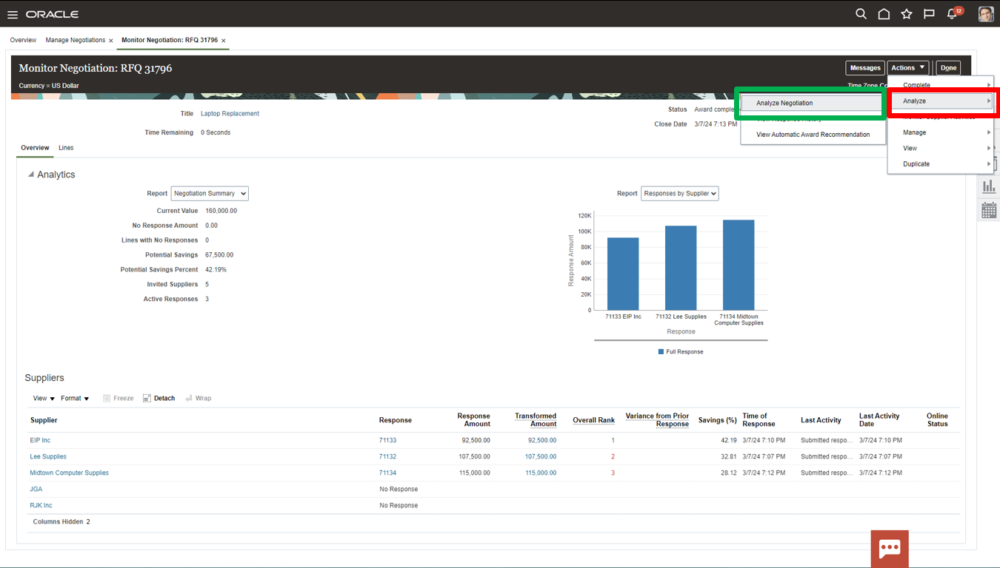
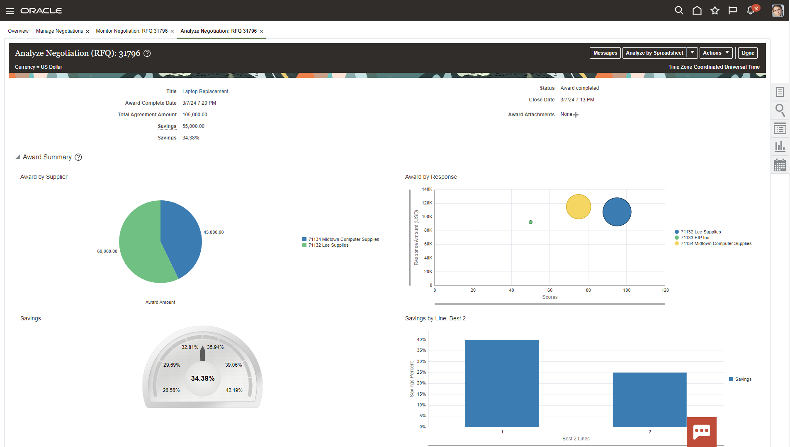
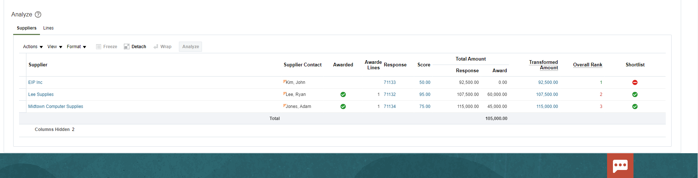

# Connections

## Introduction 

This is a fresh and unique way to offer you a chance for hands-on experience of highly differentiated and specifically curated content of numerous vignettes that are typically encountered in accounting and finance. We hope you will enjoy today’s adventure exploring a complete and unified solution for the office of the CFO.

As you follow along, do not forget to answer the Adventure Check Point questions! 

Estimated Time: 6 minutes

### Objectives

In this activity, you will:
* You need to figure out why the Automatic Award Recommendation has elected not to award EIP Inc. in this negotiation. 
 

## Task 1: Determine why the Automatic Award Recommendation has elected not to award EIP Inc. in this negotiation. 

1. You will need to go to the negotiations page.

    > Navigate to the **Procurement** tab and select **Negotiations**

    

2. The negotiations dashboard has Infolets with insights into sourcing programs and activity. This information is drillable to give the user an intuitive experience. You need to drill into Award Completed to analyze the recent sourcing negotiation.

    > In the **My Negotiations** Infolet select the **Award Completed** piece of the pie chart (Purple)

    

3. You could drill into the negotiation details by clicking the hyperlink on the negotiation number. However, you need to analyze the individual supplier responses, so you need to click the monitor icon.

    > Click the **Monitor** icon for Negotiation 31796

    

4. Here is the initial monitor page with analytical information about responses. Notice EIP was ranked first, but wasn’t awarded. Let’s dive deeper to find why. We can use the analytical tools available through Cloud Procurement to analyze further.

    
    At the bottom of the page are the suppliers. Five were invited, and three responded. You can see the details to the right. You will notice EIP was ranked first but still wasn’t awarded so you must dive deeper.

    > Select **Actions** drop down in the top ribbon

    

5. In order to see more information about this negotiation you need to utilize the analytical tools available through Cloud Procurement. To do this, select analyze negotiation from the menu options.  

    > First, click **Analyze**. 

     Then, select **Analyze Negotiation** from the drop-down menu.

    

6. Here are more analytics built into the sourcing process. The analysis breaks down the awards by supplier, total savings, and savings by line item. 

    
    
    
    At the bottom of the page are the suppliers. Five were invited, and three responded. You can see the details to the right. Once again you will notice EIP was ranked first but still wasn’t awarded so you must dive deeper.

7. Notice EIP is ranked first but has lowest score.

> Click the **score ‘50’** to access EIP’s response details.

   
   
8. Now we see how the Procurement system AI scored a zero and automatically disqualified EIP because they are missing a required certification which was set as pre-built knockout criteria.

    If this were manually scored we could add notes to the requirement scoring for review.

   
 
    > Select the **Home** icon in the top ribbon to navigate back to the Procurement springboard.

   

9. Adventure awaits, click on the image, show what you know and rise to the top of the leader board!!!
    
     
    

## Summary

Sourcing is a comprehensive set of tools designed to facilitate easy negotiation between you and your vendors.

Easily identify and negotiate goods and services all in one tool.

Drive better savings by increasing competition between your vendors.

Shorten cycle times with easy-to-use tools and AI and machine learning built into the process.

**You have successfully completed the Activity!**

## Acknowledgements
* **Author** - Matt Bailey, Staff Solution Engineer
* **Contributors** -  Betty Jane Madden, Principal Solution Engineer
* **Last Updated By/Date** - Matt Bailey, March 2024

