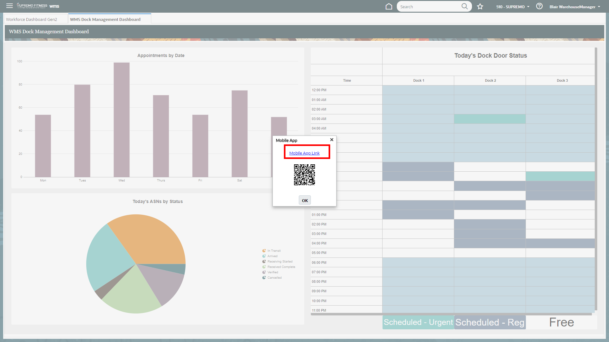
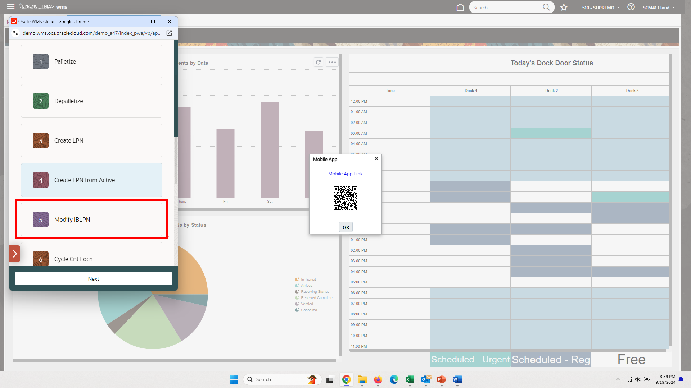
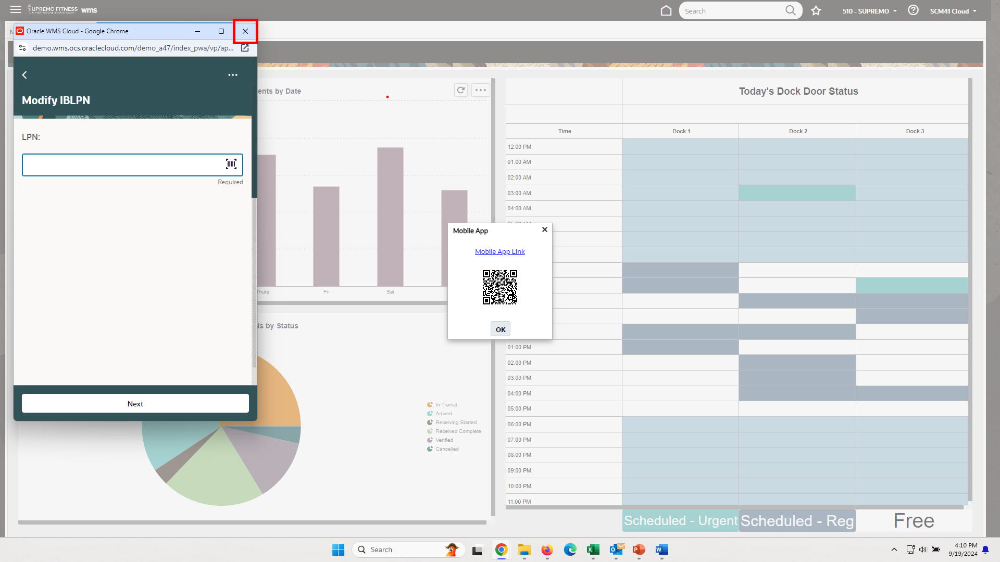

# Connections

## Introduction

Welcome to Oracle’s Cloud Adventure.  This is a fresh and unique way to offer you a chance for hands-on experience of highly differentiated and specifically curated content of numerous vignettes that are typically encountered Supply Chain Management. We hope you will enjoy today’s adventure exploring a complete and unified solution for the office of the COO.

As you follow along, do not forget to answer the Adventure Check Point questions! 

Estimated Time: 5 minutes

### Objectives

In this activity, you will:
* Use Oracle Warehouse Management to Modify LPN Files.
 

## Task 1: Modify LPN Files.

1. You are a warehouse operator leveraging the barcoding and scanning capabilities embedded into the WMS Cloud application.  You would like to do an inquiry on an item.  

    > Click on the **Supply Chain Execution** tab and select **WMS** from the Quick Actions List

    

2. With embedded mobility, users can execute transactions by leveraging our Mobile App or other supported RF scanning devices.  

    > Click on your user name on the top right corner **SCM_XX** and select **Launch Mobile App.**   

    

    > Click on **Mobile App Link** to open the app. 

    

3. The inherent Mobile App allows end users to execute transactions using a mobile device with a graphical user interface.  Note the menu options the user can select.   

    > Click on **Inventory**.

    

4. Various options are presented to the user on the Mobile App including the ability to modify a LPN (license plate number).

    > Click on **Modify IBLPN**.

    

5. Let’s enter the LPN we want to change.  Note that this could also be done using a barcode to scan the number. 

    > Enter the LPN number **LPN123** then click **Next**.

    

6. You can easily see what the item is on the LPN along with the current quantity.

    > Enter any quantity you would like to choose in the Qty field, for example **45**.  

    > Click **Next**.  

    

7. We can use the Mobile App to execute transactions.  

    > Select **3 dots** in the top right corner.   

    > Click **Actions** then select **Ctrl+N: End Modify**.   

    

8. Oracle WMS Cloud will track reason codes for modifying LPNs to ensure an audit trail and reporting.

    > Choose any of the reason codes displayed on the screen **X**.  

    

9. The system will prompt you to do the appropriate actions.

    > Click **OK** to end transaction. 

    

    > Select the **X** on the mobile app to close out the session. 

    

    > Close the browser using the **X** icon to return to the Fusion landing page. 

    

10. Adventure awaits, click on the image, show what you know and rise to the top of the leader board!!!

     

## Summary

Oracle Warehouse Management transforms warehouse and inventory management for the new and evolving fulfillment economy. The solution combines the speed and savings of the cloud with best-of-breed fulfillment functionality while giving companies a 360-degree view of their inventory without the high maintenance costs and upgrade trap of traditional solutions.

Today’s modern warehouse managers aren’t tied to a desk. They need access on the go to critical information to make smart decisions. With Oracle Warehouse Management, mobility is inherent, having been built-in from day one. Managers can view real-time analytics and reporting while users can perform all the essential activities (pick, pack, load, ship/manifest support, kitting, de-kitting, etc.) to power best-in-class fulfillment operations.

In this example, we used Oracle Warehouse Management’s embedded Mobile App to modify the quantity on a License Plate

**You have successfully completed the Activity!**

## Acknowledgements
* **Author** - Tracy Mengyan, Master Principal Solution Engineer
* **Contributors** -  Betty Jane Madden, Principal Solution Engineer
* **Last Updated By/Date** - Tracy Mengyan, September 2024

