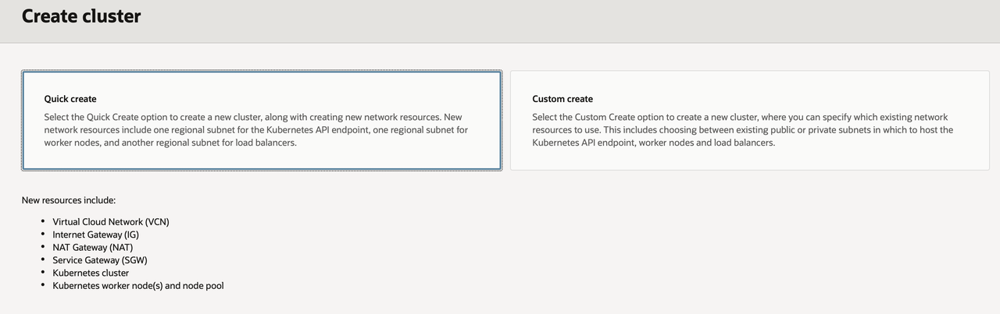

# Test ArgoCD

## Introduction

This lab will take you through the steps needed to add an OKE Cluster to ArgoCD clusters list and deploy an application to it through Argocd.

Estimated Lab Time: 15 minutes.

### Objectives

In this lab, you will:

- Add an existing OKE Cluster to ArgoCD Cluster list.
- Deploy an application to that OKE Cluster.
- If you completed Lab 3: Authenticate on the ArgoCD console with your OCI user.

### Prerequisites

This lab assumes you have:

- OKE Cluster with public endpoint, can be created with Quick create.
  
- ArgoCD up and running on the OKE Cluster created by terraform in previous LAB.

## Task 1: Add an OKE Cluster to ArgoCD Cluster list

1. Get the Bastion instance ip from the Stack Apply job output.
2. Ssh to the Bastion Instance.

```
ssh opc@bastion_instance_ip
```

3. Verify argocd is up and running.

```
kubectl get pods -n argocd
```

4. Login on Argocd with the admin user and password using the argocd cli.

- Get the admin password:
  - `kubectl get secret -n argocd argocd-initial-admin-secret -o jsonpath="{.data.password}" | base64 -d`
- Login with the following command:
  - `argocd login <the_reserved_public_ip_created>.nip.io`
    - username is **admin**
    - password is the admin password you just got.

5. Download the [Add cluster yaml file](files/add_cluster.yaml).

6. Edit the file:
   Find the following and replace them:

- `<cluster_name>`: Name of the cluster you want to add.
- `<cluster_api_endpoint>`: The endpoint of the cluster you want to add.
- `<cluster_ocid>`: The OCID of the cluster you want to add.
- `<region>`: The region where the cluster resides.

7. Apply the file to add the cluster in the Argo CD cluster list using the following command:
   `kubectl apply -f add_cluster.yaml`

8. Check to see if the cluster was added to Argo CD cluster list using the following command:
   `argocd cluster list`

## Task 2: Deploy an application to that OKE Cluster

1. Download the [example app deployment](files/deploy_example.yaml).

2. Edit the file:
   Find the following and replace:

- `<cluster_name>` - name of the cluster you set at Task1, step 6.

3. Apply the file to deploy a simple app to target cluster using the following command:
   `kubectl apply -f deploy-example.yaml`

4. After the app is deployed, you have to sync it but running the following command:
   `argocd app sync guestbook`

5. Verify the app:
   `argocd app list`

## Task 3: View ArgoCD console.

- Type in your browser: `<the_reserved_public_ip_created>.nip.io`
  This is the ip of the Load Balancer created through NGINX.

- Login with your OCI user by clicking on **LOG IN VIA OCI** Button.
  
- Now you can deploy apps through the console as well.

You may now proceed to the next lab.

### Acknowledgements

**Author**

- **Gabriel Feodorov**, Principal Cloud Architect.
