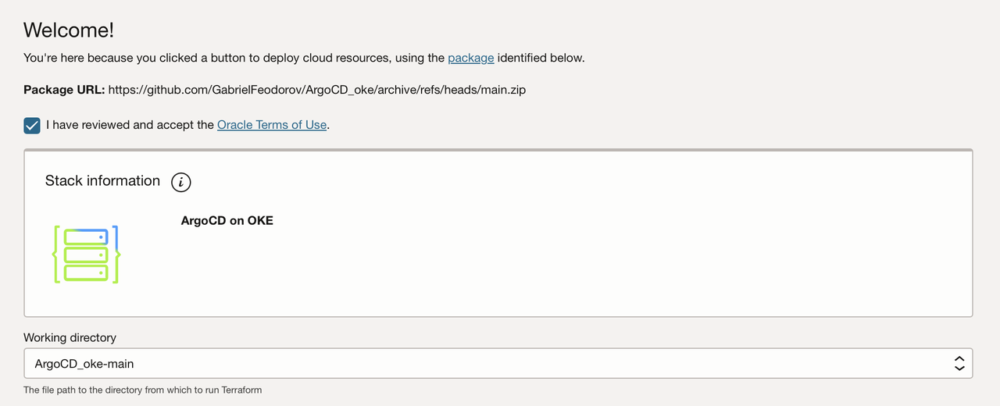

# Deploy the automation on OCI with Resource Manager

## Introduction

This lab will take you through the steps needed to provision the infrastructure using Resource Manager.

Estimated Lab Time: 30 minutes

### Objectives

In this lab, you will:

- Deploy the infrastructure using Resource Manager
- Configure the automation variables

### Resources created by Terraform.

- VCN
- Bastion Instance
- Enhanced OKE Cluster
- Flexible Load Balancer
- Policy with workload identity for ArgoCD

### Prerequisites

This lab assumes you have:

- An Oracle Cloud account
- Permissions to manage the resources created by Terraform.
- SSH Key to access Bastion Instance.

## Task 1: Create the Resource Manager Stack.

Simply click the Deploy to OCI button to create an ORM stack, then walk through the menu driven deployment.

## Task 2: Configure the stack variables

Some of the variables are pre populated.

1. Check the box on I have reviewed and accept the Oracle Terms of Use and Click on Next.
   

2. Add a ssh public key to access the Bastion instance.

3. Select an Availability domain for the Bastion instance.

4. Scroll down to ArgoCD Configuration.

5. Input the argocd image you want to use, the one that you created in LAB 2. Syntax is **ocir.region.oci.oraclecloud.com/tenancy_namespace/repository_name/argocd-oci**

6. Input the tag of the argocd image. Syntax is **v3.1.1**

7. Input an existing Reserved Public ip to be the point of access for ArgoCD. The one you created in LAB 3. Syntax is **0.0.0.0.0**

8. **Optional** If you completed LAB 3, Check the box for **Configure authentication with Oracle IDCS**, otherwise you can click on Next and then on Create to create the stack.
   If LAB 3 was completed, use the information from Task 2 in the following variables.
9. OCI Identity Domain URL, input the OCI Domain URL without the port. Syntax is **https://idcs-xxxxxxxxxxxxxxxxxxxxxx.identity.oraclecloud.com**

10. OCI Integrated Application Client ID, input the Client ID.

11. OCI Integrated Application Client Secret, input the Client secret.

12. Input the oci group that will be able to use ArgoCD, input the name of the group that you are part of.

13. Click on Next and then on Create to create the stack.

## Task 3: Deploy the resources.

- Run Plan to see there's no misconfiguration.
- Run Apply to create the resources.

Next, you will be guided through managing the deployments on an OKE Cluster using ArgoCD.
You may now proceed to the next lab.

> Note: It might take around 10-15 mintues for everything to be ready, after the deployment of resources.

## Acknowledgements

**Author**

- **Gabriel Feodorov**, Principal Cloud Architect.
