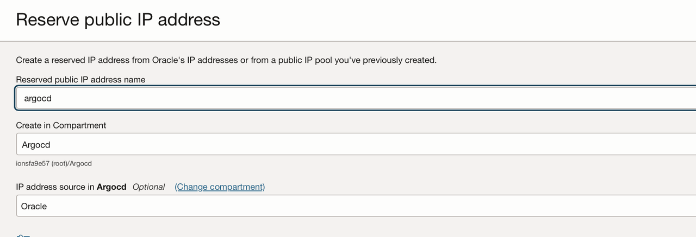

# Create ArgoCD custom image

## Introduction

In this Lab we will create a Reserved public Ip.
This is used for the Load Balancer to expose ArgoCD.

Estimated Lab Time: 5 minutes

### Objectives

- Create reserved public ip.

### Prerequisites

This lab assumes you have:

- An Oracle Cloud account
- Permission to create reserved public ips.

## Task 1: Create Reserved public IP.

- Go to OCI Console > Networking > IP management > Reserved public IPs > Reserve public IP address.
- Set a name > Click on Reserve public IP address.
  

You may now proceed to the next lab.

## Acknowledgements

**Author**

- **Gabriel Feodorov**, Principal Cloud Architect
