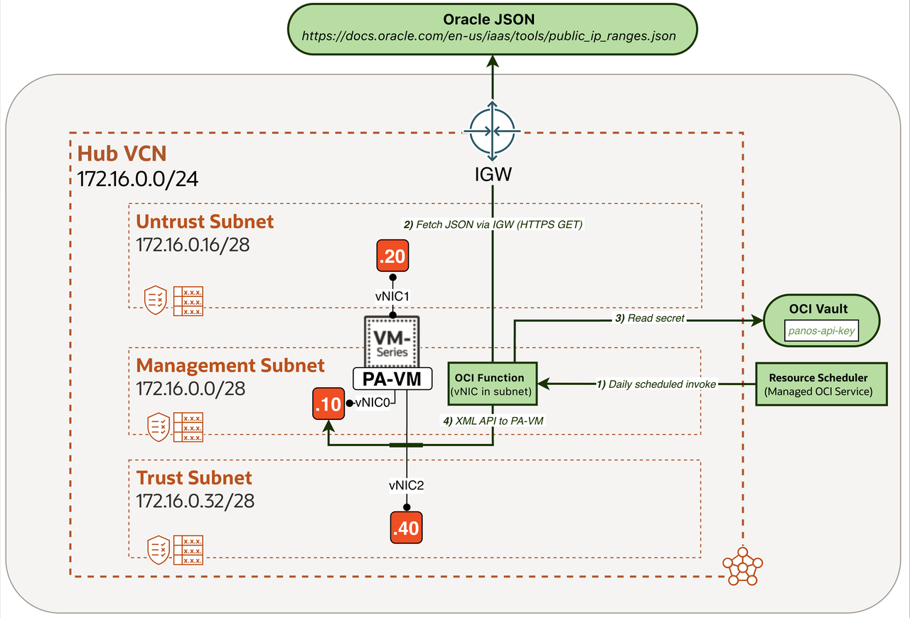
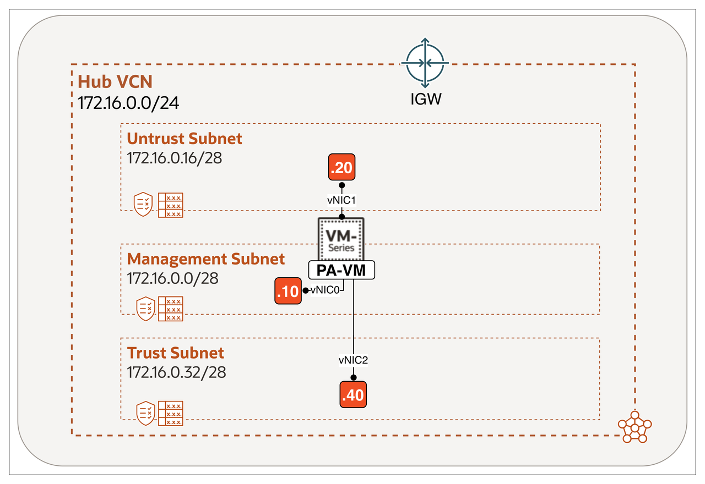
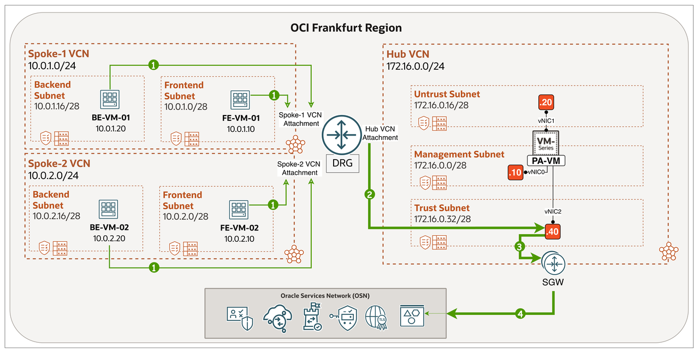

# Introduction

## About this Workshop

Oracle Cloud Infrastructure (OCI) publishes a [JSON document](https://docs.oracle.com/en-us/iaas/tools/public_ip_ranges.json) listing the public IP address ranges used by its cloud services. The file groups CIDR blocks by region and tags each block with the service it belongs to, such as `OBJECT_STORAGE` for Object Storage endpoints, `OSN` for the Oracle Services Network, and `OCI` for VCN public IP ranges (used by resources like compute instances, NAT Gateways, and public Load Balancers).

Network and security teams that operate firewalls in front of OCI workloads rely on these ranges to control traffic to OCI services. The ranges change over time, and any drift between the published file and the firewall's address objects can break legitimate traffic or leave stale objects in policies. To keep firewall policies aligned, OCI recommends polling the file at least weekly to pick up new ranges. Tracking these changes manually is repetitive, error-prone, and easy to neglect.

This workshop shows how to automate the process end-to-end on OCI. An OCI Function downloads the JSON file, filters to the regions and services you care about, and synchronizes the resulting CIDRs to a Palo Alto firewall: it creates and updates address objects to match the CIDRs in the file, removes any of its own auto-managed objects that are no longer in the file, groups them into an address group, and commits the change via the PAN-OS XML API. The function is stateless and stores no secrets on disk; the firewall API key lives in OCI Vault and is fetched at runtime via resource principal authentication. Scheduling is handled by OCI Resource Scheduler, a managed service that invokes the function daily. The function is where the work happens; the scheduler is just the heartbeat.

Estimated Workshop Time: 70 minutes

### Objectives

In this workshop, you will:

- Store a PAN-OS API key securely in **OCI Vault**.
- Configure **IAM dynamic groups and policies** so the function can authenticate to Vault using its own identity (resource principal). No static credentials.
- Build and deploy an **OCI Function** (Python) that fetches Oracle's public IP ranges, filters by region/service, and synchronizes them to your Palo Alto firewall.
- Trigger the function on a daily schedule using **OCI Resource Scheduler**, a managed service that invokes the function as its own principal with no VM or static credentials.

### Architecture Summary

The diagram below shows the components involved in the sync and how they interact. One full cycle runs through four steps:

1. OCI Resource Scheduler invokes the OCI Function on schedule.
2. The function fetches the public JSON from Oracle via the Hub VCN's Internet Gateway.
3. The function reads the PAN-OS API key from OCI Vault using its own identity (resource principal auth).
4. The function reconciles address objects on the PA-VM by calling the PAN-OS XML API over the management interface.

What each component does:

| Component                   | Purpose                                                                                                                                                                                                          |
| --------------------------- | ---------------------------------------------------------------------------------------------------------------------------------------------------------------------------------------------------------------- |
| OCI Function (Python)       | Stateless function attached to a Hub VCN subnet. Fetches Oracle's JSON, reconciles address objects on the PA-VM via the PAN-OS XML API (creates, updates, deletes auto-managed objects), and commits the change. |
| OCI Vault                   | Encrypted storage for the PAN-OS API key.                                                                                                                                                                        |
| OCI Resource Scheduler      | Managed service that triggers the function on a daily schedule. No VM to patch and no cron daemon to maintain.                                                                                                   |
| Policy (scheduler)          | Lets the scheduler invoke the function as the `resourceschedule` principal, with no API keys anywhere in the path.                                                                                               |
| PA-VM (Palo Alto VM-Series) | Target firewall. Receives address-object updates on its management interface (vNIC0) at 172.16.0.10.                                                                                                             |

### Prerequisites

Before starting, make sure you have:

1. An OCI tenancy with a compartment you can deploy resources into. Here we used the `Tutorial` compartment.
2. A Palo Alto VM-Series firewall deployed in an OCI VCN. Complete the following Live Labs workshop first: &lt;Live Labs URL&gt;. It provisions the baseline environment used in this workshop: the firewall along with the Hub VCN, subnets, Internet Gateway, and base configuration. After completing it, note the firewall's management IP and admin credentials.
3. Access to Cloud Shell from the OCI Console.
4. The following OCIDs ready. Replace the placeholders below with values from your own tenancy:
    - Compartment OCID: `ocid1.compartment.oc1..aaaaaaaaxxxxyyyyyyqqq`.
    - Subnet OCID (function/management subnet): `ocid1.subnet.oc1.eu-frankfurt-1.aaaaaaaaxxxxxyyyyqqq`.
    - Tenancy namespace: `fr8xxyz44x`.

## Why this is needed?

As an example, the diagram below shows a typical OCI hub-and-spoke deployment, where workloads in spoke VCNs reach Oracle services through a Palo Alto firewall in the hub. The firewall is the single egress inspection point for all spoke traffic destined to OCI services, which means it must permit Oracle's current set of public IP ranges. If those ranges drift out of sync with what Oracle publishes, applications in the spokes lose access to services they were previously reaching.

In a setup like this, every spoke depends on the hub firewall's address objects being accurate and current. Three reasons to automate this rather than maintain it by hand:

- **Keeping up with changes.** OCI updates the [published ranges](https://docs.oracle.com/en-us/iaas/tools/public_ip_ranges.json) on demand, when capacity is added or a new service launches, so the timing is unpredictable and a change can land at any time. A firewall that lags behind will either block legitimate traffic or trust ranges that no longer belong to Oracle. Because the change time cannot be predicted, Oracle's guidance is to poll daily to ensure minimal risk.
- **Avoiding configuration drift.** When updates happen manually, different engineers handle them differently. Names change, CIDRs get missed, old objects stay behind. A single automated process produces the same result every run, with predictable naming and no leftovers.
- **Operating without static credentials.** Any manual workflow ends up with someone holding a PAN-OS API key on a laptop or jump host. Running the work inside OCI lets the firewall API key live in Vault and be fetched at runtime by the function's own identity, with no keys stored on disk and every invocation visible in OCI Monitoring.

## Is this workshop for you?

This pattern solves a narrow case. Before adopting it, ask three questions. If any answer points elsewhere, a simpler option fits better:

1. **Is the OSN service you need covered by [PSA (Private Service Access)](https://www.oracle.com/cloud/networking/private-service-access/service-gateway-and-psa-supported-services/)?** If so, PSA maps the service to a private IP in the hub, and you route trust-interface traffic to that private IP, which removes the drift problem entirely. PSA does not cover every OSN service, so this only helps where it is supported.
2. **Does the traffic really need to stay inside the region, with no Internet or IGW path?** If reaching OSN over the Internet through an untrust interface is acceptable, that solves it without this workshop.
3. **Does the traffic really need firewall inspection, or can the spoke just use its own Service Gateway?** If inspection is not required, a local spoke SGW reaches OSN directly with no hub firewall involved.

This workshop is for the case where all three push the other way: the service is not PSA-fronted, traffic must stay off the Internet, and it must be inspected at the hub firewall. In that setup the firewall has to permit the correct OSN CIDRs on its trust interface, and keeping those CIDRs current is exactly what this automation handles.

## Learn More

1. [Familiarity with OCI console](https://docs.us-phoenix-1.oraclecloud.com/Content/GSG/Concepts/console.htm)
2. [Overview of Networking](https://docs.us-phoenix-1.oraclecloud.com/Content/Network/Concepts/overview.htm)
3. **This will be updated when the full palo alto workshop series is published.**

## Acknowledgements

- **Author** - Anas Abdallah (OCI Network Black Belt)
- **Last Updated By/Date** - Anas Abdallah, June 2026
