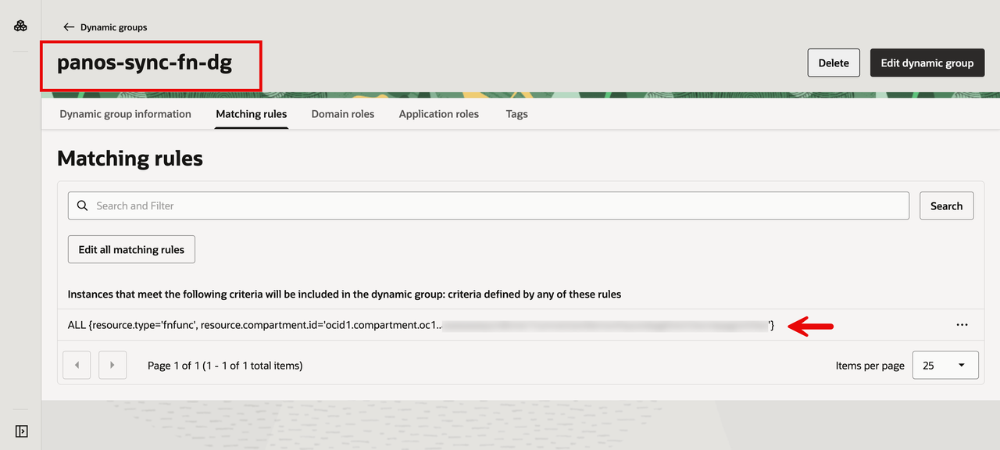
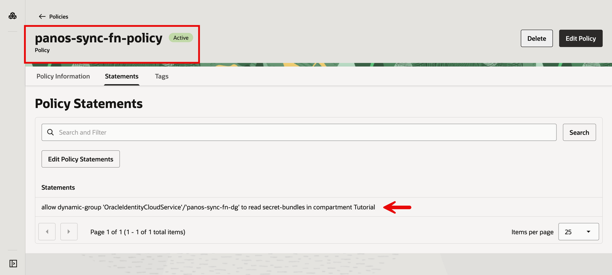

# Lab 2 - Configure IAM for Resource Principal Authentication
## Introduction

The function will authenticate to Vault as itself (a resource principal), not as a user. Two pieces are needed: a **dynamic group** that matches the function, and a **policy** that grants the dynamic group permission to read secrets.

A **Dynamic Group** is a logical grouping of OCI resources (compute instances, functions, etc.) defined by a matching rule rather than a fixed list of members. When a resource is created or destroyed, the group's membership updates automatically. Dynamic groups exist so resources can have IAM identities of their own, without you ever issuing them user accounts or API keys.

A **Policy** is a set of statements that grant permissions. Each statement says "allow these subjects to perform these actions on these resources in this scope." Subjects can be users, groups, or dynamic groups. Together, the dynamic group identifies *who* the function is, and the policy says *what* it can do.

Estimated Time: 5 minutes

### Objectives

In this lab, you will:
- Create a dynamic group that matches the sync function as an OCI resource
- Create an IAM policy granting that dynamic group permission to read the Vault secret
- Enable the function to authenticate as a resource principal, with no user accounts or API keys

### Prerequisites

This lab assumes you have:
- Completed Lab 1 and stored the PAN-OS API key as a secret in OCI Vault
- Permissions to create dynamic groups and policies in your tenancy (or working compartment)
- The OCID of the compartment where the function will run

## Task 1: Create a Dynamic Group

1. In the OCI Console, navigate to **Identity & Security** → **Domains** and select the root compartment. Click into your identity domain (typically `Default` or `OracleIdentityCloudService`). In this run, the domain was `OracleIdentityCloudService`.
2. Click on **Dynamic groups** → **Create Dynamic Group**.
3. Fill in:
    - Name: `panos-sync-fn-dg`
    - Matching Rule:

```
ALL {resource.type='fnfunc', resource.compartment.id='<your-compartment-ocid>'}
```

4. Click **Create**.



## Task 2: Create the policy

1. In the OCI Console, navigate to **Identity & Security** → **Policies**.
2. Select your working compartment `Tutorial`. Most tenancies restrict policy creation at the tenancy root, so working at the compartment level is the standard approach.
3. Click **Create Policy**.
4. Fill in:
    - Name: `panos-sync-fn-policy`
    - Click **Show manual editor** and paste the statement:

```
allow dynamic-group '<domain-name>'/'panos-sync-fn-dg' to read secret-bundles in compartment <compartment-name>
```

5. Click **Create**.



The policy is **Active**, granting the dynamic group `read secret-bundles` permission in the `Tutorial` compartment.

## Learn More

- [Accessing Other OCI Resources from Running Functions](https://docs.oracle.com/en-us/iaas/Content/Functions/Tasks/functionsaccessingociresources.htm)
- [Managing Dynamic Groups](https://docs.oracle.com/en-us/iaas/Content/Identity/Tasks/managingdynamicgroups.htm)

## Acknowledgements

- **Author** - Anas Abdallah (OCI Network Black Belt)
- **Last Updated By/Date** - Anas Abdallah, June 2026

You may now **proceed to the next lab**.