# Lab 3 - Build, Deploy, and Configure the OCI Function
## Introduction

OCI Functions runs your code as a Docker container. In this lab, you build the container in Cloud Shell, push it to OCIR (OCI Container Registry), and register it with the Functions service. You then create the Functions application, deploy the function, and set the configuration values that tell it which firewall to target, which regions and services to sync, and where to find the API key in Vault.

Estimated Time: 20 minutes

### Objectives

In this lab, you will:
- Build the function container in Cloud Shell and push it to OCIR
- Create the Functions application and deploy the sync function
- Set the function configuration: target firewall, regions and services to sync, and the Vault secret location

### Prerequisites

This lab assumes you have:
- Completed Lab 1: the PAN-OS API key is stored as a secret in OCI Vault
- Completed Lab 2: the dynamic group and IAM policy are created
- The OCID of the Vault secret from Lab 1
- A VCN and subnet available for the Functions application, with internet access via an Internet Gateway
- Permissions to use OCIR, create Functions applications, and deploy functions in your compartment

## Task 1: Open Cloud Shell on x86

By default, the Cloud Shell architecture preference is set to **No Preference**, meaning your session runs on either x86_64 or ARM (aarch64) depending on regional hardware availability. Since Cloud Shell cannot cross-compile, its architecture must match the shape of the Functions application you will deploy to. This workshop uses the `GENERIC_X86` shape, so Cloud Shell must run on x86_64.

1. Click **Actions** in the Cloud Shell pane.
2. Select **Architecture**.

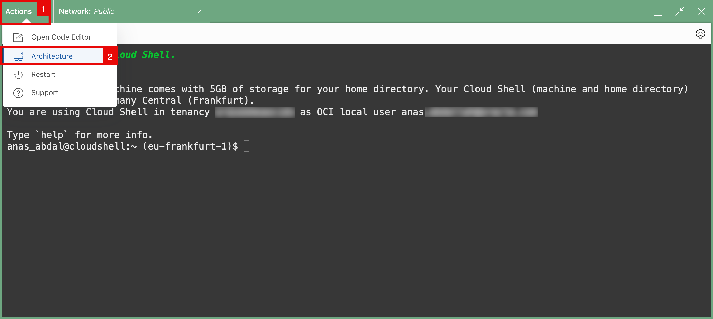

1. Choose **X86_64**.
2. Click on **Confirm**.

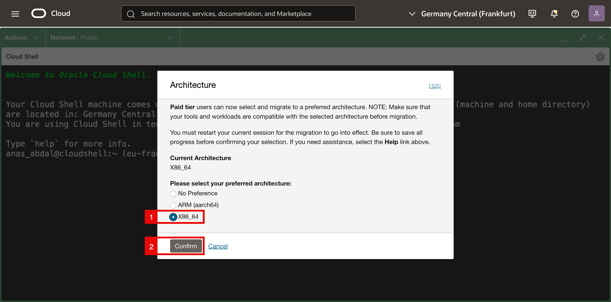

- Click on **Restart**.

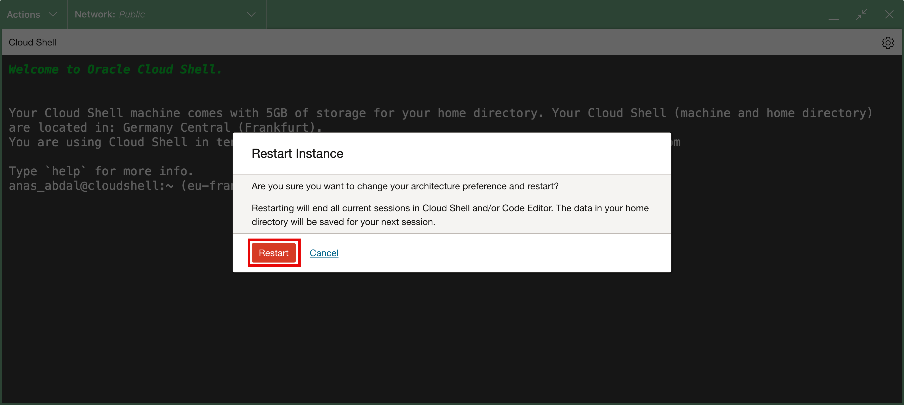

- Cloud Shell restarts on x86 and shows a confirmation banner.

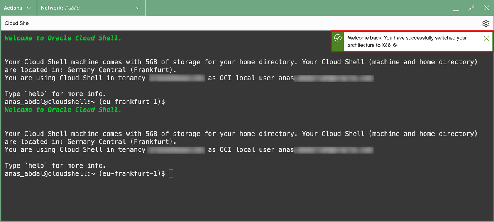

## Task 2: Generate an Auth Token for OCIR and log in

1. In the OCI Console, click the top-right profile icon, then go to **My Profile** → **Tokens and keys** → **Auth tokens** and click **Generate token**.
2. Description: `cloud-shell-ocir`.
3. Copy the token: click the **⋯** menu next to the generated token and click on **Copy**. The token is shown only once.

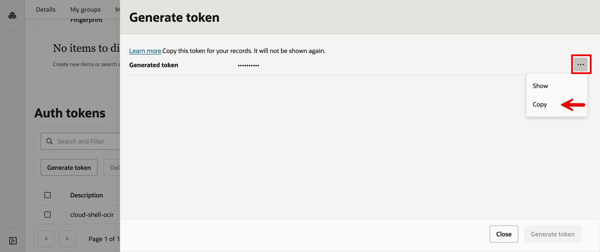

1. Log in to the regional OCIR endpoint.

```bash
<copy>docker login fra.ocir.io</copy>
```

Replace `fra` with your region's OCIR code (for example `iad` for Ashburn, `lhr` for London). See [OCIR availability](https://docs.oracle.com/en-us/iaas/Content/Registry/Concepts/registryprerequisites.htm#regional-availability) for the full list.

2. **Username**: `<tenancy-namespace>/<full-username>` (for example `fr8xxyz44x/oracleidentitycloudservice/jane.doe@example.com`).
3. Password: the auth token from above.
4. You should see `Login Succeeded`.

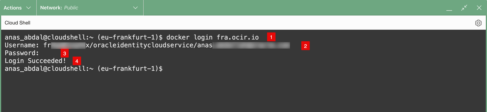


## Task 3: Configure the Fn CLI context

Cloud Shell ships with a pre-configured Fn context for the region you are in (named after the region, e.g., `eu-frankfurt-1`) using the `oracle-cs` provider. Use it, it relies on Cloud Shell's existing delegation token and avoids the need for a separate `~/.oci/config`.

- Switch to the regional context and update it with your compartment OCID and registry path:

```bash
<copy>fn use context eu-frankfurt-1
fn update context oracle.compartment-id &lt;your-compartment-ocid&gt;
fn update context registry fra.ocir.io/&lt;tenancy-namespace&gt;/panos
fn list contexts</copy>
```

- `eu-frankfurt-1`: Replace with your region's context name if you are not in Frankfurt. See [Regions and Availability Domains](https://docs.oracle.com/en-us/iaas/Content/General/Concepts/regions.htm) for the full list.
- `<your-compartment-ocid>`: The compartment OCID from the Prerequisites.
- `fra.ocir.io`: The Frankfurt OCIR endpoint. Replace `fra` with your region's OCIR code if different.
- `<tenancy-namespace>`: Your tenancy namespace from the Prerequisites.
- `panos`: The registry repository prefix. The function image will be pushed to this path.

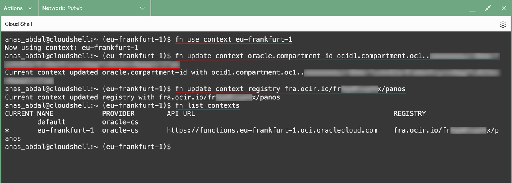

The `*` should be next to `eu-frankfurt-1`.

## Task 4: Initialize and write the function code

- Create a working directory and initialize the function skeleton:

```bash
<copy>mkdir -p ~/oci-panos-fn && cd ~/oci-panos-fn
fn init --runtime python panos-sync
cd panos-sync</copy>
```

- This generates `func.py`, `func.yaml`, and `requirements.txt`.

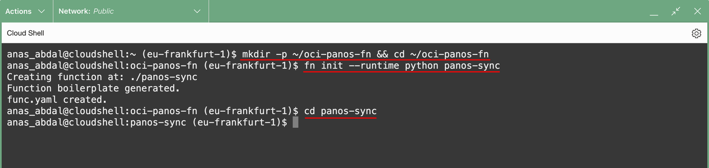

- Replace the contents of `func.py` with the function code:

```bash
<copy>vi func.py</copy>
```

In vi, delete the boilerplate: press `:`, type `%d`, press `Enter`. Press `i` to enter insert mode, paste the code below:

```python
<copy>import io, json, re, base64, requests, oci
from fdk import response

def handler(ctx, data: io.BytesIO = None):
    cfg = dict(ctx.Config())
    HOST, PREFIX, GROUP, TAG = cfg["PANOS_HOST"], cfg["ADDR_PREFIX"], cfg["ADDR_GROUP"], cfg["TAG"]
    REGIONS  = set(cfg["OCI_REGIONS"].split(","))
    SERVICES = set(cfg["OCI_SERVICES"].split(","))

    signer = oci.auth.signers.get_resource_principals_signer()
    sc = oci.secrets.SecretsClient(config={}, signer=signer)
    KEY = base64.b64decode(
        sc.get_secret_bundle(secret_id=cfg["PANOS_KEY_SECRET_OCID"]).data.secret_bundle_content.content
    ).decode().strip()

    URL = f"https://{HOST}/api/"
    requests.packages.urllib3.disable_warnings()
    doc = requests.get("https://docs.oracle.com/en-us/iaas/tools/public_ip_ranges.json", timeout=30).json()

    desired = {}
    for r in doc["regions"]:
        if r["region"] not in REGIONS: continue
        for c in r["cidrs"]:
            if not (set(c["tags"]) & SERVICES): continue
            name = f"{PREFIX}-{r['region']}-{c['cidr'].replace('.','-').replace('/','-')}"[:63]
            desired[name] = c["cidr"]

    def api(p):
        x = requests.post(URL, params={**p, "key": KEY}, verify=False, timeout=30)
        x.raise_for_status(); return x.text

    xa = "/config/devices/entry/vsys/entry[@name='vsys1']/address"
    existing = set(re.findall(rf'&lt;entry name="({PREFIX}-[^"]+)"',
                              api({"type":"config","action":"get","xpath":xa})))

    for n, c in desired.items():
        api({"type":"config","action":"set","xpath": f"{xa}/entry[@name='{n}']",
             "element": f"&lt;ip-netmask&gt;{c}&lt;/ip-netmask&gt;&lt;tag&gt;&lt;member&gt;{TAG}&lt;/member&gt;&lt;/tag&gt;"})
    for n in existing - set(desired):
        api({"type":"config","action":"delete","xpath": f"{xa}/entry[@name='{n}']"})

    members = "".join(f"&lt;member&gt;{n}&lt;/member&gt;" for n in desired)
    xg = f"/config/devices/entry/vsys/entry[@name='vsys1']/address-group/entry[@name='{GROUP}']"
    api({"type":"config","action":"edit","xpath": xg,
         "element": f"&lt;entry name='{GROUP}'&gt;&lt;static&gt;{members}&lt;/static&gt;&lt;tag&gt;&lt;member&gt;{TAG}&lt;/member&gt;&lt;/tag&gt;&lt;/entry&gt;"})
    api({"type":"commit","cmd":"&lt;commit&gt;&lt;description&gt;OCI IP sync&lt;/description&gt;&lt;/commit&gt;"})

    return response.Response(ctx, response_data=json.dumps({"synced": len(desired)}),
                             headers={"Content-Type":"application/json"})</copy>
```

Then press `Esc`, type `:wq`, and press `Enter` to save and exit.

- Replace the contents of `requirements.txt` with the function's Python dependencies:

```bash
<copy>vi requirements.txt</copy>
```

Wipe contents (`:%d`), enter insert mode (`i`), and paste:

```
<copy>fdk
requests
oci</copy>
```

- Save and exit (`Esc`, `:wq`, Enter).

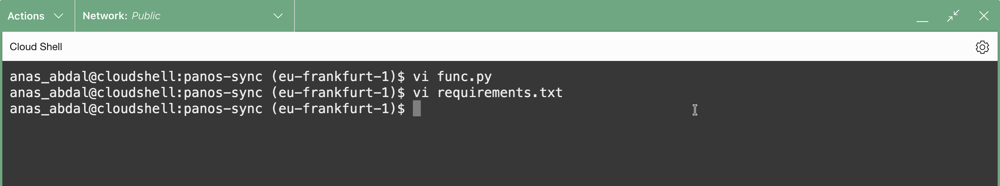

## Task 5: Create the application and deploy

- Create the Functions application. The application is the logical container for one or more functions, and it pins the network attachment (subnet) and shape (`GENERIC_X86`) used at runtime:

```bash
<copy>oci fn application create \
  --compartment-id &lt;your-compartment-ocid&gt; \
  --display-name panos-sync-app \
  --subnet-ids '["&lt;your-subnet-ocid&gt;"]'</copy>
```

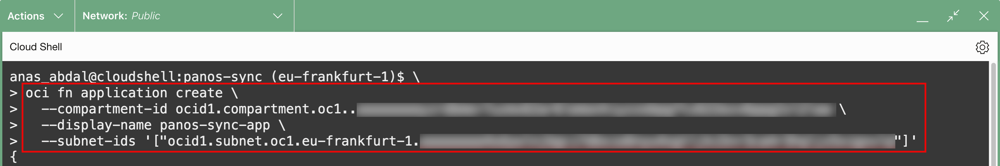

> [!NOTE] NOTE
> **Subnet choice**: The subnet must reach the firewall management IP (TCP/443) and the [Oracle IP ranges JSON](https://docs.oracle.com/en-us/iaas/tools/public_ip_ranges.json) over HTTPS. The simplest setup is the same subnet as the firewall management interface, provided it has a route to the internet via an Internet Gateway.

- The OCI Functions application `panos-sync-app` was created successfully in your compartment with `GENERIC_X86` shape, attached to your function subnet, and is now in `ACTIVE` state.

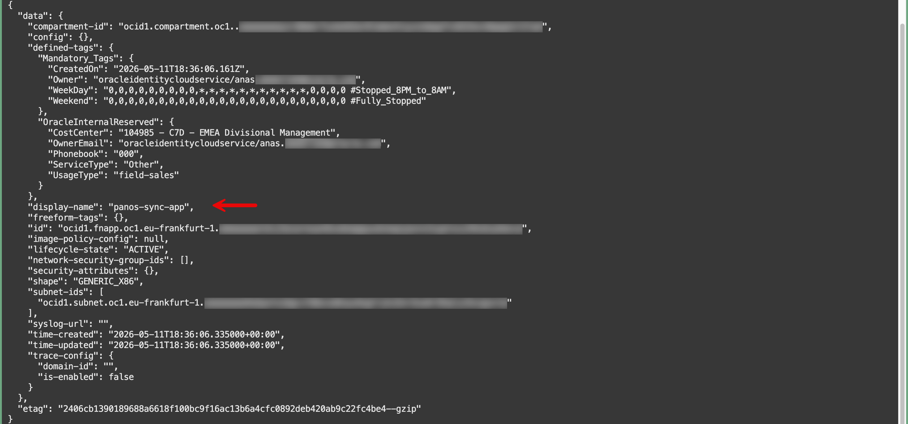

- Deploy the function. Fn will build the Docker image, push it to OCIR, and register the function with the application. This typically takes around 3 minutes:

```bash
<copy>fn -v deploy --app panos-sync-app</copy>
```

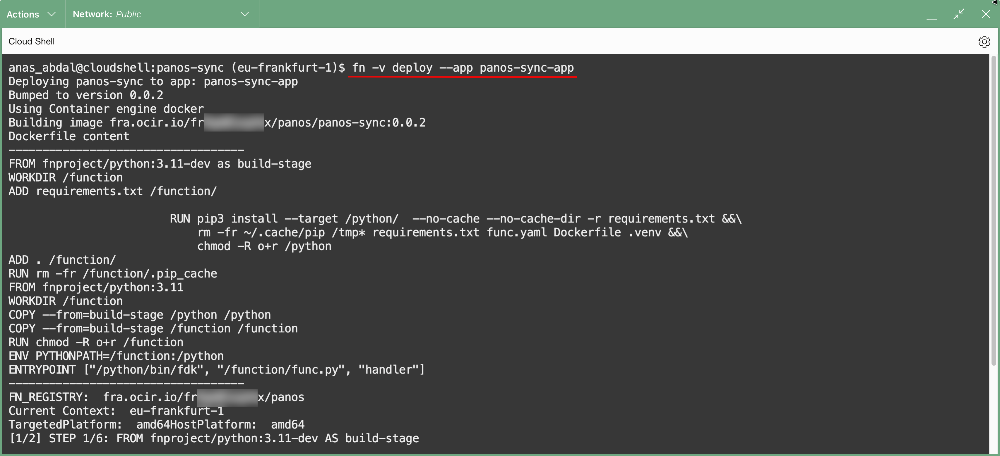

- Watch for `Successfully created function: panos-sync` at the end of the output.

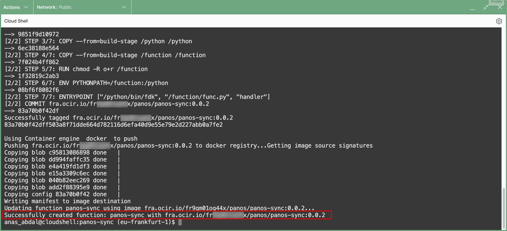


## Task 6: Set function configuration

- These environment variables tell the function which firewall to talk to, which regions and services to filter, and where to find the secret. The same image can be reused across firewalls by changing only the config.

```bash
<copy>fn config function panos-sync-app panos-sync PANOS_HOST &lt;firewall-mgmt-ip&gt;
fn config function panos-sync-app panos-sync OCI_REGIONS eu-frankfurt-1
fn config function panos-sync-app panos-sync OCI_SERVICES OSN,OBJECT_STORAGE
fn config function panos-sync-app panos-sync ADDR_PREFIX osn
fn config function panos-sync-app panos-sync ADDR_GROUP osn-public-ips
fn config function panos-sync-app panos-sync TAG oci-auto
fn config function panos-sync-app panos-sync PANOS_KEY_SECRET_OCID &lt;secret-ocid-from-lab-1&gt;</copy>
```

Where:

- `<firewall-mgmt-ip>`: The firewall's management IP.
- `<secret-ocid-from-lab-1>`: The OCID of the secret created in Lab 1.
- `OCI_REGIONS`: Comma-separated list of OCI regions to filter from the JSON. In this workshop: `eu-frankfurt-1`. See [Regions and Availability Domains](https://docs.oracle.com/en-us/iaas/Content/General/Concepts/regions.htm) for region identifiers.
- `OCI_SERVICES`: Comma-separated list of service tags to include. Valid values are `OCI`, `OSN`, and `OBJECT_STORAGE`. In this workshop: `OSN,OBJECT_STORAGE`.
- `ADDR_PREFIX`: Name prefix for the address objects the function creates on the firewall. Objects with this prefix are the only ones the function manages. In this workshop: `osn`.
- `ADDR_GROUP`: Name of the address group that contains all synced address objects. In this workshop: `osn-public-ips`.
- `TAG`: A PAN-OS tag applied to every address object and to the group, useful for filtering in the firewall UI. In this workshop: `oci-auto`.

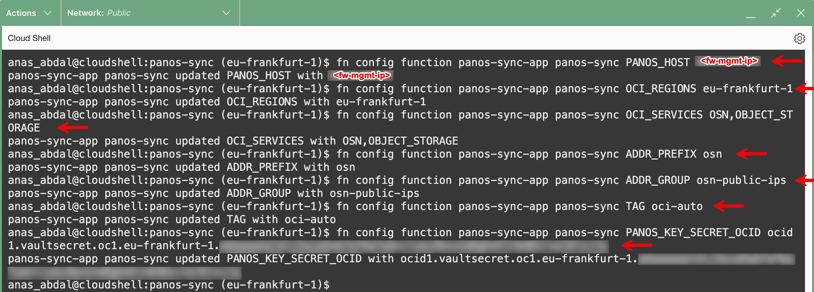

- Verify the configuration. You should see all seven config keys with their values:

```bash
<copy>fn inspect function panos-sync-app panos-sync</copy>
```

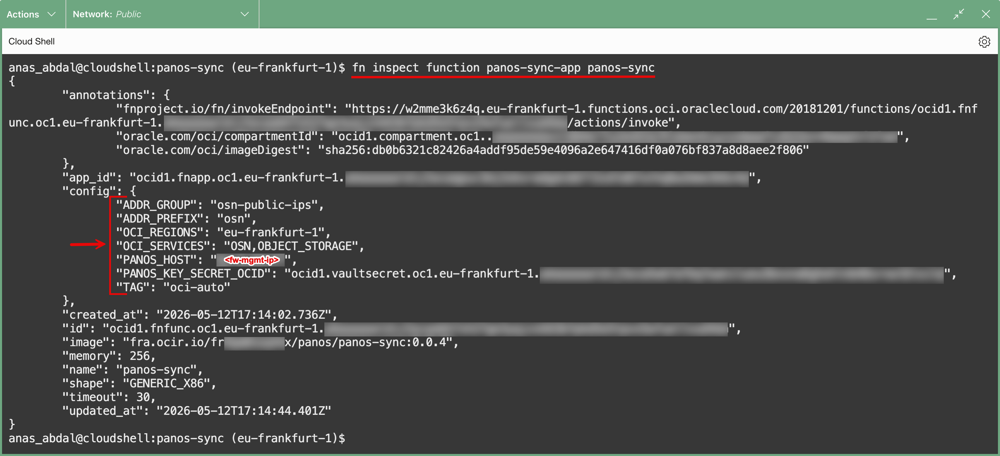

## Learn More

* [Creating and Deploying Functions](https://docs.oracle.com/en-us/iaas/Content/Functions/Tasks/functionsuploading.htm)
* [Functions: Get Started using Cloud Shell](https://docs.oracle.com/en-us/iaas/Content/developer/functions/func-setup-cs/01-summary.htm)

## Acknowledgements

- **Author** - Anas Abdallah (OCI Network Black Belt)
- **Last Updated By/Date** - Anas Abdallah, June 2026

You may now **proceed to the next lab**.
