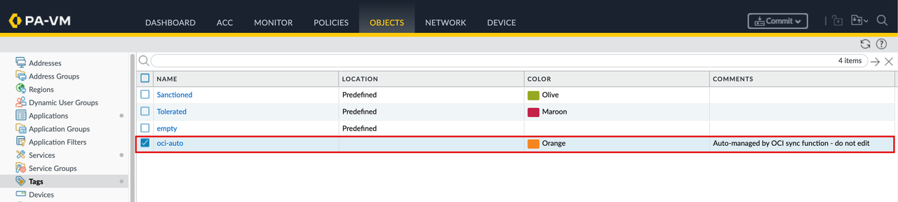

# Lab 4 - Create the Tag on the Palo Alto Firewall

## Introduction

In this lab, you create the tag on Palo Alto Firewall that the sync function uses to mark every address object it manages. The function stamps each address object it creates with this tag (`oci-auto` in this workshop), which serves two purposes: it lets the function safely identify and clean up only its own objects on later runs, and it makes the auto-managed entries easy to filter in the firewall UI.

Creating the tag before the first run is required. PAN-OS rejects any address object that references a tag which does not yet exist, so the tag must be in place before the function executes.

Estimated Time: 5 minutes

### Objectives

In this lab, you will:
- Create the `oci-auto` tag on the Palo Alto firewall
- Set the tag's name, color, and comment so auto-managed objects are easy to identify
- Commit the change so the tag is in place before the function's first run

### Prerequisites

This lab assumes you have:
- Completed Lab 3: the sync function is built, deployed, and configured
- Administrative access to the Palo Alto firewall GUI
- The tag name configured in the function's `TAG` value (`oci-auto` in this workshop)

## Task 1: Create the Tag on the Palo Alto Firewall

In this lab, you create the PAN-OS tag that the function uses to mark every address object it manages. The tag must match the `TAG` config value (`oci-auto` in this workshop). Creating it ahead of the first run matters: PAN-OS rejects an address object that references a tag which does not yet exist, so the tag must be in place before the function runs. It also makes the auto-managed objects easy to filter in the firewall UI.

1. In the Palo Alto GUI, navigate to **Objects** → **Tags** and click **Add**.
2. Fill in:
    - Name: `oci-auto`
    - Color: pick one (Orange)
    - Comments: `Auto-managed by OCI sync function - do not edit`
3. Click **OK**, then **Commit**.

## Learn More

* [Create and Apply Tags (PAN-OS Admin Guide)](https://docs.paloaltonetworks.com/pan-os/11-1/pan-os-admin/policy/use-tags-to-group-and-visually-distinguish-objects/create-and-apply-tags)
* [Tag Browser (PAN-OS Admin Guide)](https://docs.paloaltonetworks.com/pan-os/11-1/pan-os-admin/policy/use-tags-to-group-and-visually-distinguish-objects/tag-browser)

## Acknowledgements

- **Author** - Anas Abdallah (OCI Network Black Belt)
- **Last Updated By/Date** - Anas Abdallah, June 2026

You may now **proceed to the next lab**.