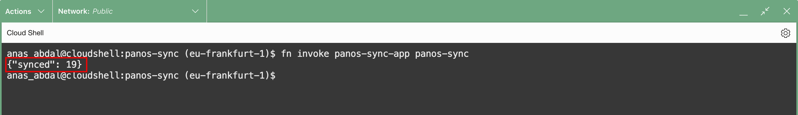
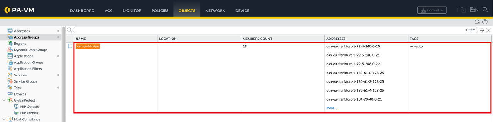

# Lab 5 - Test the Function Manually

## Introduction

In this lab, you run the sync function on demand to confirm it works before handing it to the scheduler. You invoke the function from Cloud Shell, read the JSON response to see how many address objects were synced, and then verify the results on the firewall: the new address objects appear under Objects → Addresses, each tagged with `oci-auto`, and the address group `osn-public-ips` is populated with a matching member count.

Running this manual test first means that when OCI Resource Scheduler triggers the function in the next lab, you already know the end-to-end path works and what a healthy result looks like.

Estimated Time: 10 minutes

### Objectives

In this lab, you will:
- Invoke the `panos-sync` function manually from Cloud Shell
- Interpret the JSON response and the `synced` count
- Verify the created address objects and their `oci-auto` tag on the firewall
- Confirm the `osn-public-ips` address group is populated and its count matches

### Prerequisites

This lab assumes you have:
- Completed Labs 1 through 4
- The function deployed and configured (Lab 3) and the `oci-auto` tag created on the firewall (Lab 4)
- Access to Cloud Shell and to the Palo Alto firewall GUI

## Task 1: Test the Function Manually

Before scheduling, confirm the function actually works.

- Invoke the function from Cloud Shell:

```bash
<copy>fn invoke panos-sync-app panos-sync</copy>
```

After around one minute you should see a JSON response with the count of synced address objects:

```json
{"synced": 19}
```



The exact number depends on your `OCI_REGIONS` and `OCI_SERVICES` filters. In this run, `eu-frankfurt-1` with `OSN,OBJECT_STORAGE` produced 19 entries.

- **Verify on the firewall.** Log into the firewall GUI at `https://<firewall-mgmt-ip>` and navigate to **Objects** → **Addresses**. Filter by `osn-` to see the new entries, each tagged `oci-auto`. Object names follow the format `<prefix>-<oci-region>-<cidr-dashed>`:

    - `<prefix>` is set by `ADDR_PREFIX` (`osn`)
    - `<oci-region>` comes from the Oracle JSON
    - the CIDR has its dots and slash replaced with dashes, since PAN-OS object names cannot contain `.` or `/`

For example, `92.5.248.0/22` in `eu-frankfurt-1` becomes `osn-eu-frankfurt-1-92-5-248-0-22`.


- Navigate to **Objects** → **Address Groups** and click `osn-public-ips` to open it. Confirm the members are populated and the count matches the `synced` value from the function response.



## Acknowledgements

- **Author** - Anas Abdallah (OCI Network Black Belt)
- **Last Updated By/Date** - Anas Abdallah, June 2026

You may now **proceed to the next lab**.