# Lab 6 - Schedule Daily Synchronization with OCI Resource Scheduler

## Introduction

The function works, but a sync that only runs when you invoke it by hand is not automation. Oracle updates its public IP ranges on demand as it adds capacity or launches services, with no predictable timing, so a daily refresh keeps the firewall current and ensures minimal risk without anyone touching it.

OCI Resource Scheduler is a managed service that runs scheduled actions on OCI resources. Here, it invokes the function on a fixed daily schedule. There is no VM to patch, no cron daemon to keep alive, and no instance principal to maintain. The scheduler runs as its own principal type (`resourceschedule`), so the only setup required is a policy that lets that principal invoke the function, and the schedule itself.

In this lab you grant the scheduler permission to invoke the function, create a daily schedule on `panos-sync`, and confirm the run by tampering with an address object on the firewall and watching the next run correct it.

In this run the schedule fires every day at 03:00 UTC, which is 06:00 Asia/Qatar.

Estimated Time: 10 minutes

### Objectives

In this lab, you will:
- Grant the Resource Scheduler principal permission to invoke the function
- Create a daily schedule that runs `panos-sync` automatically
- Confirm the schedule is working by tampering with an address object and watching the next run correct it

### Prerequisites

This lab assumes you have:
- Completed Labs 1 through 5
- The `panos-sync` function deployed, configured, and verified working (Lab 5)
- Permissions to create IAM policies and Resource Scheduler schedules in your compartment

## Task 1: Grant the Resource Scheduler Permission to Invoke the Function

1. In the OCI Console, navigate to **Identity & Security** → **Policies**.
2. Select your working compartment `Tutorial`. Most tenancies restrict policy creation at the tenancy root, so working at the compartment level is the standard approach.
3. Click on `panos-sync-fn-policy` which is created in Lab 2.
4. Click on **Statements** → **Edit Policy Statements** → **Advanced**:

    ```
    <copy>allow any-user to read fn-function in compartment Tutorial where all {request.principal.type='resourceschedule'}
    allow any-user to use fn-invocation in compartment Tutorial where all {request.principal.type='resourceschedule'}</copy>
    ```

5. Click **Save changes**.

    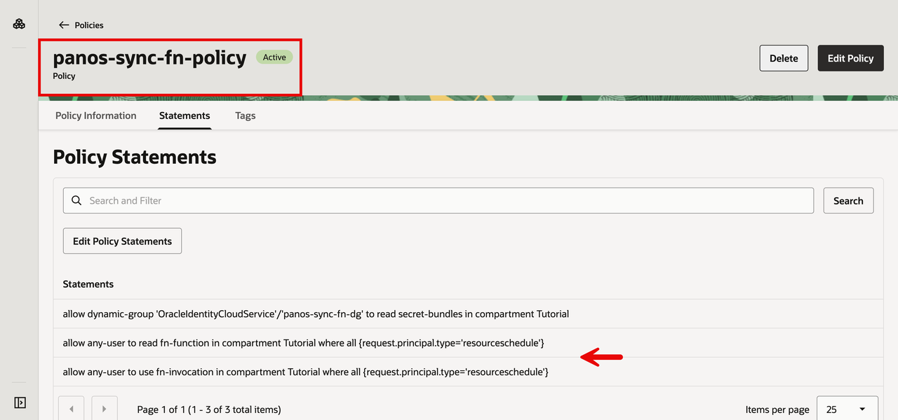

    The policy now holds three statements: the `read secret-bundles` statement for the function's dynamic group from Lab 2, plus the two scheduler statements you just added.

## Task 2: Create the Daily Schedule

With the policy in place, create the schedule on the `panos-sync` function.
1. Open the navigation menu.
2. Click on **Developer Services**.
3. Click **Functions**.

    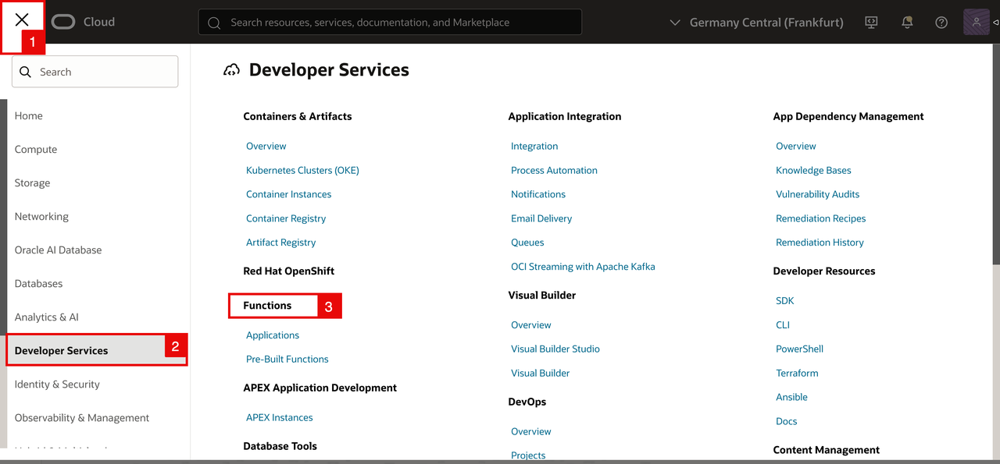

- Click on `panos-sync-app`

    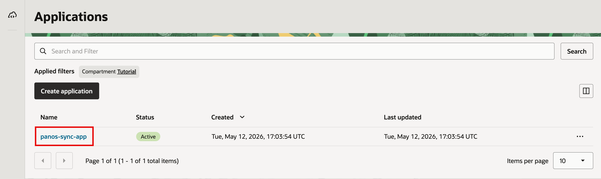

- Click the **Functions** tab.

    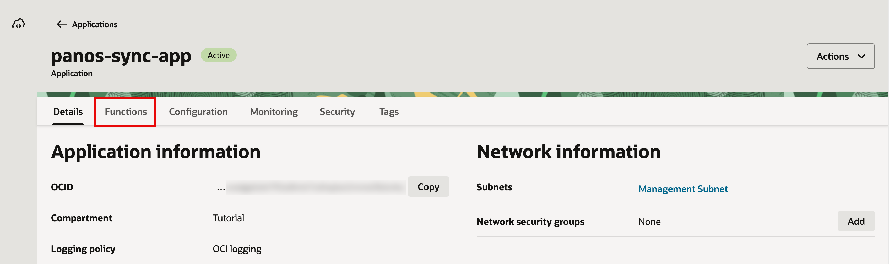

- Click `panos-sync`.

    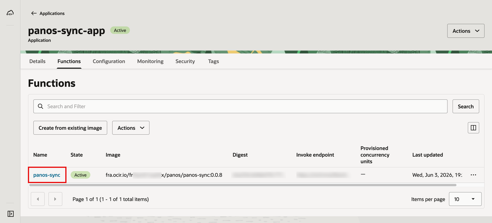

- Click the **Schedules** tab.

    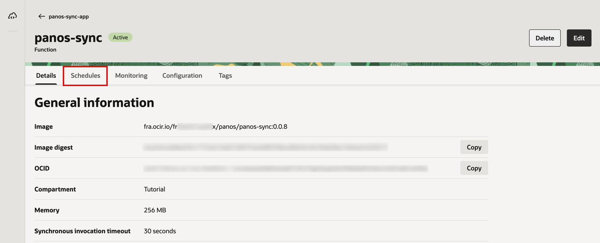

- Click **Add schedule**.

    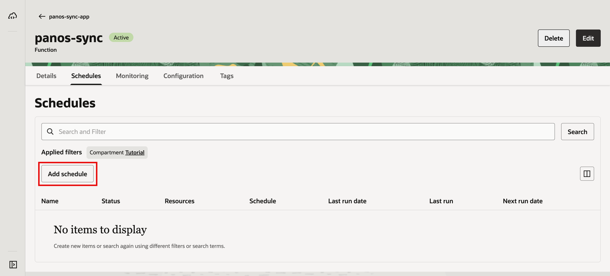

- In the **Add schedule** panel, configure the following:
    1. Leave **Create new schedule** selected.
    2. **Name**: `panos-sync-daily-schedule`.
    3. **Description**: `Triggers panos-sync function daily at 03:00 UTC (06:00 Asia/Qatar) to sync Oracle public IP ranges to the Palo Alto firewall`.
     4. **Compartment**: `Tutorial`.

    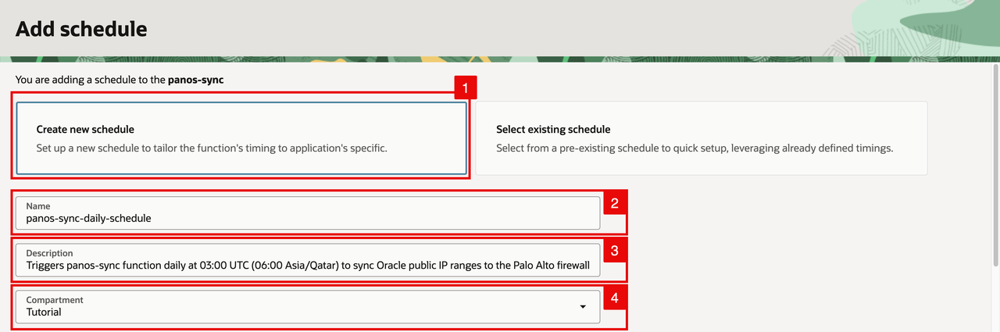

- Under **Specify schedule using**, configure the following:
    1. Keep **Form interface** selected and set:
    2. **Interval**: `Daily`.
    3. **Repeat every**: `1` `day`.
    4. **Time**: `03:00`.
    5. **Start date** and **End date**: in this run, 6/5/2026 to 6/5/2027.
    6. The **Summary** confirms `Every Day at 03:00 UTC`.
    7. Leave **Add invocation payload** off. The function reads everything it needs from its configuration and the secret, so no payload is required.
    8. Click **Create**.

    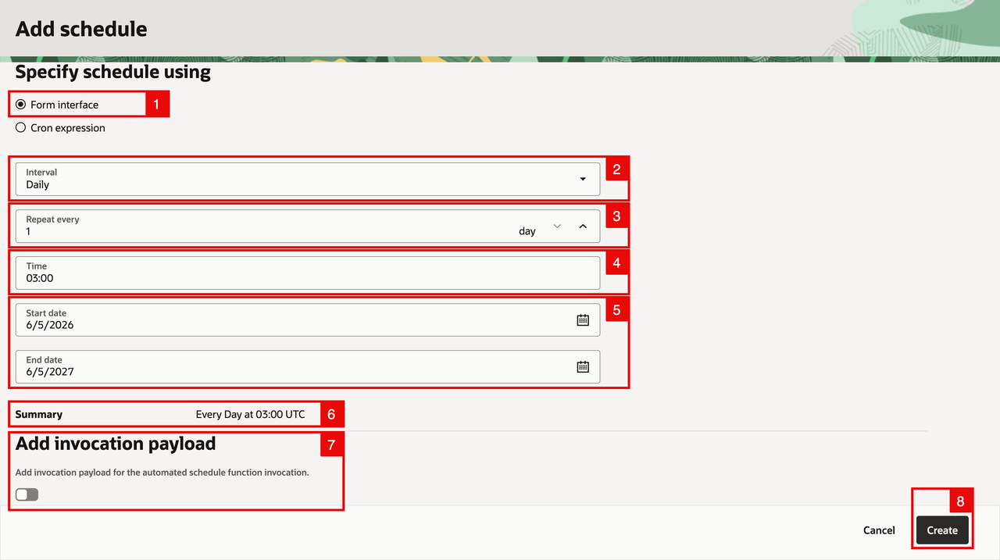

- The schedule appears with status **Creating**.

    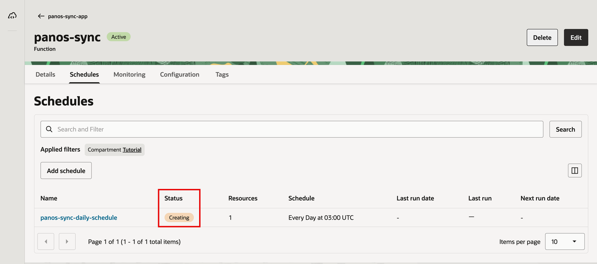

<!-- -->

1. After a short wait it moves to **Enabled**.
2. **Next run date** shows the upcoming 03:00 UTC slot.

    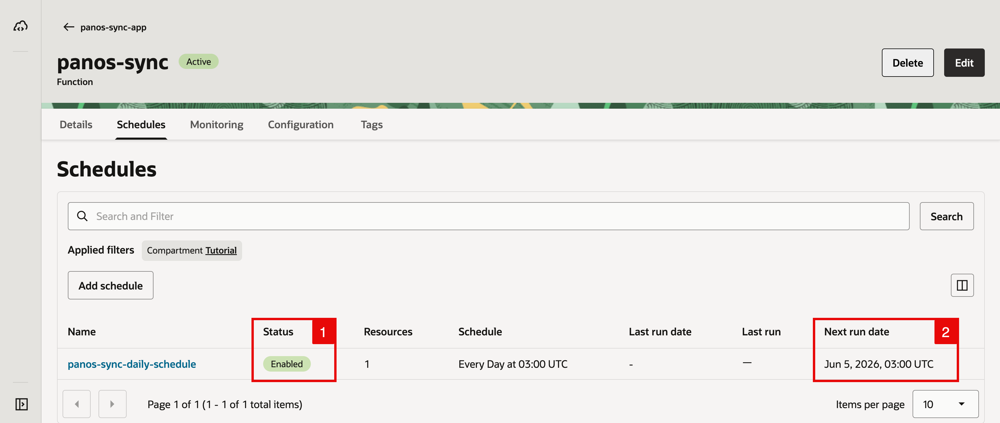

## Task 3: Confirm the Schedule Is Running

The real test is that the automation keeps the firewall aligned with Oracle's JSON even when something changes between runs.

- On the firewall, modify one of the auto-managed address objects. For example, change `osn-eu-frankfurt-1-92-5-248-0-22` from its correct value `92.5.248.0/22` to `1.1.1.1/32`, then commit.

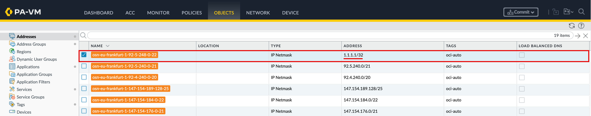

- Wait for the next scheduled run (the next 03:00 UTC slot). When it completes, the schedule details update:

    1. **Last run date** shows the slot that just passed (`Jun 5, 2026, 03:00 UTC`).
    2. **Last run** shows **Succeeded**.
    3. **Next run date** has advanced to the following day (`Jun 6, 2026, 03:00 UTC`).

    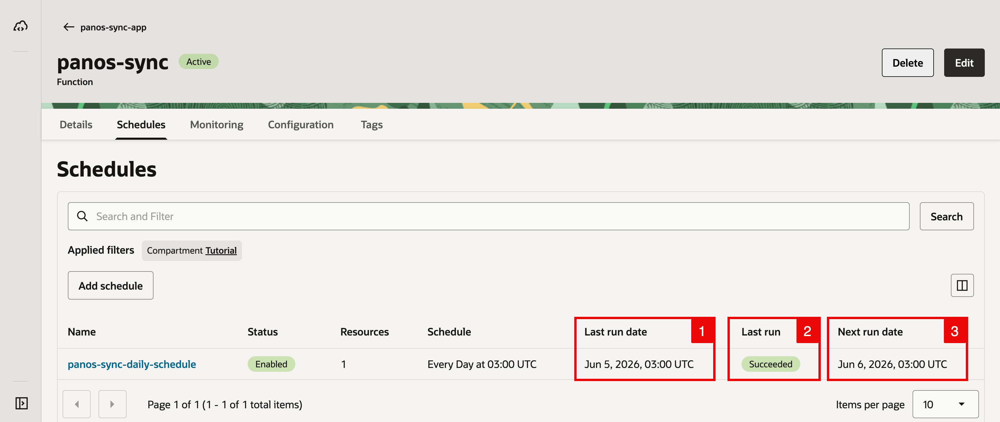

- On the firewall, refresh the **Objects** → **Addresses** view. The function has overwritten `osn-eu-frankfurt-1-92-5-248-0-22` back to its correct value, `92.5.248.0/22`. The drift you introduced is gone, with no manual intervention.

    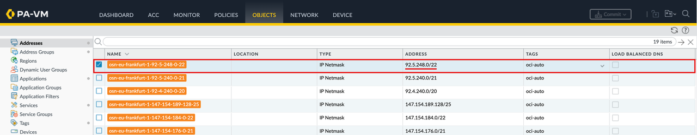

## Learn More

- [Overview of Resource Scheduler](https://docs.oracle.com/en-us/iaas/Content/resource-scheduler/home.htm)
- [Scheduling Functions](https://docs.oracle.com/en-us/iaas/Content/Functions/Tasks/functionsschedulingfunctions-about.htm)

## Acknowledgements

- **Author** - Anas Abdallah (OCI Network Black Belt)
- **Last Updated By/Date** - Anas Abdallah, June 2026

You may now **proceed to the next lab**.
