# Lab 7 - Sync Only When the IP Ranges Change

## Introduction

**This lab is an alternative to Lab 3, not an addition. Deploy either the Lab 3 function or Lab 7 function, not both. The IAM, Vault secret, tag, manual test, and scheduler steps in the other labs apply unchanged to either version.**

In Lab 3, the function performs a full sync on every run: it fetches the Oracle JSON, reconciles the address objects, rewrites the group, and commits to the firewall each time the scheduler fires. That design is simple and self-correcting, but it commits to the firewall every day even when nothing has changed.

The [published JSON](https://docs.oracle.com/en-us/iaas/tools/public_ip_ranges.json) includes a `last_updated_timestamp` field that changes only when Oracle actually updates the ranges. In this lab, you deploy an alternative version of the function that records the last-synced timestamp on the firewall and compares it at the start of each run. When the timestamp is unchanged, the function exits immediately without touching the firewall, avoiding an unnecessary commit. When it differs, the function runs the full sync and records the new value.

Estimated Time: 25 minutes

### Objectives

In this lab, you will:
- Understand where the timestamp gate fits in the function's control flow
- Deploy the timestamp-gated version of the `panos-sync` function
- Test the three behaviors: first run, skipped run, and forced re-sync
- Understand the self-healing trade-off the gate introduces

### Prerequisites

This lab assumes you have:
- Completed Lab 1: the PAN-OS API key is stored as a secret in OCI Vault
- Completed Lab 2: the dynamic group and IAM policy are created
- The OCID of the Vault secret from Lab 1
- A VCN and subnet available for the Functions application, with internet access
- Permissions to use OCIR, create Functions applications, and deploy functions in your compartment

> **Note:** If you already deployed the Lab 3 function, you can reuse the same application, OCIR login, Fn context, and configuration. Only the function code in Task 2 differs. Redeploy after replacing `func.py` and the new behavior takes effect.

## Task 1: Understand the Timestamp Gate

The function stores its state on the firewall itself, in the description field of the address group it already manages. No additional OCI resource is required.

The control flow becomes:

1. Fetch the [Oracle JSON](https://docs.oracle.com/en-us/iaas/tools/public_ip_ranges.json) and read its `last_updated_timestamp`. This field sits at the very top of the file; open the URL in a browser to see it. At the time this workshop was written it showed `2026-05-25T08:40:08.970229` (May 25, 2026), the last time Oracle had modified the IP ranges, roughly three weeks before the lab was finalized. Since the field only changes when the ranges do, it is exactly what the gate keys off.

    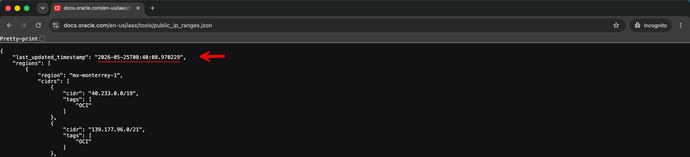

2. Read the address group's description from the firewall, which holds the timestamp recorded by the previous run.
3. If the two match, return immediately with a `skipped` response. The firewall is not modified and no commit occurs.
4. If they differ, or no timestamp is stored yet, run the full sync exactly as in Lab 3, then write the file's timestamp into the group description before committing.

Because the stored timestamp lives on the firewall, you control it directly. That is what makes this lab testable without waiting for a real Oracle update, as you will see in Task 3.

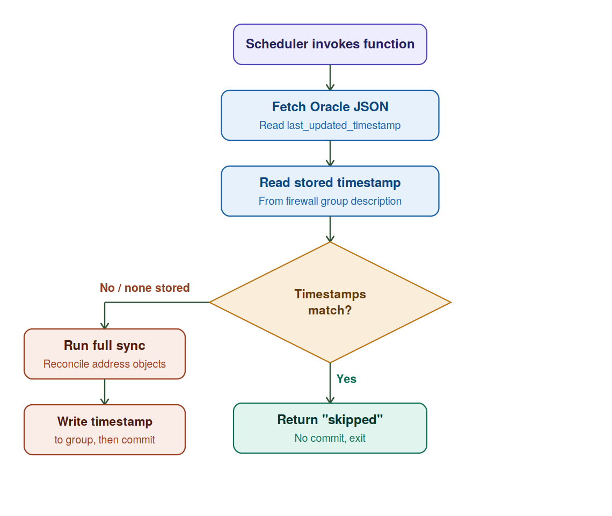

## Task 2: Write the Timestamp-Gated Function Code

Follow the same Cloud Shell, OCIR login, Fn context, and function skeleton setup as in Lab 3 (Tasks 1 through 4). If you already did this for Lab 3, change into the existing function directory:

```bash
<copy>cd ~/oci-panos-fn/panos-sync</copy>
```

Then edit `func.py`:

```bash
<copy>vi func.py</copy>
```

In vi, delete the existing contents: press `:`, type `%d`, press `Enter`. Press `i` to enter insert mode, paste the code below:

```python
<copy>import io, json, re, base64, requests, oci
from fdk import response

def handler(ctx, data: io.BytesIO = None):
    cfg = dict(ctx.Config())
    HOST, PREFIX, GROUP, TAG = cfg["PANOS_HOST"], cfg["ADDR_PREFIX"], cfg["ADDR_GROUP"], cfg["TAG"]
    REGIONS  = set(cfg["OCI_REGIONS"].split(","))
    SERVICES = set(cfg["OCI_SERVICES"].split(","))

    signer = oci.auth.signers.get_resource_principals_signer()
    sc = oci.secrets.SecretsClient(config={}, signer=signer)
    KEY = base64.b64decode(
        sc.get_secret_bundle(secret_id=cfg["PANOS_KEY_SECRET_OCID"]).data.secret_bundle_content.content
    ).decode().strip()

    URL = f"https://{HOST}/api/"
    requests.packages.urllib3.disable_warnings()

    def api(p):
        x = requests.post(URL, params={**p, "key": KEY}, verify=False, timeout=30)
        x.raise_for_status(); return x.text

    doc = requests.get("https://docs.oracle.com/en-us/iaas/tools/public_ip_ranges.json", timeout=30).json()
    file_ts = doc["last_updated_timestamp"]

    xg = f"/config/devices/entry/vsys/entry[@name='vsys1']/address-group/entry[@name='{GROUP}']"

    # Timestamp gate: compare the file timestamp to the one stored on the group.
    prev = re.search(r"&lt;description[^&gt;]*&gt;ts=([^&lt;]+)&lt;/description&gt;",
                     api({"type":"config","action":"get","xpath": xg}))
    if prev and prev.group(1) == file_ts:
        return response.Response(ctx, response_data=json.dumps({"skipped": file_ts}),
                                 headers={"Content-Type":"application/json"})

    desired = {}
    for r in doc["regions"]:
        if r["region"] not in REGIONS: continue
        for c in r["cidrs"]:
            if not (set(c["tags"]) &amp; SERVICES): continue
            name = f"{PREFIX}-{r['region']}-{c['cidr'].replace('.','-').replace('/','-')}"[:63]
            desired[name] = c["cidr"]

    xa = "/config/devices/entry/vsys/entry[@name='vsys1']/address"
    existing = set(re.findall(rf'&lt;entry name="({PREFIX}-[^"]+)"',
                              api({"type":"config","action":"get","xpath":xa})))

    for n, c in desired.items():
        api({"type":"config","action":"set","xpath": f"{xa}/entry[@name='{n}']",
             "element": f"&lt;ip-netmask&gt;{c}&lt;/ip-netmask&gt;&lt;tag&gt;&lt;member&gt;{TAG}&lt;/member&gt;&lt;/tag&gt;"})
    for n in existing - set(desired):
        api({"type":"config","action":"delete","xpath": f"{xa}/entry[@name='{n}']"})

    members = "".join(f"&lt;member&gt;{n}&lt;/member&gt;" for n in desired)
    # Store the file timestamp in the group description so the next run can compare against it.
    api({"type":"config","action":"edit","xpath": xg,
         "element": f"&lt;entry name='{GROUP}'&gt;&lt;static&gt;{members}&lt;/static&gt;"
                    f"&lt;description&gt;ts={file_ts}&lt;/description&gt;"
                    f"&lt;tag&gt;&lt;member&gt;{TAG}&lt;/member&gt;&lt;/tag&gt;&lt;/entry&gt;"})
    api({"type":"commit","cmd":"&lt;commit&gt;&lt;/commit&gt;"})

    return response.Response(ctx, response_data=json.dumps({"synced": len(desired), "timestamp": file_ts}),
                             headers={"Content-Type":"application/json"})</copy>
```

Then press `Esc`, type `:wq`, and press `Enter` to save and exit.

The differences from the Lab 3 code are: the `api` helper is defined earlier so it can be used for the timestamp read; a gate block reads the group description and returns `skipped` on a match; the group `edit` writes the timestamp into the description; and the success response includes the timestamp.

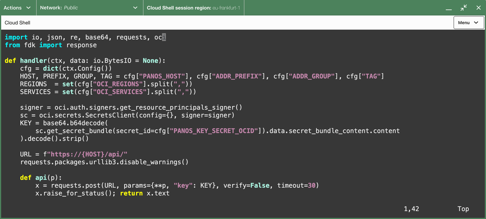

The `requirements.txt` is unchanged from Lab 3. If you are starting fresh, create it with the same contents:

```
<copy>fdk
requests
oci</copy>
```

## Task 3: Deploy and Test the Three Behaviors

If you completed Lab 3, the `panos-sync-app` application already exists and you can skip straight to the deploy command below. If you are doing this lab standalone, create the application first. It is the logical container for the function and pins the subnet and shape (`GENERIC_X86`) used at runtime:

```bash
<copy>oci fn application create \
  --compartment-id <your-compartment-ocid> \
  --display-name panos-sync-app \
  --subnet-ids '["<your-subnet-ocid>"]'</copy>
```

> **Note:** Subnet choice - the subnet must reach the firewall management IP (TCP/443) and the [Oracle IP ranges JSON](https://docs.oracle.com/en-us/iaas/tools/public_ip_ranges.json) over HTTPS. It needs a route to the internet for the JSON fetch, either via an Internet Gateway (public subnet, as used in this workshop) or a NAT Gateway (private subnet, the more common production choice). The simplest setup is to reuse the firewall's management subnet.

Deploy the function. Fn builds the Docker image, pushes it to OCIR, and registers the function with the application. This typically takes around 3 minutes:

```bash
<copy>fn -v deploy --app panos-sync-app</copy>
```

Watch for `Successfully created function: panos-sync` at the end of the output.

If you have not yet set the function configuration, apply the same `fn config` values as in Lab 3 Task 6 before testing.

> **Note:** Troubleshooting - if `fn deploy` fails with `no space left on device`, Cloud Shell's home directory has filled with cached container layers. Clear them with `podman system reset -f`, then run the deploy again. If the push fails with a `403`, your OCIR login has expired; run `docker login <region>.ocir.io` with a fresh auth token and redeploy.

Because the comparison timestamp is stored on the firewall and under your control, you can exercise all three behaviors immediately, without waiting for Oracle to publish an update.

To make the firewall state easy to observe, first show the Description column on the Address Groups page:

1. Go to **Objects**.
2. Select **Address Groups**.
3. Open the column dropdown arrow on the **Tags** column header.
4. Open the **Columns** submenu.
5. Tick **Description**.

    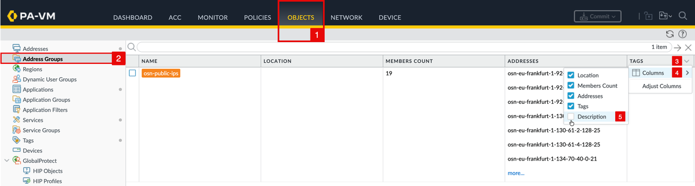

    The **Description** column now appears on the page.

    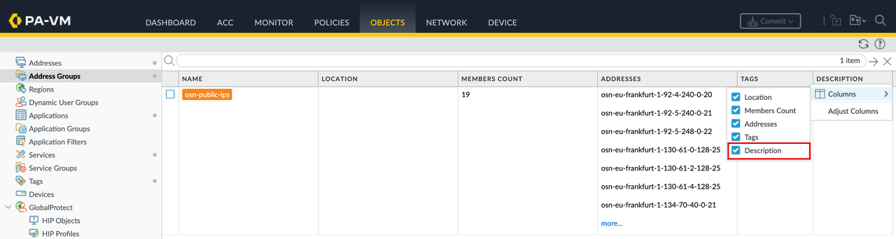

    **Behavior 1 - first run (full sync).** On the first invocation, no matching timestamp is stored yet, so the gate cannot match. The function creates the address group, syncs all 19 address objects into it, and writes the last-updated timestamp into the group **Description**. If the group already exists from Lab 3, its **Description** column for `osn-public-ips` is empty before the run:

    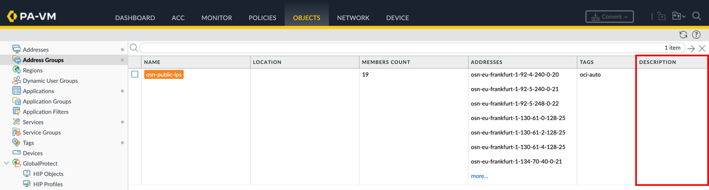

    Invoke the function:

    ```bash
    <copy>fn invoke panos-sync-app panos-sync</copy>
    ```

    Expected response, with the synced count and the recorded timestamp:

    ```json
    {"synced": 19, "timestamp": "2026-05-25T08:40:08.970229"}
    ```

    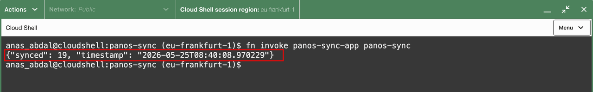

    After the run, the function has written the timestamp into the group **Description**:

<!-- -->

1. The **Description** now reads `ts=2026-05-25T08:40:08.970229`.
2. Select **Addresses** to view the objects that were created.

    

    All 19 address objects have been created and tagged `oci-auto`:

    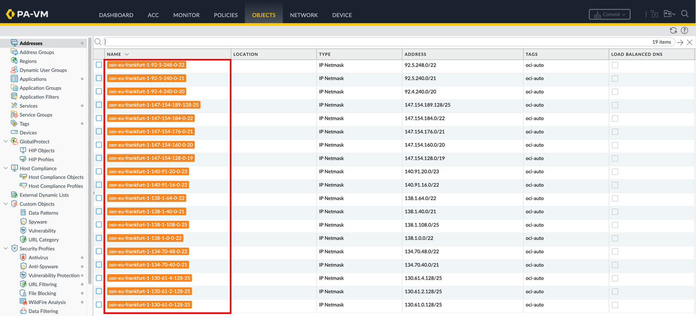

    **Behavior 2 - skipped run (no change).** When the file timestamp matches the one stored on the firewall, the gate returns immediately and the firewall is untouched. To make the skip visible, first introduce a manual change the function would normally correct. Edit one address object so its value is wrong, for example set `osn-eu-frankfurt-1-92-5-248-0-22` to `1.1.1.1/32`, then Commit:

<!-- -->

1. The address value is now `1.1.1.1/32` instead of its real CIDR.
2. Select **Address Groups** to confirm the stored timestamp.

    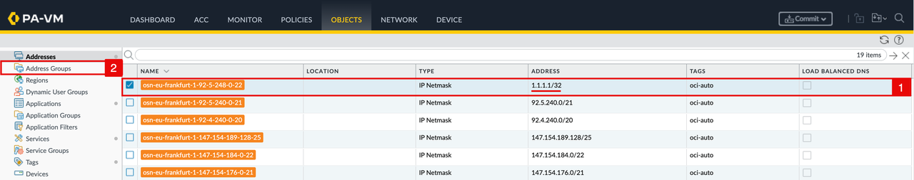

    The group **Description** still holds the timestamp recorded in Behavior 1, so it matches the file:

    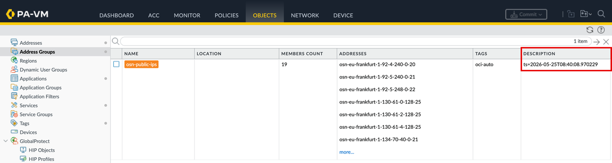

    Invoke again right away:

    ```bash
    <copy>fn invoke panos-sync-app panos-sync</copy>
    ```

    Expected response:

    ```json
    {"skipped": "2026-05-25T08:40:08.970229"}
    ```

    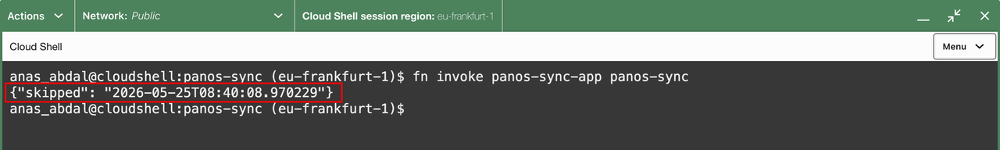

    No commit is generated on the firewall for this run. This is the behavior that saves a daily commit when Oracle has not changed the ranges. Because the function skipped, the manual change is not corrected: the address object still reads `1.1.1.1/32`:

    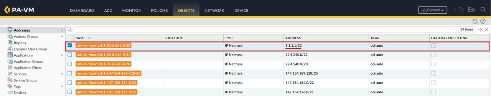

    **Behavior 3 - forced re-sync (simulated update).** When the file timestamp differs from the stored one, the gate falls through and the function runs the full sync, exactly as it would the day Oracle publishes an update. To trigger this without waiting for a real update, simulate it by changing the stored timestamp on the firewall to an old value. The `1.1.1.1/32` drift from Behavior 2 is still in place, so this run also confirms the sync corrects it:

<!-- -->

1. The **Description** column shows the current timestamp `ts=2026-05-25T08:40:08.970229` from the last sync.
2. Open `osn-public-ips` to edit it.

    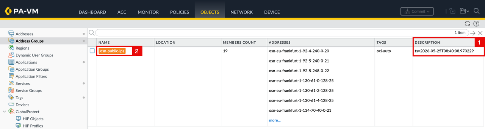

    Set the **Description** to an obviously old value so it cannot match the file:

<!-- -->

1. Change the **Description** to `ts=2000-01-01T00:00:00.000000` (January 1, 2000 - a deliberately old date, so the gate treats the stored timestamp as stale and forces a full sync).
2. Click **OK**.

    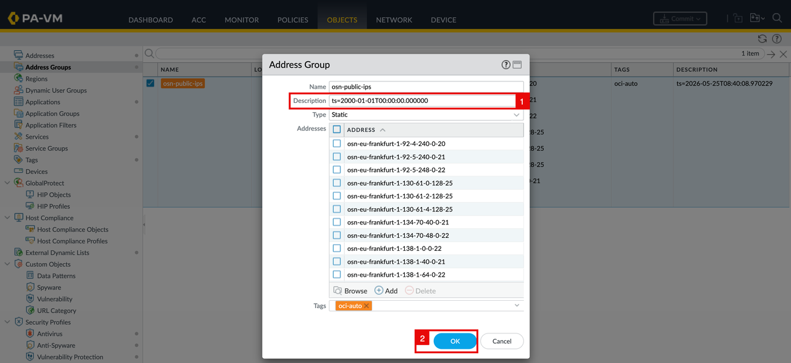

    Commit the change:

<!-- -->

1. The **Description** now shows `ts=2000-01-01T00:00:00.000000`.
2. Click **Commit**.

    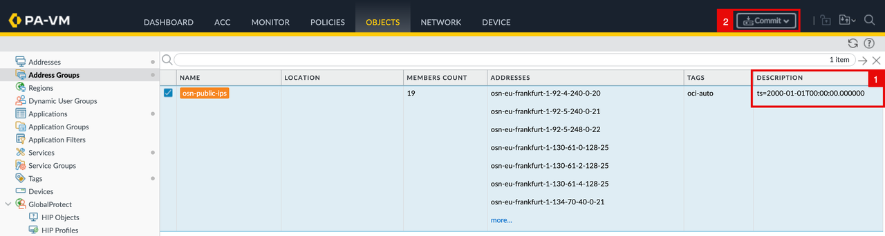

    In the commit dialog:

<!-- -->

1. Leave **Commit All Changes** selected.
2. Click **Commit**.

    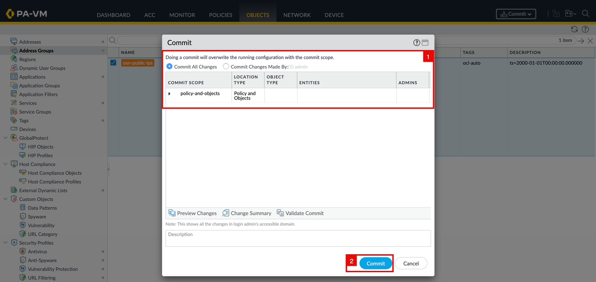

    The commit job starts and shows its progress:

    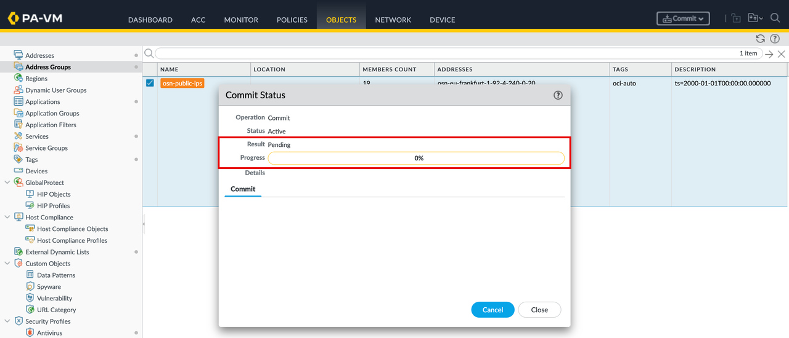

    Wait for the commit to complete successfully:

    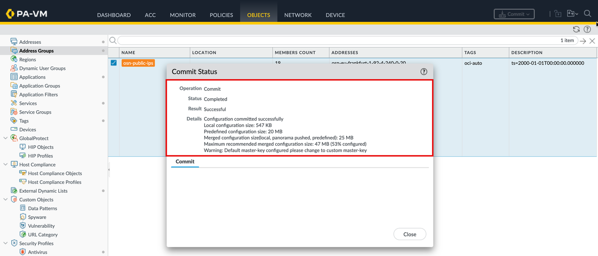

    Invoke again:

    ```bash
    <copy>fn invoke panos-sync-app panos-sync</copy>
    ```

    The stored timestamp no longer matches the file, so the function runs the full sync again and rewrites the description with the real timestamp:

    ```json
    {"synced": 19, "timestamp": "2026-05-25T08:40:08.970229"}
    ```

    This is exactly what happens in production the day Oracle updates the file: the timestamps differ, and the function reconciles.

    After the run, the function has restored the real timestamp:

<!-- -->

1. The **Description** reads `ts=2026-05-25T08:40:08.970229` again.
2. Select **Addresses** to confirm the drift was corrected.

    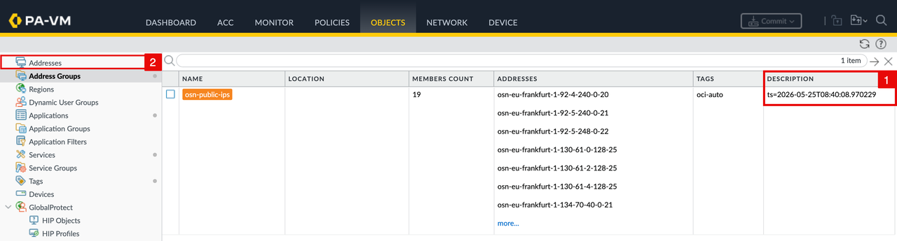

The address object `osn-eu-frankfurt-1-92-5-248-0-22` is back to its correct value `92.5.248.0/22`, reconciled from the `1.1.1.1/32` value:


In this lab you invoked the function manually with `fn invoke` to test the three behaviors quickly. In production the function is triggered automatically on a schedule, exactly as configured in Lab 6 with OCI Resource Scheduler. The timestamp gate behaves the same way under the scheduler: most scheduled runs will skip, and a run will sync only when Oracle's timestamp changes.

## Task 4: Understand the Self-Healing Trade-off

The timestamp gate detects changes to the published file, not drift on the firewall. If someone manually edits or deletes the synced address objects while the file timestamp is unchanged, the gated function will skip and will not correct that drift until the file's timestamp next changes. Behavior 2 demonstrated this directly: the `1.1.1.1/32` edit survived the skipped run.

The Lab 3 full-sync version does not have this limitation, because it reconciles the firewall to the file on every run regardless of timestamps. That is the trade-off between the two versions:

- **Lab 3 (full sync):** simpler, self-healing against manual drift, at the cost of a commit on every scheduled run.
- **Lab 7 (timestamp gated):** quieter, near-zero commits, at the cost of not self-healing between file updates.

For environments where out-of-band edits are a concern, you can keep the gate but still force a periodic full reconcile, for example by scheduling a second, less frequent run that clears the group description first, or by simply using the Lab 3 version. Choose the version that matches how the firewall is operated in your environment.

## Acknowledgements

- **Author** - Anas Abdallah (OCI Network Black Belt)
- **Last Updated By/Date** - Anas Abdallah, June 2026