# Design the Pizza Skill

## Introduction

In this lab, we will complete development of the Pizza Skill that has been started for us.

Estimated Time: 30 minutes

### Objectives

In this lab, you will:
- Create a composite bag entity to consolidate existing entities which represent the different variable elements of the pizza (size, topping, delivery time etc) and make it easier to manage entities from the dialog flow.
- Add logic to the skill's dialog flow to manage the pizza ordering process.
- Train and test the skill.
- Publish the skill so that it can be used in a digital assistant.

## Task 1: Explore and Test the Skill

The conversational AI use case you are working with is a skill for ordering pizza. To familiarize yourself with the designer and the skill itself, try it out by following these steps:

1. In ODA, click the main menu icon to open the side menu.
2. Click **Development** and select **Skills**.
3. Click the main menu icon again to collapse the side menu.
4. In the skills dashboard, select your copy of **PizzaSkill**.
5. In the left navigation for the designer, select the Intents icon.
6. Click the **OrderPizza** intent and quickly scan the utterances.
7. In the left navigation for the designer, select the Entities icon.
8. Select the **PizzaDough** entity and look at the way that it is configured.
9. Repeat the above step for **PizzaSize** and **PizzaTopping**.
10. Locate the **Train button** on the right side of the page, click it, click **Submit**, and then wait a few seconds for the training to complete.
11. Find the Bot Tester icon  on the top of the page and click it.
12. In the tester's **Message** field, type *I want to order pizza*, click **Send**, and note the skill's response.
  For now it's just a static response. It will become more dynamic once we add logic to the dialog flow.
13. Click the **Reset** button at the top of the tester window and then close the tester.

## Task 2: Add a Composite Bag Entity

When a customer orders a pizza, details such as toppings, size, and crust need to be specified. In PizzaSkill, each of these variables is represented by an entity.

The challenge for any chatbot is that the user can include varying subsets of the required information in their initial input. For example, one person might specify the size and topping, but not the type of crust. And another person might specify only the crust. In each case, the skill should recognize any entities supplied in the original input, and prompt for those that are not.

In this step, we’ll create a composite bag entity, which is a special entity that automatically recognizes and prompts for the appropriate entities for a pizza order. In addition to our custom entities (PizzaSize, PizzaTopping, PizzaDough), we'll include a system entity for DeliveryTime.

**Create the Composite Bag Entity**:

1. Select the Entities icon and click the Add Entity button to create a new entity.
2. In the **Name** field, change the value to PizzaBag.
3. In the Configuration section, in the Type dropdown, select **Composite Bag**.
  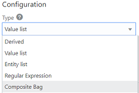

**Add Bag Items for the PizzaSize, PizzaTopping, PizzaDough, and DeliveryTime Entities**

1. Click Add Bag Item button. 
2. On the Add Bag Item page, fill in the following values:
    - **Name**: PizzaSize
    - **Type**: Entity
    - **Entity Name**: PizzaSize (If prompted in a popup, select **Overwrite**.)
    - **Maximum User Input Attempts**: 4
    - **Error Message**: Sorry, '${system.entityToResolve.value.userInput!'this'}' is not a valid size of pizza.
3. Click Add Prompt button. 
4. For the value, enter *What size of pizza would you like?*
5. Again, click Add Prompt button. 
6. For the value, enter *Please choose small, medium or large.*
7. Click **Close**.
8. Again, click Add Bag Item button. 
9. On the Add Bag Item page, fill in the following values:
    - **Name**: PizzaTopping
    - **Type**: Entity
    - **Entity Name**: PizzaTopping (If prompted in a popup, select **Overwrite**.)
    - **Error Message**: Sorry, we don't have that topping
    - **Prompt for Disambiguation**: switched ON
    - **Disambiguation Prompt**: Sorry you can only order one topping type
10. Click **Close**.
11. Again click Add Bag Item button. 
12. On the Add Bag Item page, fill in the following values:
    - **Name**: PizzaDough
    - **Type**: Entity
    - **Entity Name**: PizzaDough
    - **Prompt for Value**: false
13. Click **Close**.
14. For the fourth (and final) time, click Add Bag Item button. 
15. On the Add Bag Item page, fill in the following values:
    - **Name**: DeliveryTime
    - **Type**: Entity
    - **Entity Name**: TIME
    - **Maximum User Input Attempts**: 4
16. Scroll down to the Prompts section, replace the existing prompt with *When can we deliver that for you?*, and press Enter.
17. Click Add Validation Rule button. 
18. In the **Expression** field, enter ${(pizza.value.DeliveryTime.hrs?number < 10)?then('true','false')}
19. In the **Error Message** field, enter *Sorry, we only deliver up to 9:30pm* and press the Enter key.
20. Click **Close**.
  Here is what the PizzaBag composite bag should look like in the designer:
  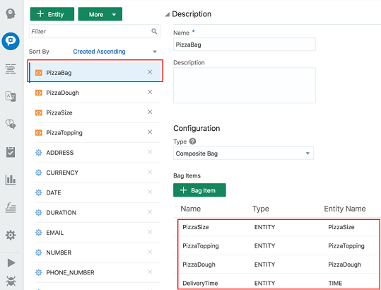

## Task 3: Associate the Entity with the Intent

Now we need to associate the PizzaBag composite entity to the OrderPizza intent so that we can extract the key words and phrases from the user input.

1. Select the Intents icon. 
2. Select the **OrderPizza** intent.
3. Click the Add entity dropdown button and select **PizzaBag** from the dropdown. See this screenshot to help locate the button:
  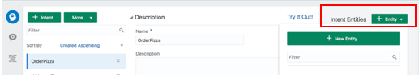

## Task 4: Implement the Pizza Ordering Logic

Next we need to write logic for the skill to understand the user query and respond accordingly. We'll do this in the dialog flow where we can choreograph the interaction between the skill and its users.

1. Click the Dialog Flow icon. 
2. Within the context variables section, add this entry: pizza: "PizzaBag"
  Here's how the addition should look in context.
  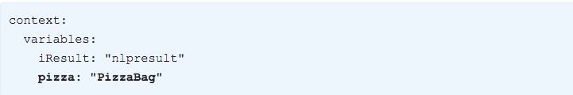
  **Important**: For all dialog flow examples, make sure that you get the indentation exactly right. Each state starts with two spaces of indentation. With each additional level of indentation, you add two more spaces.
3. Update the text and transitions properties in the **startOrderPizza** state:
  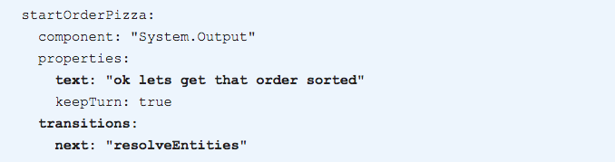
4. Click **Copy** in the following code box and then paste the copied code below the **startOrderPizza** state:

    ```
    <copy>

      resolveEntities:
      component: "System.ResolveEntities"
      properties:
        variable: "pizza"
        nlpResultVariable: "iResult"      
        maxPrompts: 3
        cancelPolicy: "immediate"        
      transitions:
        next: "setPizzaDough"
        actions:
          cancel: "maxError"

    setPizzaDough:
      component: "System.SetVariable"
      properties:
        variable: "pizza.PizzaDough"
        # value set for the variable.
        value: "${pizza.value.PizzaDough?has_content?then(pizza.value.PizzaDough,'regular')}"
      transitions:
        next: "showPizzaOrder"

    showPizzaOrder:
      component: "System.Output"
      properties:
        text: "Ok so we are getting you a ${pizza.value.PizzaSize} ${pizza.value.PizzaTopping} at ${pizza.value.DeliveryTime.date?long?number_to_time?string('HH:mm')}.  This will be on our ${pizza.value.PizzaDough} base "
      transitions:
        return : "showPizzaOrder"

    maxError:
      component: "System.Output"
      properties:
        text: "OK lets connect you with someone to help"
      transitions:
        return: "maxError"

    </copy>
    ```
    
### Notes on What We Just Did

- We have added a context variable pizza of type PizzaBag and used it in the **resolveEntities** state. This state is called when the **OrderPizza** intent is resolved.
- The **resolveEntities** state calls a system component (System.ResolveEntities), iterates through all the entity fields in the composite bag, converses with the user, and resolves all the fields.
- The **setPizzaDough** state checks if the dough value is null. If yes, then it sets it to regular.
Once all the entities are resolved, we output the pizza details in the **showPizzaOrder** state.
- The **maxError** state is called if the number of attempts for an entity in the bag has reached the value of maxPrompts.

## Task 5: Validate and Train PizzaSkill

1. Click the **Validate** button to validate the skill.
  (The Validate button is in the top navigation.)
2. If validation fails, delete the code in the dialog flow, replace it with the contents of the PizzaSkill_BotML.txt file, and validate the flow again.
3. Click **Train**, click **Submit**, and then wait a few seconds for the training to complete.

## Task 6: Test PizzaSkill

1. Find the Bot Tester icon on the top of the page and click it. 
2. Type *I want to order a medium pizza* in the **Message** field and click **Send**.
3. Click the **Intent/Q&A** tab and observe the Entity Matches section.
  You'll notice that the PizzaSize value is set to Medium:
  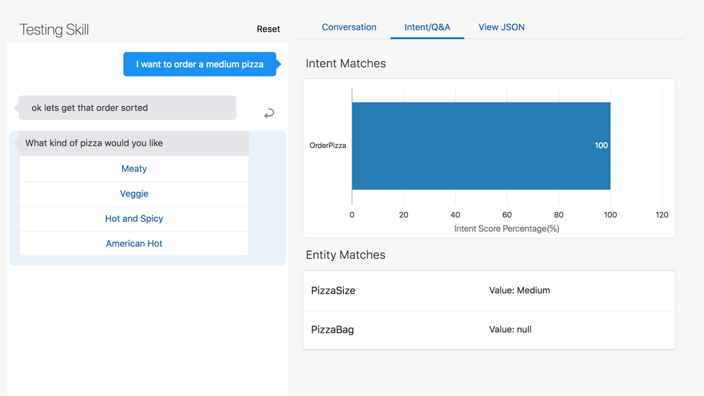
4. Click the **Reset** button.
5. Now try *Can I place an order for a medium meaty pizza to be delivered at 9:00 PM* and observe the response:
  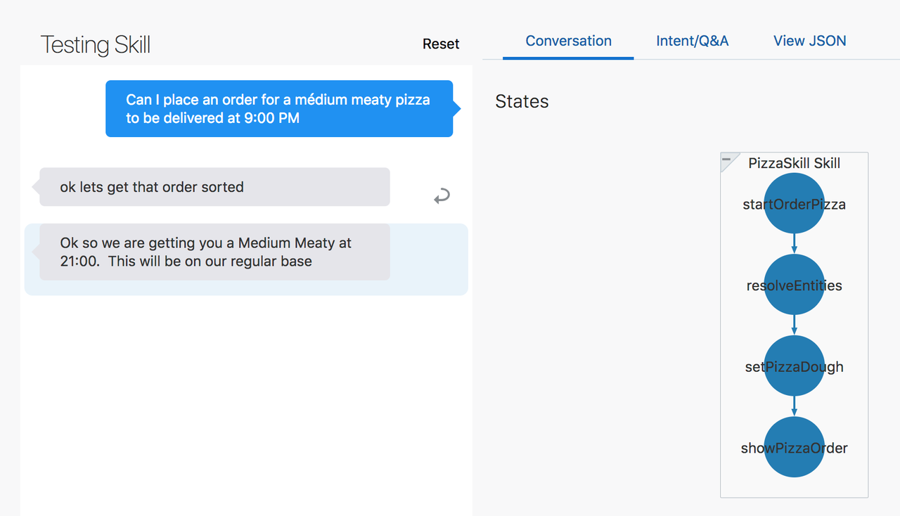
6. Click **Reset**.
7. Now let’s try one with a gluten-free base by typing: *A small veggie pizza to be delivered at 8:00pm, also can you please make it gluten-free?*
  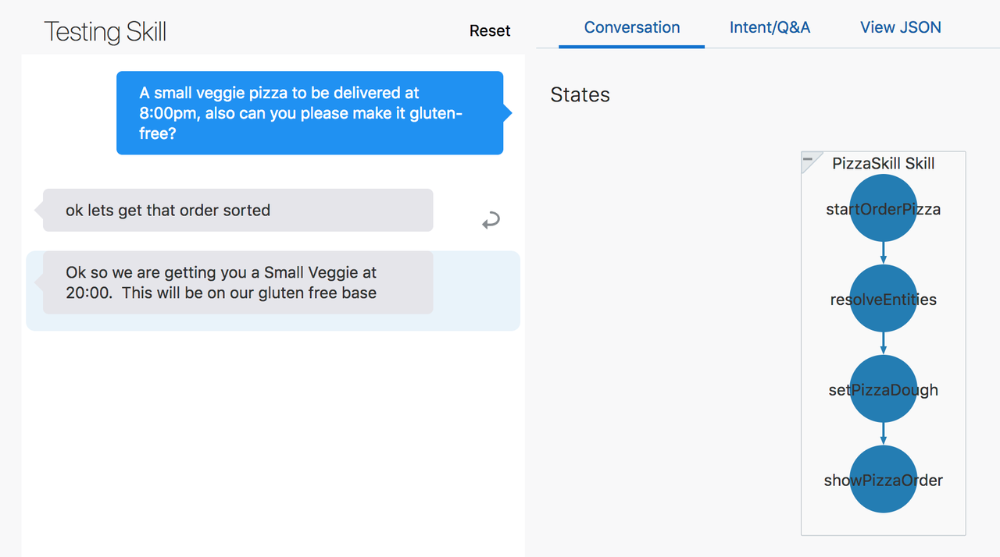
8. Click **Reset**.
9. Now try *Can I place an order for a medium meaty pizza to be delivered at 10:00 PM.*
  This should result in the following response:
  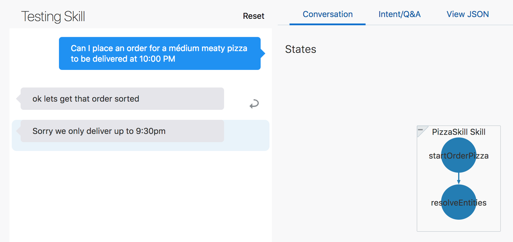
10. Click **Reset**.
11. Now try *Can I place an order for a small medium meaty pizza to be delivered at 9:00 PM* and see what you get.
12. Click **Reset**.
13. Now try *Can I place an order for a small sausage pizza to be delivered at 9:00 PM* and see what you get.
14. Click **Reset**.
15. Next try *I want a small meaty pizza.*
  The skill asks at what time to deliver the pizza.
16. To see how the skill reacts when the user changes his mind mid-stream, type *actually make it large* and press **Enter**.
17. When the skill repeats the question about delivery time, type *9:00 PM.*
  This is what the conversation should look like:
  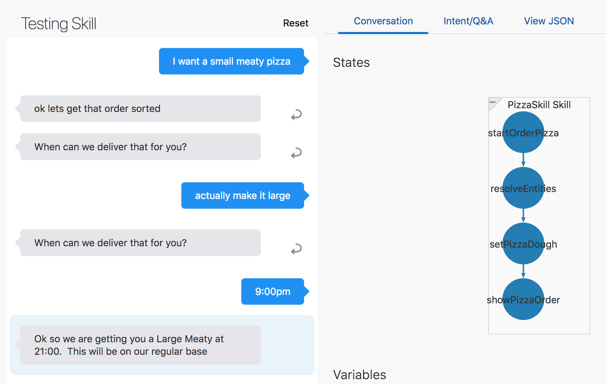
  As you can see, the skill was able to incorporate the change in the order and continue without missing a beat.
  Using the composite entity, we are able to resolve all the entities in a single customer query!

## Task 7: Publish the Skill

Now that we are done building the skill, we'd like to add it to our digital assistant.
However, to make the skill available to be added to a digital assistant, we first need to publish it:

1. Click the main menu icon to open the side menu.
2. Click **Development** and select **Skills**.
3. Click the main menu icon again to collapse the side menu.
4. In the skills dashboard, find the tile for your copy of **PizzaSkill**.
5. Click the skill's Options menu and select **Publish**.
  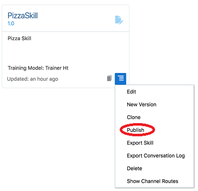
6. On the Publish Skills page, click **Publish**.
7. Once you have published the skill, note the icon on the skill's tile that shows it is now read-only.
  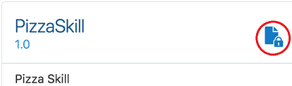

  Congrats! Your skill is now ready to be added to a digital assistant!

## Acknowledgements

* **Author** - Marcie Samuelsen
* **Contributors** -  Kamryn Vinson
* **Last Updated By/Date** - Kamryn Vinson, October 2020
