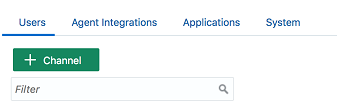
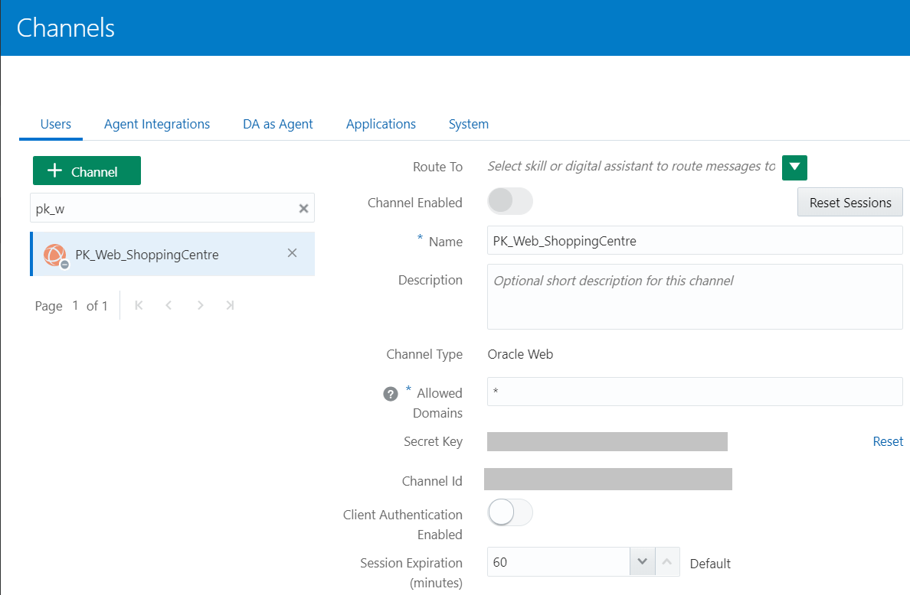
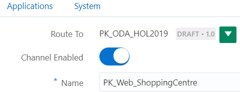
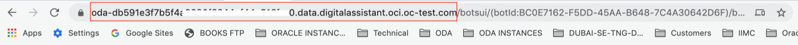
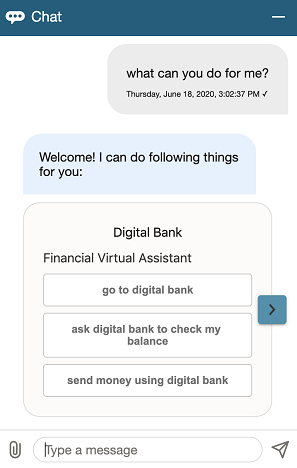

# Expose the Digital Assistant to Users through a Web Channel

## Introduction

In this section of the lab, we'll publish our DA through a web channel, create a web application to expose the DA to users, and test the DA from a web page.

> **Note**: If you are using a version of Oracle Digital Assistant that is based on Oracle Cloud Infrastructure Gen 1 (such as releases 19.1.5 and 19.4.1), this section of the tutorial won't work for you. The version of the SDK that this section requires is only available for instances of Digital Assistant that have been provisioned on Oracle Cloud Infrastructure Gen 2 (including versions 19.12 and later). To set a web channel on a Gen 1 instance of Digital Assistant, see [Expose Your Digital Assistant through a Web Channel.](https://docs.oracle.com/en/cloud/paas/digital-assistant/tutorial-web-channel/index.html)

Estimated Time: 30 minutes

### Objectives

In this lab, you will:
* Create a New Channel
* Set Up a Web Page
* Add a Chat Widget to the Web Page
* Test the DA on the Web Channel

## Task 1: Create a New Channel

1. Click the main menu icon to open the side menu.
2. Click **Development** and select **Channels**.
3. Click the main menu icon again to collapse the side menu.
4. On the **Users** tab, click **+ Channel**.
  
5. In the Create Channel dialog, fill in the following fields:
    - **Name**: A unique name for the channel, such as PK\_Web\_ShoppingCentre.
    - **Important**: If you are using the shared instance for this lab, be sure to include your initials in this field to distinguish it from the channels of other lab participants.
    - **Channel Type**: Oracle Web
    - **Allowed Domains**: * (asterisk)
    - **Client Authentication Enabled**: Switch to Off
6. Click **Create**.
7. If you are not returned to the page for the newly-created channel, enter part of your channel name in the **Filter** field, and then select your channel.
  
8. Open the **Route To** dropdown menu, enter your DA name in the **Filter** box, and select your DA.
9. Switch **Channel Enabled** to ON.
  
10. Copy the the value of the **Channel Id** field to a text file.
  You will use it later on this lab while running the sample client application.

## Task 2: Set Up a Web Page

To create the web page from which users can access the DA:

1. Create a folder called **chat-page**.
2. Download [chat-page.zip](https://docs.oracle.com/en/cloud/paas/digital-assistant/tutorial-digital-assistant/files/chat-page.zip) into the folder, and then unzip it.
  Your folder should now contain **index.html** and the **css**, **images**, and **scripts** subfolders.
3. Copy **native-client-sdk-js/web-sdk.js** from your Oracle Web SDK folder and put it in the **scripts** subfolder.

## Task 3: Add a Chat Widget to the Web Page

Now we'll add the chat widget to the web page:

1. In the top folder (chat-page), open **index.html** in an editor.
2. Click **Copy** in the following code box to copy the code, and then insert the copied code below the <link rel="stylesheet" href="css/style.css" \> tag.

    ```
    <copy>
    <script>
        var chatWidgetSettings = {
            URI: '<put-your-URI-here>',
            channelId: '<put-your-channel-ID-here>'
        };
        function initSdk(name) {
            // Default name is Bots
            if (!name) {
                name = 'Bots';
            }
            setTimeout(() => {
                const Bots = new WebSDK(chatWidgetSettings); // Initiate library with configuration
                Bots.connect()                               // Connect to server
                    .then(() => {
                        console.log("Connection Successful");
                    })
                    .catch((reason) => {
                        console.log("Connection failed");
                        console.log(reason);
                    });
                window[name] = Bots;
            });
        }
    </script>
    <script src="scripts/web-sdk.js" onload="initSdk('Bots')">
    </script>
  </copy>
    ```

3. Set these **chatWidgetSettings** properties:

    - **URI**: This is the host and domain name for your Oracle Digital Assistant instance. For example: xxxx.xxx.digitalassistant.xxx.xxx.com.
  You can get this URI from the address bar of your browser when it is displaying your Digital Assistant instance.

  

  > **Note**: Don't include https://.

  **ChannelId**: This is the channel ID that you noted when you created the Oracle Web channel. For example: 12a45b92-2c85-88aa-810d-1dc0d1cfe472.

4. Save your changes.
  Notice that the last <script\> element references the **web-sdk.js** file, which contains functions that enable you to programmatically send messages.

## Task 4: Test the DA on the Web Channel

Let's try out the chat widget.

1. On your system, navigate to the **chat-page** folder and double-click **index.html** to open the page in a web browser. You should see a web page with the chat widget's icon on the bottom of the page.
  
2. Click the widget.
3. Start communicating with the DA by asking for help and/or making specific requests, such as ordering pizza and checking account balances.
  

  > **Note**: There are menus for all three skills, which you can scroll through by using the arrows on the sides of the menus.
  

That's it! You have now introduced your DA to its public by hooking it up to a web interface.

## Acknowledgements

* **Author** - Marcie Samuelsen
* **Contributors** -  Kamryn Vinson
* **Last Updated By/Date** - Kamryn Vinson, October 2020
