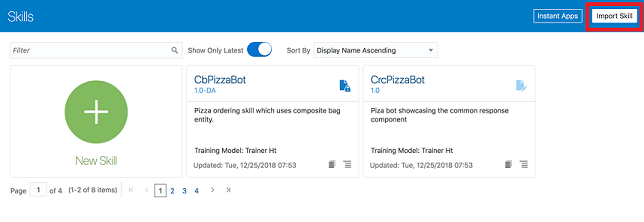
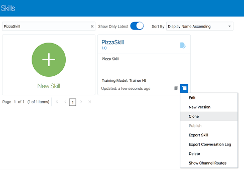

# Introduction

In this workshop, you'll learn how to work with skills and digital assistants in Oracle Digital Assistant.

A skill is an individual chatbot that is focused on a specific set of capabilities (e.g. helping customers order food from a specific restaurant).
A digital assistant is a master chatbot containing multiple specialized skills. When a user engages with the digital assistant, the digital assistant evaluates the user input and routes the conversation to the appropriate skill. You can populate your digital assistant with skills from the Skill Store and with skills you have designed yourself.
Here’s the scenario for this lab:

You’re part of a project team building a digital assistant to allow your customers to better engage with the various businesses in a major shopping centre.

This is the early stage of building the digital assistant and currently it supports use cases for a bank and a major retail store. The next stage of the project is to add a skill to support the new pizzeria that is opening up.

## Objectives

In this lab, you will:
* Complete the pizza skill ensuring it can handle complex requests for personalizing your pizza.
* Add this skill to the shopping centre digital assistant.
* Expose the digital assistant on the pizzeria's website.

Estimated Time: 120 minutes

### Prerequisites

To complete this workshop, you will need:

1. These files:
    - [PizzaSkill_starter.zip.](https://docs.oracle.com/en/cloud/paas/digital-assistant/tutorial-digital-assistant/files/PizzaSkill_starter.zip)
    - [ODA_HOL2019.zip.](https://docs.oracle.com/en/cloud/paas/digital-assistant/tutorial-digital-assistant/files/ODA_HOL2019.zip)
    - [PizzaSkill_BotML.txt.](https://docs.oracle.com/en/cloud/paas/digital-assistant/tutorial-digital-assistant/files/PizzaSkill_BotML.txt)

  Go ahead and download them now.

2. Oracle Web SDK 20.6.1 or later unzipped into a folder of your choice.
  You can download this SDK from the [Oracle Digital Assistant downloads page](http://bit.ly/amcedownloads).

3. An Oracle Digital Assistant (ODA) cloud instance. You can get one using either of the following approaches:
    - [Use your own instance](https://docs.oracle.com/en/cloud/paas/digital-assistant/tutorial-digital-assistant/#trial)

    If you have your own instance, you can continue this lab after the event and even build your own digital assistant.

    - [Using a shared instance](https://docs.oracle.com/en/cloud/paas/digital-assistant/tutorial-digital-assistant/#shared-instance)

    This option only applies if you are participating in an Oracle event where such an instance is available for all of the lab's participants.

    With this option, you can dig into the lab with less setup time.

## OPTION 1: Use Your Own Instance

### Provision an Oracle Digital Assistant Instance

If you don't already have an instance of Oracle Digital Assistant, you can set one up through the Oracle Cloud Infrastructure Console.

If you will be the only user of this instance, you can do a simplified setup consisting of these basic steps:

1. Using your Oracle Cloud Infrastructure admin credentials, sign into the Oracle Cloud Infrastructure Console.
2. Create a compartment.
3. Create a Digital Assistant instance in this compartment.
4. For a detailed walkthrough of this process, see [this article](https://blogs.oracle.com/mobile/techexchange%3A-getting-started-with-oracle-digital-assistant-on-oracle-cloud-infrastructure-oci).

> **Note**: If you want to invite other users, you need to create user accounts, security roles and grant users permission to access to your instance. For more on this process, see [Set Up Digital Assistant as an Individual Service](https://www.oracle.com/pls/topic/lookup?ctx=en/cloud/paas/digital-assistant&id=GUID-7E4F1CE5-FB40-45DF-B0F0-949289F5E184).

### Import the Starter Skill and Digital Assistant to Your Instance

Now let's prepare our demo environment by setting up the starter pizza skill and starter shopping centre digital assistant.

**Import the Pizza Skill**:

1. With the Oracle Digital Assistant UI open in your browser, click main menu icon to open the side menu.
2. Click **Development** and select **Skills**.
3. Click main menu icon again to collapse the side menu.
4. Import the skill by clicking the **Import Skill** button that is highlighted in red in the screenshot below.
    
5. Navigate to PizzaSkill_starter.zip on your system and click **Open**.
6. In the skills dashboard, select the **PizzaSkill** tile to open the skill designer.

**Import the Starter Digital Assistant**

1. With the ODA UI open in your browser, click the main menu icon to open the side menu.
2. Click **Development** and select **Digital Assistants**.
3. Click the main menu icon again to collapse the side menu.
4. Click **Import Digital Assistant**.
5. Navigate to ODA_HOL2019.zip on your system and click **Open**.
6. In the Digital Assistants dashboard, select the **ODA_HOL2019** tile to open the DA designer.

  *If you cannot spot the ODA\_HOL2019 DA, type ODA\_HOL2019 into the Filter field located above the New Digital Assistant tile.*

  By importing the ODA\_HOL2019 DA, you have added a digital assistant and two skills to your instance:

  - **ODA\_HOL\_2019** (digital assistant)
  - **RetailBot** (skill)
  - **FinancialBot** (skill)

You are now ready for the main part of the lab. Skip ahead to the *Design the Pizza Skill* section.

## OPTION 2: Use the Shared Instance

This section only applies if you are at an Oracle event with a shared instance of Digital Assistant.

### Log In to the Shared Instance

1. In your browser, enter the URL that has been provided by your lab instructor.
2. Log in to the instance using the credentials that you have been provided.

After successfully logging in, you will land on the ODA home page.

### Clone Copies of the Starter Skill and Digital Assistant

In this lab, a starter skill and a starter digital assistant are provided for you. Before you get to work, you need to create your own copies.

**Clone the Starter Skill**

1. With the Oracle Digital Assistant UI open in your browser, click the main menu icon to open the side menu.
2. Click **Development** and select **Skills**.
3. Click the main menu icon again to collapse the side menu.
4. In the skills dashboard, find the tile for **PizzaSkill**.
5. Click PizzaSkill's Options menu and select Clone.
  
6. In the **Create Clone** dialog, enter a value for **Display Name** using the form <your_initials\>\_PizzaSkill.
  For example, if your initials are AB, you'd name the skill **AB\_PizzaSkill**.
7. Click **Clone**.
8. On the Skills dashboard page, select <your_initials\>\_PizzaSkill to open it up in the designer.

**Clone the Starter Digital Assistant**

1. Click the main menu icon to open the side menu.
2. Click **Development** and select **Digital Assistants**.
3. Click the main menu icon again to collapse the side menu.
4. In the skills dashboard, find the tile for **ODA\_HOL2019**, open its Options menu, and select **Clone**.
5. In the **Create Clone** dialog, enter a value for **Display Name** using the form < your_initials>\_ODA\_HOL2019.
  For example, if your initials are AB, you'd name the skill AB\_ODA\_HOL2019.
6. Click **Clone**.
7. On the Digital Assistants dashboard page, select < your_initials>\_ODA\_HOL2019 to open it up in the designer.

## Acknowledgements

* **Author** - Marcie Samuelsen
* **Contributors** -  Kamryn Vinson
* **Last Updated By/Date** - Kamryn Vinson, October 2020
