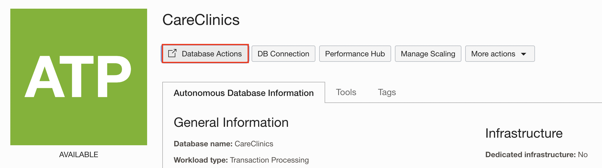
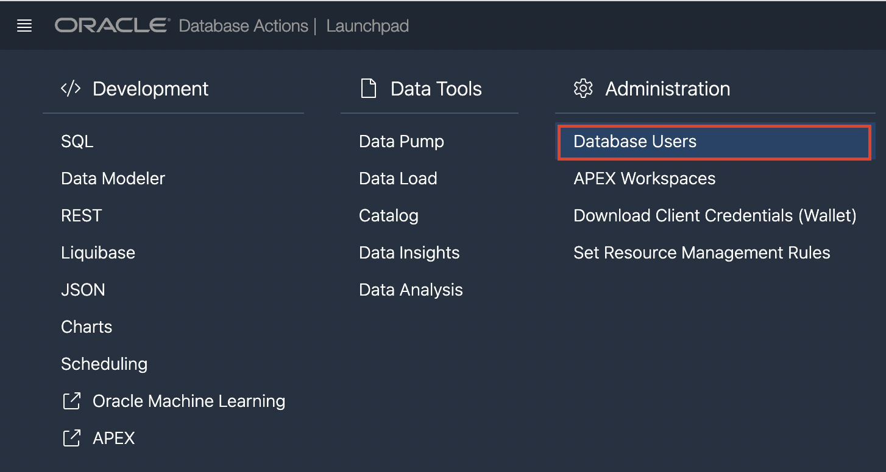
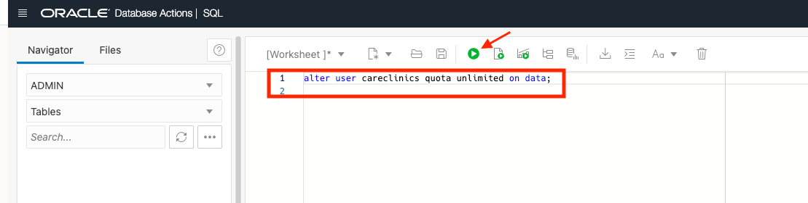
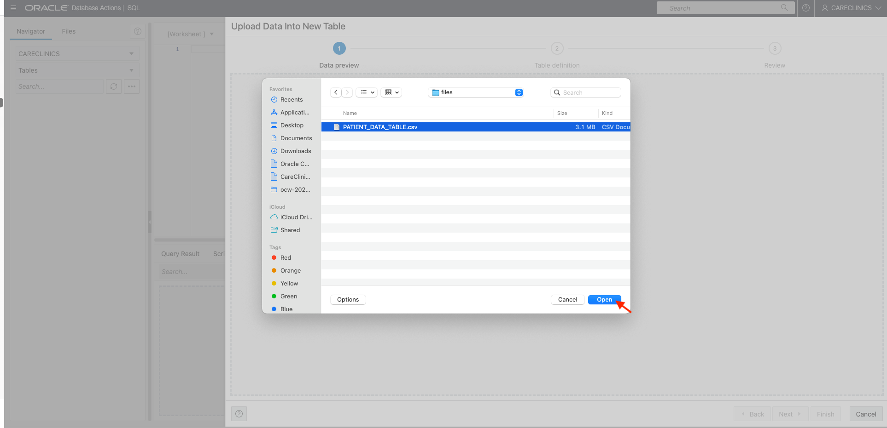
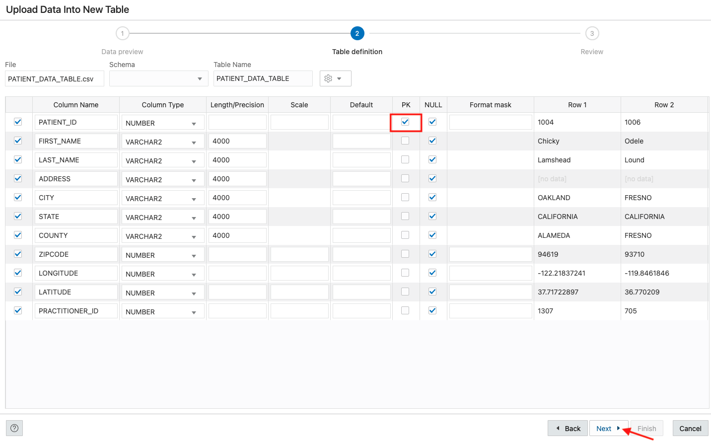
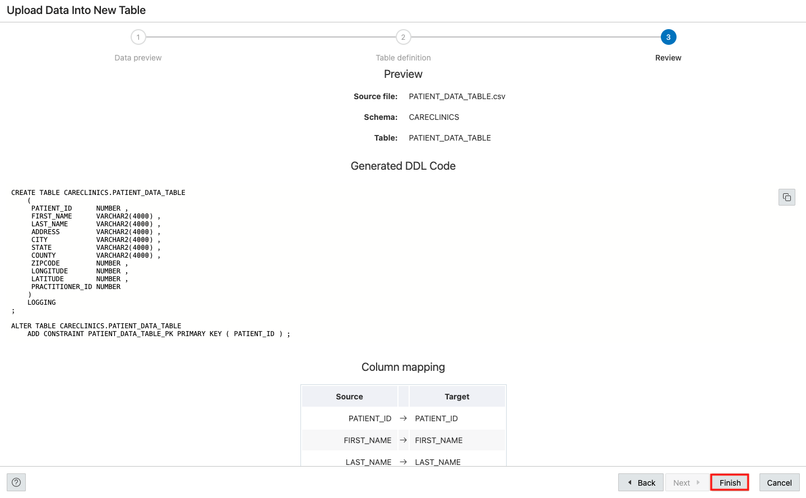

# Configure the Database

This lab walks you through the steps to quickly provision an Autonomous Transaction Processing instance on Oracle Cloud, load the Patients Data and enable the REST API.

Estimated lab time: 15 mins

## Prerequisites

- Download the Patients Data - <a href="https://objectstorage.us-ashburn-1.oraclecloud.com/p/Ei1_2QRw4M8tQpk59Qhao2JCvEivSAX8MGB9R6PfHZlqNkpkAcnVg4V3-GyTs1_t/n/c4u04/b/livelabsfiles/o/oci-library/PATIENT_DATA_TABLE.csv">download</a>.

## Task 1: Create Autonomous Transaction Processing Database

1.  Login to your Oracle Cloud Tenancy and open the side menu.
    
    

2.  Navigate Autonomous Transaction Processing.

    
    

3.  Select the your compartment/root compartment and click **Create an Autonomous Database**.
    
    

4.  Give a prefered Display Name (Ex: CareClinicsDB) and click **Transaction Processing** for the workload type.
    
    

5.  Create the ADMIN password (Ex:Oracle_12345) for the DB, following the database password requirements. Leave everything else as default.

    > *Note:* Make sure to save this password, you will need it later in this lab.
    
    

6.  Click **Create Autonomous Database**
    
    

7.  Database provisioning will take about 5 minutes. Once the Lifecycle State is ***Available***, you can continue to the next task.
    
    

## Task 2: Create a User for Application Development

1. After the instance is provisioned, click on *Database Actions*. 

    

    This will open another browser tab/window. If you have popup blockers on, you may need to allow cloud.oracle.com access to open popup windows or open the popup window manually. The popup window will take you directly to the Database Actions start page logged in as the Admin user.

2. The popup window will take you directly to the Database Actions start page logged in as the Admin user. 
    
    

    If it does not, you will be directed to a login page. Sign in with the database instance's default administrator account, Username - ADMIN with the admin password you specified (Ex: Oracle_12345) when creating the database. Click Sign in.

3. First, we want to create a database schema for our tables and data. We do this by creating a database user. To create a database user, we start by clicking the Database Actions Menu in the upper left of the page, then clicking Database Users in the Administration List. It is not good practice to use a SYS or SYSTEM user to create an application's tables, and neither is it good practice to use the ADMIN account to create applications.

    

4. Now, click the + Create User button on the right side of the page. This will slide out the Create User panel.

5. Start by entering a user name. Let's use *CareClinics* as the username. Next we need to enter a password. The password must be complex enough to pass the password profile set by the database. The rules are as follows:

    Password must be 12 to 30 characters and contain at least one uppercase letter, one lowercase letter, and one number. The password cannot contain the double quote (") character or the username "admin".

    Once we enter the password twice, ensure the Web Access button is on. This will allow us to use REST services with this database schema from the start. Your panel should look similar to the following image:
    

    Disable *Authorization Required* toggle.

    Once you are ready, click *Create User* on the bottom of the panel to create the database user.

> **Note:** If you see Error while creating user, revise your password so that it only contains letters and numbers, no characters.

6. From the Database Action menu, select the SQL tile.

    

7. On the SQL Canvas, copy and paste the following statement and run the script:

```
<copy>
alter user careclinics quota unlimited on data;
</copy>
```


8. After the quota is successfully modified, *sign out* of the page. 

## Task 3: Load the data into the Database

1. Login with *CareClinics* and your password (Ex: Oracle_12345) and navigate to SQL tile. 

2. We are now ready to load data into the database. For this task, we will use the Data Loading tab in the SQL Worksheet.

3. Start by clicking the Data Loading area; the center of the gray dotted-line box. The Upload Data into New Table model will appear.



4. After you click *Open*, the data in the CSV file is now loaded. Click the next button.


5. Let’s edit a few of these columns. We need a Primary Key for our table. Here, we can use the Patient_ID column. Just click the PK checkbox for the ID row.



6. Review the table and hit the finish button. 



## Task 4: Enable REST API 

1. Right click on the table name and select REST in the pop up menu then Enable.


2. The REST Enable Object slider will appear from the right side of the page. We are going to use the defaults for this page but take note and **copy the Preview URL**. This is the URL we will use to access the REST enabled table. When ready, click the Enable button in the lower right of the slider.


>**Note:** We will use this REST URL later in the lab. 

## Summary

In this lab, you have learnt how to configure REST API for the Database tables. We will be using this API to register the Patients and store thier details in the Autonomus Transaction Processing Database.

You may now **proceed to the next lab**.

## Acknowledgements

* **Author** - Saipriya Thirvakadu, Sr. Cloud Engineer
* **Contributors**:
    * Chip Baber, Director, Cloud Engineering

* **Last Updated By/Date** - Saipriya Thirvakadu, September 2022

