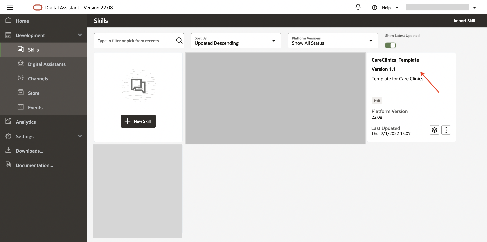
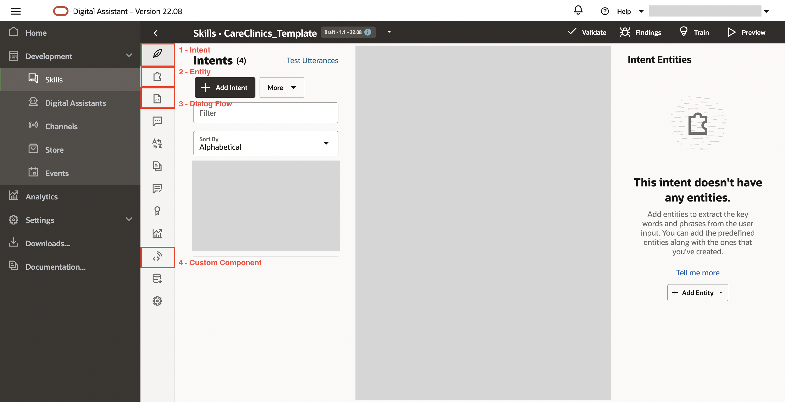
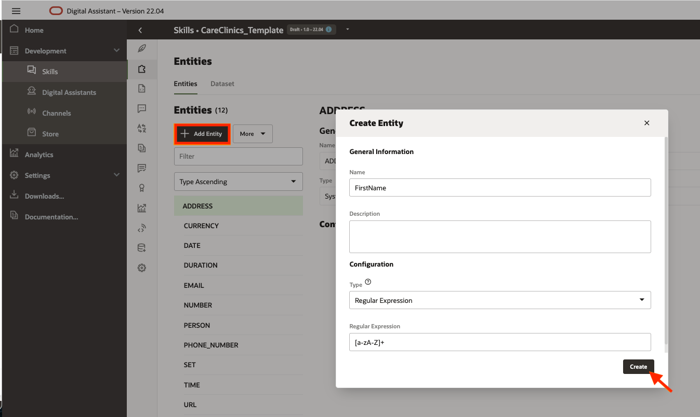
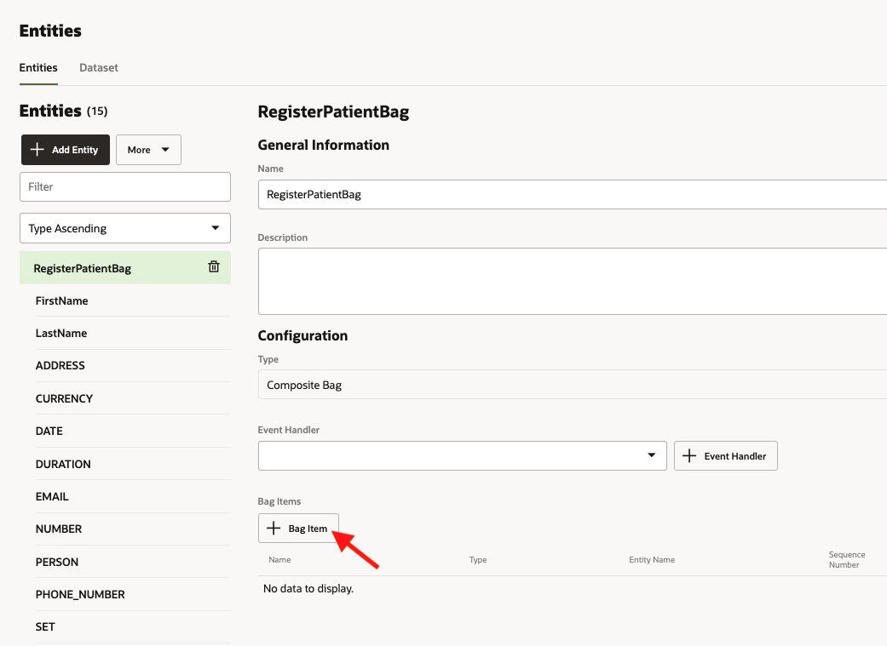
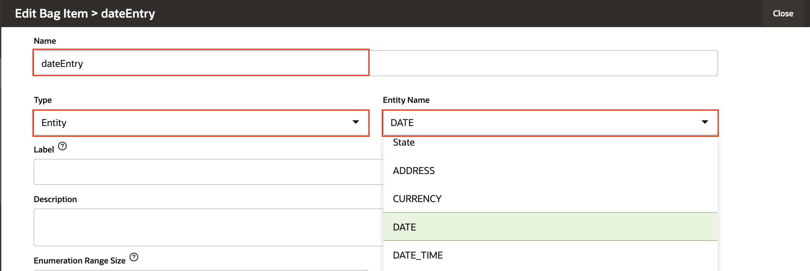
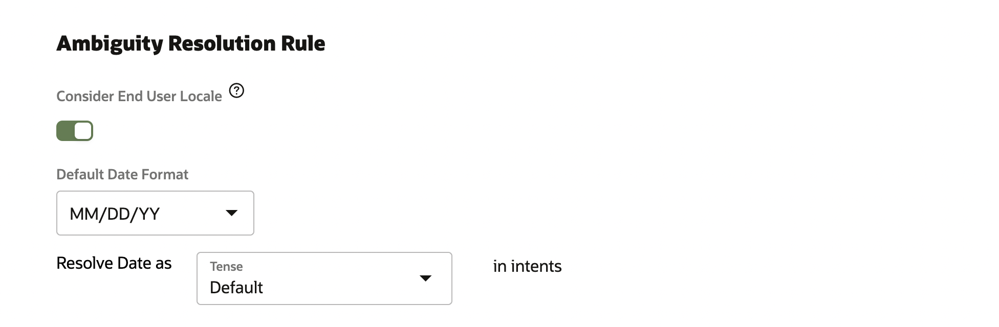
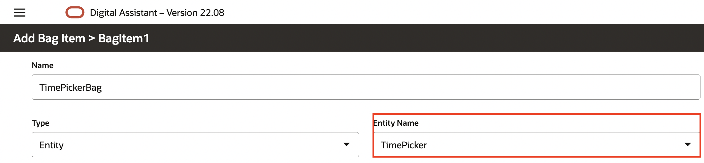

# Design the Skill

## Introduction

Once you have the instance created, you can begin the development of your Oracle Digital Assistant instance. Here’s a bird’s-eye view of the Skill development process.

  

Reference: <a href="https://docs.oracle.com/en/cloud/paas/digital-assistant/use-chatbot/create-configure-and-version-skills1.html#GUID-A782BB61-0602-45BE-95D9-DCE677260F25"> Link </a>

Estimated Time: 20 minutes

### Objectives

In this lab you will perform the following tasks: 

- Provision the Digital Assistant instance.
- Import a sample Skill within your instance.
- Create and test the intents and entities.

## Prerequisites

- Download the Skill template - <a href="https://c4u04.objectstorage.us-ashburn-1.oci.customer-oci.com/p/EcTjWk2IuZPZeNnD_fYMcgUhdNDIDA6rt9gaFj_WZMiL7VvxPBNMY60837hu5hga/n/c4u04/b/livelabsfiles/o/oci-library/CareClinics_Template.zip">download</a> 

## Task 1: Create a Digital Assistant Instance and Import the Skill
1. Once you are logged into Oracle Cloud, you are taken to the cloud services dashboard where you can see all the services available to you. Click the navigation menu in the upper left to show top-level navigation choices.
2. Click **Digital Assistant**

  

3. Select the root compartment/compartment of your own and create a Digital Assistant instance. 

  

4. After the instance is successfully created. Click on the Service Console to open the ODA console. 

  

5. Now, select the navigation on the top left menu, select Skills under Development and import the Skill which you downloaded.

  

6. Open the Skill to update the bot from the console.

  

7. Navigate the page to get familiar with the Terminology.

  

8. Click on the Intent(leaf icon) within the Skill to get started with your next task. 

## Task 2: Create and Test an Intent
Oracle Digital Assistant's underlying natural language processing (NLP) engine doesn't inherently know about the business or task that skill is supposed to assist with. For the skill to understand what it should react to, you need to define intents and examples (utterances) for how a user would request a specific intent.

You will create intents for finding a doctor and positive health therapy tips. 

Create the Find a Doctor intent: 

1. Click the + Intent button.
2. Next to the Conversation Name field, click the Edit button and enter *Find Doctor*.
3. In the Name field, type *findDoctor*.
4. Select and copy all of the example sentences below to your clipboard and paste them   into the *Advance Input Mode* section under Examples

    ```
    <copy>
    find a doc
    help from doctor
    how can I find the doctor?
    looking for a doctor
    need doctor assistance
    Where is the doc?
    </copy>
    ```

    (You'll notice that it's fine for utterances to have inconsistent punctuation and capitalization.)
5. Click the +Create button.

  

### Create the Positive Health intent:

1. Click the + Intent button.
2. Next to the Conversation Name field, click the Edit button and enter *Positive Health*.
3. In the Name field, type *positiveHealth*.
4. Select and copy all of the example sentences below to your clipboard and paste them into the *Advance Input Mode* section under Examples

    ```
    <copy>
    health tips
    mental health treatment
    need positive health tips
    positive outlook
    mental health therapy
    </copy>
    ```
5. Click the +Create button.

### Create the Unresolved intent:
The unresolved intent in a skill handles messages outside of the domain that the skill is designed to process. For this, you usually map a dialog flow state to the *unresolvedIntent* action transition to inform the user that the skill could not handle the request.

1. Click the + Intent button.
2. Next to the Conversation Name field, click the Edit button, and enter *Unresolved Intent*.
3. In the Name field, type *unresolvedIntent*.
4. Select and copy all of the example sentences below to your clipboard and paste them into the *Advance Input Mode* section under Examples

    ```
    <copy>
    blah blah
    buy me a tv
    play music
    sing a song
    </copy>
    ```
5. Click the +Create button.


### Train and test the intents:

You've now provided the basic ingredients that allow the skill to recognize user input for both intents. Currently, the skill can't understand any user input.

To enable the skill to interpret user input based on the utterances that you just added, you need to train to build the intent model.

1. On the right side of the page, locate and click the Train. Select *Trainer Ht* and then click *Submit*.

  

2. Let's perform a quick test in the utterance tester.

- Click on Test utterance.

  

- Test your utterance (Ex: You can type "help me find a doctor").

  

## Task 3: Create Entities

Now it's time to add entities, which detect information in the user input that can help the intent to fulfill a user request. We will be creating entities with regular expressions, and value lists and adding them to a composite bag. 

1. In the left navigation for the designer, select the *Entities* icon.
 
2. Click + Add Entity to create a new entity.
3. In the Name field, change the value to *FirstName*.
4. Select the Configuration type as *Regular Expression* and value as [a-zA-Z]+
  
5. Click the Create button
6. Follow the same steps for entities:  
    - *LastName* (Name - LastName, type - Regular Expression, Value - [a-zA-Z]+)
    - *PhoneNumber* (Name - PhoneNumber, type - Regular Expression, Value - ^[\+]?[(]?[0-9]{3}[)]?[-\s\.]?[0-9]{3}[-\s\.]?[0-9]{4,6}$)
    - *State* (Name - State, type - Regular Expression, Value - [a-zA-Z]+)
    - *City* (Name - City, type - Regular Expression, Value - [a-zA-Z]+)

Create a Value List Entity

1. Click + Add Entity to create a new entity.
2. In the Name field, change the value to *TimePicker*.
3. In the Configuration section, select *Value list* from the Type menu.
4. Click + Value.
For Value, type *10:00 AM*.
For Synonyms, type *10am*, then click Enter. Type 10:00am, and then click Enter again.<br/> <br/>
Here is the list of values and synonyms:<br/>
  
8:30 AM	- 8:30, 8:30am, 8:30 am <br/>
> **Note:** Hit the enter button after typing each synonym.

10:00 AM - 10am, 10:00am, 10:00 AM, 10 am <br/>
12:30 PM - 12:30pm, 12:30, 12:30 pm <br/>
2:00 PM	- 2:00 pm, 2 pm, 2pm, 2:00pm <br/>
3:30 PM	- 3:30pm, 3:30, 3:30 pm <br/>

Click Create.  
  
 
5. Repeat the above steps to create another value list for the *Provider*. <br/>

    Name: **Provider** <br/>
    Configuration: Value List <br/>
    Values: <br/>
    Dermatology	- Dermatology, derma <br/>
    Family Medicine	- FamilyMed, family medicine, family med <br/>
    Obstetrics and gynecology - ob gyn, ob-gyn, gyn, ob <br/>
    Pediatrics - pediatric, pediatrics <br/>
    Primary care - primarycare, primcare <br/>
    Other - something else, somethingelse, other, others, not here <br/>

  

Create a Composite Bag Entity

In this step, you're going to simplify your development efforts using a composite bag entity, which enables you to manage the multiple entities that you just created as a consolidated entity. In addition to unifying your entities, the various composite bag properties enable your skill to match entity values in complex, real-world scenarios that involve erratic user input.

7. Click + Add Entity to create a new entity with the name *RegisterPatientBag* and select the Configuration type as *Composite Bag*.

  

8. Select the *RegisterPatientBag* and add a *+ Bag Item*.
  
9. Enter the Name as **FirstName**, select the type as *Entity* and Entity name as *FirstName* from the drop-down.
  
10. Set the *Out of Order Extraction* as *Never* and add the following *prompts*:

    ```
    <copy>
    Enter the first name
    </copy>
    ```
    ```
    <copy>
    Invalid name, please re-enter your first name (Ex: John)    
    </copy>
    ```
  
  

11. Click the close button.
12. Add *+ Bag Item* for Last Name.<br/>
    Name: **LastName**
    Type: Entity
    Entity Name: LastName
    Set the *Out of Order Extraction* as *Never* and add the following *prompts*:

    Prompts: 

    ```
    <copy>
    Enter your last name
    </copy>
    ```
    ```
    <copy>
    Invalid name, please re-enter your last name (Ex: Smith)  
    </copy>
    ```
13. Add *+ Bag Item* for Phone Number.<br/>
    Name: **PhoneNumber**
    Type: Entity
    Entity Name: PhoneNumber
    Set the *Out of Order Extraction* as *Never* and add the following *prompts*:

    Prompts: 

    ```
    <copy>
    Enter your phone number
    </copy>
    ```
    ```
    <copy>
    Enter the phone number in the following format (Ex: 562XXXXXXX/+9198666XXXXX/555-XXX-XXXX)) )
    </copy>
    ```
    ```
    <copy>
    Invalid number, Please try again
    </copy>
    ```

14. Add *+ Bag Item* for Street Address.<br/>
    Name: **StreetAddress**
    Type: Entity
    Entity Name: Address
    Set the *Out of Order Extraction* as *Never* and add the following *prompts*:
    Prompts: 

    ```
    <copy>
    Enter your street address
    </copy>
    ```
    ```
    <copy>
    Enter a valid street address (Ex: 2300 Cloud Way)
    </copy>
    ```

      
      
      
15. Add *+ Bag Item* for City.<br/>
    Name: **City**
    Type: Entity
    Entity Name: City
    Set the *Out of Order Extraction* as *Never* and add the following *prompts*:
    Prompts: 

    ```
    <copy>
    Enter your city
    </copy>
    ```
    ```
    <copy>
    Invalid city, please re-enter your city name (Ex: Austin)
    </copy>
    ```
16. Add *+ Bag Item* for State.<br/>
    Name: **State**
    Type: Entity
    Entity Name: State
    Set the *Out of Order Extraction* as *Never* and add the following *prompts*:
    Prompts: 

    ```
    <copy>
    Enter your State
    </copy>
    ```
    ```
    <copy>
    Invalid entry, please enter the state you reside in (Ex: Texas)
    </copy>
    ```
17. Add *+ Bag Item* for Zipcode.<br/>
    Name: **Zipcode**
    Type: Entity
    Entity Name: Number
    Set the *Out of Order Extraction* as *Never* and add the following *prompts*:
    Prompts: 

    ```
    <copy>
    Enter your zip code
    </copy>
    ```
    ```
    <copy>
    Invalid code, please try again (Ex: 78741)
    </copy>
    ```
18. Add *+ Bag Item* for Location.<br/>
    Name: **Location**
    Type: Location
    Set the *Out of Order Extraction* as *Never* and add the following *prompts*:
    Prompts: 

    ```
    <copy>
    Upload your location
    </copy>
    ```

    

19. Now, Let's create another Composite bag for Date Picker. 

- Click + Add Entity to create a new entity with the name *DatePickerBag* and select the Configuration type as *Composite Bag*.

- Add *+ Bag Item* for *dateEntry*.
<br/>
    Name: **dateEntry**
    Type: Entity
    Entity Name: DATE

      

    Ambiguity Resolution Rule: 
  <br/>
    Switch on toggle - Consider End User Locale
    Default Date Format - MM/DD/YY
    Resolve Date as *Default* in intent

    
  
    Prompts: 

    ```
    <copy>
    Select your preferred date of appointment
    </copy>
    ```
    ```
    <copy>
    Please enter the date in the proper format
    </copy>
    ```

20. We will create another composite bag entity

- Click + Add Entity to create a new entity with the name *TimePickerBag* and select the Configuration type as *Composite Bag*.

- Add *+ Bag Item* for *TimePicker*.
<br/>
    Name: **TimePicker**
    Type: Entity
    Entity Name: TimePicker

    

    Prompts: 

    ```
    <copy>
    Select your preferred time slot
    </copy>
    ```

> **Note:** On the right side of the page, locate and click the Train. Select *Trainer Ht* and then click *Submit*. Ensure that all the entities are trained.

 

## Summary

You have successfully created the intents and entities for the Skill and may now **proceed to the next lab**.


## Acknowledgements

* **Author** - Saipriya Thirvakadu, Sr. Cloud Engineer
* **Contributors**:
    * Chip Baber, Director, Cloud Engineering

* **Last Updated By/Date** - Saipriya Thirvakadu, September 2022


