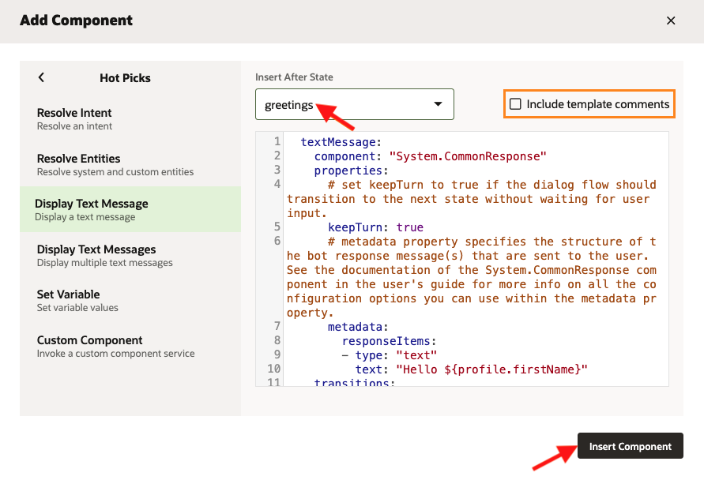
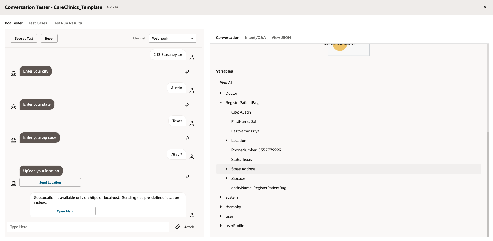

# Personalize the Skill

## Introduction

With the NLP model created, you are ready to build a dialog flow for the skill. The dialog flow is a blueprint for the interactions that enable the conversation between the skill and the user. Although you're going to create a single flow in this tutorial, a skill can have multiple flows that support different use cases and functions.

Each flow is made up of one or more states, and each state executes a function: rendering a skill response message, authenticating a user, branching the conversation when certain conditions are met, etc. 

 Think of the dialog flow as a flow chart that’s been transposed to a simple markdown language which is a version of YAML called OBotML. 

Estimated Time: 30 minutes

### Objectives

In this lab you will create a dialog flow by performing the following tasks: 

- Learn how to use the inbuilt components.
- Create custom components.

## Task 1: Test the current dialog flow

1. Go ahead and click the preview button to test the current flow.

  

2. Start the conversation by typing *Hi* and observe the states and intents in the conversation tester  window.

  

  


## Task 2: Start building the dialog flow

Each state implemented by a
component which
– Executes logic
– Receives user input
– Returns bot responses
– Determines navigation

1. Go ahead and replace *System.intent* component. This will allow you to conditionally direct a conversation to a logical next dialog flow state for each user utterance.  
```
  <copy>
########### System intent ###############
  intent:
    component: "System.Intent"
    properties:
      variable: "iResult"
    transitions:
      actions:
        unresolvedIntent: "greetings"
        greetings: "greetings"
        findDoctor: "findPatientDetails"
        positiveHealth: "startTheraphy"
  </copy>
  ```  
2. Add an unresolved state by selecting *+Add Component* to open the component templates. 

  

- Now, select *Display text message* from the *Hot Picks*, pick *Greetings* from the drop down under *insert after state*, uncheck include template comments and select *Insert Component*.

  

- Update the component as follows:

```
<copy>
########### Unresolved State ###############
  unresolvedIntent:
    component: "System.Output"
    properties:
      text: "I don't understand. What do you want to do?"
    transitions:
      return: "intent" 

</copy>
```
3. We will add the dialog flow for *Positive Health* intent. Here we are going to display a card carousal with images, text and links to redirect to different videos.

- Select *+Add component* and pick *Display Action Button Message* (under User messaging -> Display Multimedia Messages).
- Pick "unresolved" from the drop down under *insert after state*, Uncheck include template comments and select *Insert Component*.

  

- Update the component as follows:
```
<copy>
######## Begin Theraphy ############ 

  startTheraphy:    
    component: "System.CommonResponse"
    properties:
      processUserMessage: true
      keepTurn: "false"
      metadata:
        responseItems:
        - type: "cards"
          cardLayout: "horizontal"
          name: "Cards"
          actions: []
          cards:
          - title: "${theraphy.name}"
            description: "${theraphy.description}"
            imageUrl: "${theraphy.image}"
            name: "theraphy"
            iteratorVariable: "theraphy"
            actions:
            - label: "Practice Excercise"
              type: "url"
              payload:
                url: "${theraphy.action}"
        globalActions: []
    transitions: 
      return: "done"
</copy>
```

- Also, update the transition for the *greetings* component as we need to transition from Greetings to Start Theraphy:      
```
<copy>
  ##### update the transitions for greetings component
    transitions:
      actions:
        textReceived: "intent"
        startTheraphy: "startTheraphy"
</copy>
```
> **Note**: Verify your dialog flow ([Link](files/dialogflow_step2.txt)) and ignore the "The state with the name 'findPatientDetails' was not found." error.

- Go ahead and test the flow. 

  

4. Now we will request the user if they already have a provider or if they wish to register. 

- Declare a PatientType variable under context variables.     

```
<copy>
PatientType: "string"
</copy>
```

- Paste the following YAML code in your dialog flow after the *Start Theraphy* component.

```
<copy>
########### Find a doctor and schedule appointment ###############

  findPatientDetails:
    component: "System.CommonResponse"
    properties:
      processUserMessage: true
      variable: "PatientType"
      metadata:
        responseItems:        
        - type: "text" 
          text: "Do you have a provider or are you a new patient?"
          footerText:
          actions:
          - label: "New Patient"
            type: "postback"
            keyword: "New Patient"
            payload:
              action: "registerPatient" 
          - label: "I have a provider"
            type: "postback"
            keyword: "provider"
            payload:
              action: "I have a provider" 
    transitions:
      actions:
        registerPatient: "registerPatient"
        I have a provider: "chooseProvider"
        textReceived: "intent"
</copy>
```

- Also, add transition for *findPatientDetails* under the *greetings* component as follows:      
```
<copy>
##### update the transitions for greetings
    transitions:
      actions:
        startTheraphy: "startTheraphy"
        findPatientDetails: "findPatientDetails"
        textReceived: "intent"
</copy>
```
5. Now, we will go ahead and ask for patient details by leveraging the composite bag entity we created in the previous section.

- Let us declare the variable for *RegisterPatientBag* composite bag entity we created under context variables section. 

```
<copy>
RegisterPatientBag: "RegisterPatientBag"
</copy>
```
- Add the following YAML code under the *findPatientDetails* component.

```
<copy>
##############Ask for Patient details##################

  registerPatient:
    component: "System.CommonResponse"
    properties:
      processUserMessage: true 
      variable: "RegisterPatientBag"
      nlpResultVariable: "iResult"    
      cancelPolicy: "immediate"
      transitionAfterMatch: "false"    
      metadata:
        responseItems:        
        - type: "text" 
          text: "${system.entityToResolve.value.prompt}"
          actions:
          - label: "${enumValue.value!enumValue.originalString}"
            type: "postback"
            iteratorVariable: "system.entityToResolve.value.enumValues"
            payload:
              variables:
                RegisterPatientBag: "${enumValue.value!enumValue.originalString}" 
        globalActions: 
        - label: "Send Location"
          type: "location"
          visible:
            entitiesToResolve:
              include: "Location"
    transitions:
      actions:
        textReceived: "intent"
      next: "registerUserDB"
</copy>
```
> **Note**: Verify your dialog flow - [Link](files/dialogflow_step3.txt) and You should still be able to test even though you see there are errors in your validation

  

## Task 3:  Create a custom component

Custom components are reusable units of custom code that you can call from your skill's dialog flow. In order to register the patients details in the database, we will call the REST API using the NodeJS. 

Follow these steps to install the Oracle Node.js Bots SDK to your local machine.
  - Open a terminal window.
  - To install Oracle Bots Node.js SDK for global access on your laptop, enter this command:

```
<copy>
npm install -g @oracle/bots-node-sdk
</copy>
```

On a Mac, you use the sudo command:

```
<copy>
sudo npm install -g @oracle/bots-node-sdk
</copy>
```

To verify the success of your installation, enter this command:

```
<copy>
bots-node-sdk -v
</copy>
```

- Open the directory where you wish to create a custom component and paste the following command in your terminal.
```
<copy>
bots-node-sdk init carecliniccs --component-name registerpatient 
</copy>
```
 

- Now, open the registerpatient.js file under components and replace the contents with the following code: 


```
<copy>
// Custom Component
'use strict';
const fetch = require("node-fetch")

module.exports = {
  metadata: () => ({
    name: 'registerpatient',
    properties: {
      first_name: { required: true, type: 'string' },
      last_name: { required: true, type: 'string' },
      address: { required: true, type: 'string' },
      city: { required: true, type: 'string' },
      state: { required: true, type: 'string' },
      zipcode: { required: true, type: 'string' },
      longitude: { required: true, type: 'int' },
      latitude: { required: true, type: 'string' }, 
      phonenumber: {required: true, type: 'string'}, 
      ordsUrl: {required: true, type: 'string'}, 
      keepTurn: {required: false, type: 'string'}, 
      patient_id: {required: false, type: 'string'}
    },

    supportedActions: ['success', 'failure']
  }),

  invoke: (context, done) => {
    const { first_name } = context.properties()
    const { last_name } = context.properties()
    const { address } = context.properties()
    const { city } = context.properties()
    const { state } = context.properties()
    const { longitude } = context.properties()
    const { latitude } = context.properties()
    const { phonenumber } = context.properties()
    const { zipcode } = context.properties()
    const { ordsUrl } = context.properties()
    const { patient_id } = context.properties()

    var myHeaders = new fetch.Headers();
    myHeaders.append("Content-Type", "application/json");
    var pid = Math.floor(Math.random() * 100) + 30000;
    var raw = JSON.stringify({
      "patient_id": pid,
      "first_name": first_name,
      "last_name": last_name,
      "address": address,
      "city": city,
      "state": state,
      "county": "ALAMEDA",
      "zipcode": zipcode,
      "longitude": longitude,
      "latitude": latitude,
      "practitioner_id": "930",
      "phonenumber": phonenumber
    });

    var requestOptions = {
      method: 'POST',
      headers: myHeaders,
      body: raw,
      redirect: 'follow'
    };

    fetch(ordsUrl, requestOptions)
      .then(response => {
        return response.json();    
      })
      .then((data) => {    
        context.reply("Registered the user successfully! "); 
        context.variable(patient_id,pid);
        context.transition('success');
        context.keepTurn(true);
        done();
        })
      .catch((err) => {
        done(err);
        });  
      }
    };
</copy>
```
- Paste the following commands in your terminal

```
<copy>
cd carecliniccs
npm install
npm pack
</copy>
```
- Go back to the ODA console and create a custom component and add the service as given in the following picture.
  

- Go to settings icon in the navigation pane on the left and select the configuration tab. 

  

- Go ahead and update the ordsUrl which you saved in your *Notepad*.

  ```
  <copy>
  Ex: https://url/ords/careclinics/patient_data_table/
  </copy>
  ```

  

- Declare a variable to store the output (Patient ID) from the Custom Component:

```
<copy>
    patient_id: "string"
</copy>
```

- Paste the following YAML code in the dialog flow below *registerPatient*.

```
<copy>
########### Register a Patient in the Database ###############
  registerUserDB:
    component: "registerpatient"
    properties: 
      ordsUrl: ${system.config.ordsUrl}
      first_name: ${RegisterPatientBag.value.FirstName}
      last_name: ${RegisterPatientBag.value.LastName}
      address: ${RegisterPatientBag.value.StreetAddress.originalString}
      city: ${RegisterPatientBag.value.City}
      state: ${RegisterPatientBag.value.State}
      zipcode:  ${RegisterPatientBag.value.Zipcode.originalString}
      longitude: ${RegisterPatientBag.value.Location.longitude}
      latitude: ${RegisterPatientBag.value.Location.latitude} 
      phonenumber: ${RegisterPatientBag.value.PhoneNumber}
      patient_id: patient_id
      keepTurn: true
    transitions: 
      actions: 
        success: "chooseProvider"
        textReceived: "intent"
</copy>
```
7. After registration, the next step for the patient is to select the specialization for which we will use the System.ResolveEntities component.

- Select *+ Add component* and pick *Display Action Button Message* (under Hot Picks -> Resolve Entities).
- Pick "registerUserDB" from the drop down under *insert after state*, Uncheck include template comments and select *Insert Component*.

  

- Let us declare the variable for *RegisterPatientBag* composite bag entity we created. 

```
<copy>
    Provider: "Provider"
</copy>
```

- Update the component as follows:

```
<copy>
########### Let the Patient choose the provider ###############
  chooseProvider:
    component: "System.ResolveEntities"
    properties:
      variable: "Provider"
      nlpResultVariable: "iResult"      
      cancelPolicy: "immediate" 
    transitions:
      next: scheduleDate
      actions: 
        textReceived: intent
</copy>
```
8. After we select the specialization, we should now select a scheduled date. 

*Note:* ODA cannot display the calendar widget, so we will create custom properties specific to the web channel and add the javascript code to display the calendar widget to the bot deployed on a web page.

- Declare the variable for *RegisterPatientBag* composite bag entity we created. 

```
<copy>
    selectedDate: "DatePickerBag"
</copy>
```

- Add the following code below *chooseProvider* component.

```
<copy>
########### Let the Patient select a scheduled date ###############
  scheduleDate:
    component: "System.CommonResponse"
    properties:
      processUserMessage: true
      nlpResultVariable: "iResult"
      cancelPolicy: "immediate"
      transitionAfterMatch: "false"
      variable: "selectedDate"
      metadata:
        responseItems:            
        - type: "text" 
          text: "${system.entityToResolve.value.prompt}"
          channelCustomProperties:
          - channel: "websdk"
            properties:
              uiComponent:
                type: calendar
                properties:
                  minDate: "${(.now?long + 1*24*3600*1000)?number_to_date?iso_utc}" #today 
                  maxDate: "${(.now?long + 15*24*3600*1000)?number_to_date?iso_utc}" #next 15 days
                  variable: "selectedDate"
          visible:
            entitiesToResolve:
              include: "dateEntry"     
    transitions:
      actions:
        cancel: "intent"    
      next: "selectTime"
</copy>
```
9. After which Patient needs to select the preferred time slot.

- Declare the variable for *RegisterPatientBag* composite bag entity we created. 

```
<copy>
    TimePickerBag: "TimePickerBag"
</copy>
```
- Add the following code below *scheduleDate* component.

```
<copy>
########### Let the Patient select a scheduled time ###############
  selectTime:
    component: "System.ResolveEntities"
    properties:
      variable: "TimePickerBag"
      nlpResultVariable: "iResult"      
      cancelPolicy: "immediate" 
    transitions:
      next: findDoctor
      actions: 
        textReceived: intent
</copy>
```

10. Display the list of Doctors to the patients and show an appointment summary report. Here, we will use free marker expressions to show the summary of the appointment.

```
<copy>
########### Find a doctor ###############
  findDoctor:
    component: "System.CommonResponse"
    properties:
      processUserMessage: true
      keepTurn: false
      metadata:
        responseItems:        
        - type: "text" 
          text: "Here are the best in class doctors for you!"
          footerText:
        - type: "cards"
          cardLayout: "horizontal"
          name: "Doctor"
          actions: []
          cards:
          - title: "${Doctor.name} (ID - ${Doctor.practitionerid})"
            description: "${Doctor.description}"
            imageUrl: "${Doctor.image}"
            name: "Doctor"
            iteratorVariable: "Doctor"             
            actions:
            - label: "Book Appointment"
              type: "postback"
              payload:
                action: "${Doctor.action}" 
                variables: 
                  DoctorName: "${Doctor.name}"
                  practitionerid: "${Doctor.practitionerid}"
        globalActions: []
    transitions: 
      next: "apptSummary"  
      
 
  apptSummary:
    component: "System.CommonResponse"
    properties:
      keepTurn: true
      metadata:
        responseItems:
          - type: "text"
            text: "You have successfully scheduled your appointment with the doctor ${DoctorName.value} (ID - ${practitionerid.value}) for on ${selectedDate.value.dateEntry.date?number_to_date?string['yyyy-MM-dd']} at ${TimePickerBag.value.TimePicker}"
    transitions:
      next: "confirmationResponse"
  
  confirmationResponse: 
    component: "System.CommonResponse"
    properties:
      metadata:
        responseItems:
          - type: "text"
            text: "We will send you an SMS with the appointment details to your registered mobile number."
    transitions:
      next: "exitFlow"

</copy>
```
> **Note**: Verify your end to end dialog flow ([Link](files/dialogflow_lab4.txt)) and ignore the warnings.


## Summary

In this lab, we were able to create an end to end dialog flow between the bot and the user. You have also learnt how to use the custom component to call the REST service in order to perform a POST operation.  

You may now **proceed to the next lab**.

## Acknowledgements

* **Author** - Saipriya Thirvakadu, Sr. Cloud Engineer
* **Contributors**:
    * Chip Baber, Director, Cloud Engineering 

* **Last Updated By/Date** - Saipriya Thirvakadu, September 2022


