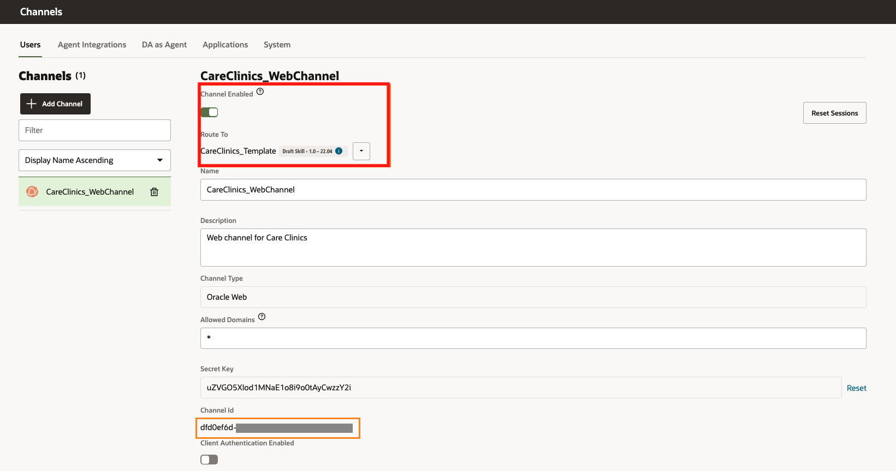

# Expose Your Skill Assistant through a Web Channel

## Introduction

You now want to expose the Skill you created through multiple channels. In this lab, you'll configure and publish your DA through a web channel, download and install the sample client application, and run and test it against your DA. Since this allows users to access your Skill through a web page, it’s within easy reach of a multitude of users. 

Estimated Time: 10 minutes

### Objectives

In this lab you will configure and publish the Skill by performing the following tasks: 

- Configure a Web channel for your Skill.
- Set up the Web channel on your local machine.
- Test your Skill.

## Prerequisites

- Download a sample web page - <a href="https://c4u04.objectstorage.us-ashburn-1.oci.customer-oci.com/p/EcTjWk2IuZPZeNnD_fYMcgUhdNDIDA6rt9gaFj_WZMiL7VvxPBNMY60837hu5hga/n/c4u04/b/livelabsfiles/o/oci-library/CareClinics_WebPage.zip">download</a> 

## Task 1: Configure a Web channel for your Skill

In this task, we will configure and publish the Skill through a web channel. 

- Click on the *Navigation menu* on the top left and select *Channels* under *Development*. 
- Now, create a channel with the following properties: 
  Name: CareClinics_WebChannel
  Description: Web channel for Care Clinics
  Channel Type: Oracle Web
  Allowed Domains: *
  Client Authentication Enabled: False

 

- After creating the channel, we need to route our channel to the skill we have been working on and enable the channel.

  

- Copy the *Channel Id* and the *URI* in a *Notepad*. 

  Ex: Channel ID: XXXXXXXX-XXXX-XXXX-XXXX-XXXXXXXXXXXX, URI: oda-XXXX-da3.data.digitalassistant.oci.oraclecloud.com

  

## Task 2: Set up the Web channel on your local machine

For the purpose of this lab, you'll set up using your machine's local host instead of using a public-facing web server. 

1. Find the CareClinics_WebPage.zip file that you downloaded at the beginning of this lab and extract its contents.

2. Now, open the settings.js file (under WebPage > scripts) folder in your Visual Studio Code.  

  Update the following fields: 

  - URI
  - Channel ID
  - Chat title - *Care Clinics*

  

## Task 3: Test your bot

Let's test the chatbot from the web page.

1. Open the index.html page in the CareClinics_WebPage folder.

2. Start testing the bot.

 

## Summary

In this lab, you have learned how to configure the chatbot to expose the web channel and test the bot on a web page. 

**Congratulations! You have successfully completed building the chatbot for Care Clinics.**

## Acknowledgements

* **Author** - Saipriya Thirvakadu, Sr. Cloud Engineer
* **Contributors**:
    * Chip Baber, Director, Cloud Engineering

* **Last Updated By/Date** - Saipriya Thirvakadu, September 2022

