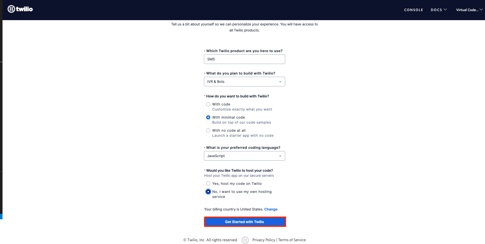
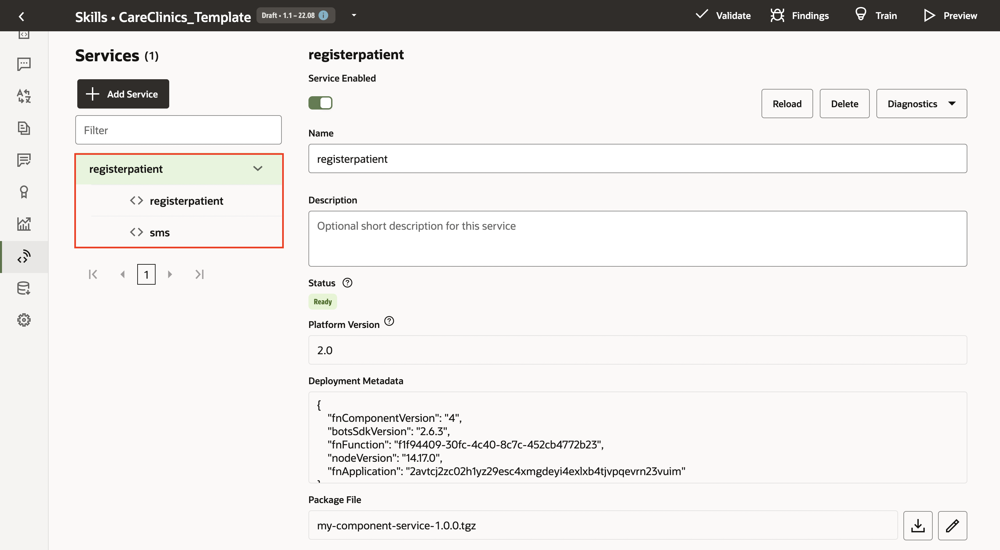
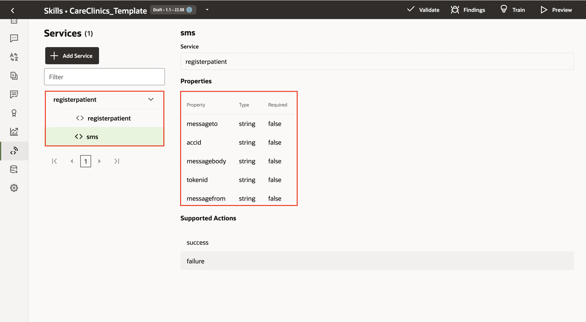
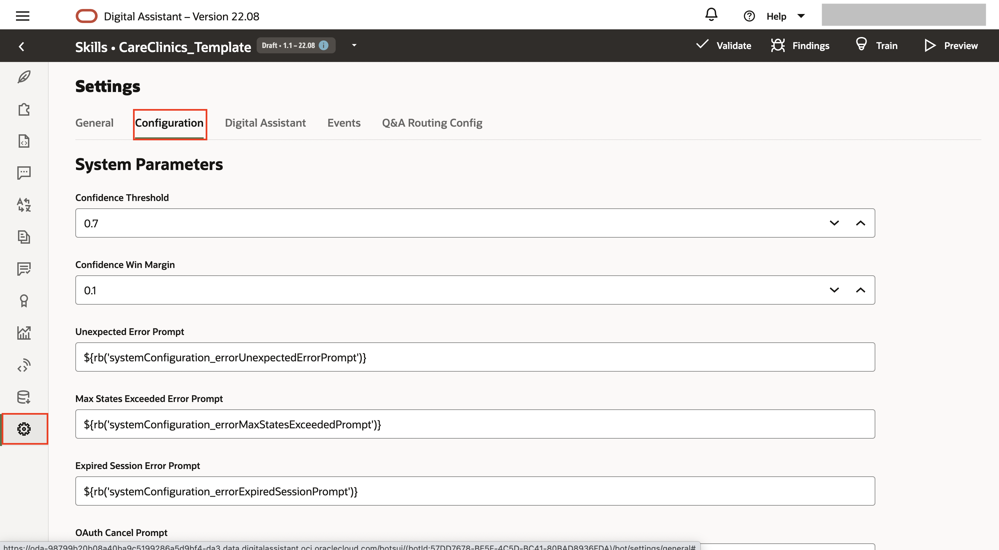
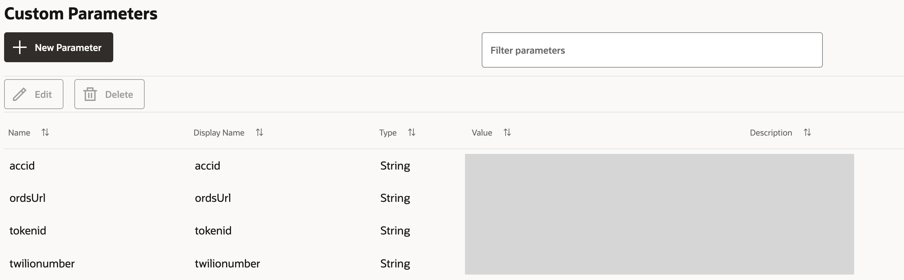
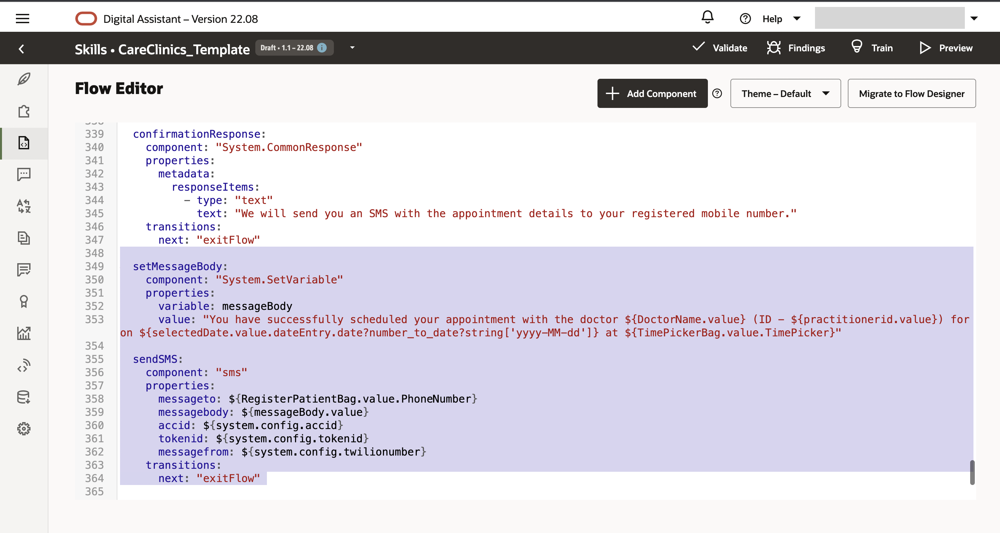

# Prepare the Skill to send an SMS

## Introduction

In this lab, you will learn how to use the custom component to send text messages from the Skill. In the previous lab, we have configured the Skill to show the detailed summary of the appointment details. However, you may also want to notify the user via Twilio SMS which is a short messaging service that sends user messages to their registered mobile number. 

Estimated Time: 20 minutes

### Objectives

In this lab you will be performing the following tasks: 

- Sign up for a Twilio paid or trial account.
- Obtain a Twilio number.
- Add a verified mobile number to use for a registered patient number.
- Configure the custom component to send out an SMS.


## Task 1: Set Up Twilio Account

1. To create a Twilio trial account with your email ID, go to https://www.twilio.com/try-twilio. 
2. Enter the required information, and then click Get Started.
  
  When prompted, enter your mobile phone number (You need to have a verified phone number to get a Twilio number).

  A verification code is sent to your mobile phone. Enter this verification code to add your number as a verified phone number.

  

3. After verification, save the *recovery code* in *Notepad* and hit the *Finish button*.

  

4. Personalize your experience and hit the *Get Started with Twilio* button.
  
  

5. In the home page, click the *Get a Twilio Phone number* button to obtain a phone number for your twilio account. 

  

6. Now, you will be able to see your Account Info. 

> **Note:** Copy your *Account SID*, *Auth Token* and *Twilio phone number* in your *Notepad*.

 

## Task 2: Add a custom component

In this task, we will create a custom component and call the **Twilio REST API** using NodeJS to send out the appointment details to the patient's registered mobile number. 

1. Open the Custom component which you built in Visual Studio Code or any IDE of your choice.

2. Create a new file under the *components* folder and name it as "sms.js". 

3. Paste the following code in the "sms.js" file: 

The component captures appointment details from the bot and passes the summary in the *messagebody* via SMS to the patient's registered mobile number. 

  

```
<copy>
// Custom Component to send out an SMS
'use strict';
const fetch = require("node-fetch")

module.exports = {
  metadata: () => ({
    name: 'sms',
    properties: {
        messageto:{ required: false, type: 'string' },
        messagebody: { required: false, type: 'string' },
        accid: {required: false, type: 'string' },
        tokenid: {required: false, type: 'string' },
        messagefrom: {required: false, type: 'string' },
      },
    supportedActions: ['success', 'failure']
  }),

  invoke: (context, done) => {
    var messageto = context.properties().messageto;
    var messagefrom = context.properties().messagefrom;
    var messagebody = context.properties().messagebody;
    var accid = context.properties().accid;
    var tokenid = context.properties().tokenid;

    const accountSid = accid; 
    const authToken = tokenid; 

    var myHeaders = new fetch.Headers();
    var credentials = Buffer.from(accountSid+":"+authToken, 'utf8').toString('base64');;
    myHeaders.append("Content-Type", "application/x-www-form-urlencoded");
    myHeaders.append("Authorization", "Basic "+credentials);

    var urlencoded = new URLSearchParams();
    urlencoded.append("Body", messagebody);
    urlencoded.append("To", messageto);
    urlencoded.append("From", messagefrom);
    
    // Declare the API for Twilio
    var url = "https://api.twilio.com/2010-04-01/Accounts/"+accountSid+"/Messages.json";
    var requestOptions = {
        method: 'POST',
        headers: myHeaders,
        body: urlencoded,
        redirect: 'follow'
    };

    // Call the API using a fetch request
    fetch(url,requestOptions)
      .then(response => {
        return response.text();    
      })
      .then((data) => { 
        // Acknowlegde the bot with the success message   
        context.reply("An SMS is sent to your registered mobile number with your appointment details!"); 
        context.transition('success');
        done();
        })
      .catch((err) => {
        done(err);
        });  
      }
    };
</copy>
```
3. Install all the dependencies and package the application using the following commands. 

```
<copy>
npm install
npm pack
</copy>
```

Here is the package which will be created: 

  

## Task 3: Upload the package in the embedded container

1. Go back to the *ODA console* and open the *Skill* you have been working on.

2. Navigate to the Custom component section within the Skill and reupload your npm package. 

  

  

3. You will notice that the components are now uploaded.

  

  

## Task 4: Add the custom parameters to the Configuration Settings page

1. Navigate to the *configuration* settings within the Skill. 

  

2. Scroll down to add the *custom parameters*, add a parameters and its value. 

      

  Add the following parameters:

    | Name | Display Name | Type | Value | 
    | -----| -------------|------|-------|
    | accid | accid| String | Paste the Account SID you copied in Task 1 |
    | tokenid | tokenid| String | Paste the Token ID you copied in Task 1 |
    | twilionumber | twilionumber | String| Paste the Twilio Phone Number you copied in Task 1|
  
  

## Task 5: Update the Dialog Flow

1. Go back to *dialog flow* and add two context variables.

```
<copy>
### Add context variables 
    messageBody: "string"
    messageto: "string"
</copy>
```


2. Then, add the following dialog flow below *confirmationResponse* component.

```
<copy>
### set the message body and send out the sms with the appointment summary
  setMessageBody:
    component: "System.SetVariable"
    properties:
      variable: messageBody
      value: "You have successfully scheduled your appointment with the doctor ${DoctorName.value} (ID - ${practitionerid.value}) for on ${selectedDate.value.dateEntry.date?number_to_date?string['yyyy-MM-dd']} at ${TimePickerBag.value.TimePicker}"
      
  sendSMS:
    component: "sms"
    properties: 
      messageto: ${RegisterPatientBag.value.PhoneNumber}
      messagebody: ${messageBody.value}
      accid: ${system.config.accid}
      tokenid: ${system.config.tokenid}
      messagefrom: ${system.config.twilionumber}
    transitions: 
      next: "exitFlow" 
</copy>
```



3. However, the dialog flow is not executed as we did not add a transition after *apptSummary*. 

Now, we will go ahead and update the transition for *apptSummary* component as follows: 

```
<copy>
    transitions:
      next: "setMessageBody"
</copy>
```


>**Note:** You can verify your completed dialog flow <a href="files/complete_dialogflow.txt"> here</a>.

**Go ahead and test your bot.**    

## Summary

In this lab, you have learned how to send out an SMS using the Oracle Digital Assistant. 

**Congratulations! You have successfully configured the chatbot which sends on an SMS on behalf of Care Clinics.**

## Acknowledgements

* **Author** - Saipriya Thirvakadu, Sr. Cloud Engineer
* **Contributors**:
    * Chip Baber, Director, Cloud Engineering

* **Last Updated By/Date** - Saipriya Thirvakadu, September 2022


