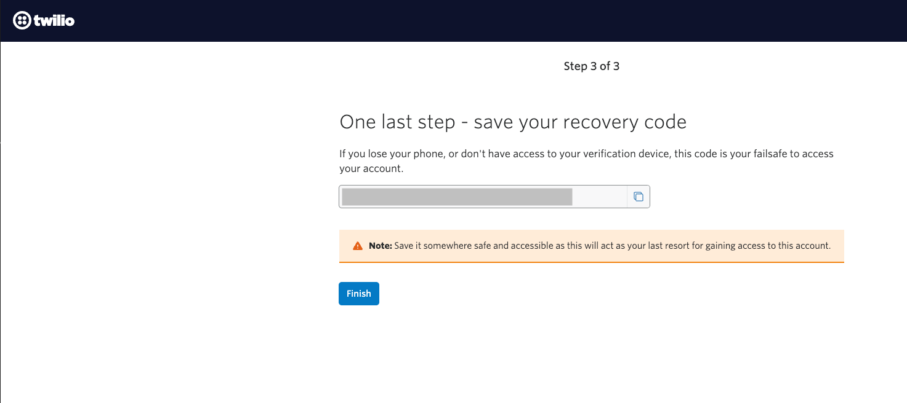

# Prepare the Skill to send an SMS

## Introduction

In this lab, you will learn how to use the custom component to send text messages from the Skill. In the previous lab, we have configured the Skill to show the detailed summary of the appointment details. However, you may also want to notify the user via Twilio SMS which is a short messaging service that sends user messages to their registered mobile number. 

Estimated Time: 20 minutes

### Objectives

In this lab you will be performing the following tasks: 

- Sign up for a Twilio paid or trial account.
- Obtain a Twilio number.
- Add a verified mobile number to use for a registered patient number.
- Configure the custom component to send out an SMS.

## Task 1: Set Up Twilio

- To create a Twilio trial account with your email ID, go to https://www.twilio.com/try-twilio. 
- Enter the required information, and then click Get Started.
  
  When prompted, enter your mobile phone number (You need to have a verified phone number to get a Twilio number).

  A verification code is sent to your mobile phone. Enter this verification code to add your number as a verified phone number

  

- After verification, save the *recovery code* in *Nodepad* and hit the *Finish button*.

  

- Personalize your experience and hit the *Get Started with Twilio* button.
  

- In the home page, click the *Get a Twilio Phone number* button to obtain a phone number for your twilio account. 

  

- Now, you will be able to see your Account Info. 

> **Note:** Copy your *Account SID*, *Auth Token* and *Twilio phone number*.

 

## Summary

In this lab, you have learned how to configure the chatbot to expose the web channel and test the bot on a web page. 

**Congratulations! You have successfully completed building the chatbot for Care Clinics.**

## Acknowledgements

* **Author** - Saipriya Thirvakadu, Sr. Cloud Engineer
* **Contributors**:
    * Chip Baber, Director, Cloud Engineering

* **Last Updated By/Date** - Saipriya Thirvakadu, September 2022

