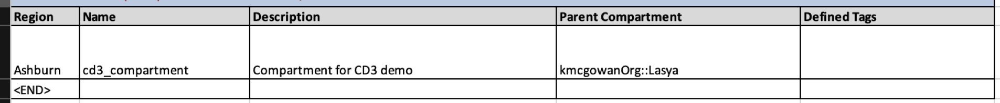
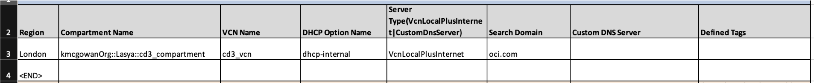
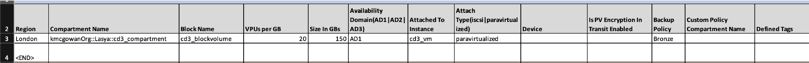
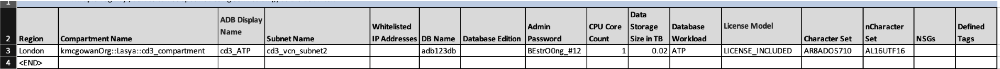

# Add resource parameter values in Excel file

## Introduction

This is a continuation of the lab 1 : **Get started with CD3 Automation Toolkit setup**

As a recap, in the previous lab we cloned the cd3 repo, built an image, executed the CD3 container and connected it to the OCI tenancy. 

Estimated time: 10 minutes

### Objectives

In this lab, you will:

- Add required parameter values for Compartments, VCN, Subnets, Compute, Block Volume, ATP to the Excel file.

### Prerequisites

- Please follow the previous lab till the last step. Once you are able to view the customer specific files in the outdirectory, you are all set to continue with this lab.

## Task 1:  Add required resource parameter values in the Excel file

### 1. **Identity**

1. Choose CD3-CIS-template from [CD3 Excel templates](https://oracle-devrel.github.io/cd3-automation-toolkit/latest/excel-templates/). 

    >**Note:** Any template other than *CD3-CIS-ManagementServices-template* can be used to provision these services.

2. Refer to the blue section in each worksheet to fill the resource details in proper formats. Not all fields are mandatory. 

    ```
    Please fill resources data before the <END> tag. Any data below the <END> tag will not be processed.
    ```

3. Add details for Compartment:

    - Open the *Compartments* tab and add your compartment data with below image as example.

    - If the parent compartment is not under root directly, then provide it in the below format:

     *Parentcompartment1::Parentcompartment2:: ... ::Parentcompartment n*

    >**Note:** Provide your Tenancy's "home region" under the "Region" column. (same for all OCI Identity components).
     
    Refer to the below image as example:
     

### 2. **Network**

1. Add details for the VCN:

    - Navigate to *VCNs* sheet and create a VCN with the following details:

    - Compartment name format: *parentcompartment1::parentcompartment2::child_compartmemt*

     Name: cd3_vcn

     CIDR: 10.110.0.0/24

    Refer to the below image as example:

    

2. Add DHCP details for cd3_vcn

    - Navigate to *DHCP* sheet and create DHCP Options with the following details:

    - VCN: cd3_vcn

     DHCP-option: dhcp-internal

     ServerType: VcnLocalPlusInternet

     Search domain: oci.com

    Refer to the below image as example:

    

3. Add details for creating Subnets in cd3_vcn

    - Navigate to *SubnetsVLANs* sheet and create subnets with the following details:

    - Name: subnet1, public subnet, CIDR: 10.110.0.0/26, Route table: RT1, Security list: SL1, Route to IGW.

    Name: subnet2, private subnet, CIDR: 10.110.0.64/26, Route table: RT2, Security list: SL2, Route to NGW.

    Refer to the below image as example:

    

4. Add details for Route rules

    - Navigate to *RouteRulesinOCI* sheet and create Route rules with following details:

    ``` 
    Name: RT1, Target:'cd3_vcn_igw', Destination type: CIDR, Destination CIDR: 0.0.0.0/0
    Name: RT2, Target:'cd3_vcn_ngw', Destination type: CIDR, Destination CIDR: 0.0.0.0/0
    ```

    Refer to the below image as example:

    

5. Add details for Security rules

    - Navigate to *SecRulesOCI* sheet and create Security rules with following details:

    - Name: SL1, STATEFUL, type: INGRESS, protocol:TCP, Source- 0.0.0.0/0, Destination port - 22

    - Name: SL2, STATEFUL, type: INGRESS, protocol:TCP, Source- 0.0.0.0/0, Destination port - 1521, 1522

    Refer to the below image as example:

    

### 3. **Compute**

1. Add details for Compute VM

    - Navigate to *Instances* sheet and create a **always-free** Compute Instance with below details:

    ```
    Name: cd3_vm, subnet: cd3_vcn_subnet1 (format: vcnname_subnetname), Source details- image::Linux, shape: VM.Standard.E3.Flex::2, ssh_public_key    
    ```

    ```
    To add SSH keys to the vm, place them in variables.tf under ssh_public_key variable.
    ```

2. Creating a simple web application

    - Create a column *Cloud Init Script* in the *Instances* sheet before the *defined tags* column and enter its value as "web.sh" in the same row with cd3_vm instance details.

    - Create bash file "web.sh" under below path and copy sample script to enable Apache on the instance.
    
    ```
    /cd3user/tenancies/<prefix>/terraform_files/<region_name>/compute/scripts
    ```

    ```
    <copy>
     #!/bin/bash
     sudo yum install -y httpd
     sudo systemctl enable httpd
     sudo systemctl restart httpd
     sudo systemctl stop firewalld
     sudo systemctl disable firewalld
     sudo iptables -A INPUT -p tcp --dport 80 -j ACCEPT
     sudo iptables-save
    </copy>
    ```
 
    >**Note:** Check logs under /var/lib/cloud/instance to ensure the correct data was passed.

    Refer to the below image as example:
    

3. Add details for Block Volumes

    - Navigate to *Block Volumes* sheet and create a Block Volume with below details:

    ```
    cd3_blockvolume: 20 VPUs per GB, 150GB size, attached to cd3_vm using paravirtualized mode
    ```

    Refer to the below image as example:

    

### 4. **Database**

1. Add details for ATP by navigating to *ADB* sheet and create an **always-free** ATP service with the below details:

    ```
    cd3_ATP: subnet-cd3_vcn_subnet2, DB Name: adb123db, CPU Core Count-10, Data Storage Size in TB -100, LICENSE_INCLUDED
    ```

    Refer to the below image as example:

    

Once all the resource details are filled, save the Excel file. 

In this lab, we have learnt how to enter details in the CD3 Excel templates.

You may now __proceed to the next lab__.

## Acknowledgements

- __Author__ - Dipesh Rathod
- __Contributors__ - Murali N V, Suruchi Singla, Lasya Vadavalli
- __Last Updated By/Date__ - Dipesh Rathod, Mar 2024
