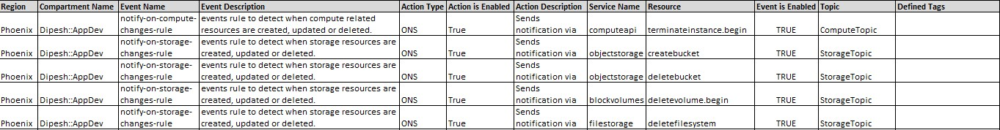
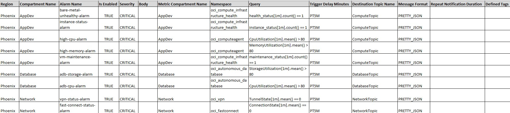

# Create OCI Event Rule, Alarm and Notifications

## Introduction

Oracle Cloud Infrastructure services emit Events, which are structured messages that indicate changes in resources. 

The Notifications service lets you know when something happens with your resources in Oracle Cloud Infrastructure. 

Using Alarms and Event Rules, you can get human-readable messages through email and text messages (SMS).

Some examples of how you might use Events and Notifications: 

- Send a Notification to a DevOps team when a database backup completes.
- Convert files of one format to another when files are uploaded to an Object Storage bucket.

Estimated Time: 10 minutes

### Objectives

The objectives of this lab are:

- Add OCI Event Rule, Alarm and Notifications details in Excel spreadsheet.
- Execute the setUpOCI.py script to generate Terraform files.
- Execute Terraform commands from the respective service folder.

### Prerequisites
Please follow the previous lab till the last step. Once you are able to provision OCI service, you are all set to continue with this lab.

## Task 1: Add OCI Event Rule, Alarm and Notifications in Excel Spreadsheet

1. Copy *CD3-CIS-ManagementServices-template.xlsx* from below path to locally on your system.

    ```
    /cd3user/oci_tools/cd3_automation_toolkit/example
    ```

2. Open *CD3-CIS-ManagementServices-template.xlsx* and update *Events, Alarms, Notifications* tabs based on your requirements and save it. You could use CIS standard pre-filled data in spreadsheet.

    _e.g._ 

    

    

## Task 2: Deploy OCI Event Rule, Alarm and Notifications

1. Place *CD3-CIS-ManagementServices-template.xlsx* Excel sheet at appropriate location in your container and provide the corresponding path in cd3file parameter at below path.

    ```
    /cd3user/tenancies /<customer_name>/<customer_name>_setUpOCI.properties
    e.g. cd3file=/cd3user/tenancies/usr1_livelab/CD3-CIS-ManagementServices-template.xlsx
    ```

2. *Execute* the setUpOCI Script from below path:

    ```
    python setUpOCI.py /cd3user/tenancies/<customer_name>/<customer_name>_setUpOCI.properties
    e.g. cd3file=/cd3user/tenancies/usr1_livelab/CD3-CIS-ManagementServices-template.xlsx
    ```

3. Type *option 8* for management services from Menu and *option 2* from submenu for *add/modify/delete events*.

4. Once the execution is *successful*, tfvars file will be generated under below folder in that region.

    ```
    <customer_name>_events.auto.tfvars file under /cd3user/tenancies/<customer_name>/terraform_files/<region_dir>
    ```

5. Navigate to the above path and *execute* the terraform commands:

    ```
    terraform init
    terraform plan
    ```

Wait for a bit until the plan succeeds and plan logs are available under _Logs_. Take a look to familiarize yourself with the log format. Scroll down until you see the line `Plan: X to add, 0 to change, 0 to destroy`.

6. Once satisfied by the plan logs, we put it into motion by starting the *Apply* process.

    ```
    terraform apply
    ```
The apply process can take some time, so patience is required.

## Task 3: Inspect Created Objects

Go to *OCI console* under compartment which was selected for deployment and take a few moments to explore the resources created. 

Ask yourself how these resources will make your environment more healthy.

You may now __proceed to the next lab__.

## Acknowledgements

- __Author__ - Dipesh Rathod
- __Contributors__ - Murali N V, Suruchi Singla, Lasya Vadavalli
- __Last Updated By/Date__ - Dipesh Rathod, May 2023
