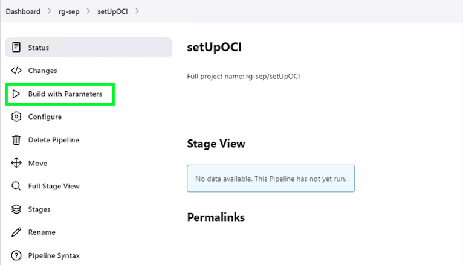
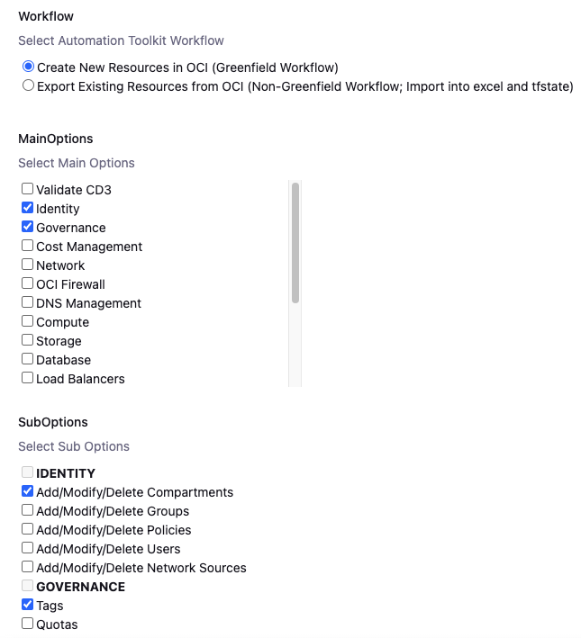
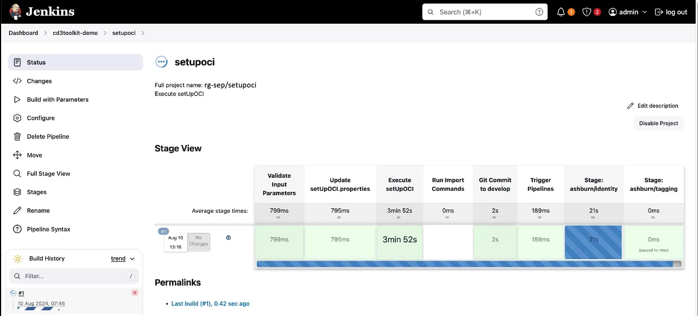
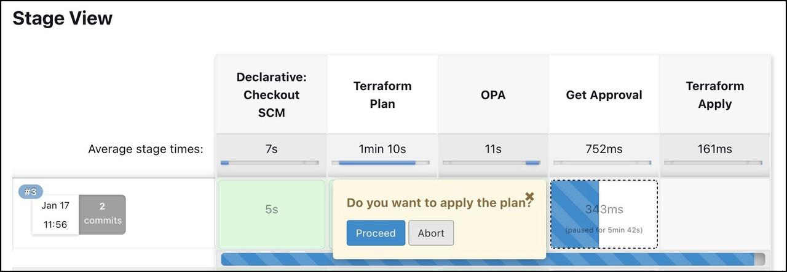

# Deploy OCI resources using CD3 Toolkit - Jenkins

## Introduction

This is a continuation of the lab 2 : **Add resource parameter values in Excel file**

As a recap, in the lab 2 we added resource parameters values in excel file for Compartments, VCN, Subnets, Compute, Block Volume and ATP.

Estimated time: 10 minutes

### Objectives

In this lab, you will:

- Execute setUpOCI and terraform pipelines from jenkins.
- Review terraform plan, OPA output and approve terraform apply stage.

### Prerequisites

- Please follow the previous lab till the last step. Once you are ready with excel template. You are all set to continue with this lab.

# Create Resources using Jenkins
   
   >**Note:** Only one user at a time using the Jenkins setup is supported in the current release of the toolkit.

## Task 1: Add Excel path to 'prefix_setUpoci.properties'
1. **Login** to Jenkins URL with the user created after initialization.
2. **Click** on Prefix Name from Dashboard
3. **Click** on setUpOCI pipeline. 
4. **Click** on **Build with Parameters** from left side menu.

        

5. **Upload** the filled [Excel sheet](https://oracle-devrel.github.io/cd3-automation-toolkit/latest/excel-templates/) in Excel_Template section.
    
        

## Task 2: Execute setUpOCI.py
1. Select the workflow as Create Resources in OCI (Greenfield Workflow). Choose single or multiple MainOptions as required and then corresponding SubOptions.
    >**Note:** Please read while selecting multiple options simultaneously. Below screenshot shows example to create compartments.

      

6. Click on **Build** at the bottom.

## Task 3: Generate terraform files and create our resources in OCI

   >**Note:** setUpOCI pipeline is auto triggered parallely from setUpOCI pipeline. This will run the python script to generate the terraform auto.tfvars. Once created and commit to the OCI Devops GIT Repo.

1. You could also navigate terraform-apply pipeline as example below.
    >**Note:** terraform_files » phoenix » tagging » terraform-apply

        

2. **Review Logs** for Terraform Plan and OPA stages by clicking on the stage and then **Logs**.
    
3. Click **Proceed** to proceed with terraform apply or **Abort** to cancel the terraform apply for each services you selected.
    >**Note:** Get Approval stage has timeout of 24 hours, if no action is taken the pipeline will be aborted after 24 hours. 

        

4. **Login** to the OCI console and **verify** that resources got created as required.

In this lab, we have learnt how to execute setUpOCI.py to create terraform files and create OCI resources using those terraform files.

You may now __proceed to the next lab__.

## Acknowledgements

- __Author__ - Dipesh Rathod
- __Contributors__ - Murali N V, Suruchi Singla, Dipesh Rathod
- __Last Updated By/Date__ - Dipesh Rathod, Mar 2024
