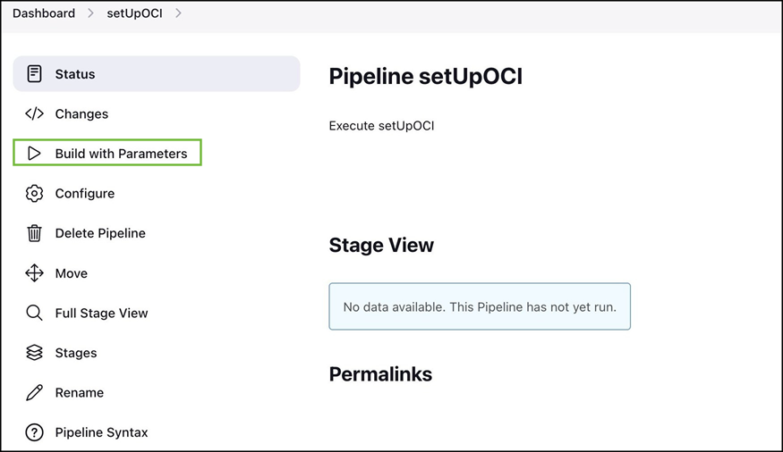
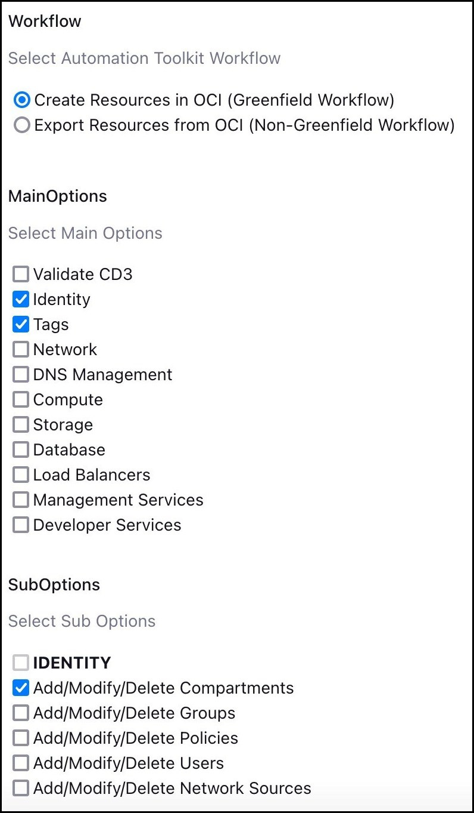
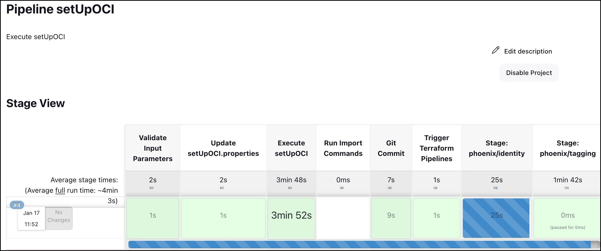
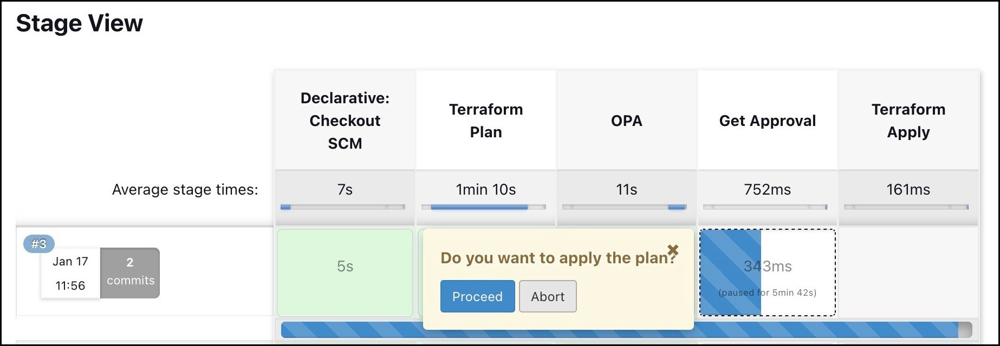
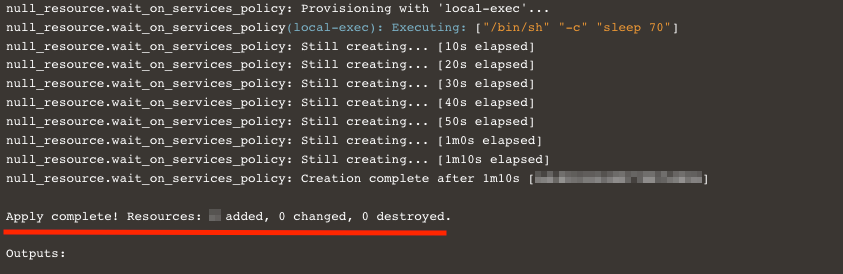

# Deploy OCI resources using CD3 Toolkit

## Introduction

This is a continuation of the lab 2 : [Add resource parameters values in excel file](/cd3-automation-toolkit/add-resource-values-excel/add-resource.md)

As a recap, in the previous lab we added resource parameters values in excel file for Compartments, VCN, Subnets, Compute, Block Volume and ATP.

Estimated time: 20 minutes

### Objectives

In this lab, you will:

- Execute the *setUpOCI.py* script to generate terraform files.
- Execute terraform commands from the respective service folders. 

### Prerequisites

- Please follow the previous lab till the last step. Once you are ready with excel template. You are all set to continue with this lab.

# Create Resources using Jenkins
   
   >**Note:** Only one user at a time using the Jenkins setup is supported in the current release of the toolkit.

## Task 1: Add Excel path to 'customername_setUpoci.properties'
1. **Login** to Jenkins URL with the user created after initialization.
2. **Click** on setUpOCI pipeline from Dashboard. 
3. **Click** on **Build with Parameters** from left side menu.

        

4. **Upload** the filled Excel sheet in Excel_Template section.
    
        

## Task 2: Execute setUpOCI.py
1. Select the workflow as Create Resources in OCI (Greenfield Workflow). Choose single or multiple MainOptions as required and then corresponding SubOptions.
    >**Note:** Please read while selcting multiple options simultaneously. Below screenshot shows example to create compartments and Tags.

      

6. Click on Build at the bottom.

## Task 3: Generate terraform files and create our resources in OCI

   >**Note:** setUpOCI pipeline is auto triggered parallely from setUpOCI pipeline. This will run the python script to generate the terraform auto.tfvars. Once created and commit to the OCI Devops GIT Repo.

1. You could also navigate terraform-apply pipeline as example below.
    >**Note:** terraform_files » phoenix » tagging » terraform-apply

        

2. **Review Logs** for Terraform Plan and OPA stages by clicking on the stage and then **Logs**.
    
3. Click **Proceed** to proceed with terraform apply or **Abort** to cancel the terraform apply for each services you selected.
    >**Note:** Get Approval stage has timeout of 24 hours, if no action is taken the pipeline will be aborted after 24 hours. 

        

4. **Login** to the OCI console and **verify** that resources got created as required.

# Create Resources using CLI 

## Task 1: Add Excel path to 'customername_setUpoci.properties'

1. Add the Excel file path for "cd3file" parameter. You can find a file in below location.

    ```
    /cd3user/tenancies/<customer_name>_setUpOCI.properties
    ```

2. Set below parameter to *false*, since we are creating new resources, and not modifying any existing ones.

    ```
    non_gf_tenancy = false
    ```

3. Save the file.


## Task 2: Execute setUpOCI.py

1. Run setUpOCI.py script to create the Terraform files for our resources.

2. Navigate to below path and execute the command.
        
    ```
    cd /cd3user/oci_tools/cd3_automation_toolkit/
    python setUpOCI.py /cd3user/tenancies/<customer_name>/<customer_name>_setUpOCI.properties
    ```
## Task 3: Generate terraform files and create our resources in OCI

1. Select option 1 from *setUpOCI.py* output menu. 

    >**Note:** Identity--> 1: Add/Modify/Delete Compartments. 

2. Navigate to identity directory under home region directory after Terraform files are created.

    ```               
    cd /cd3user/tenancies/<customer_name>/terraform_files/<home_region>/identity
    ```

3. Execute terraform init, plan and apply to create the compartment.

    >**Note:** Since we are creating all resources in the *democompartment*, we should first create the compartment in OCI and run fetch compartments again. This way the variables file has the *compartment* entry and other resources can be created in it.

4. Go back to the below folder and execute the setUpOCI.py again as shown in *Task 3* and select *fetch compartments*.

    ```
    /cd3user/oci_tools/cd3_automation_toolkit/
    ```

    >**Note:** This option will update OCID of newly created compartments in TF file.

5. Select: 3,4,5,6 options to create terraform files for Network, Compute, Storage and Database respectively from the *setUpOCI.py* output menu.

    - Under *Network*: Select- Options 1,3,4 
    - Under *Compute*: Select- Option 2
    - Under *Storage*: Select- Option 1
    - Under *Database*: Select- Option 3

    >**Note:** Terraform files are generated under the respective Service directories of the Region directory.

6. Once the Terraform files are created from above step, navigate to below path for each of the services: Network, Compute, Database and Block volume.

    ```
    /cd3user/tenancies/<customer_name>/terraform_files/<region>/<services>
    ```

7. Enter into each of the required service folders (network, compute, database) and execute the below terraform commands to provision the resources in OCI.

    ```
    terraform init
    terraform plan 
    terraform apply 
    ```

    >Note: We are using terraform commands to provision resources in this lab. We will also leverage this terraform code in resource manager in upcoming lab.  

8. Review the terraform output and the created resources can be viewed on the OCI console.

    

In this lab, we have learnt how to enter details in the CD3 Excel templates, execute setUpOCI.py to create terraform files and create OCI resources using those terraform files.

You may now __proceed to the next lab__.

## Acknowledgements

- __Author__ - Lasya Vadavalli
- __Contributors__ - Murali N V, Suruchi Singla, Dipesh Rathod
- __Last Updated By/Date__ - Dipesh Rathod, Mar 2024