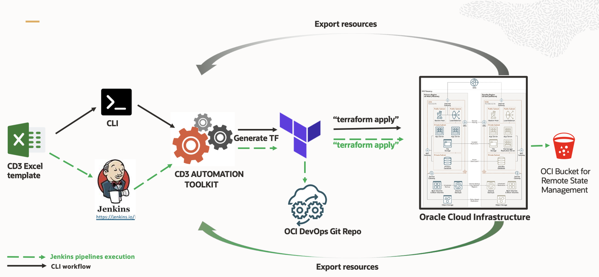

# Introduction

## About this Workshop

This set of labs will walk you through deploying various OCI services. Upon completion of the labs, a full set of OCI resources will be created as a base infrastructure to install and configure an application.

[CD3 Automation Toolkit Explained in 1 minute](youtube:TSNu0pUHYsE&list=PLPIzp-E1msrbJ3WawXVhzimQnLw5iafcp&index=1)

Estimated Workshop Time: 60 Minutes

### Objectives

In this workshop, you will learn how to:
- Get Started with CD3 Automation Toolkit
- Build OCI infrastructure using CD3 Automation Toolkit
- Group the generated Terraform files
- Produce and Inspect Terraform Plan
- Apply Plan to OCI tenancy
- OCI Resource Manager Upload
- Terraform Destroy to reset

### Prerequisites

This lab has the following pre-requisites:

- A [free tier](https://www.oracle.com/cloud/free/) or paid OCI tenancy
- An account in the Administrators group in OCI
- Basic understanding of Git
- Any docker CLI compatible platform such as Docker or Rancher.
- Local Directory - A directory in your local system that will be shared with the container to hold the generated Terraform files.

## The CD3 Automation Toolkit Architecture

### Overview

CD3 stands for **C**loud **D**eployment **D**esign **D**eliverable. [The CD3 Automation toolkit](https://github.com/oracle-devrel/cd3-automation-toolkit) has been developed to help in automating the OCI resource object management.

It reads input data in the form of CD3 Excel sheet and generates the terraform files which can be used to provision the resources in OCI instead of handling the task through the OCI console manually. 

The toolkit also reverse engineers the components in OCI back to the Excel sheet and Terraform configuration. 

This generated Terraform code can be used by the OCI Resource Manager or leveraged by the organisations’ CI/CD processes.

### Cost

All resources deployed by the Automation Toolkit are OCI native services, meaning it may have cost impact based on tenancy billing plan.

### Architecture Components

The Automation Toolkit will deploy a full set of resources suitable for a production cloud, including:

- Identity and Access Management (IAM) Controls
- One or More Virtual Cloud Networks (VCNs)
- Compute Service
- Block Volume
- Autonomous Transaction Processing Database
- Cloud Events Rules
- Alarms
- OCI Notifications 
- Budget Controls

Most of the resources in OCI can be provisioned with Terraform. While beyond the scope of this lab, more information on using Terraform with OCI can be found [here](https://docs.oracle.com/en-us/iaas/Content/API/SDKDocs/terraform.htm).

## Learn More

* [Documentation](https://github.com/oracle-devrel/cd3-automation-toolkit)
* [Learning Videos](https://www.youtube.com/watch?v=TSNu0pUHYsE&list=PLPIzp-E1msrbJ3WawXVhzimQnLw5iafcp)

## Acknowledgements

- __Author__ - Dipesh Rathod
- __Contributors__ - Murali N V, Suruchi Singla, Lasya Vadavalli
- __Last Updated By/Date__ - Dipesh Rathod, May 2023
