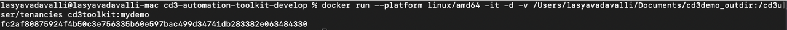

# Get started with CD3 Automation Toolkit setup

## **Introduction**

The CD3 Automation toolkit is available in the github public repo : [CD3 github repo](https://github.com/oracle-devrel/cd3-automation-toolkit)  


To begin the process of setting up the Toolkit and connecting to OCI, please follow the step-by-step instructions outlined in this lab.

Estimated Lab Time: 10 minutes
<br>

### Objectives

The objectives of this lab are:

- Clone the CD3 repo
- Build an image from the dockerfile in repo
- Run the CD3 container
- Connect CD3 container to OCI tenancy

### Prerequisites

- Git 
- Any Docker CLI compatible platform such as Docker or Rancher.
- Local Directory: A directory in your local system that will be shared with the container to hold the generated Terraform files.
- OCI Tenancy access requirement - Appropriate IAM policies must be in place for each of the resources that the user may try to create. Minimum requirement for the user to get started is to have the ability to read to the tenancy.
 
## Task 1: Clone the repo

1. Open your terminal and navigate to the desired directory where you intend to download the git repository.
2. Run the git clone command as shown below:
    ```
    bash
    git clone https://github.com/oracle-devrel/cd3-automation-toolkit
    ```
3. Once the cloning completes successfully, the repo will replicate to the local directory.

## Task 2: Build an image from the Dockerfile obtained from the above clone

 1. Change directory to *'cd3-automation-toolkit'*(i.e. the cloned repo in your local).

2. Execute:
```
bash 
docker build --platform linux/amd64 -t cd3toolkit:${image_tag} -f Dockerfile --pull --no-cache . 
```

> __Note:__ *${image_tag} should be replaced with suitable tag as per your requirements/standards. The period (.) at the end of the docker build command is required.*


<br>

## **Task 3: Run the CD3 container**

- Execute the below *docker run* command:

```
docker run --platform linux/amd64 -it -d -v <directory_in_local_system_where_the_files_must_be_generated>:/cd3user/tenancies <image_name>:<image_tag>
```
<br>



<br>
- Verify the container:
```
docker ps
```

## Task 4: Connect Docker container to OCI tenancy

###  **Step 1: Exec into the container:**
 
 1. List out all the containers:

```
docker ps
```
> Note down the container ID from this cmd output.

2. Enter the container using the above container id.

```bash
docker exec -it <container_id> bash
```
3. Change directory to *'user-scripts'*

```
cd /cd3user/oci_tools/cd3_automation_toolkit/user-scripts/
```
### **Step 2: Create API PEM Key:**

1. RSA key pair in PEM format (minimum 2048 bits) is needed to use OCI APIs. If the key pair does not exist, create them by executing *createAPIKey.py* under *'user-scripts'* folder:

``` 
python createAPIKey.py 
```

> This will generate the public/private key pair(oci_api_public.pem and oci_api_private.pem) at */cd3user/tenancies/keys/*

2. In case you already have the keys, you should copy the private key file inside the container and rename it to *oci_api_private.pem*.

### **Step 3: Upload the Public key to OCI console.**

Upload the Public key to "APIkeys" under user settings in OCI Console. Pre-requisite to use the complete functionality of the Automation Toolkit is to have the user as an administrator to the tenancy.

   - Open the Console, and sign in as the user.
   - View the details for the user who will be calling the API with the key pair.

   - Open the Profile menu (User menu icon) and click **User Settings**.

   - Click **Add Public Key**.
   - Paste the contents of the PEM public key in the dialog box and click *Add*.

### **Step 4: Edit tenancyconfig.properties:**

Enter the required details in *tenancyconfig.properties*

```
[Default]
# Mandatory Fields
# Friendly name for the Customer Tenancy eg: demotenancy;
# The generated .auto.tfvars will be prefixed with this customer name
customer_name=
tenancy_ocid=
fingerprint=
user_ocid=

# Path of API Private Key (PEM Key) File; If the PEM keys were generated by running createAPI.py, leave this field empty.
# Defaults to /cd3user/tenancies/keys/oci_api_private.pem when left empty.
key_path=

# Region ; defaults to us-ashburn-1 when left empty.
region=

# Leave it blank if you want single outdir or specify absolute path for outdir_structure_file.properties containing directory structure for OCI services.
outdir_structure_file=
#or
#outdir_structure_file=/cd3user/oci_tools/cd3_automation_toolkit/user-scripts/outdir_structure_file.properties

# Optional Fields
# SSH Key to launched instances
ssh_public_key=

```
### **Step 5 : Initialise the environment:**

To initialise your environment for utilizing the automation toolkit, execute:

```
python createTenancyConfig.py tenancyconfig.properties
```

> **Note:** *If the API Keys were generated and added to the OCI console using previous steps, it might take a couple of seconds to reflect. Thus, running the above command immediately might result in Authentication Errors.
In such cases, please retry after a minute.*

Here is a screenshot of example execution of the script:

 

After the *createTenancyConfig.py* script is executed, customer specific files get created under */cd3user/tenancies/\<customer_name>* with \<customer_name> provided in *tenancyconfig.properties* as prefix.

This lab concludes with the verification of the generated customer specific files.

<br>

In this lab, we have cloned the CD3 repo, built an image from it, executed the cd3 container and connected it to the OCI tenancy using config details.

<br>

Follow the next lab to upload the CD3 Excel file and execute setUpOCI.py script which generates the terraform files. 

[def]: images/docker_run.png "example  of docker run command"

You may now __proceed to the next lab__.

## Acknowledgements

- __Author__ - Lasya Vadavalli
- __Contributors__ - Murali N V, Suruchi Singla, Dipesh Rathod
- __Last Updated By/Date__ - Lasya Vadavalli, June 2023
