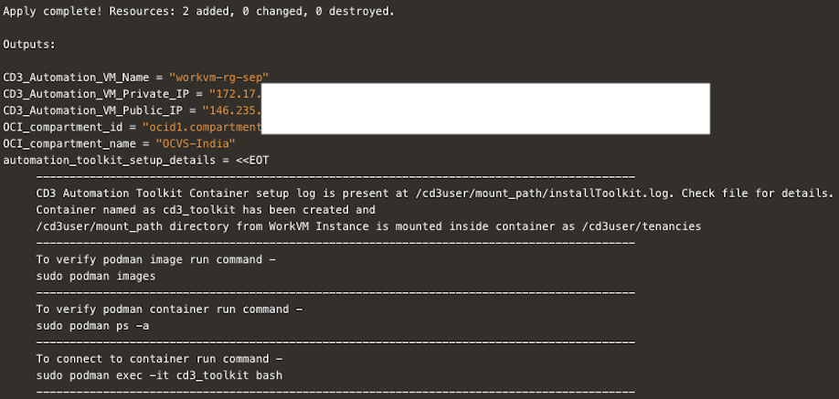

# Get started with CD3 Automation Toolkit setup

## **Introduction**

To set up the CD3 Toolkit container and connecting it to OCI, please follow the step-by-step instructions outlined in this lab.

The CD3 container can either be launched in a OCI VM using **single click RM stack** deployment or it can be launched in user's **Local system**. The container should be then connected to OCI tenancy to be able to Create/Export the resources.

Estimated Time: 10 minutes

### Objectives

The objectives of this lab are:

- Launch CD3 container in OCI 
- Launch CD3 container in Local System.
- Connect CD3 container to OCI tenancy

### Prerequisites

- IAM policy to allow user/instance principal to manage the services that need to be created/exported using the toolkit.

- The user deploying the stack should have access to launch OCI Resource Manager Stack, Compute Instance and Network resources.

## Task 1: Launch CD3 container in OCI- Single Click deployment

1. **Click** on the below button to launch the Resource Manager Stack that creates the CD3 WorkVM.

   [](https://cloud.oracle.com/resourcemanager/stacks/create?zipUrl=https://github.com/oracle-devrel/cd3-automation-toolkit/archive/refs/heads/main.zip)

2. **Accept** the terms and conditions, fill in the details like the Network, Compartment, VM name, shape etc., for the workVM to be created.  

   >**Important:** It is recommended to refrain from using 0.0.0.0/0 as Source CIDR to access the VM to maintain a secure environment. Instead just provide the specific IP/CIDR from where you are going to access the VM.

3. Check the **Run Apply** box at the bottom and click on **Create**.

4. After the Apply job is successful, **Click** on the Job and scroll down to the end of logs.

5. Find the details for the **created VM** and commands to be executed to login to the toolkit container.

   Below is a sample output:

   


  After executing the container, jump to [Task 3](#Task3:ConnectcontainertoOCItenancy) to connect this container to OCI tenancy.

## Task 2: Launch CD3 container in Local System

Make sure the [prerequisites](#prerequisites) are met before proceeding.

1. Clone the CD3 repository to a local folder from your terminal using below command.

    ```bash
    git clone https://github.com/oracle-devrel/cd3-automation-toolkit
    ```

2. Change the directory to **cd3-automation-toolkit** (i.e. the cloned repo in your local) and execute.

    ```bash
    docker build --platform linux/amd64 -t cd3toolkit:$<image_tag> -f Dockerfile --pull --no-cache . 
    ```
    >**Note:** $<image_tag> should be replaced with suitable tag as per your requirements/standards. The period (.) at the end of the docker build command is required.

3. Run the CD3 container using below command.

    ```bash
    docker run --platform linux/amd64 -it -d -v <directory_in_local_system_where_the_files_must_be_generated>:/cd3user/tenancies <image_name>:<image_tag>
    ```

4. Verify the container using  ```docker ps```. Note down the container ID from the above command and execute.

    ```bash
    docker exec -it <container_id> bash
    ```

## Task 3: Connect container to OCI tenancy

1. For the scope of this tutorial, we will use API-Key authentication. Navigate to ```cd /cd3user/oci_tools/cd3_automation_toolkit/user-scripts/```

    >**Note:** Check [Github documentation](https://github.com/oracle-devrel/cd3-automation-toolkit) to configure other methods.


2. Create RSA key pair by  executing ```createAPIKey.py``` under **user-scripts** folder.

    ```
    python createAPIKey.py 
    ```

    >**Note:** It will generate the public & private key pair at ```/cd3user/tenancies/keys/``` folder.
    
    ```
    oci_api_public.pem
    oci_api_private.pem
    ```

    In case you already have the keys, you should copy the private key file inside the container and rename it to ```oci_api_private.pem```.

3. **Upload** the Public key to **APIkeys** under user settings in OCI Console.

    -  Open the **Console**, and sign in as the user.

    -  View the details for the user who will be calling the API with the **key pair**.

    -  Open the Profile menu (User menu icon) and click **User Settings**.

    -  Click **Add Public Key**.

    -  Paste the contents of the **PEM public key** in the dialog box and click **Add**.

3. Navigate to ```/cd3user/oci_tools/cd3_automation_toolkit/user-scripts/```
4. Edit ```tenancyconfig.properties``` file and fill the details in **Required parameters** and **Auth Details Parameters** sections. 

   Below are the sample values for **API_Key Auth mechanism**. 
 
    ```bash
    # tenancyconfig.properties
    ##################################################################################################################
                            ## Required Parameters ##
    ##################################################################################################################

    # Friendly name for the Customer Tenancy eg: demotenancy; The generated .auto.tfvars files will be prefixed with this
    # customer_name.
    prefix=rg-sep

    tenancy_ocid=ocid1.tenancy.oc1.....niuea

    # Example: us-phoenix-1
    region=us-phoenix-1

    # Auth Mechanism for OCI APIs - api_key,instance_principal,session_token
    # Please make sure to add IAM policies for user/instance_principal before executing createTenancyConfig.py
    auth_mechanism=api_key

    ##################################################################################################################
                                ## Auth Details Parameters ##
    # Required only for ${auth_mechanism} as api_key; Leave below params empty if 'instance_principal' or 'session_token'
    # is used
    ##################################################################################################################

    user_ocid=ocid1.user.oc1....4avq
    #Path of API Private Key (PEM Key) File; Defaults to /cd3user/tenancies/keys/oci_api_private.pem when left empty
    key_path=
    fingerprint= 9d:20:...:45:c8
   
    ```

    >**Note:**  If you selected Instance Principal or session token method for authentication, follow the commented guidelines in the *tenancyconfig.properties* file or [Auth Mechanisms documentation](https://github.com/oracle-devrel/cd3-automation-toolkit) and proceed accordingly.


5. Under **Deployment Parameters** section in ```tenancyconfig.properties``` file, Leave the default value for **outdir structure file** parameter to group your generated terraform auto.tfvars files for each service.

    >**Note:** To place all the generated terraform auto.tfvars files directly under the region folder, comment the parameter with the default outdirectory structure file path and uncomment the one above it.


6. Under **Advanced parameters for DevOps** section in tenancyconfig.properties file set the parameter   ```use_oci_devops_git=yes``` to use the toolkit with **Jenkins**.
   
    >**Note:** If you plan to use the toolkit with CLI, skip this section. Since we are using API-key Auth mechanism, the **User details** section can be skipped.

7. **Initialise** your environment to use the Automation Toolkit.

    ```bash
    python createTenancyConfig.py tenancyconfig.properties
    ```

8. You should see an output similar to below:

      ```bash
      [cd3user@109c63ee4ec0 user-scripts]$ python createTenancyConfig.py tenancyconfig.properties
      =================================================================
      NOTE: Make sure the API Public Key is added to the OCI Console!!!
      =================================================================
   
      Using different directories for OCI services as per the input outdir_structure_file..........
   
      Copying Private Key File..........
   
      Creating Tenancy specific config.................
      Updated OCI_Regions file !!!
   
   
      Creating Tenancy specific remote tfstate Items - bucket, S3 credentials.................
      Creating new customer secret key
   
      Creating Tenancy specific setUpOCI.properties.................
      Creating Tenancy specific region directories, terraform provider , variables files.................
   
      Creating Tenancy specific DevOps Items - Topic, Project and Repository.................
   
      The toolkit has been setup successfully. !!!
   
      Customer Specific Working Directory Path: /cd3user/tenancies/rg-sep
   
      Remote State Bucket Name: rg-sep-automation-toolkit-bucket in us-sanjose-1.
      Common Jenkins Home: /cd3user/tenancies/jenkins_home
      DevOps Project Name and Repo Name: rg-sep-automation-toolkit-project, rg-sep-automation-toolkit-repo in us-sanjose-1.
      Folder configured for OCI DevOps GIT: /cd3user/tenancies/rg-sep/terraform_files/ Initial Commit ID from createTenancyConfig.py: df73e44
   
      #########################################
      Next Steps for using toolkit via Jenkins
      #########################################
      Start Jenkins using  - /usr/share/jenkins/jenkins.sh &
      Access Jenkins using - https://<IP Address of the machine hosting docker container>:8443
   
      ######################################
      Next Steps for using toolkit via CLI
      ######################################
      Modify /cd3user/tenancies/rg-sep/rg-sep_setUpOCI.properties with input values for cd3file and workflow_type
      cd /cd3user/oci_tools/cd3_automation_toolkit/
      python setUpOCI.py /cd3user/tenancies/rg-sep/rg-sep_setUpOCI.properties
      ==================================================================================================================================
      ```


10. After the createTenancyConfig.py script is successfully executed, customer specific files are created under ```/cd3user/tenancies/<prefix>```.
  
In this lab, we have learnt how to **setup CD3 toolkit container** and **connect** it to OCI tenancy.

You may now __proceed to the next lab__.

## Acknowledgements

- __Author__ - Lasya Vadavalli
- __Contributors__ - Murali N V, Suruchi Singla, Dipesh Rathod
- __Last Updated By/Date__ - Lasya Vadavalli, Mar 2024
