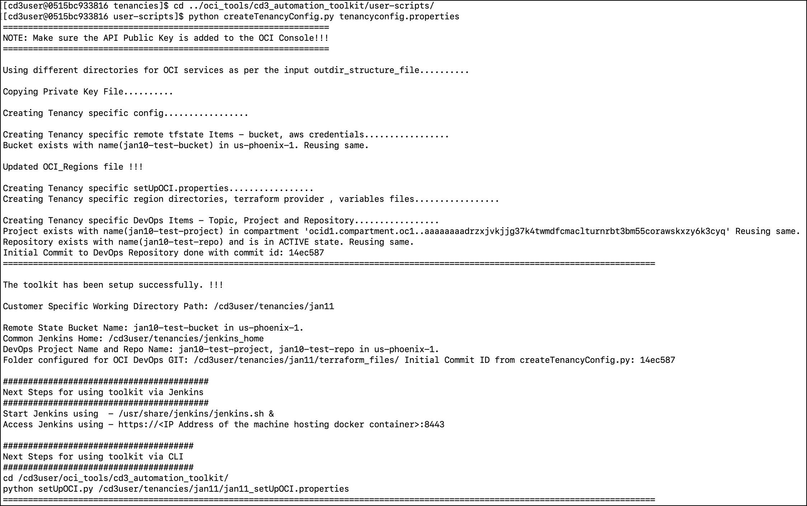

# Get started with CD3 Automation Toolkit setup

## **Introduction**

To set up the CD3 Toolkit container and connecting it to OCI, please follow the step-by-step instructions outlined in this lab.

The CD3 container can either be launched in a OCI VM using single click RM stack deployment or it can be launched in user's Local system. The container should be then connected to OCI tenancy to be able to Create/Export the resources.


Estimated Time: 10 minutes

### Objectives

The objectives of this lab are:

- Launch CD3 container in OCI 
- Launch CD3 container in Local System.
- Connect CD3 container to OCI tenancy


### Prerequisites


- IAM policy to allow user/instance principal to manage the services that need to be created/exported using the toolkit.

- Minimum requirement is to have read access to the tenancy.

<br>

## Task 1: Launch CD3 container in OCI- Single Click deployment:


**Prerequisites:**

The user deploying the stack should have access to launch OCI Resource Manager Stack, Compute Instance and Network resources.


**1.** Click on the below button to launch the Resource Manager Stack that creates the CD3 WorkVM.

   [](https://cloud.oracle.com/resourcemanager/stacks/create?zipUrl=https://github.com/oracle-devrel/cd3-automation-toolkit/archive/refs/heads/develop.zip)

<br>

**2.** Accept the terms and conditions, fill in the details like the Network, Compartment, VM name, shape etc., for the workVM to be created.  

   <br>

   >Important!:  It is recommended to refrain from using 0.0.0.0/0 as Source CIDR to access the VM to maintain a secure environment. Instead just provide the specific IP/CIDR from where you are going to access the VM.

   <br>

**3.** Check the **Run Apply** box at the bottom and click on **Create**.

**4.** After the Apply job is successful, **Click** on the Job and scroll down to the end of logs.

   Find the details for the created VM and commands to be executed to login to the toolkit container.

   Below is a sample output:

   


  After executing the container, jump to [Task 3](#task-3-connect-container-to-oci-tenancy) to connect this container to OCI tenancy.

<br>

## Task 2: Launch CD3 container in Local System

Make sure the [prerequisites](#prerequisites) are met before proceeding.


**1**. Clone the CD3 repository to a local folder from your terminal using below command:

   ```bash

    git clone https://github.com/oracle-devrel/cd3-automation-toolkit
  ```

**2.** Change the directory to **cd3-automation-toolkit** (i.e. the cloned repo in your local) and execute:

  ```bash
    docker build --platform linux/amd64 -t cd3toolkit:$<image_tag> -f Dockerfile --pull --no-cache . 
  ```
<br>

   >**Note:** $<image_tag> should be replaced with suitable tag as per your requirements/standards. The period (.) at the end of the docker build command is required.

<br>

**3.** Run the CD3 container using below command:

```bash
    docker run --platform linux/amd64 -it -d -v <directory_in_local_system_where_the_files_must_be_generated>:/cd3user/tenancies <image_name>:<image_tag>
```
    
   
 <br> 

**4.** Verify the container using  ```docker ps```.

Note down the container ID from the above command and execute:

  ```bash
   docker exec -it <container_id> bash
  ```


## Task 3: Connect container to OCI tenancy

**1.**  **Authentication mechanism:**

 For the scope of this tutorial, we will use API-Key authentication. 
 
 Follow the next steps to configure the same. Check [Github documentation]() to configure other methods.

    
**2.** Navigate to ```cd /cd3user/oci_tools/cd3_automation_toolkit/user-scripts/```


**3.** Create RSA key pair by  executing ```createAPIKey.py``` under **user-scripts** folder:

   ``` 
    python createAPIKey.py 
   ```

This will generate the public & private key pair at ```/cd3user/tenancies/keys/``` folder.

   ```
    oci_api_public.pem and oci_api_private.pem
   ```

In case you already have the keys, you should copy the private key file inside the container and rename it to below.

   ```
   oci_api_private.pem
   ```

**4.** Upload the Public key to **APIkeys** under user settings in OCI Console.

 -  Open the **Console**, and sign in as the user.

 -  View the details for the user who will be calling the API with the **key pair**.

 -  Open the Profile menu (User menu icon) and click **User Settings**.

 -  Click **Add Public Key**.

 -  Paste the contents of the **PEM public key** in the dialog box and click **Add**.


<br>

**3.** Open *tenancyconfig.properties* file and fill the details in **Required parameters** and **Auth Details Parameters** sections. 

  Below are the sample values for **API_Key Auth mechanism**. 

<br>

   
   ```bash

   ##################################################################################################################
                            ## Required Parameters ##
    ##################################################################################################################

    # Friendly name for the Customer Tenancy eg: demotenancy; The generated .auto.tfvars files will be prefixed with this
    # customer_name.
    customer_name=demo_tenancy

    tenancy_ocid=ocid1.tenancy.oc1.....niuea

    # Example: us-phoenix-1
    region=us-phoenix-1

    # Auth Mechanism for OCI APIs - api_key,instance_principal,session_token
    # Please make sure to add IAM policies for user/instance_principal before executing createTenancyConfig.py
    auth_mechanism=api_key

    ##################################################################################################################
                                ## Auth Details Parameters ##
    # Required only for ${auth_mechanism} as api_key; Leave below params empty if 'instance_principal' or 'session_token'
    # is used
    ##################################################################################################################

    user_ocid=ocid1.user.oc1....4avq
    #Path of API Private Key (PEM Key) File; Defaults to /cd3user/tenancies/keys/oci_api_private.pem when left empty
    key_path=
    fingerprint= 9d:20:...:45:c8
   
   ```
<br>


   >Note:  If you selected Instance Principal or session token method for authentication, follow the commented guidelines in the *tenancyconfig.properties* file or [Auth Mechanisms]() page and proceed accordingly.


**4.** Under **Deployment Parameters** section, Leave the default value for **outdir structure file** parameter to group your generated terraform auto.tfvars files for each service.

To place all the generated terraform auto.tfvars files directly under the region folder, comment the parameter with the default outdirectory structure file path and uncomment the one above it.


**5.** The **Advanced parameters for DevOps** should be configured if you plan to use the toolkit with Jenkins. 

    If you plan to use the toolkit with CLI, skip this section.


To use the toolkit with **Jenkins**, set the parameter values like shown below


```bash

##################################################################################################################
                            ## Advanced Parameters for DevOps ##
# Below OCI Objects - Remote State Bucket Name and DevOps Project/Repo and a Notification Topic will be created/fetched
# from region specified in ${region} above.
# These values are required to be set as "yes" for Jenkins Configuration.
##################################################################################################################


# Compartment OCID where Bucket and DevOps Project/repo will be created; defaults to root if left empty.
compartment_ocid=ocid1.compartment.oc1....z3a

# Remote state configuration
# Enter yes if remote state needs to be configured, else tfstate will be stored on local filesystem.
use_remote_state=yes

# Specify bucket name if you want to use existing bucket else leave empty.
# If left empty, Bucket with name ${customer_name}-automation-toolkit-bucket will be created/reused in ${region}.
remote_state_bucket_name=

# OCI DevOps GIT configuration
# Enter yes if generated terraform_files need to be stored in OCI DevOps GIT Repo else they will be stored on local
# filesystem. Will enforce 'yes' for use_remote_state in case below is set to 'yes'
use_oci_devops_git=yes

# Specify Repo name if you want to use existing OCI Devops GIT Repository else leave empty Format: <project_name/repo_name>
# If left empty, DevOps items  with names ${customer_name}-automation-toolkit-project/repo/topic will be created/reused
# in ${region}.
oci_devops_git_repo_name=


```


Since we are using API-key Auth mechanism, the User details section can be skipped. The details are automatically fetched from above provided values. 


6. Initialise your environment to use the Automation Toolkit:

```bash

python createTenancyConfig.py tenancyconfig.properties

```

You should see an output similar to below:




<br>

After the createTenancyConfig.py script is successfully executed, customer specific files are created under ```/cd3user/tenancies/<customer_name>```

   

You have now successfully setup the CD3 toolkit container and connected it to OCI tenancy.


What's next? Check out the next labs to Create/Export and manage your OCI resources using CLI or Jenkins. 


## Acknowledgements

- __Author__ - Lasya Vadavalli
- __Contributors__ - Murali N V, Suruchi Singla, Dipesh Rathod
- __Last Updated By/Date__ - Lasya Vadavalli, June 2023
