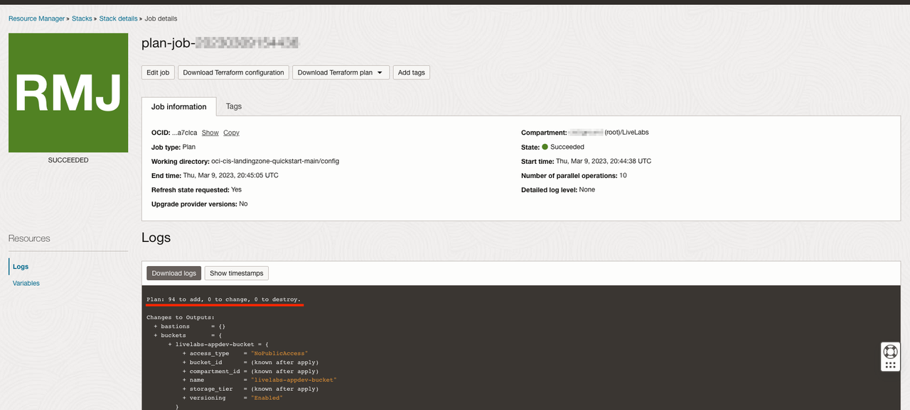
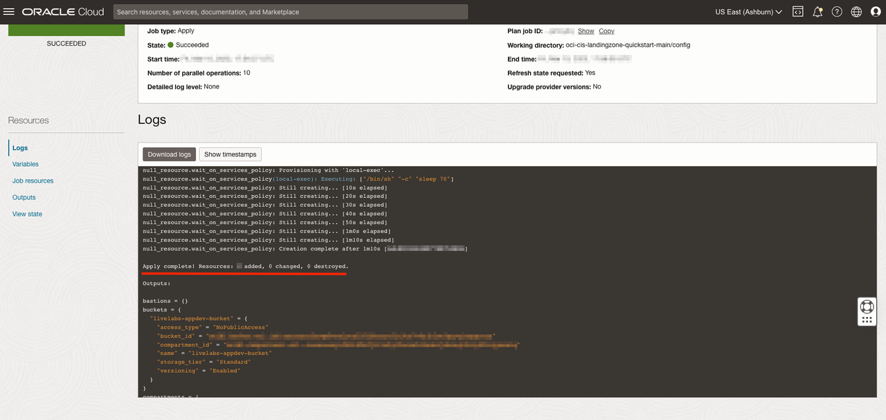

# Upload stack to OCI resource manager

## Introduction

Resource Manager allows you to share and manage infrastructure configurations and state files across multiple teams and platforms.

Stack is a the collection of OCI resources corresponding to a given Terraform configuration. Each stack resides in the compartment you specify, in a single region; however, resources on a given stack can be deployed across multiple regions.

Estimated Time: 10 minutes

### Objectives

The objectives of this lab are:

- Create a Resource Manager Stack

### Prerequisites
Please follow the previous lab till the last step. Once you are able to provision OCI event alarms and notifications, you are all set to continue with this lab.

## Task 1: Create a Resource Manager Stack

1. Execute the *setUpOCI* Script:
    ```
    python setUpOCI.py /cd3user/tenancies/<customer_name>/<customer_name>_setUpOCI.properties
    e.g. python setUpOCI.py /cd3user/tenancies/usr1_livelab/usr1_livelab_setUpOCI.properties
    ```

2. Type *option 9* for developer services and *option 1* from submenu to *upload current terraform files/state to Resource Manager*.

3. Once the *execution* is successful, you will see the below stack in resource manager and file will be generated under the folder.

    ```
    <customer_name>-<region_dir>-stacks.zip file will be generated under the folder /cd3user/tenancies/<customer_name>/terraform_files/<region_dir>
    ```

4. Go to *OCI console* under compartment which was selected for upload and take a few moments to explore the stack created.

5. You can run *plan option* from resource manager to validate it. You could also download the terraform files for local modification and re-upload or use [OCI online code editor](https://docs.oracle.com/en-us/iaas/Content/ResourceManager/Tasks/code-editor.htm).  

    

6. Wait for a bit until the plan *succeeds* and plan logs are available under *Logs*. Run apply if any changes are made to get it applied.

    

## Acknowledgements

- __Author__ - Dipesh Rathod
- __Contributors__ - Murali N V, Suruchi Singla, Lasya Vadavalli
- __Last Updated By/Date__ - Dipesh Rathod, May 2023
