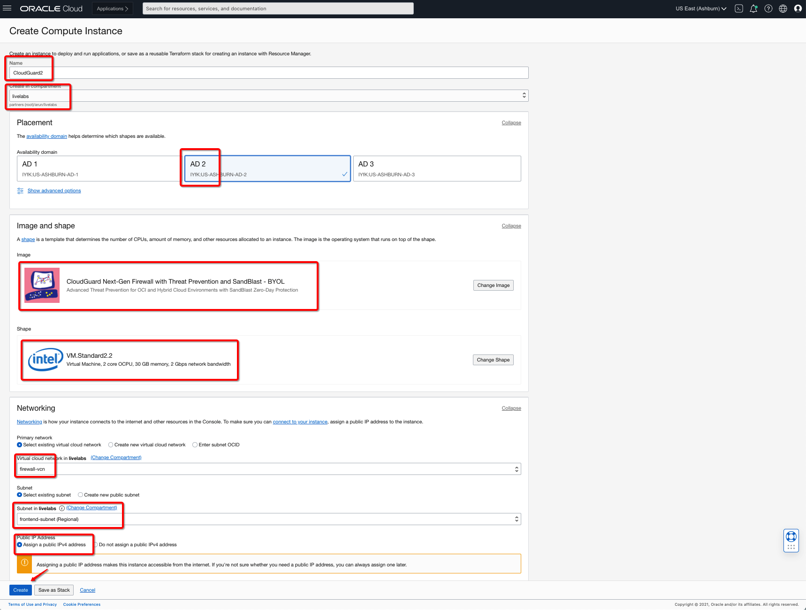

# Deploy CloudGuard and Supporting Configuration

## Introduction

In this lab you will be creating CloudGuard instances from **partner images** i.e. **OCI Marketplace**, adding additional interfaces, IP Addresses, dynamic group and policy to support traffic between VCNs.

Estimated Time: 30 minutes.

### Objectives

- Launch CloudGuard Instances in Hub VCN
- Add Interfaces to CloudGuard Instances
- Assign Secondary IP Addresses to Primary CloudGuard Instance
- Demonstrate launching Dynamic Groups and Policies
- Demonstrate updating routing tables
- Validate route tables association

### Prerequisites

- Oracle Cloud Infrastructure paid account credentials (User, Password, Tenant, and Compartment)
- Oracle Marketplace Listings Access required for this **Lab**:
    - **CloudGuard Security Management** BYOL listing
    - **CloudGuard Next-Gen Firewall with Threat Prevention and SandBlast** BYOL listing
        - You would need a valid license from Check Point if you chose BYOL listing once trail license is expired.

## Task 1: Launch CloudGuard Security Management and CloudGuard Instances

1. Launch **Cloud Shell** by clicking the icon next to region name on top right of OCI console. ('<=' icon)

2. Once cloud Shell is launched. Enter command **ssh-keygen**, press enter for all prompts. This will create a ssh key pair. Enter command.

    ```
    <copy>
    bash
    cd .ssh
    cat id_rsa.pub
    </copy>
    ```

    Copy the key displayed. This will be used when creating the compute instance.

3. From OCI services menu, Click **Instances** under **Compute**.

4. On the left sidebar, select the **Compartment** in which you placed your VCN under **List Scope**. Then Click **Create Instance**. You will be creating **3** instances as per below table in respective order:

    | Name      | Placement | Image                                                |  Version | Shape          | Network      | Subnet      | Add SSH-Keys                |
    | ---------- | --------- | ---------------------------------------------------- | ------------- | -------------- | ------------ | ----------- | --------------------------- |
    | CheckPointManager| AD1       | Partner Image: CloudGuard Security Management - BOYL | R81_rev1.0         | VMStandard2.2  | firewall-vcn | frontend-subnet | Yours/CloudShell Public Key |
    | CloudGuard1| AD1       | Partner Image: CloudGuard Next-Gen Firewall with Threat Prevention and SandBlast - BOYL | R81_rev1.0         | VMStandard2.2  | firewall-vcn | frontend-subnet | Yours/CloudShell Public Key |
    | CloudGuard2| AD2       | Partner Image: CloudGuard Next-Gen Firewall with Threat Prevention and SandBlast - BOYL | R81_rev1.0         | VM Standard2.2 | firewall-vcn | frontend-subnet | Yours/CloudShell Public Key |

5. Enter a **Name** for your Instance and the **Compartment** in which you placed your **Firewall VCN**. Fill out the dialog box. Select appropriate values based on table shared in previous **step#4**. Click on **Partner Image Agreement** check box and save image selection by clicking on **Select Image** button.

6. Select Shape **VM Standard2.2** as default value.

7. Scroll Down to **Networking** and verify the following.

    - Your Compartment is selected
    - The VCN created is populated: **firewall-vcn**
    - The subnet created is populated: **frontend-subnet**
    - Enable Public IP Address assignment: **Assign a public IPv4 address**

     

8. Ensure **PASTE PUBLIC KEYS** is selected under **Add SSH Keys**. Paste the public key copied earlier.

   **Note:** If 'Service limit' error is displayed choose a different compatible shape from VM.Standard2.1, VM.Standard.E2.1, VM.Standard1.1, VM.Standard.B1.1 OR choose a different AD.

   **Note:** If you already have your ssh-key available you can skip copying from cloud-shell and paste your own public key and use private key associated to that for accessing instance.

9. Click **Create** and wait for Instance to be in **Running** state.

10. Repeat step 5 to 9 based on the **table** provided in **step#4** for CloudGuard instances: **cloudguard1 and cloudguard2** .

    - You will be using below **cloud-init** script which you can upload by clicking on **Managment > Paste cloud-init script option** available on the same screen of **Create Compute Instance** dialog box. This cloud-init script ensures that you can use CloudGuard Security Manager to manage CloudGuard Instances:

      ```
      <copy>
      #!/bin/bash

      ftw_password=$(curl_cli --silent http://169.254.169.254/opc/v1/instance/id)

      echo "template_name: HA" >> /etc/cloud-version
      echo "template_version: LiveLabsCheckPoint" >> /etc/cloud-version

      clish -c "set user admin shell '/etc/cli.sh'" -s

      blink_conf="gateway_cluster_member=true"
      blink_conf="$blink_conf&ftw_sic_key=Check@1234"
      blink_conf="$blink_conf&download_info=true"
      blink_conf="$blink_conf&upload_info=true"
      blink_conf="$blink_conf&admin_password_regular=$ftw_password"
      blink_conf="$blink_conf&reboot_if_required=true"

      blink_config -s "$blink_conf"
      </copy>
      ```

    - **CloudGuard1** instance creation details:

      

    - **CloudGuard2** instance creation details:

      

## Task 2: Add Interfaces on CloudGuard Instances

1. Click on **CloudGuard1** instance and navigate to **Attached VNIC** under Resources section of the instance details page. You will be adding **backend** interface:

    | Name    | Virtual Cloud Network | Network      | Subnet         | Skip source/destination check |
    |---------|-----------------------|--------------|----------------|-------------------------------|
    | backend | firewall-vcn          | Normal Setup | backend-subnet | Yes                           |

2. Click on **Create VNIC** and fill out the dialog box for **backend** interface:

    - **Name**: Enter Name
    - **Virtual Cloud Network**:  Select firewall-vcn from drop down
    - **Network**:  Keep the default value as Normal Setup
    - **Subnet**: Select **backend-subnet** from drop down
    - **Skip source/destination check**: Select checkmark next to this option
      

3. Verify all the information and Click **Save Changes**.

4. This will add **backend** interface on **CloudGuard1** instance with following components.

    *backend interface on CloudGuard1 instance*

5. Navigate to primary interface of **CloudGuard1** instance and make sure that you have enabled **Skip source/destination check**:

    

6. Click on **CloudGuard2** instance and navigate to **Attached VNIC** under Resources section of the instance details page. You will be adding **backend** interface:

    | Name    | Virtual Cloud Network | Network      | Subnet         | Skip source/destination check |
    |---------|-----------------------|--------------|----------------|-------------------------------|
    | backend | firewall-vcn          | Normal Setup | backend-subnet | Yes                           |

7. Click on **Create VNIC** and fill out the dialog box for **backend** interface:

      - **Name**: Enter Name
      - **Virtual Cloud Network**:  Select firewall-vcn from drop down
      - **Network**:  Keep the default value as Normal Setup
      - **Subnet**: Select **backend-subnet** from drop down
      - **Skip source/destination check**: Select checkmark next to this option

    

8. Verify all the information and Click **Save Changes**.

9. This will add **backend** interface on **CloudGuard2** instance with following components.

    *backend interface on CloudGuard2 instance*

10. Navigate to primary interface of **CloudGuard2** instance and make sure that you have enabled **Skip source/destination check**:

    

## Task 3: Assign Secondary IP Addresses on Primary CloudGuard Instance

1. Click on **CloudGuard1** instance and navigate to **Attached VNIC** under Resources section of the instance details page. You will be assigning additional IP addresses to **frontend** and **backend** interfaces to VM. You will be using them to route traffic to/from firewall(s):

    | Interface | Public IP Address         | Public IP Assignment            | PublicIP Name     |
    |-----------|---------------------------|---------------------------------|-------------------|
    | frontned i.e. primary  | Select Reserve Public IP  | Create New or Chose Existing IP | FrontendFloatingIP|
    | backend   | N/A                       | N/A                             | N/A               |

2. Select **frontend** interface and click on **Assign Secondary Private IP Address** and fill out the dialog box for **primary** interface secondary IP address:

      - **Public IP Type**: Select Reserved Public IP
      - **Select Existing Reserved Public IP Address**:  If you have an existing IP you can select but in this case you will create a new public IP.
      - **PublicIP Name**:  Enter a user-friendly name
      - **COMPARTMENT**: Ensure your compartment is selected

    

3. Verify all the information and Click **Assign**.

4. This will add secondary private IP address and a public IP to **primary** interface on **CloudGuard1** instance with following components.

    *assign secondary IP address to primary interface on CloudGuard1 instance*

5. Select **backend** interface and click on **Assign Secondary Private IP Address** and fill out the dialog box for **backend** interface secondary IP address:

      - **Public IP Type**: No Public IP
      - **COMPARTMENT**: Ensure your compartment is selected

    

6. Verify all the information and Click **Assign**.

7. This will add secondary private IP address to **backend** interface on **CloudGuard1** instance with following components.

    *assign secondary IP address to backend interface on CloudGuard1 instance*

## Task 4: Configure Dynamic Groups and Required Policies

1. From the OCI Services menu, click **Dynamic Groups** under **Identity & Security**. Select your region on right part of the screen:

    

2. You will be creating **Dynamic Group** which will include **CloudGuard** instances OCIDs which will support HA failover use-case. Based on below tables you will create Dynamic Group.

    | Name                        | Description                          | Instance OCIDs               | Comment                                      |
    |-----------------------------|--------------------------------------|------------------------------|----------------------------------------------|
    | cloudguard-high-availability | CloudGuard High Availability Use-Case | CloudGuard1, CloudGuard2 OCIDs | Collect Instances OCID from Instance Details |

3. Select **Create Dynamic Group** and fill out the dialog box for creating dynamic group:

      - **Name**: Entery Dynamic Group Name 
      - **Description**:  Enter Dynamic Group Description
      - **Matching Rules**:  Click on Rule-Builder With **Any of The Following** option
        - **Instance OCID**:
            - **Value**: Enter CloudGuard1 Instance OCID
        - **Instance OCID**:
            - **Value**: Enter CloudGuard2 Instance OCID

    

4. Verify all the information and Click **Add Rule** and Click **Create**:

5. This will create a new dynamic group with CloudGuard Instance OCIDs with following components.

    *new dynamic group with CloudGuard Instances OCID*

6. From the OCI Services menu, click **Policies** under **Identity & Security**. Select your region on right part of the screen:

    

7. You will be creating **Dynamic Group Policy** which will include **CloudGuard** instances OCIDs which will support HA failover use-case. Based on below tables you will create Dynamic Group Policy.

    | Name                | Description         | Policy                                                                             | Comment                                    |
    |---------------------|---------------------|------------------------------------------------------------------------------------|--------------------------------------------|
    | cloudguard-ha-policy | CloudGuard HA Policy | Allow dynamic-group cloudguard-high-availability to manage all-resources in compartment entercompartmentname | Open for All Resources with Instances OCID |

8. Select **Create Policy** and fill out the dialog box for creating dynamic group policy:

      - **Name**: Enter Policy Name
      - **Description**:  Enter Policy Description
      - **Polic Builder**:  Enter policy
        - **Open Policy**: Allow dynamic-group cloudguard-high-availability to manage all-resources in compartment EnterCompartmentNameHere
            - **Dynamic Group**: Ensure you enter correct dynamic group name in our case it’s **cloudguard-high-availability**
      - **COMPARTMENT**: Ensure **resources** compartment is selected
        - In this lab environment you have created all resources in a single compartment for example: **livelabs**

    

9. Verify all the information and Click **Create**.

10. This will create policy with following components.

    *New Policy Present in Instances compartment associated with dynamic group created earlier*

7. Verify at this point you have required instances are running in your chosen compartment:
   - **One** Check Point Security Management in Firewall-VCN
   - **Two** CloudGuard Instances in Firewall-VCN
   - **Two** Linux VM Instances in Web-VCN
   - **Two** Linux VM Instances in DB-VCN

    

## Task 5: Update Route Tables on Firewall-VCN

1. Navigate to the **firewall-vcn** and select **VCN-INGRESS** route table.

2. Click **Add Route Rules**

3. Select the Target Type as **Private IP** and enter the Secondary IP Address Associated with **CloudGuard1** instance's **backend** interface.

4. Enter the **Destination CIDR Block**

    In this case you will put all default CIDR **0.0.0.0/0** which is incoming traffic from Spoke VCNs via **DRG** to Active Firewall. You can also enter the CIDR block for the Web and DB VCN is needed.  i.e.: 10.0.0.0/24 or 10.0.1.0/24

5. Add **Description**.

    

6. Click **Add Route Rules** to finish.

7. Navigate to the **firewall-vcn** and select **BackendRouteTable** route table.

8. Click **Add Route Rules**

9. Select the Target Type as **Dynamic Routing Gateway** and associated Dynamic Routing Gateway gets reflected automatically due to VCN attachment.

10. Enter the **Destination CIDR Block**

    - In this case you will add two route entries for both Web and DB VCN i.e.: 10.0.0.0/24 or 10.0.1.0/24 using **Another Route Rule** option available on dialog box.
    - You can also add another entry which is for Object Storage traffic via Service Gateway. This confirms that any traffic towards Object Storage within your region has a route via service gateway instead of relying on internet. It will be used in **Traffic Validation** lab.

11. Add **Description** for each entry.

    

12. Click **Add Route Rules** to finish.

13. Navigate to the **firewall-vcn** and select **DefaultRouteTable** route table.

14. Click **Add Route Rules**

15. You will be adding two new entries one for Web Spoke VCN CIDR and another for DB Spoke VCN CIDR via Dynamic Routing Gateway.

    - **New Entry**
        - Select the Target Type as **Dynamic Routing Gateway** and associated Dynamic Routing Gateway gets reflected automatically due to VCN attachment.
        - Enter the **Destination CIDR Block**
            - In this case you will add an entry for Web VCN i.e.: 10.0.0.0/24
    - **New Entry**
        - Select the Target Type as **Dynamic Routing Gateway** and associated Dynamic Routing Gateway gets reflected automatically due to VCN attachment.
        - Enter the **Destination CIDR Block**
            - In this case you will add an entry for DB VCN i.e.: 10.0.1.0/24.

16. Add **Description** for each entry.

    

17. Click **Add Route Rules** to finish.

18. Navigate to the **firewall-vcn** and select **SGWRouteTable** route table.

19. Click **Add Route Rules**

20. Select the Target Type as **Private IP** and enter the Secondary IP Address Associated with **CloudGuard1** instance's **backend** interface.

21. Enter the **Destination CIDR Block**

    - In this case you will put all default CIDR **0.0.0.0/0** so all return traffic goes from Service Gateway goes via Firewall.

22. Add **Description** for each entry.

    

17. Click **Add Route Rules** to finish.

## Task 6: Verify Route Tables associated to Subnets and Gateways

1. Below table includes necessary subnets in each **VCNs** and make sure **Route Table** are attached to right subnets and service gateway.

    | VCN          | Resource Name/Type                       | Route Table Name                |
    |--------------|------------------------------------------|---------------------------------|
    | firewall-vcn | frontend-subnet/Subnet                   | DefaultRouteTable               |
    | firewall-vcn | backend-subnet/Subnet                    | BackendRouteTable               |
    | firewall-vcn | Firewall VCN/DRG Firewall VCN Attachment | VCN-INGRESS                     |
    | firewall-vcn | service-gateway/Service Gateway        | SGWRouteTable                   |
    | web-vcn      | application-private/Subnet               | Default Route Table for web-vcn |
    | db-vcn       | database-private/Subnet                  | Default Route Table for db-vcn  |

2. Below example reflects how to attach correct route table based on above table to one of the resource **Service Gateway**:

    

3. Below example reflects how to attach correct route table based on above table to one of the resource **BackendRouteTable**:

    

**Congratulations! You have successfully completed the lab.**

## Learn More

1. [OCI Training](https://www.oracle.com/cloud/iaas/training/)
2. [Familiarity with OCI console](https://docs.us-phoenix-1.oraclecloud.com/Content/GSG/Concepts/console.htm)
3. [Overview of Networking](https://docs.us-phoenix-1.oraclecloud.com/Content/Network/Concepts/overview.htm)
4. [Overview of Marketplace Applications](https://docs.oracle.com/en-us/iaas/Content/Marketplace/Concepts/marketoverview.htm)
5. [OCI CloudGuard Deployment Guide](https://supportcenter.checkpoint.com/supportcenter/portal?eventSubmit_doGoviewsolutiondetails=&solutionid=sk142872)

## Acknowledgements

- **Author** - Arun Poonia, Senior Solutions Architect
- **Adapted by** - Check Point
- **Contributors** - N/A
- **Last Updated By/Date** - Arun Poonia, August 2021
