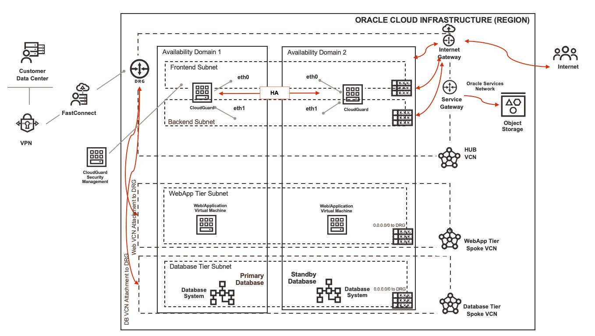

# Introduction

Oracle Cloud Infrastructure is responsible for securing the infrastructure that runs all the services offering by Oracle Cloud Infrastructure. This infrastructure is composed of the hardware, software, networking, and facilities that run Oracle Cloud Infrastructure services. Customer's responsibility is tied to which service they select on Oracle Cloud Infrastructure. Since its a shared security model, it becomes critical to secure your workloads. In this workshop you will be using OCI's partner Check Point's CloudGuard solution to secure your workloads.

This workshop will cover automated and step-by-step (manual) approaches which you can follow to deploy your required components on Oracle Cloud Infrastructure with Check Point solution.

Since you will be using OCI Marketplace's product (CloudGuard) so make sure you have access to minimum **BYOL Listings** available on Oracle Cloud Infrastructure Marketplace. You can also deploy **PAID Listing** which gives you access to active license.

## CloudGuard Solution

Oracle Cloud Infrastructure's partner Check Point's **CloudGuard** solution is available on OCI Marketplace. You can use this solution with different use-cases to secure your workloads. In this workshop we will cover High-Availability use-case where you can deploy the solution in active-passive mode and secure the workloads using **CloudGuard(s)**.

Attached below is a sample architecture of the solution:

   

Estimated time: 120 minutes

### Objectives

   - Provision the infrastructure using Oracle Resource Manager i.e. Terraform
   - Provision and configure the infrastructure manually
   - Learn to Deploy CloudGuard instances using marketplace i.e. partner images
   - Configure CloudGuard Firewalls to support active-passive use-case
   - Validate and inspect the traffic via CloudGuard Firewalls
   - Destroy the infrastructure using Oracle Resource Manager or Manually.

### Prerequisites

   - Oracle Cloud Infrastructure paid account credentials (User, Password, Tenant, and Compartment)

   **PLEASE READ**: You must have a valid **Oracle Cloud Infrastructure paid account** which allows you to access at a minimum **BYOL** Marketplace listing.

   **Getting Started** section includes instructions to create a new free trial account, please convert that account as pay you go so you can consume marketplace listings.

   - Access to below Oracle Cloud Marketplace **BYOL** listings.
      - **CloudGuard Security Management**
      - **CloudGuard Next-Gen Firewall with Threat Prevention and SandBlast**

### Comments

Oracle Cloud Infrastructure now supports **Intra VCN routing capabilities** which gives us the simplicity of configuring routing to support OCI workload traffic within VCNs and you can also use a Firewall to inspect/secure your traffic. 

- **Intra-VCN Routing**: Allows you to control routing for intra-VCN traffic and you are able to define subnet level routes.
- **IGW/NATGW Ingress Routing**: Allows definition of routes for inbound public traffic to the VCN towards a user-selected next-hop.
- **SGW Ingress Routing enhancement**: Allows you to define your own routes for SGW to route traffic from OCI services to destinations inside your VCN

You can learn more about **Intra VCN Routing** [here](https://docs.oracle.com/en-us/iaas/Content/Network/Tasks/managingroutetables.htm#:~:text=Intra%2DVCN%20routing%20allows%20you,route%20for%20the%20VCN%20CIDR.), this workshop can be referred and implment your use-case as needed.

Let's get started!

## Learn More

1. [OCI Training](https://www.oracle.com/cloud/iaas/training/)
2. [Familiarity with OCI console](https://docs.us-phoenix-1.oraclecloud.com/Content/GSG/Concepts/console.htm)
3. [Overview of Networking](https://docs.us-phoenix-1.oraclecloud.com/Content/Network/Concepts/overview.htm)
4. [Overview of Marketplace Applications](https://docs.oracle.com/en-us/iaas/Content/Marketplace/Concepts/marketoverview.htm)
5. [OCI CloudGuard Deployment Guide](https://supportcenter.checkpoint.com/supportcenter/portal?eventSubmit_doGoviewsolutiondetails=&solutionid=sk142872)

## Acknowledgements

- **Author** - Arun Poonia, Principal Solutions Architect
- **Adapted by** - Check Point
- **Contributors** - N/A
- **Last Updated By/Date** - Arun Poonia, Oct 2022
