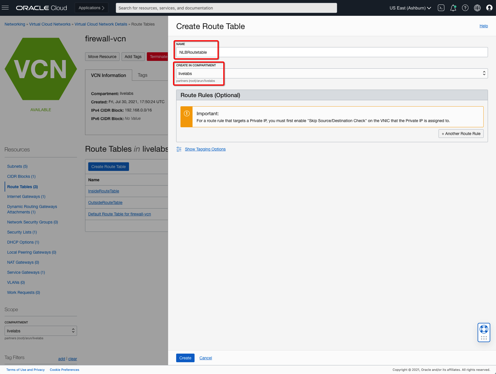
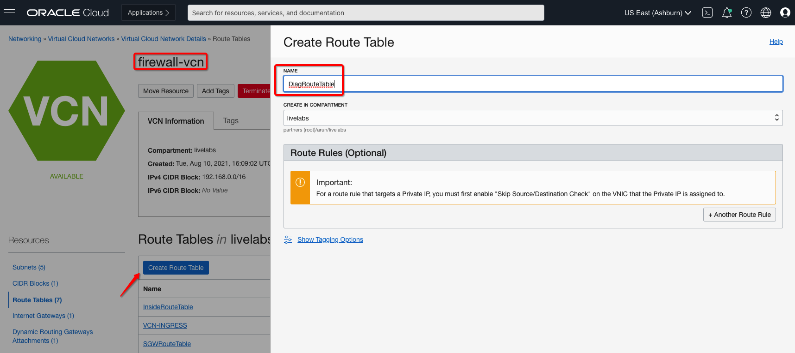

# Configure Required Oracle Cloud Infrastructure Components

## Introduction

In this lab you will be creating required virtual cloud networks (VCNs), subnets in each VCN, dynamic routing gateways (DRG), route tables and spoke VCNs compute instances to support traffic between VCNs.

Estimated Lab Time: 30 minutes.

### Objectives
- Demonstrate launching Hub VCN and supporting configuration 
- Demonstrate launching Web VCN and supporting configuration 
- Demonstrate launching DB VCN and supporting configuration 
- Demonstrate launching Dynamic Routing Gateways and supporting configuration
- Demonstrate launching Route Tables on each VCNs and supporting configuration
- Launch Compute Instances in each Web and DB VCNs

### Prerequisites

- Oracle Cloud Infrastructure paid account credentials (User, Password, Tenant, and Compartment)  

## **Task 1: Configure Hub VCN**

1. From the OCI Services menu, click **Virtual Cloud Networks** under **Networking**. Select your region on right part of the screen:

   

2. Below table represents what you will be creating. Click on **Create VCN** icon to create new **Virtual Cloud Network**:

      | VCN Name                              | VCN CIDR       | Comment                                                    |
      |---------------------------------------|----------------|------------------------------------------------------------|
      | firewall-vcn                          | 192.168.0.0/16 | Hub Virtual Cloud Networks; Firewalls will be part of this |
      
   

3. Fill out the dialog box:

      - **VCN NAME**: Provide a name
      - **COMPARTMENT**: Ensure your compartment is selected
      - **VCN CIDR BLOCK**: Provide a CIDR block (192.168.0.0/16)

   

4. Verify all the information and Click **Create VCN**.

5. This will create a VCN with following components.

    *VCN, Default Route Tables, Default Security List*

6. Click **View Virtual Cloud Network** you just created to display your VCN details.

7. Create a public **mgmt-subnet** subnet which will support management interfaces to CloudGuard(s). Below table represents what you will be creating in **firewall-vcn**: 

      | Name        | Type     | CIDR           | Access | Route Table         | DHCP Options         | Security List         |
      |-------------|----------|----------------|--------|---------------------|----------------------|-----------------------|
      | mgmt-subnet | Regional | 192.168.1.0/24 | Public | Default Route Table | Default DHCP Options | Default Security List |

8. Click on **Create Subnet** on **firewall-vcn** Virtual Cloud Network Details page and fill out the dialog box: 

      - **Subnet NAME**: Provide a name
      - **COMPARTMENT**: Ensure your compartment is selected
      - **Subnet Type**: Regional Subnet Type is selected
      - **CIDR Block**:  Unique CIDR within the range of your VCN CIDR block.
      - **Route Table**: Default Route Table in your Case.
      - **Subnet Access**: Public in your case.
      - **DHCP Options**: Default DHCP Options in your case.
      - **Security List**: Default Security List in your case.

   

9. Verify all the information and Click **Create Subnet**.

10. This will create a Subnet with following components.

    *mgmt-subnet Subnet*

11. Create a private **diag-subnet** subnet which will support diagnostic interfaces to Secure Firewall VMs. Below table represents what you will be creating in **firewall-vcn**: 

      | Name         | Type     | CIDR           | Access  | Route Table         | DHCP Options         | Security List         |
      |--------------|----------|----------------|---------|---------------------|----------------------|-----------------------|
      | diag-subnet  | Regional | 192.168.2.0/24 | Private | Default Route Table | Default DHCP Options | Default Security List |

12. Click on **Create Subnet** on **firewall-vcn** Virtual Cloud Network Details page and fill out the dialog box: 

      - **Subnet NAME**: Provide a name
      - **COMPARTMENT**: Ensure your compartment is selected
      - **Subnet Type**: Regional Subnet Type is selected
      - **CIDR Block**:  Unique CIDR within the range of your VCN CIDR block.
      - **Route Table**: Default Route Table in your Case.
      - **Subnet Access**: Private in your case.
      - **DHCP Options**: Default DHCP Options in your case.
      - **Security List**: Default Security List in your case.

   

13. Verify all the information and Click **Create Subnet**.

14. This will create a Subnet with following components.

    *diag-subnet Subnet*

15. Create a private **inside-subnet** subnet which will support inside interfaces to Secure Firewall VMs. Below table represents what you will be creating in **firewall-vcn**: 

      | Name           | Type     | CIDR           | Access  | Route Table         | DHCP Options         | Security List         |
      |----------------|----------|----------------|---------|---------------------|----------------------|-----------------------|
      | inside-subnet  | Regional | 192.168.3.0/24 | Private | Default Route Table | Default DHCP Options | Default Security List |

16. Click on **Create Subnet** on **firewall-vcn** Virtual Cloud Network Details page and fill out the dialog box: 

      - **Subnet NAME**: Provide a name
      - **COMPARTMENT**: Ensure your compartment is selected
      - **Subnet Type**: Regional Subnet Type is selected
      - **CIDR Block**:  Unique CIDR within the range of your VCN CIDR block.
      - **Route Table**: Default Route Table in your Case.
      - **Subnet Access**: Private in your case.
      - **DHCP Options**: Default DHCP Options in your case.
      - **Security List**: Default Security List in your case.

   

17. Verify all the information and Click **Create Subnet**.

18. This will create a Subnet with following components.

    *inside-subnet Subnet*

19. Create a public **outside-subnet** subnet which will support outside interfaces to Secure Firewall VMs which allows inbound connection from outside as well as towards internet from inside. Below table represents what you will be creating in **firewall-vcn**: 

      | Name           | Type     | CIDR           | Access  | Route Table         | DHCP Options         | Security List         |
      |----------------|----------|----------------|---------|---------------------|----------------------|-----------------------|
      | outside-subnet | Regional | 192.168.4.0/24 | Public  | Default Route Table | Default DHCP Options | Default Security List |

20. Click on **Create Subnet** on **firewall-vcn** Virtual Cloud Network Details page and fill out the dialog box: 

      - **Subnet NAME**: Provide a name
      - **COMPARTMENT**: Ensure your compartment is selected
      - **Subnet Type**: Regional Subnet Type is selected
      - **CIDR Block**:  Unique CIDR within the range of your VCN CIDR block.
      - **Route Table**: Default Route Table in your Case.
      - **Subnet Access**: Public in your case.
      - **DHCP Options**: Default DHCP Options in your case.
      - **Security List**: Default Security List in your case.

   

21. Verify all the information and  Click **Create Subnet**.

22. This will create a Subnet with following components.

    *outside-subnet Subnet*

23. Create a public **nlb-subnet** subnet which will support flexible network load balancer configuration for private as well as public to Secure Firewall VMs. Below table represents what you will be creating in **firewall-vcn**: 

      | Name       | Type     | CIDR           | Access  | Route Table          | DHCP Options         | Security List         |
      |------------|----------|----------------|---------|----------------------|----------------------|-----------------------|
      | nlb-subnet | Regional | 192.168.5.0/24 | Private  | Default Route Table | Default DHCP Options | Default Security List |

24. Click on **Create Subnet** on **firewall-vcn** Virtual Cloud Network Details page and fill out the dialog box: 

      - **Subnet NAME**: Provide a name
      - **COMPARTMENT**: Ensure your compartment is selected
      - **Subnet Type**: Regional Subnet Type is selected
      - **CIDR Block**:  Unique CIDR within the range of your VCN CIDR block.
      - **Route Table**: Default Route Table in your Case.
      - **Subnet Access**: Private in your case.
      - **DHCP Options**: Default DHCP Options in your case.
      - **Security List**: Default Security List in your case.

   

25. Verify all the information and  Click **Create Subnet**.

26. This will create a Subnet with following components.

    *nlb-subnet Subnet*

23. Create a Internet Gateway for **Firewall VCN**. Below table represents what you will be creating on **Internet Gateway**: 

      | Name            |
      |-----------------|
      | internet-gateway |

23. Click on **Create Internet Gateway** on **firewall-vcn**; details page > internet Gateway and fill out the dialog box: 

      - **NAME**: Provide a name
      - **COMPARTMENT**: Ensure your compartment is selected

   

24. Verify all the information and Click **Create Internet Gateway**.

25. This will create a Internet Gateway in your Firewall VCN with following components.

    *internet-gateway Internet Gateway*

26. Create a Service Gateway for **Firewall VCN**. Below table represents what you will be creating on **Service Gateway**: 

      | Name            | Services                                       |
      |-----------------|------------------------------------------------|
      | service-gateway | All Region Services in Oracle Services Network |

27. Click on **Create Service Gateway** on **firewall-vcn** Details page > Service Gateway and fill out the dialog box: 

      - **NAME**: Provide a name
      - **COMPARTMENT**: Ensure your compartment is selected
      - **Services**: Select appropriate services

   

28. Verify all the information and Click **Create Service Gateway**.

29. This will create a Service Gateway in your Firewall VCN with following components.

    *service-gateway Service Gateway*

## **Task 2: Configure Web VCN**

1. From the OCI Services menu, click **Virtual Cloud Networks** under **Networking**. Select your region on right part of the screen:

   

2. Below table represents what you will be creating. Click on **Create VCN** icon to create new **Virtual Cloud Network**:

      | VCN Name                              | VCN CIDR       | Comment                                                    |
      |---------------------------------------|----------------|------------------------------------------------------------|
      | web-vcn                               | 10.0.0.0/24    | Web Virtual Cloud Networks; Web VMs will be present here   |
      
   

3. Fill out the dialog box:

      - **VCN NAME**: Provide a name
      - **COMPARTMENT**: Ensure your compartment is selected
      - **VCN CIDR BLOCK**: Provide a CIDR block (10.0.0.0/24)

   

4. Verify all the information and Click **Create VCN**.

5. This will create a VCN with following components.

    *Web-VCN, Default Route Tables, Default Security List*

6. Click **View Virtual Cloud Network** you just created to display your VCN details.

7. Create a private **application-private** subnet which will host Web VMs/Applications. Below table represents what you will be creating in **web-vcn**: 

      | Name                | Type     | CIDR          | Access  | Route Table         | DHCP Options         | Security List         |
      |---------------------|----------|---------------|---------|---------------------|----------------------|-----------------------|
      | application-private | Regional | 10.0.0.0/25   | Private | Default Route Table | Default DHCP Options | Default Security List |

8. Click on **Create Subnet** on **web-vcn** Virtual Cloud Network Details page and fill out the dialog box: 

      - **Subnet NAME**: Provide a name
      - **COMPARTMENT**: Ensure your compartment is selected
      - **Subnet Type**: Regional Subnet Type is selected
      - **CIDR Block**:  Unique CIDR within the range of your VCN CIDR block.
      - **Route Table**: Default Route Table in your Case.
      - **Subnet Access**: Private in your case.
      - **DHCP Options**: Default DHCP Options in your case.
      - **Security List**: Default Security List in your case.

   

9. Verify all the information and Click **Create Subnet**.

10. This will create a Subnet with following components.

    *application-private Subnet*

## **Task 3: Configure DB VCN**

1. From the OCI Services menu, click **Virtual Cloud Networks** under **Networking**. Select your region on right part of the screen:

   

2. Below table represents what you will be creating. Click on **Create VCN** icon to create new **Virtual Cloud Network**:

      | VCN Name                              | VCN CIDR       | Comment                                                         |
      |---------------------------------------|----------------|-----------------------------------------------------------------|
      | db-vcn                                | 10.0.1.0/24    | DB Virtual Cloud Networks; DB Systems/VMs will be present here  |

   

3. Fill out the dialog box:

      - **VCN NAME**: Provide a name
      - **COMPARTMENT**: Ensure your compartment is selected
      - **VCN CIDR BLOCK**: Provide a CIDR block (10.0.1.0/24)

   

4. Verify all the information and Click **Create VCN**.

5. This will create a VCN with following components.

    *DB-VCN, Default Route Tables, Default Security List*

6. Click **View Virtual Cloud Network** you just created to display your VCN details.

7. Create a private **Database** subnet which will host Database Applications/Hosts. Below table represents what you will be creating in **db-vcn**: 

      | Name             | Type     | CIDR          | Access  | Route Table         | DHCP Options         | Security List         |
      |------------------|----------|---------------|---------|---------------------|----------------------|-----------------------|
      | database-private | Regional | 10.0.1.0/25   | Private | Default Route Table | Default DHCP Options | Default Security List |

8. Click on **Create Subnet** on **db-vcn** Virtual Cloud Network Details page and fill out the dialog box: 

      - **Subnet NAME**: Provide a name
      - **COMPARTMENT**: Ensure your compartment is selected
      - **CIDR Block**:  Unique CIDR within the range of your VCN CIDR block.
      - **Route Table**: Default Route Table in your Case.
      - **Subnet Access**: Private in your case.
      - **DHCP Options**: Default DHCP Options in your case.
      - **Security List**: Default Security List in your case.

   

9. Verify all the information and Click **Create Subnet**.

10. This will create a Subnet with following components.

    *database-private Subnet*

## **Task 4: Configure Dynamic Routing Gateway**

1. From the OCI Services menu, click **Dynamic Routing Gateways** under **Networking**. Select your region on right part of the screen:

   

2. Below table represents what you will be creating. Click on **Create Dynamic Routing Gateway** icon to create new **Dynamic Routing Gateway**:

      | Name         |
      |--------------|
      | firewall-drg |
      
   

3. Fill out the dialog box:

      - **DRG NAME**: Provide a name
      - **COMPARTMENT**: Ensure your compartment is selected

   

4. Verify all the information and Click **Create Dynamic Routing Gateway**.

5. This will create a VCN with following components.

    *DRG, Default Route Tables, Default Import and Export Route Distribution*

6. Click **DRG** you just created to display your DRG details.

7. Create a Virtual Cloud Network Attachment for **Firewall VCN**. Below table represents what you will be creating on **DRG VCN Attachments**: 

      | Name         | Virtual Cloud Network | DRG Route Table                                   |
      |--------------|-----------------------|---------------------------------------------------|
      | Firewall_VCN | firewall-vcn          | Autogenerated Drg Route Table for VCN Attachments |

8. Click on **Create Virtual Cloud Network Attachment** on **firewall-drg** details page and fill out the dialog box: 

      - **Attachment NAME**: Provide a name
      - **COMPARTMENT**: Ensure your compartment is selected
      - **DRG Route Table**:  Select default value as you will be updating route table in this lab.

   

9. Verify all the information and Click **Create Virtual Cloud Network Attachment**.

10. This will create a Virtual Cloud Network Attachment to your Dynamic Routing Gateway with following components.

    *Firewall_VCN VCN Attachment*

11. Create a Virtual Cloud Network Attachment for **Web VCN**. Below table represents what you will be creating on **DRG VCN Attachments**: 

      | Name         | Virtual Cloud Network | DRG Route Table                                   |
      |--------------|-----------------------|---------------------------------------------------|
      | Web_VCN      | web-vcn               | Autogenerated Drg Route Table for VCN Attachments |

12. Click on **Create Virtual Cloud Network Attachment** on **firewall-drg** Details page and fill out the dialog box: 

      - **Attachment NAME**: Provide a name
      - **COMPARTMENT**: Ensure your compartment is selected
      - **DRG Route Table**:  Select default value as you will be updating route table in this lab.

   

13. Verify all the information and Click **Create Virtual Cloud Network Attachment**.

14. This will create a Virtual Cloud Network Attachment to your Dynamic Routing Gateway with following components.

    *Web_VCN VCN Attachment*

15. Create a Virtual Cloud Network Attachment for **DB VCN**. Below table represents what you will be creating on **DRG VCN Attachments**: 

      | Name         | Virtual Cloud Network | DRG Route Table                                   |
      |--------------|-----------------------|---------------------------------------------------|
      | DB_VCN       | db-vcn                | Autogenerated Drg Route Table for VCN Attachments |

16. Click on **Create Virtual Cloud Network Attachment** on **firewall-drg** details page and fill out the dialog box: 

      - **Attachment NAME**: Provide a name
      - **COMPARTMENT**: Ensure your compartment is selected
      - **DRG Route Table**:  Select default value as you will be updating route table in this lab.

   

17. Verify all the information and Click **Create Virtual Cloud Network Attachment**.

18. This will create a Virtual Cloud Network Attachment to your Dynamic Routing Gateway with following components.

    *DB_VCN VCN Attachment*

19. Create a **To-Firewal** Route Table for **Web and DB VCNs** traffic which should go to **Firewall VCN**. Below table represents what you will be creating on **DRG Route Table**: 

      | Name        | Destination CIDR | Next Hop Attachment Type | Next Hop Attachment |
      |-------------|------------------|--------------------------|---------------------|
      | To-Firewall | 0.0.0.0/0        | Virtual Cloud Network    | Firewall_VCN        |

20. Click on **Create DRG Route Table** on **firewall-drg** Details page and fill out the dialog box: 

      - **Route Table NAME**: Provide a name
      - **COMPARTMENT**: Ensure your compartment is selected
      - **Destination CIDR**:  Enter 0.0.0.0/0 so all traffic from Web and DB VCNs goes to Firewall VCN for inspection. 
      - **Next Hop Attachment Type**:  Select Virtual Cloud Network type. 
      - **Next Hop Attachment**:  Select Firewall_VCN attachment created earlier from drop-down

   

21. Verify all the information and Click **Create DRG Route Table**.

22. This will create a DRG Route Table to your Dynamic Routing Gateway with following components.

    *To-Firewall DRG Route Table*

23. Create a **From-Firewall** Route Table for **Firewall VCN** traffic which should go to respective **DB and Web VCNs**. Below table represents what you will be creating on **DRG Route Table**: 

      | Name          | 
      |---------------|
      | From-Firewall |

24. Click on **Create DRG Route Table** on **firewall-drg** Details page and fill out the dialog box: 

      - **Route Table NAME**: Provide a name
      - **COMPARTMENT**: Ensure your compartment is selected

   

25. Verify all the information and Click **Create DRG Route Table**.

26. This will create a DRG Route Table to your Dynamic Routing Gateway with following components.

    *From-Firewall DRG Route Table*

27. Attach **From-Firewall** route table to **Firewall VCN** attachment on Dynamic Routing Gateway. Click on **Firewall_VCN** and click **Edit** button to update route table. 

   

28. Click on **Show Advanced Options** next to Edit Attachment Dialog box and select **From-Firewall** route table from **DRG Route Table** and **Save Changes**

   

27. Attach **To-Firewall** route table to **Web VCN** attachment on Dynamic Routing Gateway. Click on **Web_VCN** and click **Edit** button to update route table. 

   

28. Click on **Show Advanced Options** next to Edit Attachment Dialog box and select **To-Firewall** route table from **DRG Route Table** and **Save Changes**

   

27. Attach **To-Firewall** route table to **DB VCN** attachment on Dynamic Routing Gateway. Click on **DB_VCN** and click **Edit** button to update route table. 

   

28. Click on **Show Advanced Options** next to Edit Attachment Dialog box and select **To-Firewall** route table from **DRG Route Table** and **Save Changes**

   

29. Create **Import Route Distribution** for each DB and Web VCNs on Dynamic Routing Gateway. Below table represents what you will be creating on **Import Route Distribution Entries**: 

   | Priority | Match Type | Attachment Type Filter | DRG Attachment | Action |
   |----------|------------|------------------------|----------------|--------|
   | 1        | Attachment | Virtual Cloud Network  | Web_VCN        | ACCEPT |
   | 2        | Attachment | Virtual Cloud Network  | DB_VCN         | ACCEPT |

30. Click on **Create Import Route Distribution** on **firewall-drg** Details/Import Route Distribution page and fill out the dialog box: 

      - **Route Distribution NAME**: Provide a name
      - **COMPARTMENT**: Ensure your compartment is selected
      - **Add Statement**: Add two Statement here for each VCN
         - **First Statement**
            - **Priority**: Enter priority value; in your case 1 
            - **Match Type**: Select Attachment as type
            - **Attachment Type Filter**: Select Virtual Cloud Network from dropdown
            - **VCN Attachment**: Select Web_VCN from dropdown
            - **Action**: Default Value as ACCEPT
         - **Second Statement**
            - **Priority**: Enter priority value; in your case 1 
            - **Match Type**: Select Attachment as type
            - **Attachment Type Filter**: Select Virtual Cloud Network from dropdown
            - **VCN Attachment**: Select DB_VCN from dropdown
            - **Action**: Default Value as ACCEPT        

   

31. Verify all the information and Click **Create Import Route Distribution**.

32. This will create an Import Route Distribution to your Dynamic Routing Gateway with following components.

    *Transit-Spokes Import Route Distribution*

33. Attach **Transit-Spokes** import route redistribution to **Firewall VCN** attachment on Dynamic Routing Gateway. Click on **From-Firewall** drg route table and click **Edit** button to update route table. 

34. Select **Enable Route Distribution** and from drop down in dialog box select **Transit Spokes** import route distribution. Complete your change by clicking **Save Changes**

   

35. This will update import route distribution to **From-Firewall** route table attached to **Firewall VCN**

## **Task 5: Configure Route Tables in each VCNs**

1. From the OCI Services menu, click **Virtual Cloud Networks** under **Networking**. Select your region on right part of the screen:

   

2. Select **web-vcn** which you created earlier. You will be updating default route table within this VCN. Make sure you choose right Compartment from drop down on your left screen **COMPARTMENT** section. 

3. Navigate to **Default Route Table for web-vcn** on your Virtual Cloud Networks Details >> Route Tables page. You will be adding a new route table entry based on below table: 

   | Target Type             | Destination CIDR Block | Description                      | Comment                                                                                             |
   |-------------------------|------------------------|----------------------------------|-----------------------------------------------------------------------------------------------------|
   | Dynamic Routing Gateway | 0.0.0.0/0              | SendTrafficToFirewallsThroughDRG | For Test Purpose you are sending all traffic; In Production send only required traffic to Firewalls |

4. Click on **Add Route Rules** on **Default Route Table for web-vcn** route table; Virtual Cloud Networks Details >> Route Table page and fill out the dialog box: 

      - **Target Type**: Select Dynamic Routing Gateway; earlier created dynamic routing gateway **firewall-drg** will reflect automatically due to VCN attachment. 
      - **Destination CIDR Block**:  Enter Destination CIDR block which you want to inspect; 0.0.0.0/0 in our case.
      - **Description**:  Enter a user-Friendly Description 

   

5. Verify all the information and Click **Add Route Rules**.

6. This will update Default Route Table for web-vcn with following components.

    *Updated Default Route Table for web-vcn with DRG entry*

7. Go back to **web-vcn** and select Security Lists under Resources section. Navigate to **Default Security Lists for web-vcn**. You will be updating ingress rules in your security list based on below table: 

   | Source Type | Source CIDR | IP Protocol           | Description |
   |-------------|-------------|-----------------------|-------------|
   | CIDR        | 0.0.0.0/0   | All Protocols         | AllowAll    |

8. Click on **Add Ingress Rules** on **Default Security Lists for web-vcn** and fill out the dialog box: 

      - **Source Type**:  Select Type as **CIDR**
      - **Source CIDR**:  Enter Destination CIDR block which you want to inspect; 0.0.0.0/0 in our case.
      - **IP Protocol**:  Enter a user-Friendly Description 
      - **Description**:  Enter a user-Friendly Description 

   

9. Verify all the information and Click **Add Ingress Rules**.

10. This will update Default Route Table for web-vcn with following components.

    *Updated Default Security Lists for web-vcn with Allow All IP Protocols entry*

11. Go back to Virtual Cloud Networks home page and select **db-vcn** which you created earlier. You will be updating default route table within this VCN. Make sure you choose right Compartment from drop down on your left screen **COMPARTMENT** section. 

12. Navigate to **Default Route Table for db-vcn** on your Virtual Cloud Networks Details >> Route Tables page. You will be adding a new route table entry based on below table: 

   | Target Type             | Destination CIDR Block | Description                      | Comment                                                                                             |
   |-------------------------|------------------------|----------------------------------|-----------------------------------------------------------------------------------------------------|
   | Dynamic Routing Gateway | 0.0.0.0/0              | SendTrafficToFirewallsThroughDRG | For Test Purpose you are sending all traffic; In Production send only required traffic to Firewalls |

13. Click on **Add Route Rules** on **Default Route Table for db-vcn** route table; Virtual Cloud Networks Details >> Route Table page and fill out the dialog box: 

      - **Target Type**: Select Dynamic Routing Gateway; earlier created dynamic routing gateway **firewall-drg** will reflect automatically due to VCN attachment. 
      - **Destination CIDR Block**:  Enter Destination CIDR block which you want to inspect; 0.0.0.0/0 in our case.
      - **Description**:  Enter a user-Friendly Description 

   

14. Verify all the information and Click **Add Route Rules**.

15. This will update Default Route Table for db-vcn with following components.

    *Updated Default Route Table for db-vcn with DRG entry*

16. Go back to **db-vcn** and select Security Lists under Resources section. Navigate to **Default Security Lists for web-vcn**. You will be updating ingress rules in your security list based on below table: 

   | Source Type | Source CIDR | IP Protocol           | Description |
   |-------------|-------------|-----------------------|-------------|
   | CIDR        | 0.0.0.0/0   | All Protocols         | AllowAll    |

17. Click on **Add Ingress Rules** on **Default Security Lists for db-vcn** and fill out the dialog box: 

      - **Source Type**:  Select Type as **CIDR**
      - **Source CIDR**:  Enter Destination CIDR block which you want to inspect; 0.0.0.0/0 in our case.
      - **IP Protocol**:  Enter a user-Friendly Description 
      - **Description**:  Enter a user-Friendly Description 

   

18. Verify all the information and Click **Add Ingress Rules**.

19. This will update Default Route Table for db-vcn with following components.

    *Updated Default Security Lists for db-vcn with Allow All IP Protocols entry*

20. Go back to Virtual Cloud Networks home page and select **firewall-vcn** which you created earlier. You will be creating few route tables associated to each subnet within this VCN. Make sure you choose right Compartment from drop down on your left screen **COMPARTMENT** section. 

21. Navigate to **Default Route Table for firewall-vcn** on your Virtual Cloud Networks Details >> Route Tables page. You will be adding a new route table entry based on below table: 

   | Target Type             | Destination CIDR Block | Description                      | Comment                                                                                             |
   |-------------------------|------------------------|----------------------------------|-----------------------------------------------------------------------------------------------------|
   | Internet Gateway | 0.0.0.0/0              | InternetTraffic | For management, outside interfaces public connection you need internet connectivity |

22. Click on **Add Route Rules** on **Default Route Table for firewall-vcn** route table; Virtual Cloud Networks Details >> Route Table page and fill out the dialog box: 

      - **Target Type**: Select Internet Gateway; earlier created internet gateway **internet-gateway** will be reflect automatically.
      - **Destination CIDR Block**:  Enter Destination CIDR block which you want to inspect; 0.0.0.0/0 in our case.
      - **Description**:  Enter a user-Friendly Description 

   

23. Verify all the information and Click **Add Route Rules**.

24. This will update Default Route Table for firewall-vcn with following components.

    *Updated Default Route Table for firewall-vcn with Internet Gateway entry*

25. Click on **Create Route Table** on **Route Tables** resources under **firewall-vcn** section. You will be creating a placeholder for **outside-subnet** route table. Fill out the dialog box: 

      - **NAME**: Provide a name; In your case **OutsideRouteTable**
      - **COMPARTMENT**: Ensure your compartment is selected

   

26. Verify all the information and Click **Create**.

27. This will create Outside Route Table for firewall-vcn with following components.

    *Created Outside Route table for firewall-vcn*

28. Click on **Create Route Table** on **Route Tables** resources under **firewall-vcn** section. You will be creating a placeholder for **inside-subnet** route table. Fill out the dialog box: 

      - **NAME**: Provide a name; In your case **InsideRouteTable**
      - **COMPARTMENT**: Ensure your compartment is selected

   

29. Verify all the information and Click **Create**.

30. This will create Inside Route Table for firewall-vcn with following components.

    *Created Inside Route table for firewall-vcn*

31. Click on **Create Route Table** on **Route Tables** resources under **firewall-vcn** section. You will be creating a placeholder for **nlb-subnet** route table. Fill out the dialog box: 

      - **NAME**: Provide a name; In your case **NLBRouteTable**
      - **COMPARTMENT**: Ensure your compartment is selected

   

32. Verify all the information and Click **Create**.

33. This will create NLB Route Table for firewall-vcn with following components.

    *Created NLB Route table for firewall-vcn*
   
34. Click on **Create Route Table** on **Route Tables** resources under **firewall-vcn** section. You will be creating a placeholder for firewall-vcn attachment ingress route table. Fill out the dialog box: 

      - **NAME**: Provide a name; In your case **VCN-INGRESS**
      - **COMPARTMENT**: Ensure your compartment is selected

   

35. Verify all the information and Click **Create**.

36. This will create VCN-INGRESS Route Table for firewall-vcn with following components.

    *Created VCN INGRESS Route table for firewall-vcn*

37. Click on **Create Route Table** on **Route Tables** resources under **firewall-vcn** section. You will be creating a placeholder for **diag-subnet** route table. Fill out the dialog box: 

      - **NAME**: Provide a name; In your case **DiagRouteTable**
      - **COMPARTMENT**: Ensure your compartment is selected

   

38. Verify all the information and Click **Create**.

39. This will create Diag Route Table for firewall-vcn with following components.

    *Created Diag Route table for firewall-vcn*

40. Click on **Create Route Table** on **Route Tables** resources under **firewall-vcn** section. You will be creating a placeholder for **service-gateway** route table. Fill out the dialog box: 

      - **NAME**: Provide a name; In your case **SGWRouteTable**
      - **COMPARTMENT**: Ensure your compartment is selected

   

41. Verify all the information and Click **Create**.

42. This will create SGW Route Table for firewall-vcn with following components.

    *Created SGW Route table for firewall-vcn*

43. Go back to **firewall-vcn** and select Security Lists under Resources section. Navigate to **Default Security Lists for firewall-vcn**. You will be updating ingress rules in your security list based on below table: 

   | Source Type | Source CIDR | IP Protocol           | Description |
   |-------------|-------------|-----------------------|-------------|
   | CIDR        | 0.0.0.0/0   | All Protocols         | AllowAll    |

44. Click on **Add Ingress Rules** on **Default Security Lists for firewall-vcn** and fill out the dialog box: 

      - **Source Type**:  Select Type as **CIDR**
      - **Source CIDR**:  Enter Destination CIDR block which you want to inspect; 0.0.0.0/0 in our case.
      - **IP Protocol**:  Enter a user-Friendly Description 
      - **Description**:  Enter a user-Friendly Description 

   

45. Verify all the information and Click **Add Ingress Rules**.

46. This will update Default Route Table for firewall-vcn with following components.

    *Updated Default Security Lists for firewall-vcn with Allow All IP Protocols entry*

47. Navigate to **firewall-drg** dynamic routing gateway's **Firewall_VCN** attachment to update VCN Route Table. Click on **Edit** icon to update **VCN Route Table** and select **VCN-INGRESS** roite table from drop-down.

   

48. Verify all the information and Click **Save Changes**.

49. This will create add VCN-INGRESS Route Table for **Firewall_VCN** with following components.

    *Added VCN INGRESS Route table for Firewall_VCN attachment*

## **Task 6: Launch Compute instances in Web VCN**

1. Launch **Cloud Shell** by clicking the icon next to region name on top right of OCI console. ('<=' icon)

2. Once cloud Shell is launched. Enter command **ssh-keygen**, press enter for all prompts. This will create a ssh key pair. Enter command.

      ```
      <copy>
      bash
      cd .ssh
      cat id_rsa.pub
      </copy>
      ```
   
   Copy the key displayed. This will be used when creating the compute instance.

3. From OCI services menu, Click **Instances** under **Compute**.
 
4. On the left sidebar, select the **Compartment** in which you placed your VCN under **List Scope**. The, Click **Create Instance**. You will be creating **2** instances as per below table: 

   | Name     | Placement  | Image                 | Shape   | Network | Subnet              | Add SSH-Keys                |
   |----------|------------|-----------------------|---------|---------|---------------------|-----------------------------|
   | web-app1 | AD1        | Default: Oracle Linux | Default | web-vcn | application-private | Yours/CloudShell Public Key |
   | web-app2 | AD2 or AD1 | Default: Oracle Linux | Default | web-vcn | application-private | Yours/CloudShell Public Key |
 
5. Enter a **Name** for your Instance and the **Compartment** in which you placed your **Web VCN**. Fill out the dialog box. Leave **Image or Operating System** and **Availability Domain** as the default values.

6. Leave Shape **Shape** as default value.

7. Scroll Down to **Networking** and verify the following.
      - Your Compartment is selected
      - The VCN created is populated: **Web VCN**
      - The subnet created is populated: **application-private**

8. Ensure **PASTE PUBLIC KEYS** is selected under **Add SSH Keys**. Paste the public key copied earlier.
 
   **NOTE:** If 'Service limit' error is displayed choose a different shape from VM.Standard2.1, VM.Standard.E2.1, VM.Standard1.1, VM.Standard.B1.1 OR choose a different AD.
   **NOTE:** If you already have your ssh-key available you can skip copying from cloud-shell and paste your own public key and use private key associated to that for accessing instance.

9. Click **Create** and wait for Instance to be in **Running** state. 

10. Repeat step 5 to 9 based on the **table** provided in **step 4** for another instance.

## **Task 7: Launch Compute instances in DB VCN**

1. Launch **Cloud Shell** by clicking the icon next to region name on top right of OCI console. ('<=' icon)

2. Once cloud Shell is launched. Enter command **ssh-keygen**, press enter for all prompts. This will create a ssh key pair. Enter command.

      ```
      <copy>
      bash
      cd .ssh
      cat id_rsa.pub
      </copy>
      ```
   
   Copy the key displayed. This will be used when creating the compute instance.

3. From OCI services menu, Click **Instances** under **Compute**.
 
4. On the left sidebar, select the **Compartment** in which you placed your **DB VCN** under **List Scope**. The, Click **Create Instance**. You will be creating **2** instances as per below table: 

   | Name     | Placement  | Image                 | Shape   | Network | Subnet              | Add SSH-Keys                |
   |----------|------------|-----------------------|---------|---------|---------------------|-----------------------------|
   | db-app1  | AD1        | Default: Oracle Linux | Default | db-vcn  | database-private    | Yours/CloudShell Public Key |
   | db-app2  | AD2 or AD1 | Default: Oracle Linux | Default | db-vcn  | database-private    | Yours/CloudShell Public Key |
 
5. Enter a **Name** for your Instance and the **Compartment** in which you placed your **DB VCN**. Fill out the dialog box. Leave **Image or Operating System** and **Availability Domain** as the default values.

6. Leave Shape **Shape** as default value.

7. Scroll Down to **Networking** and verify the following.
      - Your Compartment is selected
      - The VCN created is populated: **Web VCN**
      - The subnet created is populated: **application-private**

8. Ensure **PASTE PUBLIC KEYS** is selected under **Add SSH Keys**. Paste the public key copied earlier.
 
   **NOTE:** If 'Service limit' error is displayed choose a different shape from VM.Standard2.1, VM.Standard.E2.1, VM.Standard1.1, VM.Standard.B1.1 OR choose a different AD.
   **NOTE:** If you already have your ssh-key available you can skip copying from cloud-shell and paste your own public key and use private key associated to that for accessing instance.

9. Click **Create** and wait for Instance to be in **Running** state. 

10. Repeat step 5 to 9 based on the **table** provided in **step 4** for another instance.

11. Verify that required instances in **Web** and **DB** VCNs are in **Running** state. 

   

***Congratulations! You have successfully completed the lab.***

You may now [proceed to the next lab](#next).

## Learn More

1. [OCI Training](https://www.oracle.com/cloud/iaas/training/)
2. [Familiarity with OCI console](https://docs.us-phoenix-1.oraclecloud.com/Content/GSG/Concepts/console.htm)
3. [Overview of Networking](https://docs.us-phoenix-1.oraclecloud.com/Content/Network/Concepts/overview.htm)
4. [Overview of Marketplace Applications](https://docs.oracle.com/en-us/iaas/Content/Marketplace/Concepts/marketoverview.htm)
5. [OCI Cisco Secure Firewall Deployment Guide](https://www.cisco.com/c/en/us/td/docs/security/firepower/quick_start/oci/ftdv-oci-gsg/ftdv-oci-deploy.html)

## Acknowledgements

- **Author** - Arun Poonia, Principal Solutions Architect
- **Adapted by** -  Cisco
- **Contributors** - N/A
- **Last Updated By/Date** - Arun Poonia, Oct 2022