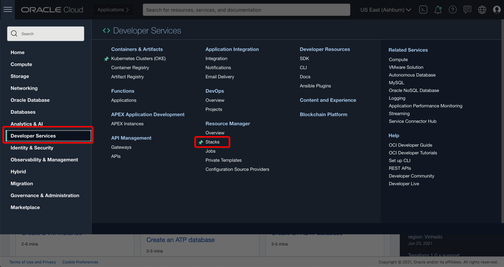
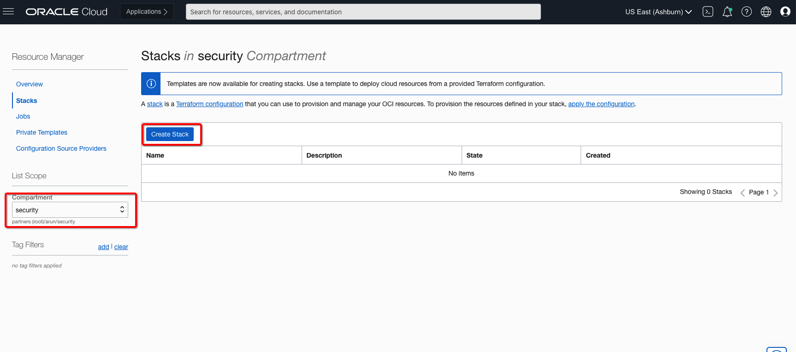
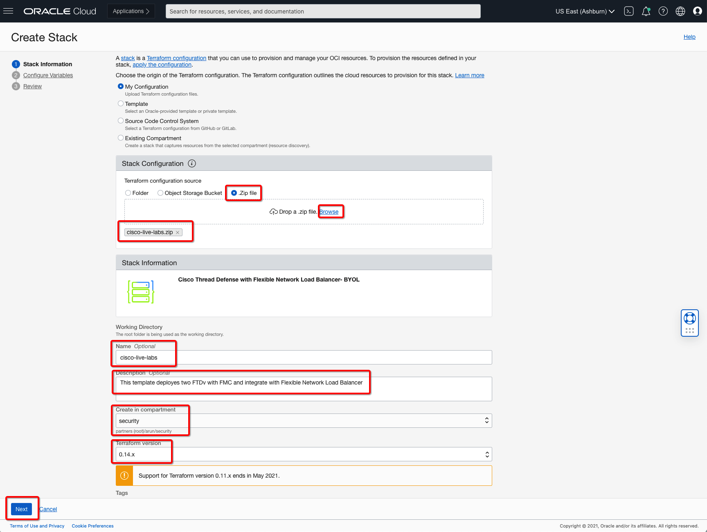
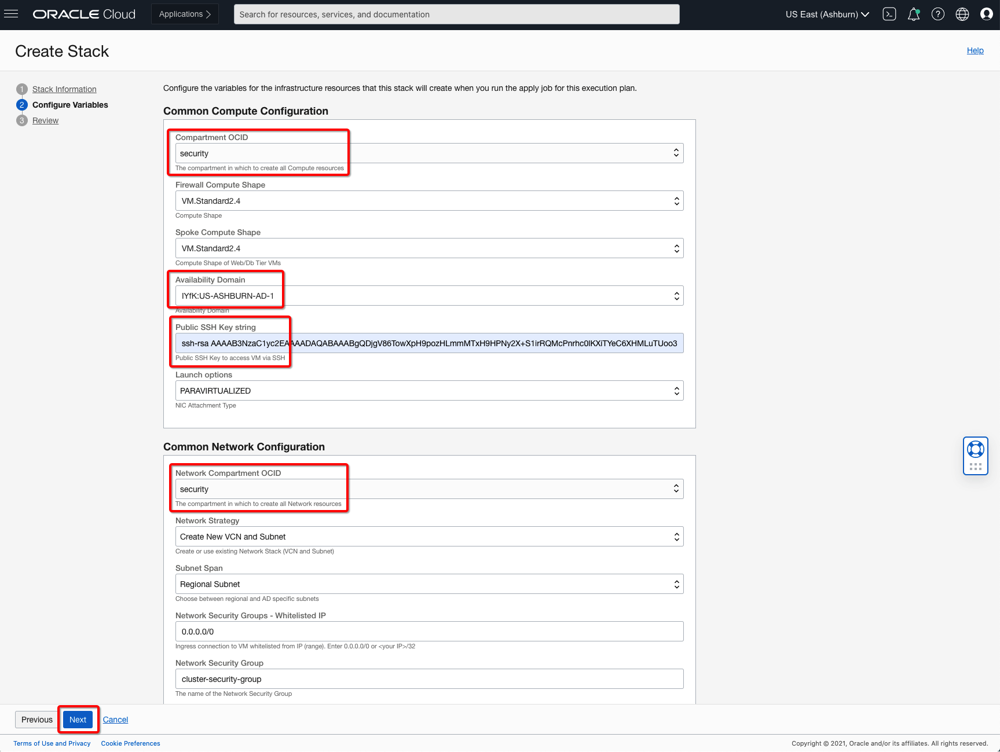
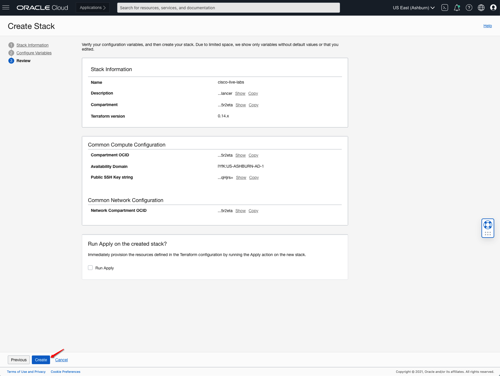
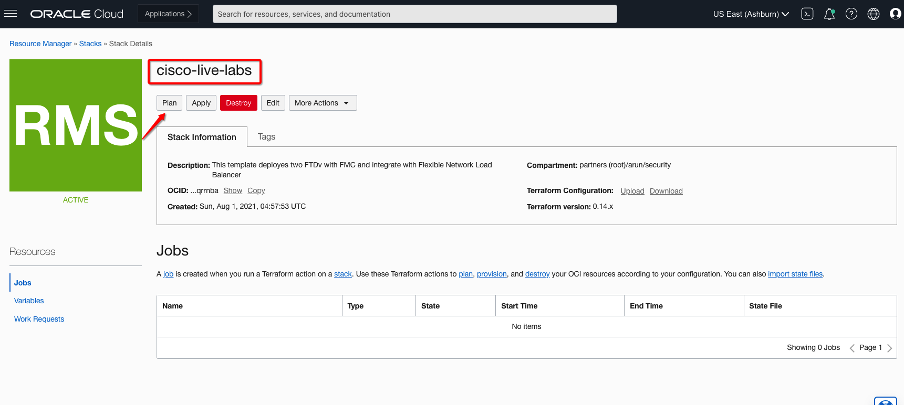
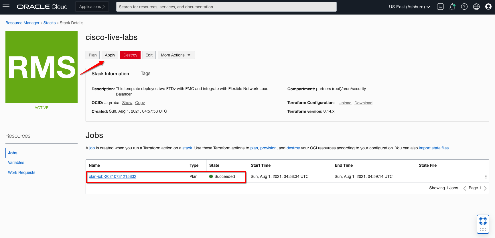
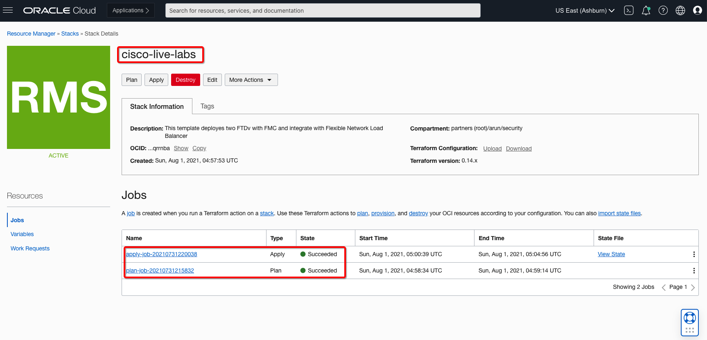
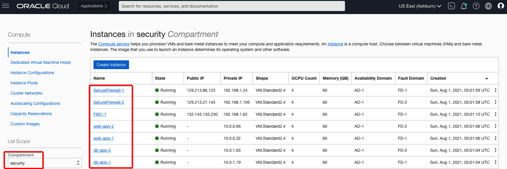

# Deploy Lab using Oracle Resource Manager

## Introduction

In this lab you will be using Oracle Resource Manager to deploy required virtual cloud networks (VCNs), subnets in each VCN, dynamic routing gateways (DRG), route tables, compute instances and Secure Firewall instances to support traffic between VCNs.

**PLEASE READ**: If you wish to deploy the configuration manually, please skip **Lab0** and continue from **Lab1** onwards.

Estimated Lab Time: 10 minutes.

### Objectives

   - Create Stack using Oracle Resource Manager
   - Validate Terraform Plan and Apply
   - Connect to Instances

### Prerequisites

- Oracle Cloud Infrastructure paid account credentials (User, Password, Tenant, and Compartment)
- Access to Oracle Cloud Marketplace **BYOL** listings.
    - **Cisco Firepower Management Center (FMCv)**
    - **Cisco Firepower NGFW virtual firewall (NGFWv)**

## **Task 1: Login and Create Stack using Resource Manager**

You will be using Terraform to create your lab environment.

1.  Click on the link below to download the zip file which you need to build your environment.  

    - Click here: [cisco-live-labs.zip](https://objectstorage.us-ashburn-1.oraclecloud.com/p/vmKa0ecCDEuNwfYrjPsHH5liqhrZUsvr-QOJf6AV0VGviyKsL8PYQ_Q3ClX9LhVc/n/partners/b/files/o/cisco-live-labs.zip) 
        - Packaged terraform **Secure Firewall Active-Active** use-case.
        - **PAR URL** is valid until **Dec, 2025**.

    **Please Read**: You can also download this zip folder locally and update required variables to support your required version/listing of Firewall. 

2.  Save in your local machine's downloads folder.

3.  Open up the hamburger menu in the left-hand corner.  Choose **Developer Services > Stacks**. Click on **Stacks**: 

    

4. Choose the right compartment from left hand side drop-down and appropriate region from top right drop-down and click the **Create Stack** button

    

5.  Select **My Configuration**, choose the **.ZIP FILE** button, click the **Browse** link and select the zip file (cisco-live-labs.zip) that you downloaded. Click **Select**.

    

    Enter the following information and accept all the defaults

    - **Name**: Enter a user-friendly name for your **stack** 

    - **Compartment**: Select the Compartment where you want to create your stack. 

    - **Terraform Version**: Validated version for this stack is **1.0.x**

6.  Click **Next**.

    **Please Read**: You can choose **VM.Standard2.4** shape for firewall Compute Shape until Partner supports flexible shapes and **VM.Standard.E3.Flex** for Spoke Compute Shape.

    

    Enter/Select the following minimum information. Some information may already be pre-populated. Do not change the pre-populated info.

    **Compute Compartment**: Select Compute Compartment from drop-down where you would like to create compute instances.  

    **Availability Domain:** Select Appropriate AD from drop-down. 

    **Public SSH Key**: Paste the public key string which you would like to use to connect VMs via your private-key.

    **Network Compartment**: Select Network Compartment from drop-down where you would like to create networking components i.e. VCN, subnets, route tables, DRG etc. 

    **Note:**: Keep the Network Strategy as **Create New VCN and Subnet** as default value, if you chose to modify the code you can do so to support existing VCN/Subnet values. 

7. Click **Create** to create your stack. Now you can move next steps to create your environment.

    

## **Task 2: Terraform Plan and Apply**

When using Resource Manager to deploy an environment, you need to execute a terraform **plan** and **apply**. Let's do that now.

1.  [OPTIONAL] Click **Plan** to validate your configuration. This takes about a minute, please be patient.

    

2.  At the top of your page, click on **Stack Details**.  Click the button, **Apply**. This will create your instances and required configuration.

    

3.  Once this job succeeds, your environment is created! Time to login to your instance to finish the configuration.

    

    **Note**: Stack will deploy **Cisco Firepower NGFW virtual firewall (NGFWv)** byol listing instances to support this use-case.

## **Task 3: Connect to your instances**

1. Based on your laptop config, choose the appropriate steps to connect to your instances. 

   

**NOTE**: It will take few minutes before you can connect to ssh-daemon becomes available. If you are unable to connect then make sure you have a valid key, wait a few minutes, and try again.

***Congratulations! You have successfully completed the lab.***

**PLEASE READ**: You must skip **Lab 1 to Lab2** now and proceed to **Lab 3** i.e. **Configure Secure Firewall(s)**. 

You may now [proceed to the next lab](#next).

## Learn More

1. [OCI Training](https://www.oracle.com/cloud/iaas/training/)
2. [Familiarity with OCI console](https://docs.us-phoenix-1.oraclecloud.com/Content/GSG/Concepts/console.htm)
3. [Overview of Networking](https://docs.us-phoenix-1.oraclecloud.com/Content/Network/Concepts/overview.htm)
4. [Overview of Marketplace Applications](https://docs.oracle.com/en-us/iaas/Content/Marketplace/Concepts/marketoverview.htm)
5. [OCI Cisco Secure Firewall Deployment Guide](https://www.cisco.com/c/en/us/td/docs/security/firepower/quick_start/oci/ftdv-oci-gsg/ftdv-oci-deploy.html)

## Acknowledgements

- **Author** - Arun Poonia, Principal Solutions Architect
- **Adapted by** -  Cisco
- **Contributors** - N/A
- **Last Updated By/Date** - Arun Poonia, Oct 2022