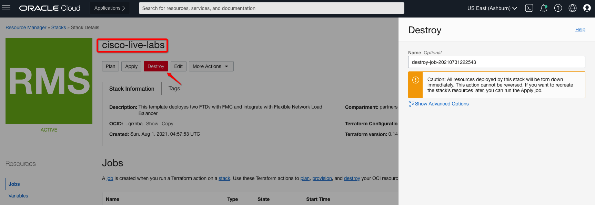
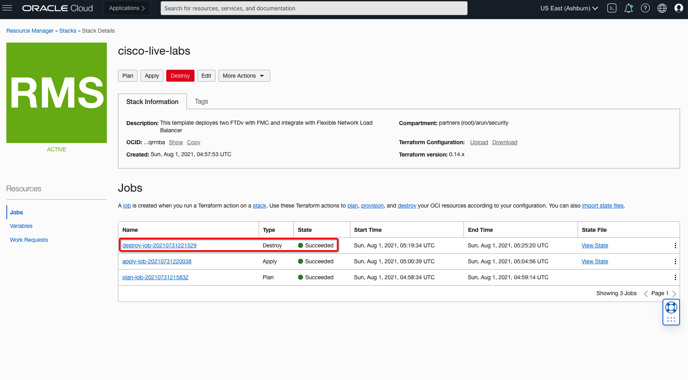

# Destroy Lab Environment

## Introduction

In this lab you will be destroying lab environment which you created either manually or using Oracle Resource Manager. Manual steps include deleting virtual cloud networks (VCNs), subnets in each VCN, dynamic routing gateways (DRG), route tables, compute instances, Firewall Management Center Instance and Secure Firewall instances.

**Note**: Select the right Compartment where you have created your resources. 

Estimated Lab Time: 10 minutes.

### Objectives

   - Destroy environment manually
   - Destroy environment using Oracle Resource Manager

### Prerequisites

- Oracle Cloud Infrastructure paid account credentials (User, Password, Tenant, and Compartment)

## **Task 1: Delete environment manually**

When manually destroying the environment, ensure that one-resource is not tied to another resource.

1. From OCI services menu, Click **Instances** under **Compute** and delete instances which you have created in your lab environment. 

2. From OCI services menu, Click **Dynamic Routing Gateway** under **Networking > Customer Connectivity** and delete **firewall-drg** DRG which you have created in your lab environment. 

3. From OCI services menu, Click **Virtual Cloud Networks** under **Networking** and delete route table entries, service gateway, route tables, subnets and VCN from each **firewall-vcn,web-vcn,db-vcn**,  which you have created in your lab environment. 

4. From OCI services menu, Click **Buckets** under **Storage**. Delete the object and bucket which you created earlier to validate the Object Storage Network traffic. 

## **Task 2: Delete environment using Oracle Resource Manager**

When using Resource Manager to destroy the environment, you need to execute a **terraform destroy** and apply. Let's do that now.

1. Open up the hamburger menu in the left-hand corner.  Choose **Developer Services > Stacks**. Click on **Stacks** and navigate to your stack which you created in **Lab0**

2. At the top of your page, click on Stack Details. Click the button, **Destroy**. This will destroy your instances and required configuration.

    

3. Once this job succeeds, your environment is destroyed! Time to enjoy a cup of coffee now :) 

    

***Congratulations! You have successfully completed the labs.***

## Learn More

1. [OCI Training](https://www.oracle.com/cloud/iaas/training/)
2. [Familiarity with OCI console](https://docs.us-phoenix-1.oraclecloud.com/Content/GSG/Concepts/console.htm)
3. [Overview of Networking](https://docs.us-phoenix-1.oraclecloud.com/Content/Network/Concepts/overview.htm)
4. [Overview of Marketplace Applications](https://docs.oracle.com/en-us/iaas/Content/Marketplace/Concepts/marketoverview.htm)
5. [OCI Cisco Secure Firewall Deployment Guide](https://www.cisco.com/c/en/us/td/docs/security/firepower/quick_start/oci/ftdv-oci-gsg/ftdv-oci-deploy.html)

## Acknowledgements

- **Author** - Arun Poonia, Principal Solutions Architect
- **Adapted by** -  Cisco
- **Contributors** - N/A
- **Last Updated By/Date** - Arun Poonia, Oct 2022