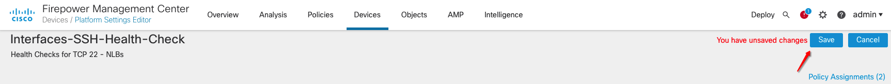

# Configure Secure Firewalls

## Introduction

In this lab you will be configuring Secure Firewalls instances initial configuration, interfaces, routes, ssh-interfaces health check and route tables to support traffic between VCNs. You have deployed Firewall Management Center(FMC) to manage Secure Firewalls configuration. You have also used **cloud-init** to pass FMC IP address, registration key and NAT ID.

Estimated Lab Time: 20 minutes.

### Objectives

- Initial Configuration on Firewall Management Center
- Initial Configuration on Secure Firewall First Instance
- Initial Configuration on Secure Firewall Second Instance

### Prerequisites

- Oracle Cloud Infrastructure paid account credentials (User, Password, Tenant, and Compartment)  

## **Task 1: Initial Configuration on Firewall Management Center**

1. Connect to **FMC1** instance public IP over ssh. You will be creating initial password so you can connect to FMC over browser.

    - SSH to Firewall Management Center using **admin** user with your private key associated with this instance.
    - Enter password to manage Firewall Management Center using browser, In this case you have entered **Cisco@123** password. 

      

2. Connect to **fmc1** instance public IP on your local machine's web browser: **https://public_ip**. It will ask you to enter **username/password**, enter **admin/Cisco@123** or your password which you have configured in **step#1**. 

   

3. Select **Start 90-Day evaluation period without registration** for the time being but at a later stage if you want to add a license you can do. For this lab you will use 90 days trial license. 

   

4. Click **Save** to apply 90 days license to your FMC. 

5. [Optional] Connect to **secureFirewall1** instance public IP over ssh. Since you are using Firewall Management Center to manage Secure Firewalls. You can check firewall manager as below: 

    - SSH to Secure Firewall using **admin** user with your private key associated with this instance.
    - Enter command **show managers** this should reflect manager which you added or populated during instance creation. Value should be **pending**:

      

6. [Optional] Connect to **secureFirewall2** instance public IP over ssh. Since you are using Firewall Management Center to manage Secure Firewalls. You can check firewall manager as below:

    - SSH to Secure Firewall using **admin** user with your private key associated with this instance.
    - Enter command **show managers** this should reflect manager which you added or populated during instance creation. Value should be **pending**:

      

7. Navigate to **Devices > Add > Device** to add your **secureFirewall1** instance. 

      

8. Click on **Device** and fill out the dialog box for **Device Registration**:

      - **Host**: Enter SecureFirewall1 Instance Public IP
      - **Display Name**: Enter User-Friendly Name
      - **Registration Key**: Enter Registration Key associated with **secureFirewall1** instance which is used in **cloud-init** configuration; Example: **cisco123reg1**
      - **Access Control Policy**:
        - Click on **Create New Policy** icon and it will open a dialog box; enter policy name and description and select **Block Traffic** from options.
      - **Performance Tier**
        - Select appropriate version from drop-down, in your case you can also select **FTDv - Variable** 
        - Enable Check marks to Malware, Threat and URL Filtering
      - **Unique NAT ID**: Enter NAT ID associated with **secureFirewall1** instance which is used in **cloud-init** configuration; Example: **cisco123nat1**

      

      

9. Click on **Register** button to add your device to FMC. 

    

10. [Optional] We have noticed sometimes while registering device if FMC is not fully up yet it might try to de-register device itself when you register device first time. So you can add manager again on each Secure Firewall instance using below command over SSH: 

      ```
      <copy>
        configure manager add <fmc_public_ip> <registration_key> <nat_id>
        end
      </copy>
      ```

12. Click on **Add > Device** and fill out the dialog box for **Device Registration**:

      - **Host**: Enter SecureFirewall2 Instance Public IP
      - **Display Name**: Enter User-Friendly Name
      - **Registration Key**: Enter Registration Key associated with **secureFirewall2** instance which is used in **cloud-init** configuration; Example: **cisco123reg2**
      - **Access Control Policy**: Select **Block Traffic** policy created from drop-down.
      - **Performance Tier**
        - Select appropriate version from drop-down, in your case you can also select **FTDv - Variable** 
        - Enable Check marks to Malware, Threat and URL Filtering
      - **Unique NAT ID**: Enter NAT ID associated with **secureFirewall2** instance which is used in **cloud-init** configuration; Example: **cisco123nat2**

13. Click on **Register** button to add your device to FMC. 

    

14. [Optional] We have noticed sometimes while registering device if FMC is not fully up yet it might try to de-register device itself when you register device first time. So you can add manager again on each Secure Firewall instance using below command over SSH: 

      ```
      <copy>
        configure manager add <fmc_public_ip> <registration_key> <nat_id>
        end
      </copy>
      ```

15. View Registered **Secure Firewalls** on your FMC. 

    

## **Task 2: Initial Secure Firewall1 configuration using FMC**

1. Connect to **FMC** public IP over browser using **admin/Cisco@123** or password which you have configured for FMC in **Task 1**. 

2. Naviagte to **Device** and select pencil icon next to **SecureFirewall1**. 

    

3. Below table represents how interfaces mapping are associated on your SecureFirewall instance: 

    | Interface Name     | Instance Interface |
    |--------------------|--------------------|
    | Diagnostic 0/0     | Diag               |
    | GigabitEtherent0/0 | Inside             |
    | GigabitEtherent0/1 | Outside            |

4. Click on **GigabitEtherent0/0** edit icon to add details of inside interface. 

    

5. Fill out the dialog box for **Edit Physical Interface** and Click **Ok**:

    - **Name**: Enter name as Inside
    - **Enabled**: Select this Option
    - **Security Zone**: Click on **New** option to add a security zone named as **Inside**
    - **IPv4**: Enter **Inside** interface on **secureFirewall1** instance private IP.

    

    

6. Click on **GigabitEtherent0/1** edit icon to add details of outside interface. 

7. Fill out the dialog box for **Edit Physical Interface** and Click **Ok**:

    - **Name**: Enter name as Outside
    - **Enabled**: Select this Option
    - **Security Zone**: Click on **New** option to add a security zone named as **Outside**
    - **IPv4**: Enter **Outside** interface on **secureFirewall1** instance private IP.

    

    

8. Save your interfaces configuration by clicking on **Save** icon on your device. 

    

9. Navigate to **Routes > Static Routes** to add route entries to support VCNs traffic inbound as well as outbound. Click on **+Add Route** icon to add routes:

    

10. Click on **+Add Route** to add inside interface traffic

    - **Interface**: Select Inside Interface
    - **Selected Network**: Add **IPv4-Private-10.0.0.0-8** from available network, You can also create a new network and be specific about it for Spoke VCNs CIDRs.
    - **Gateway**: Click on **New** and add a object named as **inside-subnet-gateway** with a value of first IP of your inside-subnet i.e. **192.168.3.1/24**

   

11. Fill out the dialog box for **Add Static Route Configuration** and Click **Save > Ok**:

    - **Interface**: Select Outside Interface
    - **Selected Network**: Add **any-ipv4** from available network, You can also create a new network and be specific about it.
    - **Gateway**: Click on **New** and add a object named as **outside-subnet-gateway** with a value of first IP of your outside-subnet i.e. **192.168.4.1/24**

   

12. Save your routes configuration by clicking on **Save** icon on your device. 

    

## **Task 3: Initial Secure Firewall2 configuration using FMC**

1. Connect to **FMC** public IP over browser using **admin/Cisco@123** or password which you have configured for FMC in **Task 1**. 

2. Navigate to **Device** and select pencil icon next to **SecureFirewall2**. 

    

3. Below table represents how interfaces mapping are associated on your SecureFirewall instance: 

    | Interface Name     | Instance Interface |
    |--------------------|--------------------|
    | Diagnostic 0/0     | Diag               |
    | GigabitEtherent0/0 | Inside             |
    | GigabitEtherent0/1 | Outside            |

4. Click on **GigabitEtherent0/0** edit icon to add details of inside interface. 

5. Fill out the dialog box for **Edit Physical Interface** and Click **Ok**:

    - **Name**: Enter name as Inside
    - **Enabled**: Select this Option.
    - **Security Zone**: Select previously created **Inside** security zone.
    - **IPv4**: Enter **Inside** interface on **secureFirewall2** instance private IP.

    

6. Click on **GigabitEtherent0/1** edit icon to add details of outside interface. 

7. Fill out the dialog box for **Edit Physical Interface** and Click **Ok**:

    - **Name**: Enter name as Outside
    - **Enabled**: Select this Option
    - **Security Zone**: Select previously created **Outside** security zone.
    - **IPv4**: Enter **Outside** interface on **secureFirewall2** instance private IP.

    

8. Save your interfaces configuration by clicking on **Save** icon on your device. 

9. Navigate to **Routes > Static Routes** to add route entries to support VCNs traffic inbound as well as outbound. Click on **+Add Route** icon to add routes:

    

10. Click on **+Add Route** to add inside interface traffic

    - **Interface**: Select Inside Interface
    - **Selected Network**: Add **IPv4-Private-10.0.0.0-8** from available network, You can also create a new network and be specific about it for Spoke VCNs CIDRs.
    - **Gateway**: Select **inside-subnet-gateway** which has a value of first IP of your inside-subnet i.e. **192.168.3.1/24**

   

11. Fill out the dialog box for **Add Static Route Configuration** and Click **Save > Ok**:

    - **Interface**: Select Outside Interface
    - **Selected Network**: Add **any-ipv4** from available network, You can also create a new network and be specific about it.
    - **Gateway**: Select **outside-subnet-gateway** which has a value of first IP of your outside-subnet i.e. **192.168.4.1/24**

   

12. Save your routes configuration by clicking on **Save** icon on your device. 

13. Navigate to **Devices > Platform Settings** and click on **New Policy > Threat Defense Settings** to enable **SSH** health check on Secure Firewalls inside and outside interfaces.

   

14. Fill out the dialog box for **New Policy** and Click **Save**:

    - **Name**: Enter a User-Friendly Name; Example: Interfaces-SSH-Health-Check
    - **Description**: Enter a User-Friendly Description; Example: Health Checks for TCP 22 - NLBs
    - **Selected Devices**: Add **SecureFirewall1** and **SecureFirewall2** from Available Devices.

    

15. Click on **+ Add** icon to enable SSH Access to Secure Firewall Interfaces. 

16. Fill out the dialog box for **Add Secure Shell Configuration** and Click **Ok**:

    - **IP Address**: Choose any-ipv4 address.
    - **Selected Zones/Interfaces**: Add **inside** and **outside** zones which are associated with interfaces from available zones.

   

17. Save your SSH Health Check configuration by clicking on **Save** icon on your device.  

   

18. Now you will deploy both **SecureFirewall1** and **SecureFirewall2** configuration. 

19. Navigate to **Device > Deployment**, select your **SecureFirewall1 and SecureFirewall2** devices and click on **Deploy** button:

   

   

   

20. You can do a sanity check on Secure Firewalls devices to see interfaces, ssh health check and routes are there. 

   

21. If you navigate to your OCI Console's **Network Load Balancers** now you should see all Network Load Balancers are healthy. 

   

***Congratulations! You have successfully completed the lab.***

You may now [proceed to the next lab](#next).

## Learn More

1. [OCI Training](https://www.oracle.com/cloud/iaas/training/)
2. [Familiarity with OCI console](https://docs.us-phoenix-1.oraclecloud.com/Content/GSG/Concepts/console.htm)
3. [Overview of Networking](https://docs.us-phoenix-1.oraclecloud.com/Content/Network/Concepts/overview.htm)
4. [Overview of Marketplace Applications](https://docs.oracle.com/en-us/iaas/Content/Marketplace/Concepts/marketoverview.htm)
5. [OCI Cisco Secure Firewall Deployment Guide](https://www.cisco.com/c/en/us/td/docs/security/firepower/quick_start/oci/ftdv-oci-gsg/ftdv-oci-deploy.html)

## Acknowledgements

- **Author** - Arun Poonia, Senior Solutions Architect
- **Adapted by** - Cisco
- **Contributors** - N/A
- **Last Updated By/Date** - Arun Poonia, August 2021