# Deploy Secure Firewall and Supporting Configuration

## Introduction

In this lab you will be creating Firewall Management Center, Secure Firewall instances from **partner images** or **marketplace** service, adding additional interfaces and flexible network load balancers to support traffic between VCNs.

Estimated Lab Time: 30 minutes.

### Objectives

- Launch Firewall Management Center in Hub VCN
- Launch Secure Firewall Instances in Hub VCN 
- Add Interfaces to Secure Firewall Instances
- Demonstrate launching Flexible Network Load Balancer and supporting configuration
- Demonstrate updating routing tables 
- Validate route tables association

### Prerequisites

- Oracle Cloud Infrastructure paid account credentials (User, Password, Tenant, and Compartment)
- Access to Oracle Cloud Marketplace **BYOL** listings.
     - **Cisco Firepower Management Center (FMCv)**
     - **Cisco Firepower NGFW virtual firewall (NGFWv)**

## **Task 1: Launch Firewall Management Center Instance**

1. Launch **Cloud Shell** by clicking the icon next to region name on top right of OCI console. ('<=' icon)

2. Once cloud Shell is launched. Enter command **ssh-keygen**, press enter for all prompts. This will create a ssh key pair. Enter command.

      ```
      <copy>
      bash
      cd .ssh
      cat id_rsa.pub
      </copy>
      ```
   
   Copy the key displayed. This will be used when creating the compute instance.

3. From OCI services menu, Click **Instances** under **Compute**.
 
4. On the left sidebar, select the **Compartment** in which you placed your VCN under **List Scope**. The, Click **Create Instance**. You will be creating **1** instance as per below table: 

    | Name      | Placement | Image                                                |  Version | Shape          | Network      | Subnet      | Add SSH-Keys                |
    | ---------- | --------- | ---------------------------------------------------- | ------------- | -------------- | ------------ | ----------- | --------------------------- |
    | fmc1| AD1       | Cisco Firepower Management Center (FMCv) BYOL | 7.0.0-94    | VMStandard2.2  | firewall-vcn | mgmt-subnet | Yours/CloudShell Public Key |
    
5. Enter a **Name** for your Instance and the **Compartment** in which you placed your **Firewall VCN**. Fill out the dialog box. Select appropriate values based on table shared in previous **#4**. Click on **Partner Image Agreement** check box and save image selection by clicking on **Select Image** button.

6. Select Shape **VM Standard2.2** as default value.

7. Scroll Down to **Networking** and verify the following.
      - Your Compartment is selected
      - The VCN created is populated: **firewall-vcn**
      - The subnet created is populated: **mgmt-subnet**
      - Enable Public IP Address assignment: **Assign a public IPv4 address**

   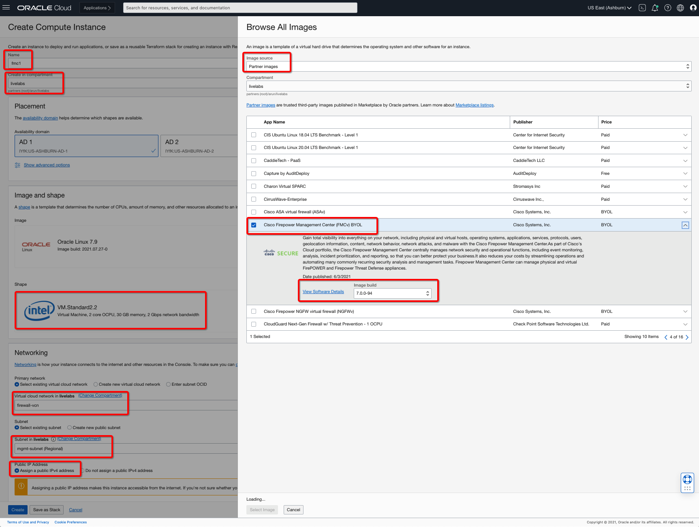

8. Ensure **PASTE PUBLIC KEYS** is selected under **Add SSH Keys**. Paste the public key copied earlier.
 
   **NOTE:** If 'Service limit' error is displayed choose a different shape from VM.Standard2.1, VM.Standard.E2.1, VM.Standard1.1, VM.Standard.B1.1 OR choose a different AD.

   **NOTE:** If you already have your ssh-key available you can skip copying from cloud-shell and paste your own public key and use private key associated to that for accessing instance.

9. Click **Create** and wait for Instance to be in **Running** state. 

## **Task 2: Launch Secure Firewall Instances**

1. Launch **Cloud Shell** by clicking the icon next to region name on top right of OCI console. ('<=' icon)

2. Once cloud Shell is launched. Enter command **ssh-keygen**, press enter for all prompts. This will create a ssh key pair. Enter command.

      ```
      <copy>
      bash
      cd .ssh
      cat id_rsa.pub
      </copy>
      ```
   
   Copy the key displayed. This will be used when creating the compute instance.

3. From OCI services menu, Click **Instances** under **Compute**.
 
4. On the left sidebar, select the **Compartment** in which you placed your VCN under **List Scope**. The, Click **Create Instance**. You will be creating **2** instances as per below table: 

    | Name      | Placement | Image                                                |  Version | Shape          | Network      | Subnet      | Add SSH-Keys                |
    | ---------- | --------- | ---------------------------------------------------- | ------------- | -------------- | ------------ | ----------- | --------------------------- |
    | secureFirewall1| AD1       | Partner Image: Cisco Firepower NGFW virtual firewall (NGFWv) | 7.0.0-94 | VMStandard2.4  | firewall-vcn | mgmt-subnet | Yours/CloudShell Public Key |
    | secureFirewall2| AD2       | Partner Image: Cisco Firepower NGFW virtual firewall (NGFWv) | 7.0.0-94 | VM Standard2.4 | firewall-vcn | mgmt-subnet | Yours/CloudShell Public Key |
    
5. Enter a **Name** for your Instance and the **Compartment** in which you placed your **Firewall VCN**. Fill out the dialog box. Select appropriate values based on table shared in previous **#4**. Click on **Partner Image Agreement** check box and save image selection by clicking on **Select Image** button.

6. Select Shape **VM Standard2.4** as default value.

7. Scroll Down to **Networking** and verify the following.
      - Your Compartment is selected
      - The VCN created is populated: **firewall-vcn**
      - The subnet created is populated: **mgmt-subnet**
      - Enable Public IP Address assignment: **Assign a public IPv4 address**

   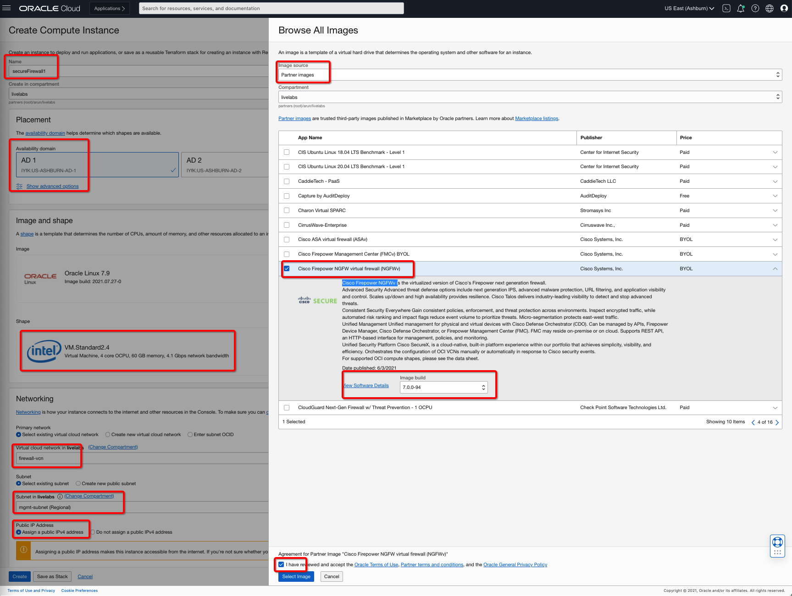

8. Ensure **PASTE PUBLIC KEYS** is selected under **Add SSH Keys**. Paste the public key copied earlier.
 
   **NOTE:** If 'Service limit' error is displayed choose a different shape from VM.Standard2.1, VM.Standard.E2.1, VM.Standard1.1, VM.Standard.B1.1 OR choose a different AD.

   **NOTE:** If you already have your ssh-key available you can skip copying from cloud-shell and paste your own public key and use private key associated to that for accessing instance.

9. Click on **Show advanced options** button below **Boot Volume** section and select **Paste cloud-init script** where you will be pasting a cloud-init script which will allow you to manage **Secure Firewall** via **Firewall Management Center**

    You need to update values for each variable in below cloud-init script for each instance: 

    | Variable      | Example           | Comment                       |
    |---------------|-------------------|-------------------------------|
    | Hostname      | firewall-name     | Secure Firewall Instance Name |
    | AdminPassword | Cisco@1234        | Admin Password                |
    | FmcIp         | 132.145.135.38    | FMC IP to Manage Firewalls; Instance which you created in step1    |
    | FmcRegKey     | cisco123reg       | Firewall Registration Key     |
    | FmcNatId      | cisco123nat       | Firewall Nat Id               |

    An example of **SecureFirewall1** would be this: 

      ```
      <copy>
      {
        "Hostname": "secure-firewall1",
        "AdminPassword": "Cisco@1234",
        "FirewallMode": "routed",
        "IPv4Mode": "dhcp",
        "ManageLocally":"No",
        "FmcIp": "132.145.135.38",
        "FmcRegKey": "cisco123reg1",
        "FmcNatId": "cisco123nat1"
       }
      </copy>
      ```

10. Click **Create** and wait for Instance to be in **Running** state. 

11. Repeat step 5 to 10 based on the **table** provided in **step 4** for another Secure Firewall **secureFirewall2** instance.

    An example of **SecureFirewall2** **cloud-init** would be something like this: 

      ```
      <copy>
      {
        "Hostname": "secure-firewall1",
        "AdminPassword": "Cisco@1234",
        "FirewallMode": "routed",
        "IPv4Mode": "dhcp",
        "ManageLocally":"No",
        "FmcIp": "132.145.135.38",
        "FmcRegKey": "cisco123reg2",
        "FmcNatId": "cisco123nat2"
       }
      </copy>
      ```

   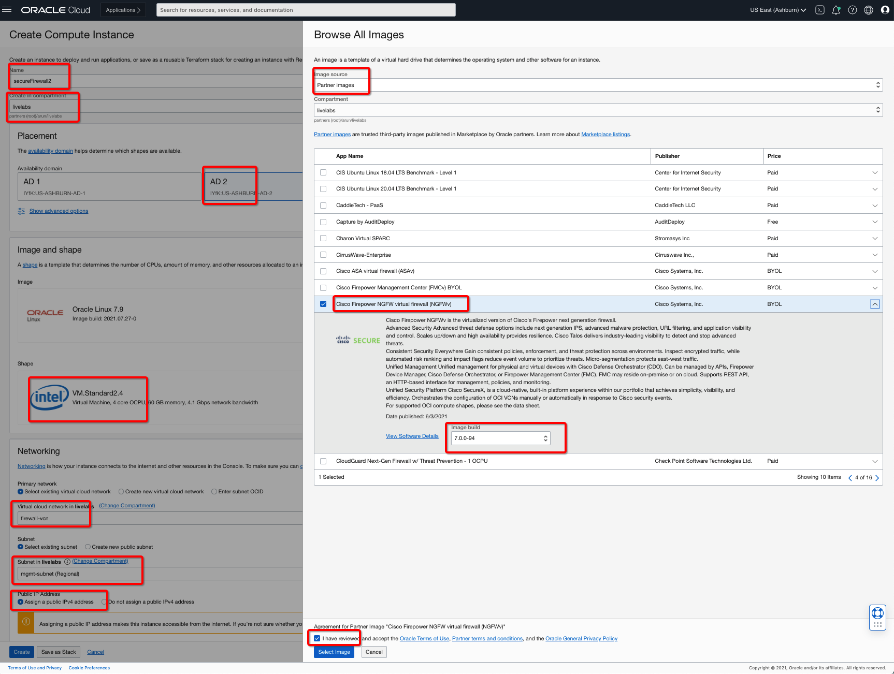

## **Task 3: Add Interfaces on Secure Firewall Instances**

1. Click on **secureFirewall1** instance and navigate to **Attached VNIC** under Resources section of the instance details page. You will be adding **diag**, **inside** and **outside** interfaces respectively which is very **important** here:

    | Name    | Virtual Cloud Network | Network      | Subnet         | Skip source/destination check |
    |---------|-----------------------|--------------|----------------|-------------------------------|
    | diag    | firewall-vcn          | Normal Setup | diag-subnet    | No                            |
    | inside  | firewall-vcn          | Normal Setup | inside-subnet  | Yes                           |
    | outside | firewall-vcn          | Normal Setup | outside-subnet | Yes                           |

2. Click on **Create VNIC** and fill out the dialog box for **diag** interface: 

      - **Name**: Enter Name
      - **Virtual Cloud Network**:  Select firewall-vcn from drop down
      - **Network**:  Keep the default value as Normal Setup
      - **Subnet**: Select **diag-subnet** from drop down

   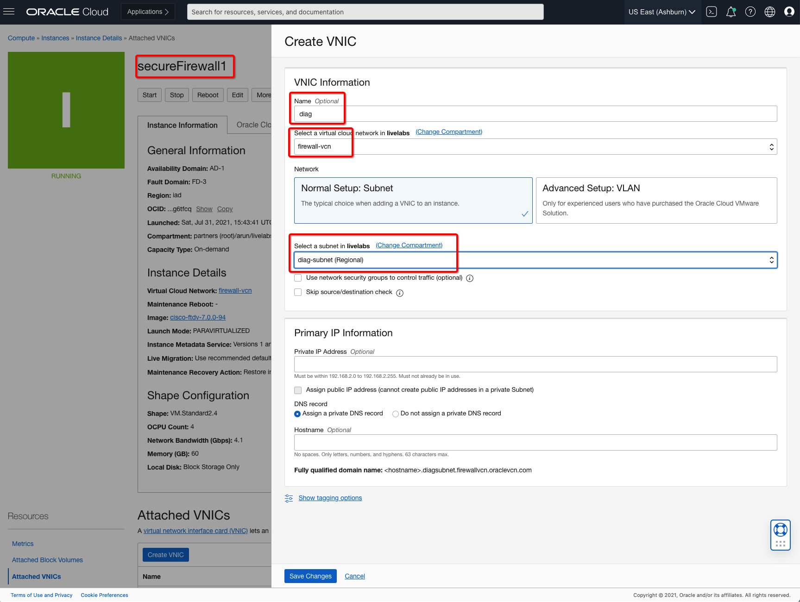

3. Verify all the information and Click **Save Changes**.

4. This will add **diag** interface on **secureFirewall1** instance with following components.

    *diag interface on secureFirewall1 instance*

5. Click on **Create VNIC** and fill out the dialog box for **inside** interface: 

      - **Name**: Enter Name
      - **Virtual Cloud Network**:  Select firewall-vcn from drop down
      - **Network**:  Keep the default value as Normal Setup
      - **Subnet**: Select **inside-subnet** from drop down
      - **Skip source/destination check**: Select checkmark next to this option

   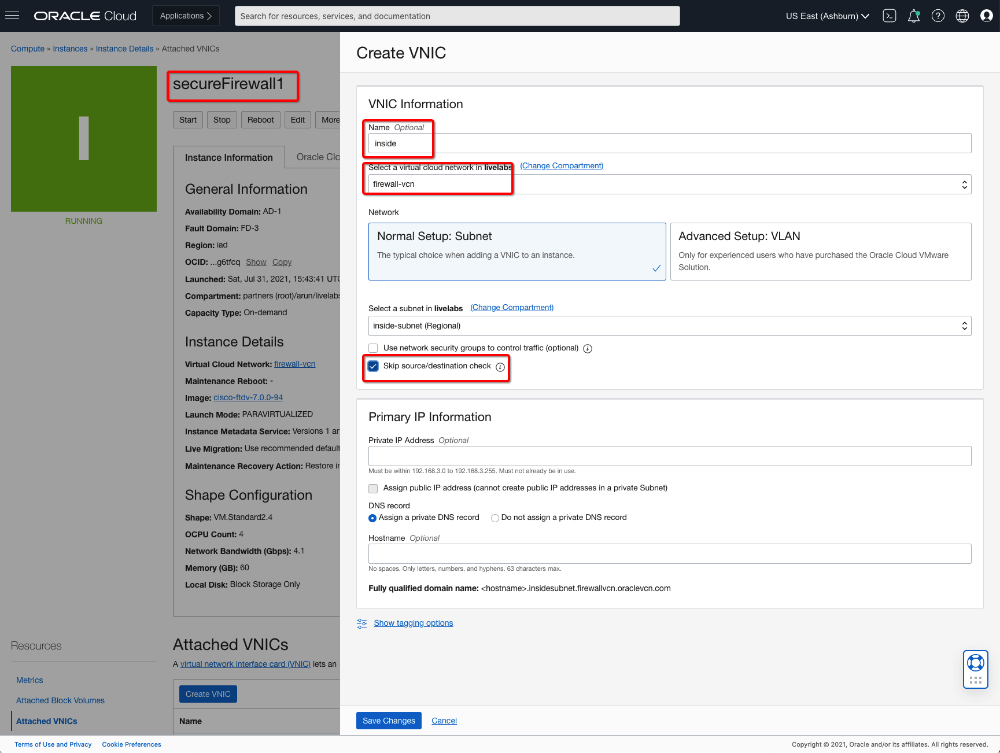

6. Verify all the information and Click **Save Changes**.

7. This will add **inside** interface on **secureFirewall1** instance with following components.

    *inside interface on secureFirewall1 instance*

8. Click on **Create VNIC** and fill out the dialog box for **outside** interface: 

      - **Name**: Enter Name
      - **Virtual Cloud Network**:  Select firewall-vcn from drop down
      - **Network**:  Keep the default value as Normal Setup
      - **Subnet**: Select **outside-subnet** from drop down
      - **Skip source/destination check**: Select checkmark next to this option
      - **Assign a public IPv4 address**: Select this option to assign a public to interface.

   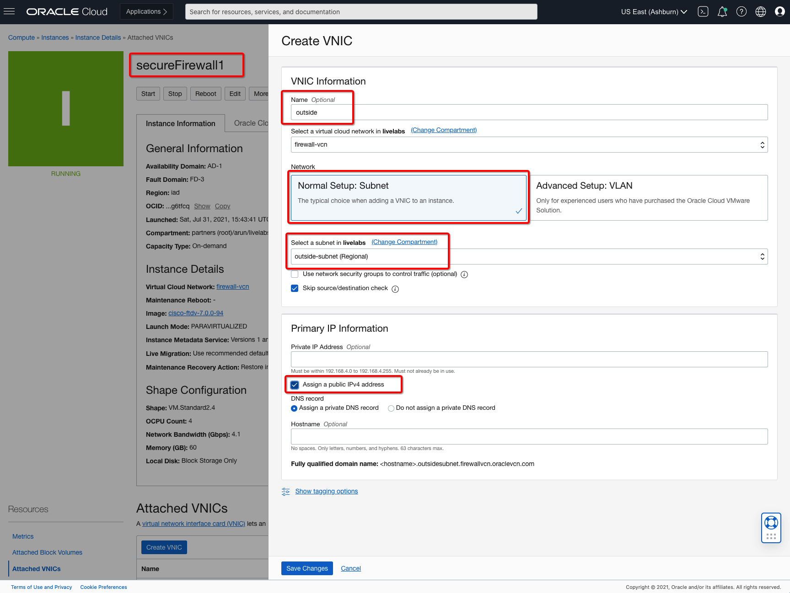

9. Verify all the information and Click **Save Changes**.

10. This will add **outside** interface on **secureFirewall1** instance with following components.

    *outside interface on secureFirewall1 instance*

11. Click on **secureFirewall2** instance and navigate to **Attached VNIC** under Resources section of the instance details page. You will be adding **diag**, **inside** and **outside** interfaces respectively:

    | Name    | Virtual Cloud Network | Network      | Subnet         | Skip source/destination check |
    |---------|-----------------------|--------------|----------------|-------------------------------|
    | diag    | firewall-vcn          | Normal Setup | diag-subnet    | No                            |
    | inside  | firewall-vcn          | Normal Setup | inside-subnet  | Yes                           |
    | outside | firewall-vcn          | Normal Setup | outside-subnet | Yes                           |

12. Click on **Create VNIC** and fill out the dialog box for **diag** interface: 

      - **Name**: Enter Name
      - **Virtual Cloud Network**:  Select firewall-vcn from drop down
      - **Network**:  Keep the default value as Normal Setup
      - **Subnet**: Select **diag-subnet** from drop down

   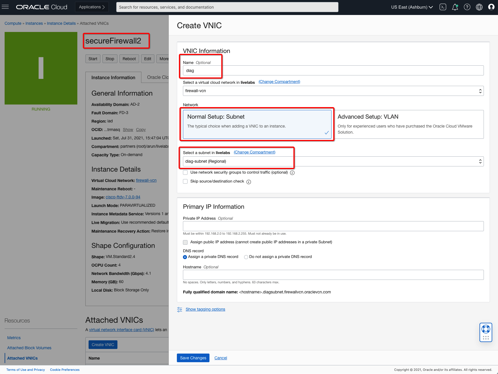

13. Verify all the information and Click **Save Changes**.

14. This will add **diag** interface on **secureFirewall2** instance with following components.

    *diagnostic interface on secureFirewall1 instance*

15. Click on **Create VNIC** and fill out the dialog box for **inside** interface: 

      - **Name**: Enter Name
      - **Virtual Cloud Network**:  Select firewall-vcn from drop down
      - **Network**:  Keep the default value as Normal Setup
      - **Subnet**: Select **inside-subnet** from drop down
      - **Skip source/destination check**: Select checkmark next to this option

   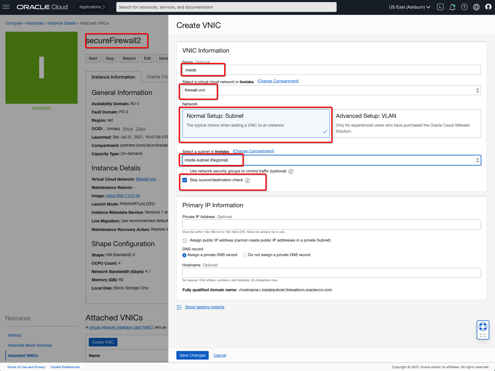

16. Verify all the information and Click **Save Changes**.

17. This will add **inside** interface on **secureFirewall2** instance with following components.

    *inside interface on secureFirewall2 instance*

18. Click on **Create VNIC** and fill out the dialog box for **outside** interface: 

      - **Name**: Enter Name
      - **Virtual Cloud Network**:  Select firewall-vcn from drop down
      - **Network**:  Keep the default value as Normal Setup
      - **Subnet**: Select **outside-subnet** from drop down
      - **Skip source/destination check**: Select checkmark next to this option
      - **Assign a public IPv4 address**: Select this option to assign a public to interface.

   

19. Verify all the information and Click **Save Changes**.

20. This will add **outside** interface on **secureFirewall2** instance with following components.

    *outside interface on secureFirewall2 instance*

## **Task 4: Create Flexible Network Load Balancers**

1. From the OCI Services menu, click **Load Balancers** under **Networking**. Select your region on right part of the screen:

   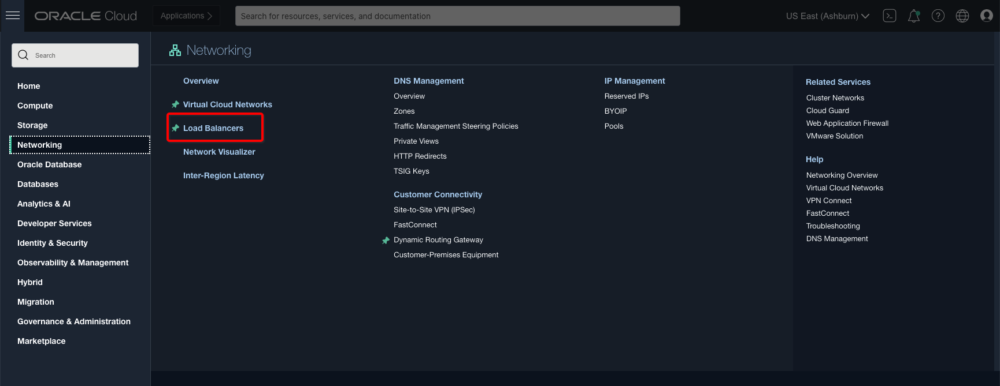

2. Below table represents what you will be creating. Click on **Create Load Balancer** icon to create new **Flexible Network Load Balancer**:

    | Load Balancer Name      | Type                  | Visibility Type           | VCN          | subnet        | Listener Name | Listener Type | Backend Name | Backend Sets                                | Backend Health Check |
    |-------------------------|-----------------------|---------------------------|--------------|---------------|---------------|---------------|--------------|---------------------------------------------|----------------------|
    | CiscoExternalPublicNLB  | Network Load Balancer | Public                    | firewall-vcn | nlb-subnet    | nlb-listener  | UDP/TCP       | backends     | Outside Interfaces of SecureFirewall1 and 2 | TCP Port 22          |
    | CiscoExternalPrivateNLB | Network Load Balancer | Private                   | firewall-vcn | nlb-subnet    | nlb-listener  | UDP/TCP/ICMP  | backends     | Outside Interfaces of SecureFirewall1 and 2 | TCP Port 22          |
    | CiscoInternalPrivateNLB | Network Load Balancer | Private                   | firewall-vcn | inside-subnet | nlb-listener  | UDP/TCP/ICMP  | backends     | Inside Interfaces of SecureFirewall1 and 2  | TCP Port 22          |

3. Click on **Create Load Balancer** and Select **Network Load Balancer** and fill out the dialog box for **CiscoExternalPublicNLB** based on the table from **2** step in this section:

      - **Load Balancer Name**: Enter Network Load Balancer Name as per the table values.
      - **Choose Visibility Type**: Select Type as per the table values.
      - **Virtual Cloud Networks**:  Select firewall-vcn from dropdown
      - **Subnet**:  Select subnet as per table
      - **COMPARTMENT**: Ensure your compartment is selected

   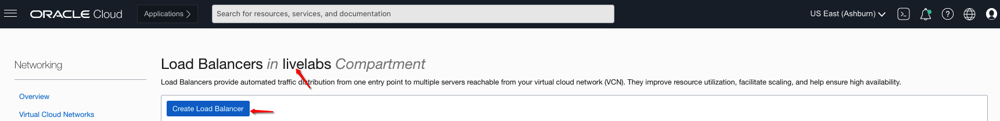

   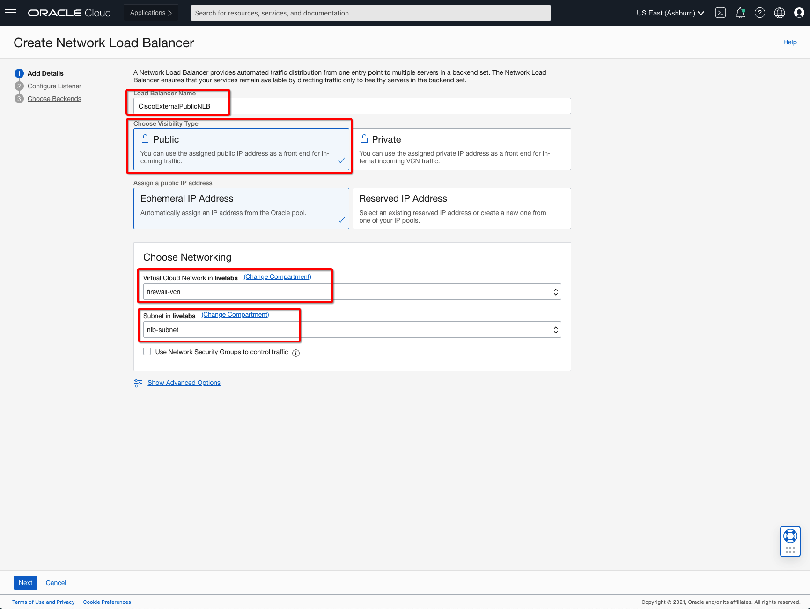

4. Click on **Next** to add listener **Name** and select Type of Traffic as **UDP/TCP** as per the table values. 

   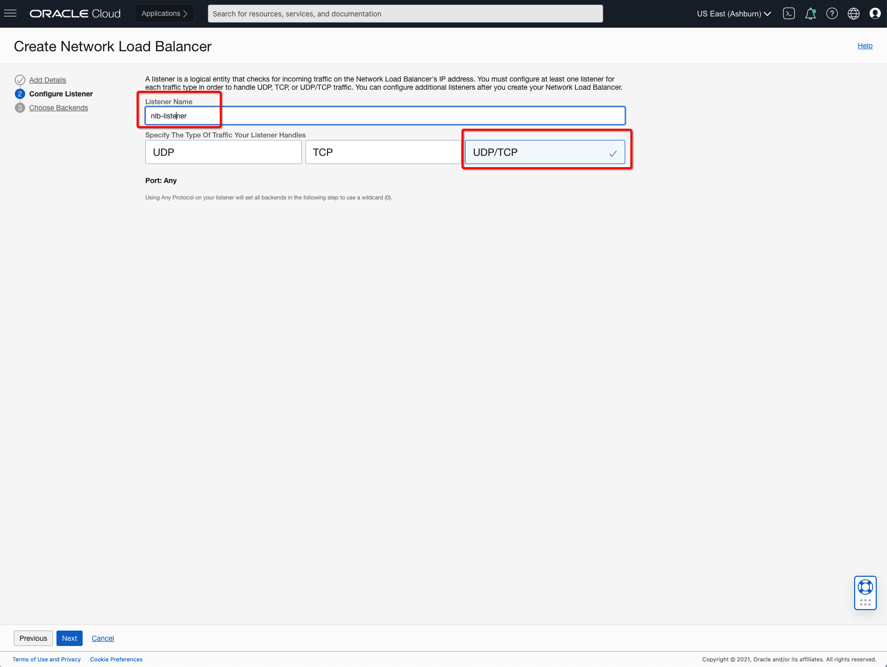

5. Click on **Next** 

      - **Backend Set Name**: Enter Backend set name as per the table values.
      - **Add Backends**:
        - Select Backend interfaces for **secureFirewall1** and **secureFirewall2** from drop-down as per table. 
      - **Specify Health Check Policy**:  
        - Select **Protocol** and enter **Port** as per the table values.

   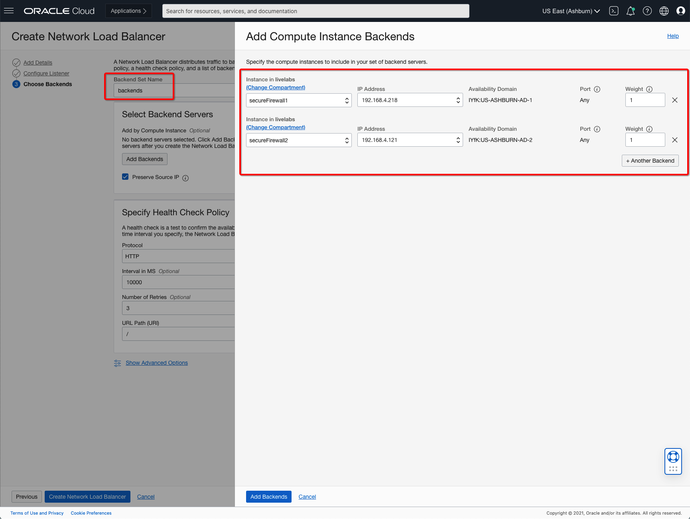

   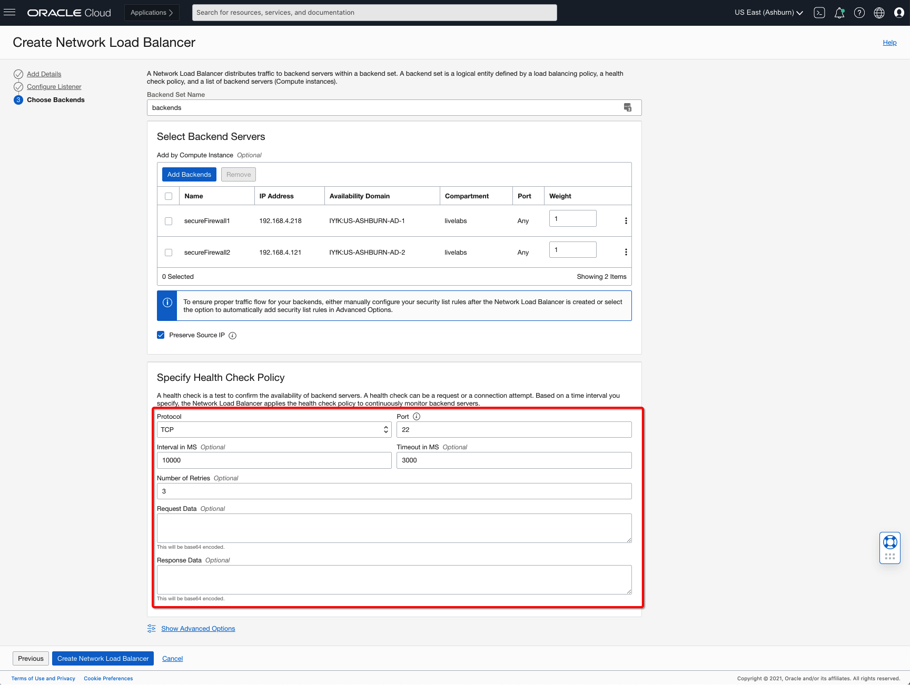

6. Click on **Create Network Load Balancer** to create **Flexible Network Load Balancer**

7. This will create network load balancer with **outside** interfaces of **secureFirewall1** and **secureFirewall2** instances with following components.

    *CiscoExternalPublicNLB Public Network Load Balancer with Outside interfaces of Secure Firewall instances*

8. Repeat steps **3 to 6** to create each Network Load Balancer to support traffic. 

9. At this point you should have **3** flexible network load balancer configured. Their health check will turn okay when you configure **Secure Firewall** in next lab.

   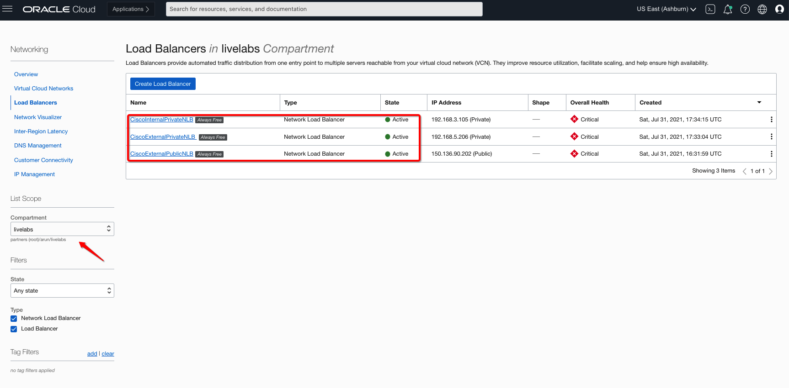

## **Task 5: Update Route Tables on Firewall-VCN**

1. Navigate to the **firewall-vcn** and select **VCN-INGRESS** route table. 

2. Click **Add Route Rules**

3. Select the Target Type as **Private IP** and enter the **CiscoInternalPrivateNLB** private IP associated with Network Load Balancer with **secureFirewall1 and secureFirewall2** instance's **Inside** interfaces.

4. Enter the **Destination CIDR Block**

    - In this case you will put all default CIDR **0.0.0.0/0** which is incoming traffic from Spoke VCNs via **DRG** to Active Firewall. You can also enter the CIDR block for the Web and DB VCN is needed.  i.e.: 10.0.0.0/24 or 10.0.1.0/24

5. Add **Description**.

   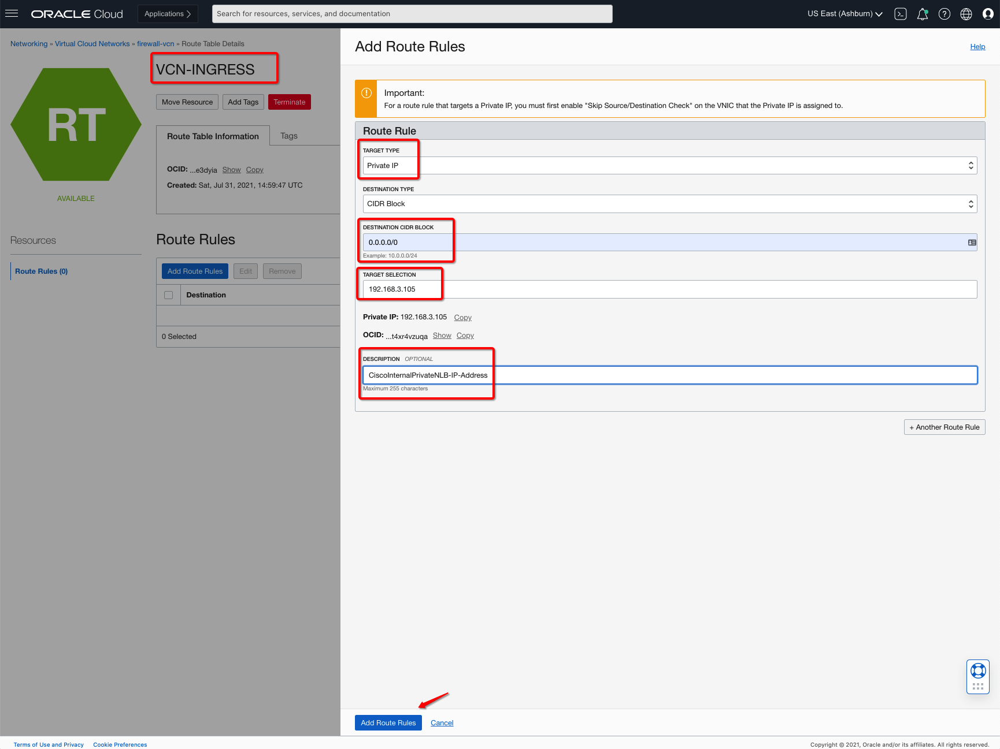

6. Click **Add Route Rules** to finish.

7. Navigate to the **firewall-vcn** and select **InsideRouteTable** route table. 

8. Click **Add Route Rules**

9. Select the Target Type as **Dynamic Routing Gateway** and associated Dynamic Routing Gateway gets reflected automatically due to VCN attachment.

10. Enter the **Destination CIDR Block**

    - In this case you will add two route entries for both Web and DB VCN i.e.: 10.0.0.0/24 or 10.0.1.0/24 using **Another Route Rule** option available on dialog box.
    - You can also add another entry which is for Object Storage traffic via Service Gateway. This confirms that any traffic towards Object Storage within your region has a route via service gateway instead of relying on internet. It will be used in **Traffic Validation** lab. 

11. Add **Description** for each entry.

   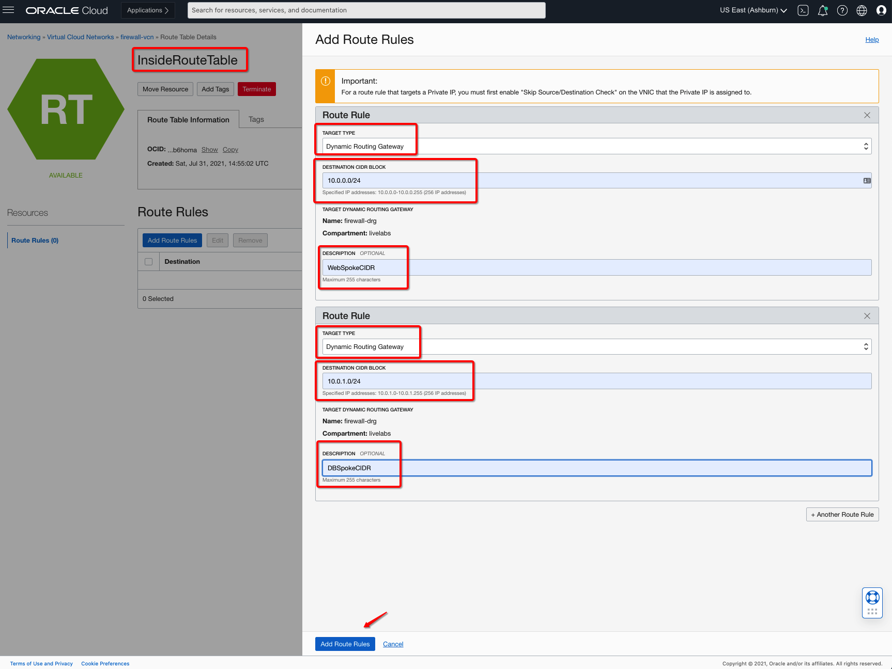

12. Click **Add Route Rules** to finish.

13. Navigate to the **firewall-vcn** and select **OutsideRouteTable** route table. 

14. Click **Add Route Rules**

15. You will be adding three entries one for Internet Facing traffic via internet gateway and another for return traffic from this subnet to Spoke VCNs via Dynamic Routing Gateway. 
   
    - **First Entry**
        - Select the Target Type as **Internet Gateway** and associated Internet Gateway gets reflected automatically select that from drop down **internet-gateway**.
        - Enter the **Destination CIDR Block**
            - In this case you will put **0.0.0.0/0** for outgoing traffic via internet gateway.
    - **Second Entry**
        - Select the Target Type as **Dynamic Routing Gateway** and associated Dynamic Routing Gateway gets reflected automatically due to VCN attachment.
        - Enter the **Destination CIDR Block**
            - In this case you will add an entry for Web VCN i.e.: 10.0.0.0/24
    - **Third Entry**
        - Select the Target Type as **Dynamic Routing Gateway** and associated Dynamic Routing Gateway gets reflected automatically due to VCN attachment.
        - Enter the **Destination CIDR Block**
            - In this case you will add an entry for DB VCN i.e.: 10.0.1.0/24.

16. Add **Description** for each entry.

   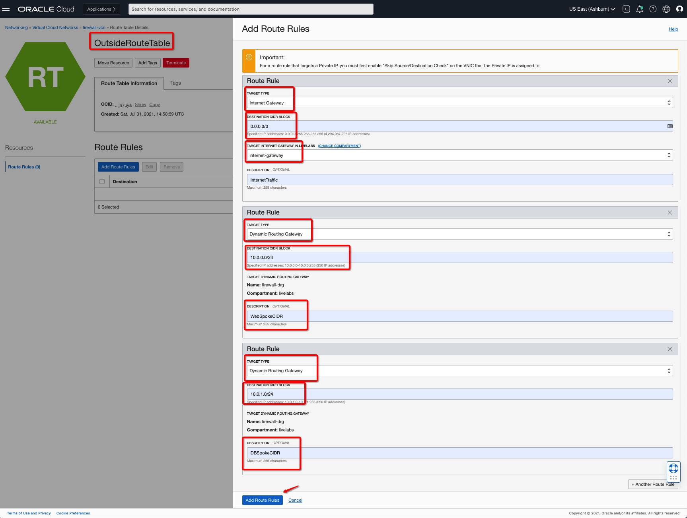

17. Click **Add Route Rules** to finish.

18. Navigate to the **firewall-vcn** and select **SGWRouteTable** route table. 

19. Click **Add Route Rules**

20. Select the Target Type as **Private IP** and enter the **CiscoInternalPrivateNLB** private IP associated with Network Load Balancer with **secureFirewall1 and secureFirewall2** instance's **Inside** interfaces.

21. Enter the **Destination CIDR Block**

    - In this case you will put all default CIDR **0.0.0.0/0** so all return traffic goes from Service Gateway goes via Firewall.

22. Add **Description** for each entry.

   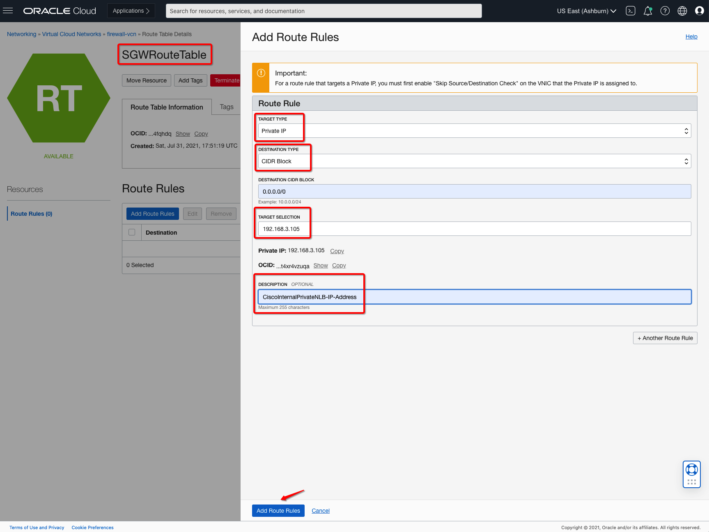

23. Click **Add Route Rules** to finish.

24. Navigate to the **firewall-vcn** and select **NLBRouteTable** route table. 

25. Click **Add Route Rules**

26. You will be adding three entries one for Internet Facing traffic via internet gateway and another for return traffic from this subnet to Spoke VCNs via Dynamic Routing Gateway.

    - **First Entry**
        - Select the Target Type as **Internet Gateway** and associated Internet Gateway gets reflected automatically select that from drop down **internet-gateway**.
        - Enter the **Destination CIDR Block**
            - In this case you will put **0.0.0.0/0** for outgoing traffic via internet gateway.
    - **Second Entry**
        - Select the Target Type as **Dynamic Routing Gateway** and associated Dynamic Routing Gateway gets reflected automatically due to VCN attachment.
        - Enter the **Destination CIDR Block**
            - In this case you will add an entry for Web VCN ie: 10.0.0.0/24
    - **Third Entry**
        - Select the Target Type as **Dynamic Routing Gateway** and associated Dynamic Routing Gateway gets reflected automatically due to VCN attachment.
        - Enter the **Destination CIDR Block**
            - In this case you will add an entry for DB VCN ie: 10.0.1.0/24.
    - [Optional]**Fourth Entry**
        - Select the Target Type as **Dynamic Routing Gateway** and associated Dynamic Routing Gateway gets reflected automatically due to VCN attachment.
        - Enter the **Destination CIDR Block**
            - In this case you will add an entry for On-Prem CIDR ie: 172.16.0.0/16.

27. Add **Description** for each entry as needed.

   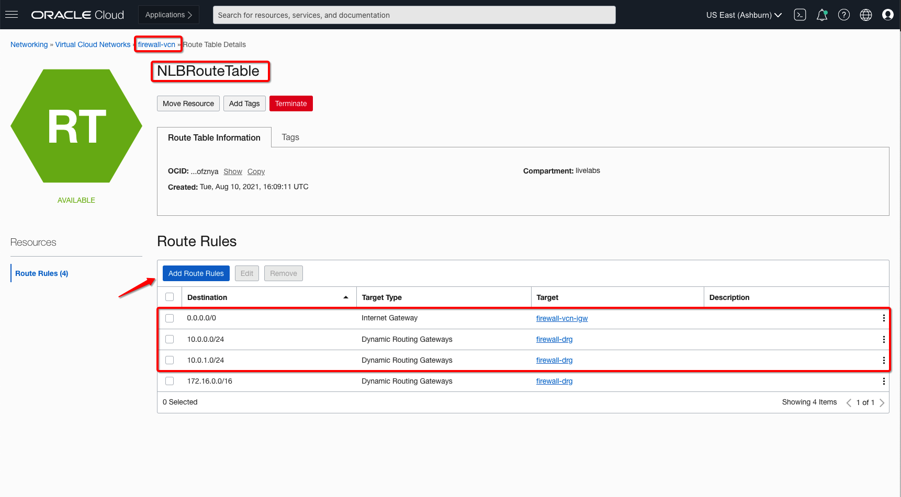

28. Click **Add Route Rules** to finish.

## **Task 6: Verify Route Tables associated to Subnets and Gateways**

1. Below table includes neccessary subnets in each **VCNs** and make sure **Route Table** are attached to right subnets and service gateway. 

    | VCN          | Resource Name/Type                       | Route Table Name                |
    |--------------|------------------------------------------|---------------------------------|
    | firewall-vcn | mgmt-subnet/Subnet                       | DefaultRouteTable               |
    | firewall-vcn | diag-subnet/Subnet                       | DefaultRouteTable               |
    | firewall-vcn | outside-subnet/Subnet                    | OutsideRouteTable               |
    | firewall-vcn | inside-subnet/Subnet                     | InsideRouteTable                |
    | firewall-vcn | nlb-subnet/Subnet                        | NLBRouteTable                   |
    | firewall-vcn | Firewall VCN/DRG Firewall VCN Attachment | VCN-INGRESS                     |
    | firewall-vcn | service-gateway/Service Gateway          | SGWRouteTable                   |
    | web-vcn      | application-private/Subnet               | Default Route Table for web-vcn |
    | db-vcn       | database-private/Subnet                  | Default Route Table for db-vcn  |

2. Below example reflects how to attach correct route table based on above table to one of the resource **Service Gateway**:

   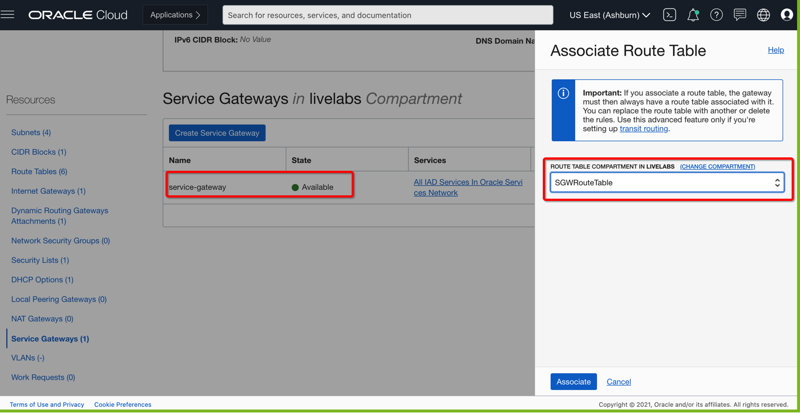

3. Below example reflects how to attach correct route table based on above table to one of the resource **OutsideRouteTable**:

   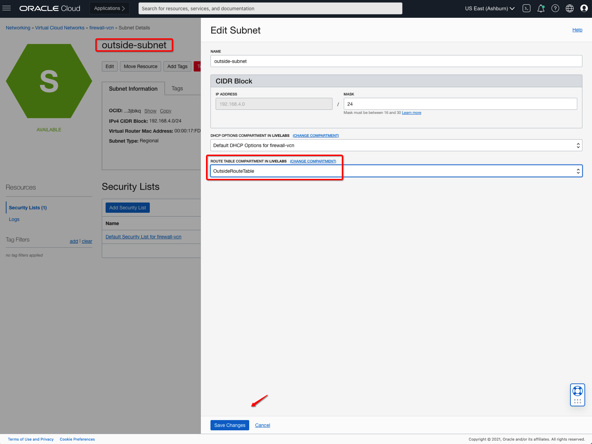

***Congratulations! You have successfully completed the lab.***

You may now [proceed to the next lab](#next).

## Learn More

1. [OCI Training](https://www.oracle.com/cloud/iaas/training/)
2. [Familiarity with OCI console](https://docs.us-phoenix-1.oraclecloud.com/Content/GSG/Concepts/console.htm)
3. [Overview of Networking](https://docs.us-phoenix-1.oraclecloud.com/Content/Network/Concepts/overview.htm)
4. [Overview of Marketplace Applications](https://docs.oracle.com/en-us/iaas/Content/Marketplace/Concepts/marketoverview.htm)
5. [OCI Cisco Secure Firewall Deployment Guide](https://www.cisco.com/c/en/us/td/docs/security/firepower/quick_start/oci/ftdv-oci-gsg/ftdv-oci-deploy.html)

## Acknowledgements

- **Author** - Arun Poonia, Senior Solutions Architect
- **Adapted by** - Cisco
- **Contributors** - N/A
- **Last Updated By/Date** - Arun Poonia, August 2021