# Traffics Validation

## Introduction

In this lab you will be creating required security policies, NAT policies on Secure Firewalls to support different use-case and validate traffics between and from VCNs. 

Estimated Lab Time: 20 minutes.

### Objectives

- Validate North-South Inbound
- Validate North-South Outbound
- Validate East-West (Web to Database & Database to Web)
- Validate East-West Traffic (Web & DB Application to Oracle Services Network)

### Prerequisites

- Oracle Cloud Infrastructure paid account credentials (User, Password, Tenant, and Compartment)

## **Task 1: North-South Inbound Traffic**

1. Connect to **FMC1** Firewall Management Center public IP on your local machine's web browser: **https://public_ip** using **admin/Cisco@123** or **password** which you have setup in **Lab3**

2. Navigate to **Policies > Access Control** and click on pencil icon to update **BlockAll** policy name as **TrafficPolicies** and click on **Save**:

3. Add a new rule by clicking on **+ Add Rule** button preset on your **TrafficPolicies** screen. Fill out the dialog box and save configuration by clicking on **+ Add** button:
      - In this lab you will allow all but in production environment make sure you open only required rules. 

    Enter the following information and accept all the defaults
       - **Name**: Enter a user-friendly name; AllowAll
       - **Logging**: Enable Logging
         - Enable check marks to **Log at Beginning of Connection** and **Log at End of Connection**

   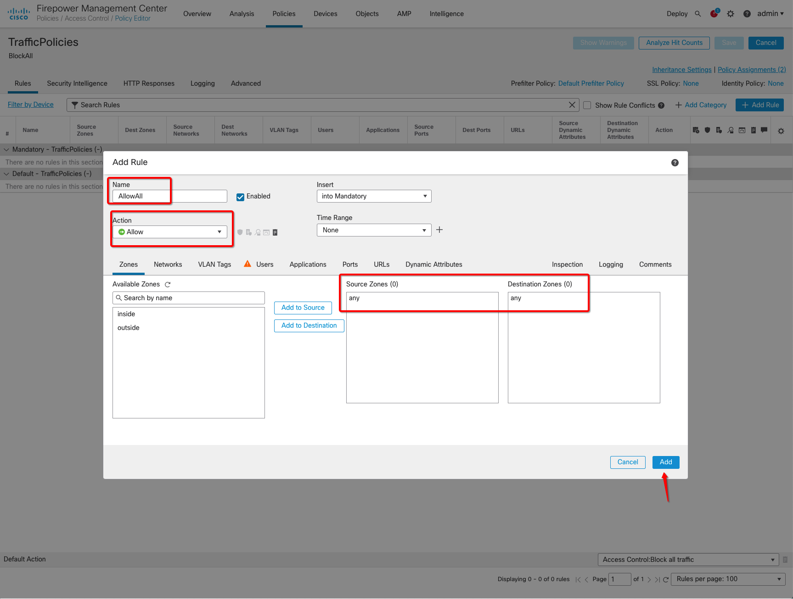

   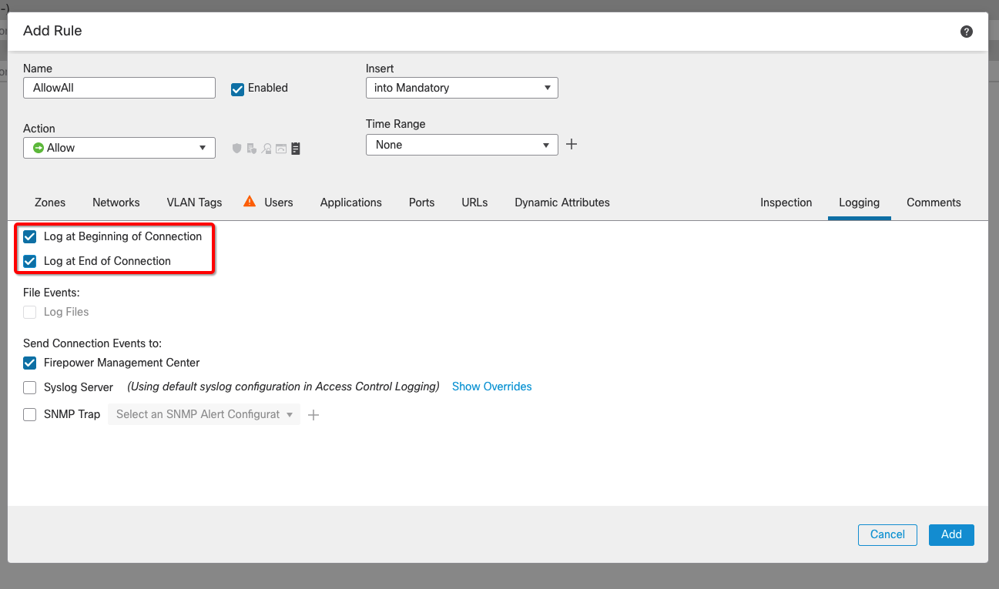

4. Click on **Save** button to save your policy configuration. 

   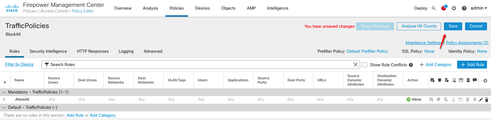

5. You will be creating **NAT Policy** to support traffic to do that navigate to **Devices > NAT**: 

   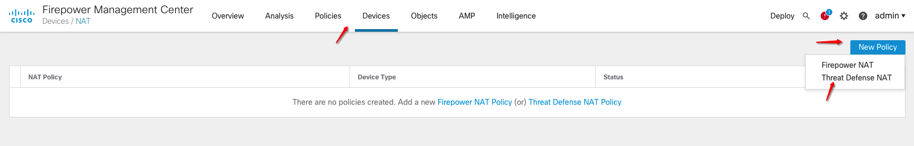

6. Click on **New Policy > Threat Defense NAT** to add new policy. Fill out the dialog box and save configuration by clicking on **Save** button: 

    Enter the following information and accept all the defaults
       - **Name**: Enter a user-friendly name; Inbound-Supporting-NAT
       - **Description**: Enter a user-friendly value; For Inbound Traffic
       - **Selected Devices**: Select **SecureFirewall1** and **SecureFirewall2** from available devices.

    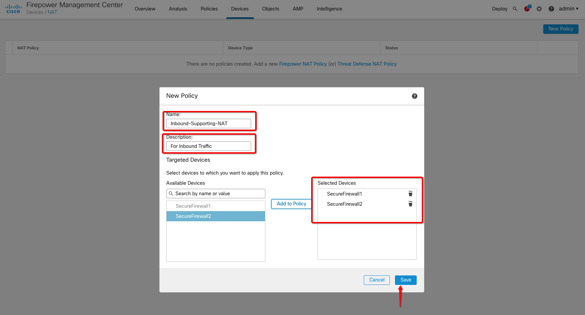                    

7. Click on **+ Add Rule** icon to add two **NAT** rules. Fill out the dialog box and save configuration by clicking on **OK** button: 

    Enter the following information and accept all the defaults for **First** Rule: 
       - **Type**: Static
       - **Interface Objects**:
         - **Source Interface Objects**: Add outside Interface
         - **Destination Interface Objects**: Add inside Interface
       - **Original Packet**:
         - **Original Source**: any
         - **Original Destination**: Create a new host object by clicking on **+** icon with below value:
            - **All-Private**: 0.0.0.0/0 Value
         - **Original Destination Port**: Create a new port object by clicking on **+** icon with below value:
               - **Web-VM-1234**: TCP port 1234 value
       - **Translated Packet**:
         - **Translated Source**: Destination Interface IP
         - **Translated Destination**: Create a new host object by clicking on **+** icon with below value
               - **Web-App1-VM**: Web-App-1 VM Private IP
         - **Translated Destination Port**: SSH 

   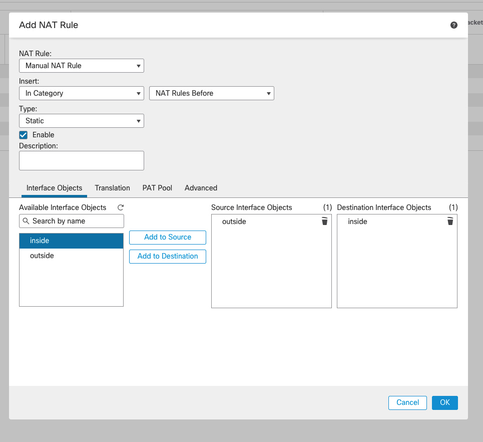

   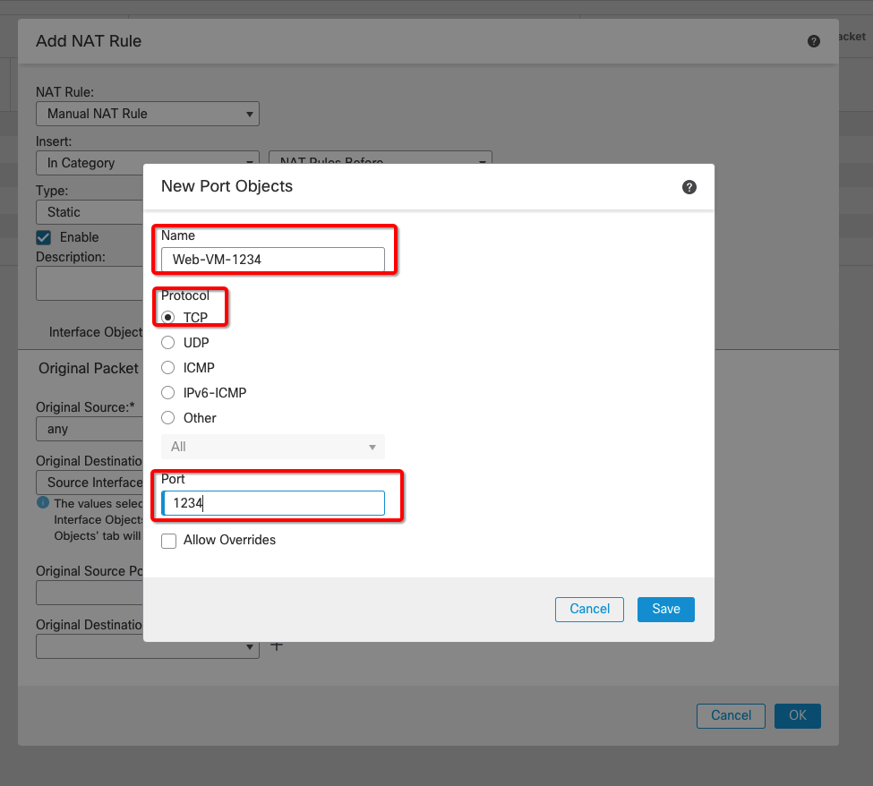

   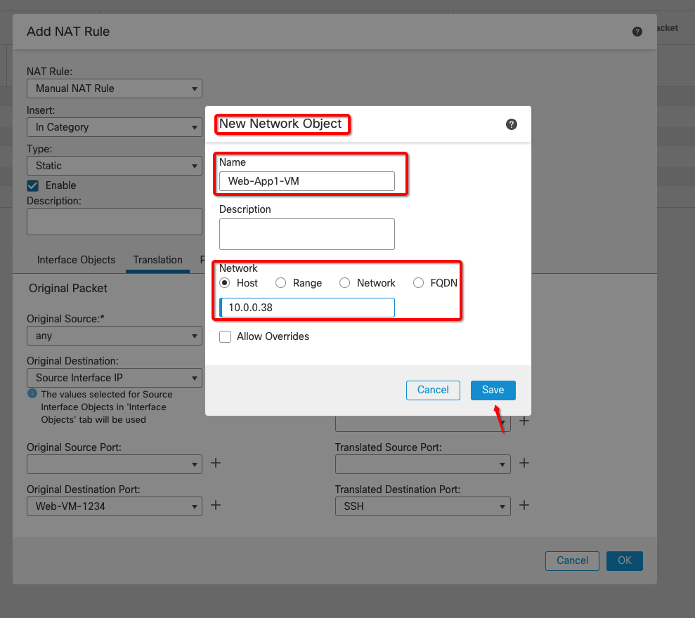

   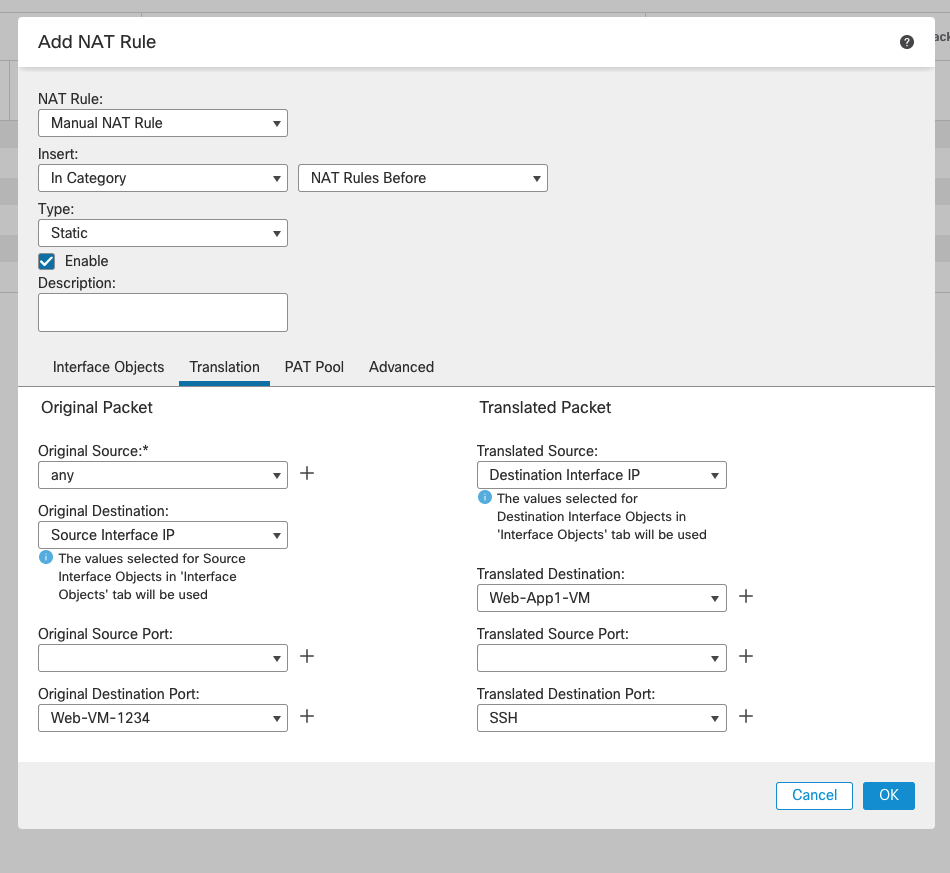

    Enter the following information and accept all the defaults for **Second** Rule: 
       - **Type**: Static
       - **Interface Objects**:
         - **Source Interface Objects**: Add outside Interface
         - **Destination Interface Objects**: Add inside Interface
       - **Original Packet**:
         - **Original Source**: any
         - **Original Destination**: Create a new host object by clicking on **+** icon with below value:
            - **All-Private**: 0.0.0.0/0 Value
         - **Original Destination Port**: Create a new port object by clicking on **+** icon with below value:
               - **DB-VM-1235**: TCP port 1235 value
       - **Translated Packet**:
         - **Translated Source**: Destination Interface IP
         - **Translated Destination**: Create a new host object by clicking on **+** icon with below value
               - **DB-App1-VM**: DB-App-1 VM Private IP
         - **Translated Destination Port**: SSH 

   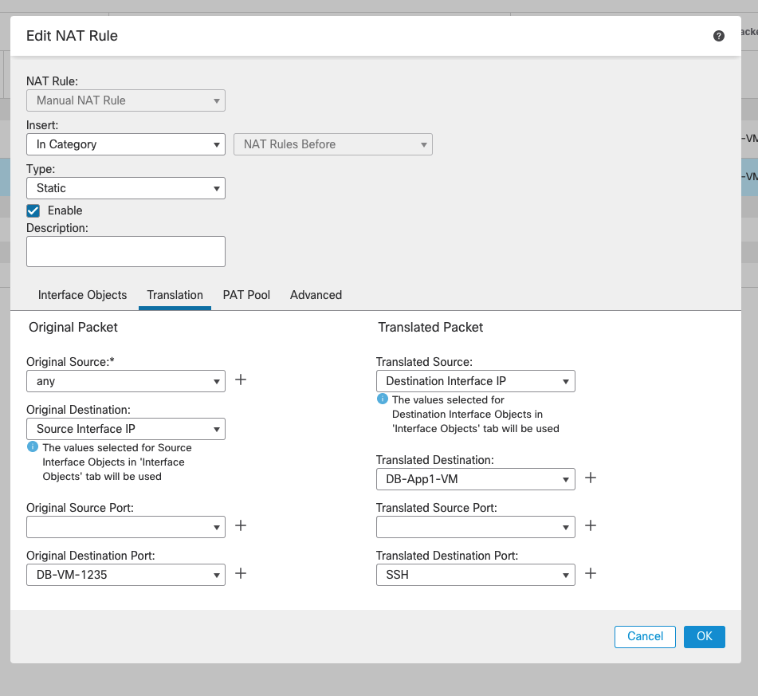

8. Verify that **NAT Rules** are added successfully: 

   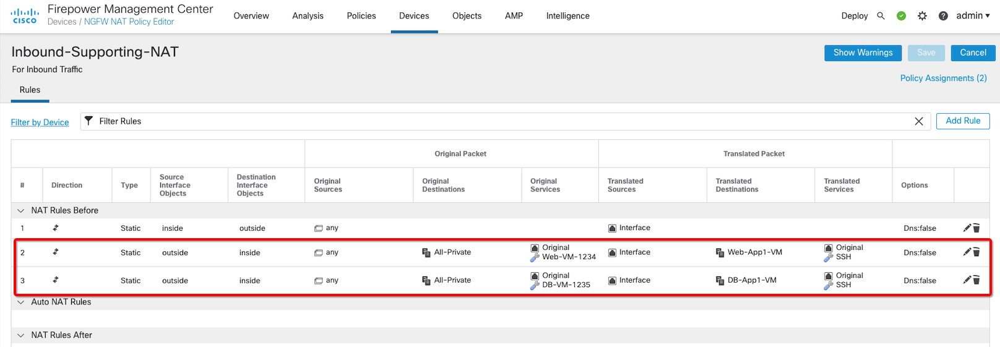

9. Do a sanity check to make sure **firewall policy** is present. 

   

10. Connect to **Web APP1** and **DB APP1** using **CiscoExternalPublicNLB Network Load Balancer Public IP** over **SSH** and unique port as per your configuration:

    | VM       | Port  | IP                                   | Example                       |
    |----------|-------|--------------------------------------|-------------------------------|
    | Web App1 | 1234  | CiscoExternalPublicNLB Network Load Balancer Public IP | ssh opc@150.136.64.143 -p 1234 |
    | DB App1  | 1235  | CiscoExternalPublicNLB Network Load Balancer Public IP | ssh opc@150.136.64.143 -p 1235 |

11. Below diagram validates that Inbound traffic is working towards your DB and Web Spoke VMs. 

   

12. You can also verify that from **Analysis > Connections > Events** on your **FMC** instance.

   

## **Task 2: North-South Outbound Traffic**

1. Connect to **Firewall Management Center** instance public IP on your local machine's web browser: **https://public_ip** using **admin/Cisco@123** or **password** which you have setup in **Lab3**

2. Add a new **NAT** rule by Clicking on **Add Rule** button. Fill out the dialog box and save configuration:

    Enter the following information and accept all the defaults:
       - **Type**: Static
       - **Interface Objects**:
         - **Source Interface Objects**: Add inside Interface
         - **Destination Interface Objects**: Add outside Interface
       - **Original Packet**:
         - **Original Source**: any
       - **Translated Packet**:
         - **Translated Source**: Destination Interface IP

   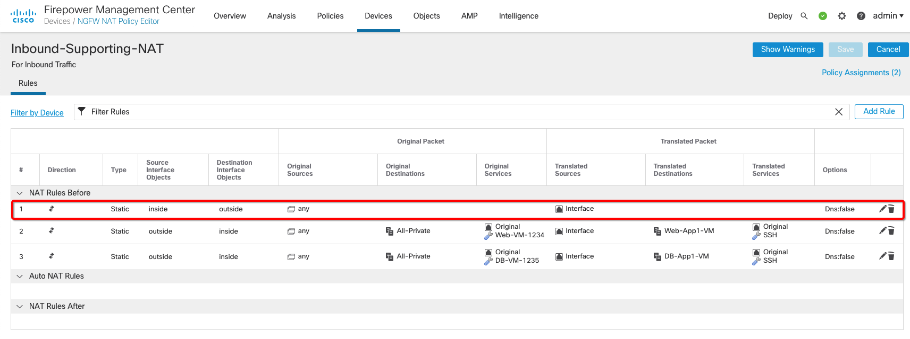

3. Do a sanity check to make sure **firewall policy** is present. 

   

4. Connect to **Web APP1** and **DB APP1** using **CiscoExternalPublicNLB Network Load Balancer Public IP** over **SSH** and unique port as per your configuration: 

    | VM       | Port  | IP                                   | Example                       |
    |----------|-------|--------------------------------------|-------------------------------|
    | Web App1 | 1234  | CiscoExternalPublicNLB Network Load Balancer Public IP | ssh opc@150.136.64.143 -p 1234 |
    | DB App1  | 1235  | CiscoExternalPublicNLB Network Load Balancer Public IP | ssh opc@150.136.64.143 -p 1235 |

5. Initiate a ping to **google.com** or publicly available site connection as per below diagram which validates that Outbound traffic from Web and DB spoke VMs is working fine.

   

6. You can also verify that from **Analysis > Connections > Events** on your **FMC** instance.

   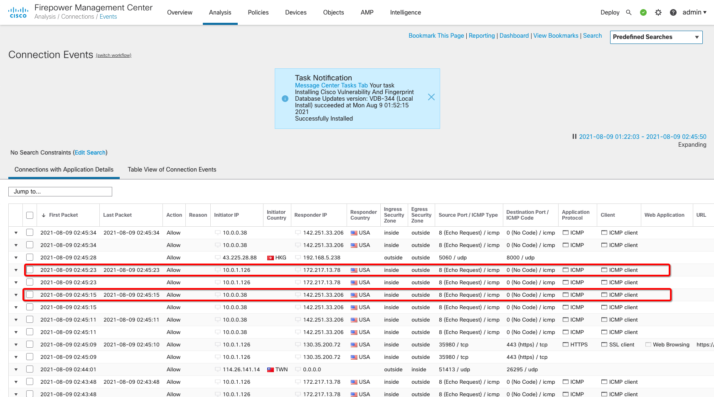

## **Task 3: East-West Traffic (Web to Database & Database to Web)**

1. Connect to **Firewall Management Center** instance public IP on your local machine's web browser: **https://public_ip** using **admin/Cisco@123** or **password** which you have setup in **Lab3**

2. Do a sanity check to make sure **firewall policy** is present. 

   

3. Connect to **Web APP1** and **DB APP1** using **CiscoExternalPublicNLB Network Load Balancer Public IP** over **SSH** and unique port as per your configuration: 

    | VM       | Port  | IP                                   | Example                       |
    |----------|-------|--------------------------------------|-------------------------------|
    | Web App1 | 1234  | CiscoExternalPublicNLB Network Load Balancer Public IP | ssh opc@150.136.64.143 -p 1234 |
    | DB App1  | 1235  | CiscoExternalPublicNLB Network Load Balancer Public IP | ssh opc@150.136.64.143 -p 1235 |

4. Initiate a ping between **Web App1** and **DB App1** VM and vice-versa as per below diagram which validates that traffic between Web and DB spoke VMs is working fine.

   

5. You can also verify that from **Analysis > Connections > Events** on your **FMC** instance.

   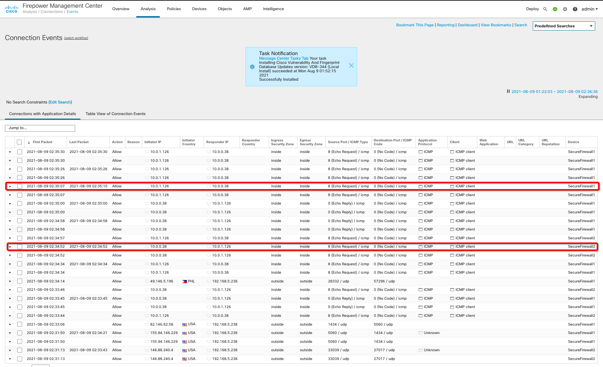

## **Task 4: East-West Traffic (Web & DB Application to Oracle Services Network)**

1. From the OCI Services menu, click **Buckets** under **Storage**. Select your region on right part of the screen:

   

2. Below table represents what you will be creating. Click on **Create Bucket** icon to create new **Bucket**:

      | Bucket Name               | Bucket Type    | Comment                                                    |
      |---------------------------|----------------|------------------------------------------------------------|
      | security-bucket           | Standard       | You will be adding an object and creating pre-auth URL     |

3. Fill out the dialog box:

      - **Bucket NAME**: Provide a name
      - **COMPARTMENT**: Ensure your compartment is selected
      - **Bucket Type**: Standard

   

4. Verify all the information and Click **Create**.

5. This will create a Bucket with following components.

    *Standard Bucket*

6. Upload a Object and Create **Pre-Auth** URL which you will be using to access the object from **Web** or **DB** spoke VMs. 
   
    - In your case you can upload an image object for test purpose.

   

7. Once you complete **Pre-Authentication Request** a Details dialog box pops up, copy the URL which you will be using to access uploaded Object. 

8. Connect to **Firewall Management Center** instance public IP on your local machine's web browser: **https://public_ip** using **admin/Cisco@123** or **password** which you have setup in **Lab3**

9. Navigate to **FMC Console** and based on below table create a static route for your **Object Storage Networks** within your **region** on each device i.e. **SecureFirewall1** and **SecureFirewall2**: 

   | Interface              | Selected Network                                                    | Gateway                           | Comment                                                                        |
   |------------------------|---------------------------------------------------------------------|-----------------------------------|--------------------------------------------------------------------------------|
   | inside                 | New Address Object; object-storage-network with 134.70.0.0/16 value | inside-subnet-gateway 192.168.3.1 | Ensure that you add Object Storage Networks addresses range as per your region |

10. Below image shows value for **SecureFirewall1** instance: 

   

11. Below image shows value for **SecureFirewall2** instance: 

   

12. Do a sanity check to confirm routes are added successfully on both Secure Firewall instances: 

   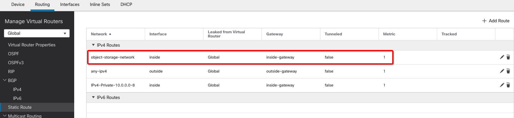

13. Create a **NAT Rule** in your existing policy to ensure that traffic from inside towards Object Storage Networks gets **source NATed** to inside interface IP address. Click on **Add Rule** and add a rule at position **#2**. Fill out the dialog box: 

    Enter the following information and accept all the defaults:
       - **Type**: Static
       - **Interface Objects**:
         - **Source Interface Objects**: Add inside Interface
         - **Destination Interface Objects**: Add inside Interface
       - **Original Packet**:
         - **Original Source**: any
         - **Original Destination**: Use host object **object-storage-network** created earlier.
       - **Translated Packet**:
         - **Translated Source**: Destination Interface IP
         - **Translated Destination**: Use host object **object-storage-network** created earlier. 

    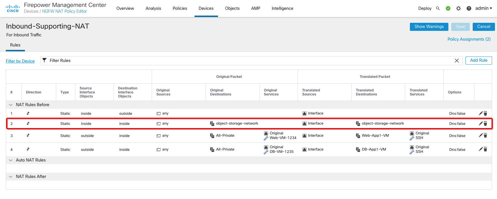

14. Do a sanity check to make sure **firewall policy** is present. 

   

15. Connect to **Web APP1** and **DB APP1** using **CiscoExternalPublicNLB Network Load Balancer Public IP** over **SSH** and unique port as per your configuration: 

    | VM       | Port  | IP                                   | Example                       |
    |----------|-------|--------------------------------------|-------------------------------|
    | Web App1 | 1234  | CiscoExternalPublicNLB Network Load Balancer Public IP | ssh opc@150.136.64.143 -p 1234 |
    | DB App1  | 1235  | CiscoExternalPublicNLB Network Load Balancer Public IP | ssh opc@150.136.64.143 -p 1235 |

16. Do a **wget** to **Pre-Authentication Request** which you created earlier from Web and DB spoke VMs and you should get a response back.

   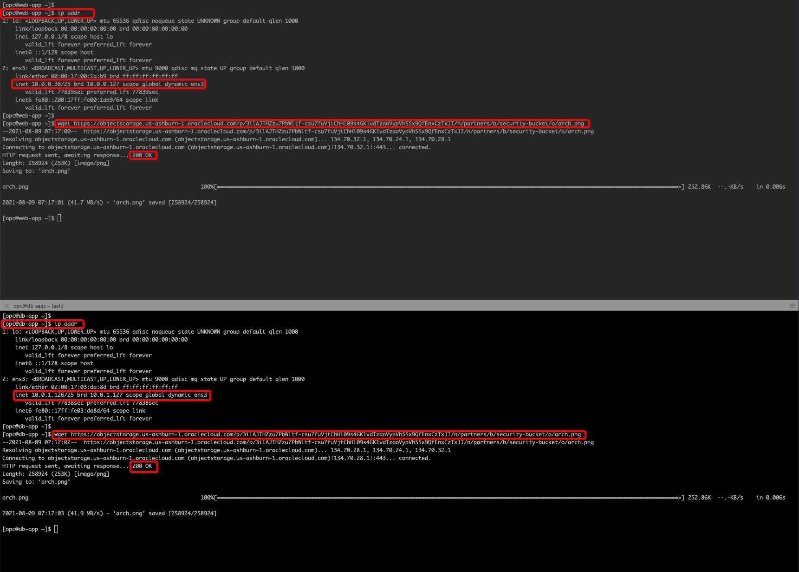

17. You can also verify that from **Analysis > Connections > Events** on your **FMC** instance.

   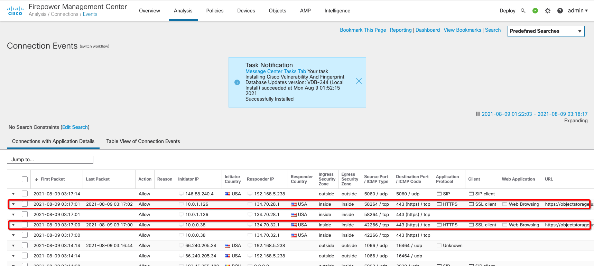

***Congratulations! You have successfully completed the lab.***

You may now [proceed to the next lab](#next).

## Learn More

1. [OCI Training](https://www.oracle.com/cloud/iaas/training/)
2. [Familiarity with OCI console](https://docs.us-phoenix-1.oraclecloud.com/Content/GSG/Concepts/console.htm)
3. [Overview of Networking](https://docs.us-phoenix-1.oraclecloud.com/Content/Network/Concepts/overview.htm)
4. [Overview of Marketplace Applications](https://docs.oracle.com/en-us/iaas/Content/Marketplace/Concepts/marketoverview.htm)
5. [OCI Cisco Secure Firewall Deployment Guide](https://www.cisco.com/c/en/us/td/docs/security/firepower/quick_start/oci/ftdv-oci-gsg/ftdv-oci-deploy.html)

## Acknowledgements

- **Author** - Arun Poonia, Senior Solutions Architect
- **Adapted by** - Cisco
- **Contributors** - N/A
- **Last Updated By/Date** - Arun Poonia, August 2021