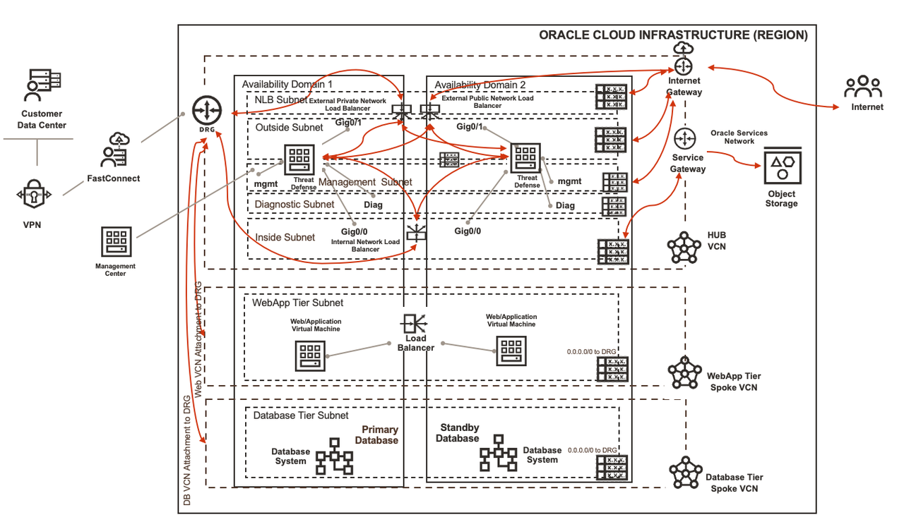

# Introduction

Oracle Cloud Infrastructure is responsible for securing the infrastructure that runs all the services offering by Oracle Cloud Infrastructure. This infrastructure is composed of the hardware, software, networking, and facilities that run Oracle Cloud Infrastructure services. Customer's responsibility is tied to which service they select on Oracle Cloud Infrastructure. Since its a shared security model, it becomes critical to secure your workloads. In this workshop you will be using OCI's partner Cisco's Secure Firewall solution to secure your workloads. 

This workshop will cover automated and step-by-step(manual) approaches which you can follow to deploy your required components on Oracle Cloud Infrastructure with Cisco solution.

Since you will be using OCI Marketplace's product (Secure Firewall) so make sure you have access to **BYOL Listings** available on Oracle Cloud Infrastructure Marketplace which allows you to have a trial 90-day license, but you can procure license from Cisco Partner via Partner Manager/Directly. 

## Secure Firewall Solution

Oracle Cloud Infrastructure's partner Cisco's **Secure Firewall** solution is available on OCI Marketplace. You can use this solution with different use-cases to secure your workloads. This workshop will cover **Active-Active** use-case where you can deploy the solution using flexible network load balancer and secure the workloads with **Secure Firewall(s)**. 

Attached below is a sample architecture of the solution:

   

Estimated time: 120 minutes

### Objectives

   - Provision the infrastructure using Oracle Resource Manager i.e. Terraform
   - Provision and configure the infrastructure manually 
   - Learn to Deploy Secure Firewall instances using marketplace i.e. partner images
   - Configure Secure Firewalls to support active-active use-case 
   - Validate and inspect the traffic via Secure Firewalls
   - Destroy the infrastructure using Oracle Resource Manager or Manually.

### Prerequisites

   - Oracle Cloud Infrastructure paid account credentials (User, Password, Tenant, and Compartment)

   **PLEASE READ**: You must have a valid **Oracle Cloud Infrastructure paid account** which allows you to access at a minimum **BYOL** Marketplace listing.

   **Getting Started** section includes instructions to create a new free trial account, please convert that account as pay you go so you can consume marketplace listings.

   - Access to Oracle Cloud Marketplace **BYOL** listings.
      - **Cisco Firepower Management Center (FMCv)**
      - **Cisco Firepower NGFW virtual firewall (NGFWv)**

#### Let's get Started!

You may now [proceed to the labs](#next).

## Learn More

1. [OCI Training](https://www.oracle.com/cloud/iaas/training/)
2. [Familiarity with OCI console](https://docs.us-phoenix-1.oraclecloud.com/Content/GSG/Concepts/console.htm)
3. [Overview of Networking](https://docs.us-phoenix-1.oraclecloud.com/Content/Network/Concepts/overview.htm)
4. [Overview of Marketplace Applications](https://docs.oracle.com/en-us/iaas/Content/Marketplace/Concepts/marketoverview.htm)
5. [OCI Cisco Secure Firewall Deployment Guide](https://www.cisco.com/c/en/us/td/docs/security/firepower/quick_start/oci/ftdv-oci-gsg/ftdv-oci-deploy.html)

## Acknowledgements

- **Author** - Arun Poonia, Senior Solutions Architect
- **Adapted by** - Cisco
- **Contributors** - N/A
- **Last Updated By/Date** - Arun Poonia, August 2021