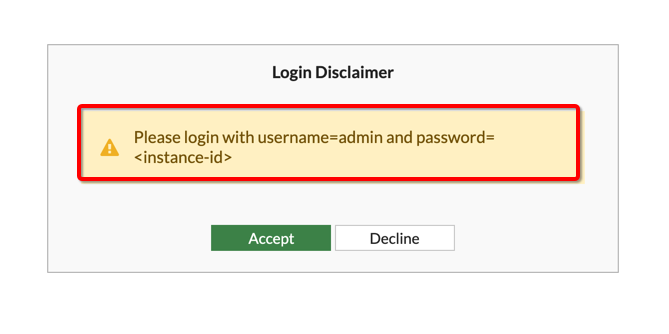
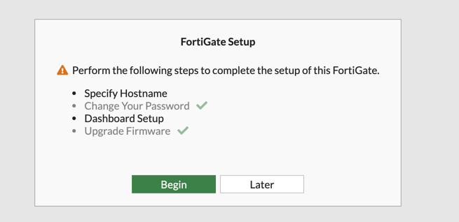
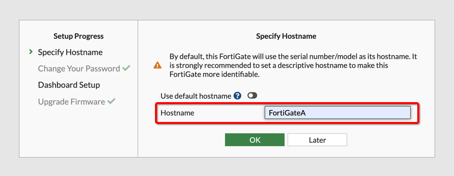
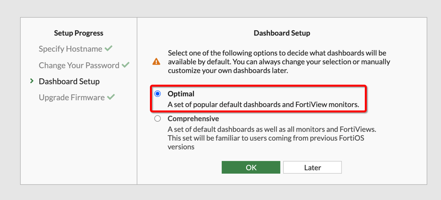
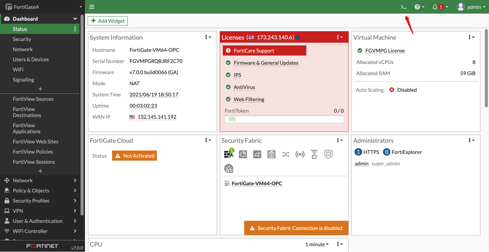
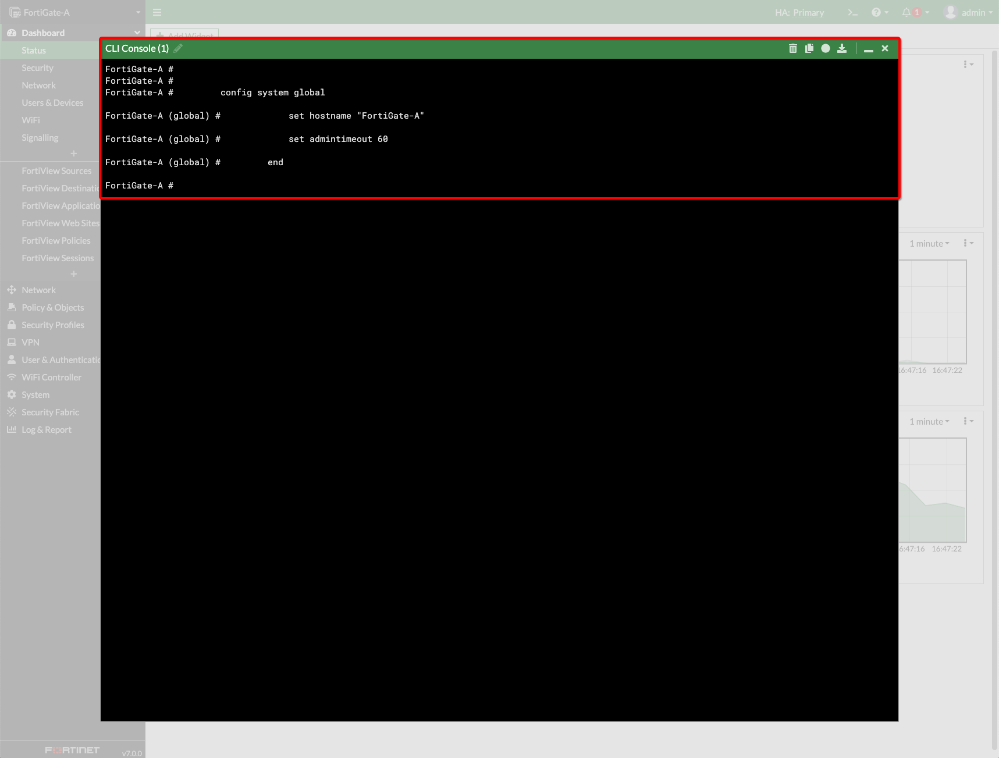
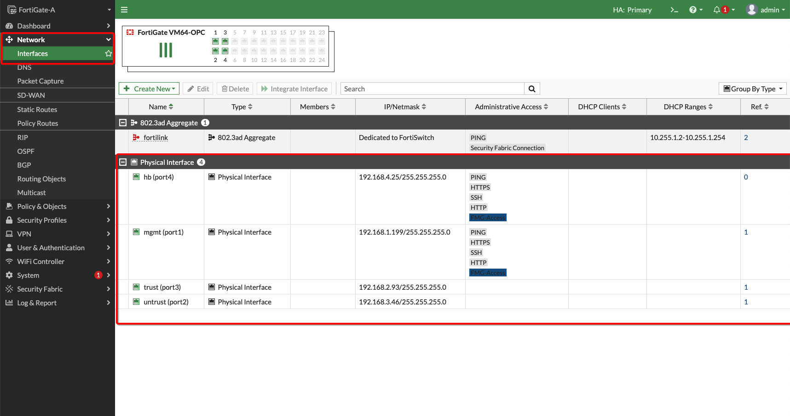
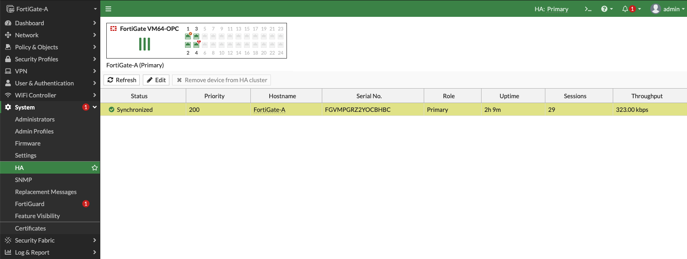
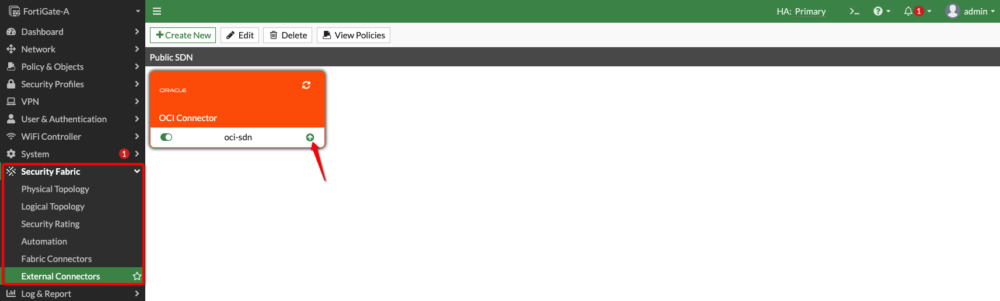
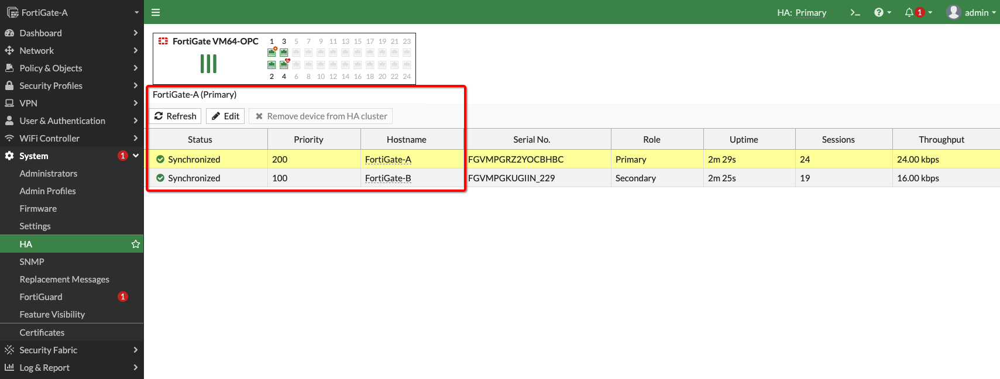

# Configure FortiGate Firewalls

## Introduction

In this lab you will be configuring FortiGate firewalls initial configuration, hostnames, interfaces, high availability, external OCI connector and route tables to support traffic between VCNs.

Estimated Lab Time: 20 minutes.

### Objectives

- Initial Configuration on Primary FortiGate
- Initial Configuration on Secondary FortiGate

### Prerequisites

- Oracle Cloud Infrastructure paid account credentials (User, Password, Tenant, and Compartment)  

## **Task 1: Initial Configuration on Primary FortiGate**

1. Connect to **FortiGate1** instance public IP on your local machine's web browser: **https://public_ip**. It will ask you to use instance OCID to login the first time as below. 

   

2. Update default old password with new password value:
    - For example in your case you can chose **fortinet** as password so next time you login to FortiGate GUI, you will be using **admin/fortinet** to login. 

3. Re-Login to **FortiGate1** GUI using new password and update initial configuration: 

   

   

   

4. Connect to **CLI** on your initial login to **FortiGate1** Instance by clicking to terminal icon as below, this will prompt a CLI window where you will be adding configuration in your next steps: 

   

5. Copy below configuration and paste in **CLI Console** to update **FortiGate1** hostname:

      ```
      <copy>
        config system global
            set hostname "FortiGate-A"
            set admintimeout 60
        end
      </copy>
      ```

   

6. Update below configuration based on your **FortiGate1** instance value and paste in **CLI Console** for **FortiGate1** interfaces:

    | Interface | IP Address                                                             | Subnet Mask                                                                                | Comment |
    |-----------|------------------------------------------------------------------------|--------------------------------------------------------------------------------------------|---------|
    | port1     | ${mgmt-ip}: Mgmt Interface Private IP                                  | ${mgmt-ip-mask}: Mgmt Interface Subnet Mask; Example: 255.255.255.0                        | N/A     |
    | port2     | ${untrust-floating-private-ip}: Untrust Interface Secondary Private IP | ${untrust-floating-private-ip-mask}: Untrust Interface Subnet Mask; Example: 255.255.255.0 | N/A     |
    | port3     | ${trust-floating-private-ip}: Trust Interface Secondary Private IP     | ${trust-floating-private-ip-mask}: Trust Interface Subnet Mask; Example: 255.255.255.0     | N/A     |
    | port4     | ${hb-ip}: HA Interface Private IP                                      | ${hb-ip-mask}: HA Interface Subnet Mask; Example: 255.255.255.0                            | N/A     |

      ```
      <copy>
        config system interface
            edit port1
                set ip ${mgmt-ip} ${mgmt-ip-mask}
                set allowaccess ping https ssh http fgfm
                set type physical
                set alias mgmt
                set description "mgmt"
                set mtu-override enable
                set mtu 9000
            next
        end
        config system interface
            edit port2
                set mode static     
                set vdom "root"
                set ip ${untrust-floating-private-ip} ${untrust-floating-private-ip-mask}
                set type physical
                set description "Untrust"
                set alias untrust
                set mtu-override enable
                set mtu 9000
                set secondary-IP enable
            next
        end
        config system interface
            edit port3
                set mode static        
                set vdom "root"
                set ip ${trust-floating-private-ip} ${trust-floating-private-ip-mask}
                set type physical
                set description "Trust"
                set alias trust
                set mtu-override enable
                set mtu 9000
            next
        end
        config system interface
            edit port4
                set mode static
                set ip ${hb-ip} ${hb-ip-mask}
                set allowaccess ping https ssh http fgfm
                set type physical
                set description "HA"
                set alias hb
                set mtu-override enable
                set mtu 9000
            next
        end
      </copy>
      ```

5. Update below configuration based on your **FortiGate1** instance value and paste in **CLI Console** for **FortiGate1** static routes:

    | Gateway           | Value                               |
    |-------------------|-------------------------------------|
    | untrust-subnet-gw | Untrust Subnet Gateway: 192.168.3.1 |
    | trust-subnet-gw   | Trust Subnet Gateway: 192.168.2.1   |
    | vcn-cidr          | Spoke VCNs CIDR: 10.0.0.0/8         |

      ```
      <copy>
        config router static
            edit 1        
                set gateway ${untrust-subnet-gw}
                set device port2
            next
            edit 2
                set dst ${vcn-cidr}
                set gateway ${trust-subnet-gw}
                set device port3
            next
        end
      </copy>
      ```

6. Update below configuration based on your **FortiGate1** instance value and paste in **CLI Console** for **FortiGate1** OCI SDN Connector:

    | Parameter                | Value                                                                             |
    |--------------------------|-----------------------------------------------------------------------------------|
    | tenancy-ocid             | User's Tenancy OCID: Example: ocid1.tenancy.oc1..aaaaaXXXX                        |
    | compute-compartment-ocid | FortiGate Instances Compute Compartment OCIDs: Example: ocid1.compartment.oc1..XXa|

      ```
      <copy>
        config system sdn-connector
            edit "oci-sdn"
                set type oci
                set ha-status enable
                set tenant-id ${tenancy-ocid}
                set compartment-id ${compute-compartment-ocid}
            next
        end
      </copy>
      ```

7. Update below configuration based on your **FortiGate1** instance value and paste in **CLI Console** for **FortiGate1** High Availability Cluster:

    | Parameter      | Value                              |
    |----------------|------------------------------------|
    | mgmt-subnet-gw | Mgmt Subnet Gateway: 192.168.1.1   |
    | hb-peer-ip     | FortiGate2 HA Interface Private IP |

      ```
      <copy>
        config system ha
            set group-id 30
            set group-name "ha-cluster"
            set mode a-p
            set hbdev "port4" 50
            set session-pickup enable
            set session-pickup-connectionless enable
            set ha-mgmt-status enable
            config ha-mgmt-interfaces
                edit 1
                    set interface "port1"
                    set gateway ${mgmt-subnet-gw}  
                next
            end
            set override disable
            set priority 200
            set unicast-hb enable
            set unicast-hb-peerip ${hb-peer-ip}
        end
      </copy>
      ```

8. Do a sanity check and verify that configuration which you pushed are there on **FortiGate1** instance:

   

   

   


## **Task 2: Initial Configuration on Secondary FortiGate**

1. Connect to **FortiGate2** instance public IP on your local machine's web browser: **https://public_ip**. It will ask you to use instance OCID to login the first time as below. 

   

2. Update default old password with new password value:
    - For example, in your case you can chose **fortinet** as password so next time you login to FortiGate GUI, you will be using **admin/fortinet** to login. 

3. Re-Login to **FortiGate2** GUI using new password and update initial configuration: 

   

   

   

4. Connect to **CLI** on your initial login to **FortiGate2** Instance by clicking to terminal icon as below, this will prompt a CLI window where you will be adding configuration in your next steps: 

   

5. Copy below configuration and paste in **CLI Console** to update **FortiGate2** hostname:

      ```
      <copy>
        config system global
            set hostname "FortiGate-B"
            set admintimeout 60
        end
      </copy>
      ```

6. Update below configuration based on your **FortiGate2** instance value and paste in **CLI Console** for **FortiGate2** interfaces:

    | Interface | IP Address                                                             | Subnet Mask                                                                                | Comment |
    |-----------|------------------------------------------------------------------------|--------------------------------------------------------------------------------------------|---------|
    | port1     | ${mgmt-ip}: Mgmt Interface Private IP                                  | ${mgmt-ip-mask}: Mgmt Interface Subnet Mask; Example: 255.255.255.0                        | N/A     |
    | port4     | ${hb-ip}: HA Interface Private IP                                      | ${hb-ip-mask}: HA Interface Subnet Mask; Example: 255.255.255.0                            | N/A     |

      ```
      <copy>
        config system interface
            edit port1
                set ip ${mgmt-ip} ${mgmt-ip-mask}
                set allowaccess ping https ssh http fgfm
                set type physical
                set alias mgmt
                set description "mgmt"
                set mtu-override enable
                set mtu 9000
            next
        end
        config system interface
            edit port4
                set mode static
                set ip ${hb-ip} ${hb-ip-mask}
                set allowaccess ping https ssh http fgfm
                set type physical
                set description "HA"
                set alias hb
                set mtu-override enable
                set mtu 9000
            next
        end
      </copy>
      ```

7. Update below configuration based on your **FortiGate2** instance value and paste in **CLI Console** for **FortiGate2** High Availability Cluster:

    | Parameter      | Value                              |
    |----------------|------------------------------------|
    | mgmt-subnet-gw | Mgmt Subnet Gateway: 192.168.1.1   |
    | hb-peer-ip     | FortiGate1 HA Interface Private IP |

      ```
      <copy>
        config system ha
            set group-id 30
            set group-name "ha-cluster"
            set mode a-p
            set hbdev "port4" 50
            set session-pickup enable
            set session-pickup-connectionless enable
            set ha-mgmt-status enable
            config ha-mgmt-interfaces
                edit 1
                    set interface "port1"
                    set gateway ${mgmt-subnet-gw}  
                next
            end
            set override disable
            set priority 100
            set unicast-hb enable
            set unicast-hb-peerip ${hb-peer-ip}
        end
      </copy>
      ```

    **NOTE:** As soon as you enter this HA configuration **FortiGate2** will stop responding on UI/SSH by design since it's standby instance of HA cluster and it becomes healthy on failover of Primary Instance. 

    **NOTE:** Some Configuration like **static routes**, **port3** and **port4** get pushed to this instance during HA sync so you don't have to worry about that. 

8. Connect to **FortiGate1** instance's GUI and validate that HA configuration sync is complete, it might take few minutes to reflect that. 

   

***Congratulations! You have successfully completed the lab.***

You may now [proceed to the next lab](#next).

## Learn More

1. [OCI Training](https://cloud.oracle.com/en_US/iaas/training)
2. [Familiarity with OCI console](https://docs.us-phoenix-1.oraclecloud.com/Content/GSG/Concepts/console.htm)
3. [Overview of Networking](https://docs.us-phoenix-1.oraclecloud.com/Content/Network/Concepts/overview.htm)
4. [Familiarity with Compartment](https://docs.us-phoenix-1.oraclecloud.com/Content/GSG/Concepts/concepts.htm)
5. [Connecting to a compute instance](https://docs.us-phoenix-1.oraclecloud.com/Content/Compute/Tasks/accessinginstance.htm)
6. [OCI FortiGate Administration Guide](https://docs.fortinet.com/document/fortigate-public-cloud/7.0.0/oci-administration-guide/16658/about-fortigate-vm-for-oci)

## Acknowledgements

- **Author** - Arun Poonia, Senior Solutions Architect
- **Adapted by** - Fortinet
- **Contributors** - N/A
- **Last Updated By/Date** - Arun Poonia, July 2021