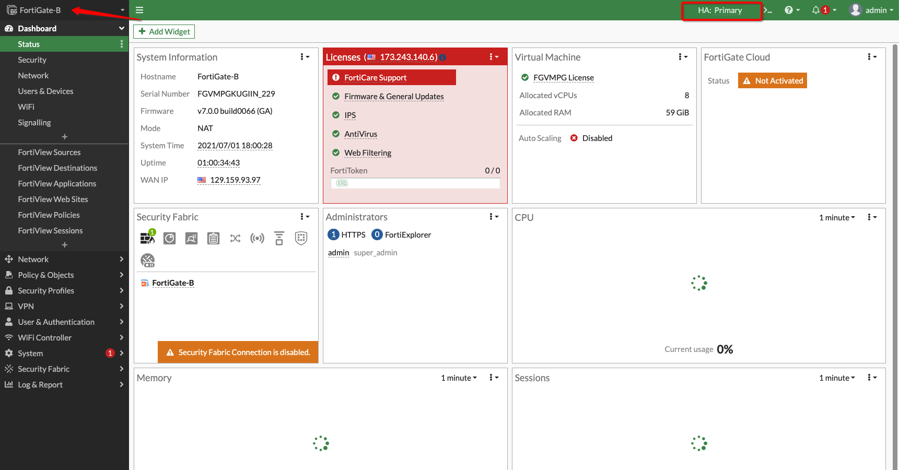

# Traffics and High Availability Validation

## Introduction

In this lab you will be creating required security policies on FortiGate Firewalls to support different use-case and validate traffics between and from VCNs. In the end you will stop/reboot primary instance to ensure that floating IPs moves to Secondary **FortiGate** instance.

Estimated Lab Time: 20 minutes.

### Objectives

- Validate North-South Inbound
- Validate North-South Outbound
- Validate East-West (Web to Database & Database to Web)
- Validate East-West Traffic (Web & DB Application to Oracle Services Network)
- Validate HA Failover to Secondary FortiGate Instance

### Prerequisites

- Oracle Cloud Infrastructure paid account credentials (User, Password, Tenant, and Compartment)

## **Task 1: North-South Inbound Traffic**

1. Connect to **FortiGate1** instance public IP on your local machine's web browser: **https://public_ip** using **admin/fortinet** or **password** which you have setup in **Lab3**

2. Navigate to **CLI Console** and based on below table create security policies and VIP entries: 

    | Parameter                   | Value                                                                          |
    |-----------------------------|--------------------------------------------------------------------------------|
    | untrust-floating-private-ip | Primary FortiGate Untrust Interface Secondary Private IP;Example: 192.168.3.46 |
    | web-app1-private-ip         | Web Spoke VM1 Private IP; Example: 10.0.0.101                                  |
    | db-app1-private-ip          | DB Spoke VM1 Private IP; Example: 10.0.1.10                                    |

    ```
    <copy>
    config firewall vip
        edit "WebVM"
            set extip ${untrust-floating-private-ip}
            set mappedip "${web-vm1-private-ip}"
            set extintf "port2"
            set portforward enable
            set extport 1234
            set mappedport 22
        next
    end
    config firewall vip
        edit "DBVM"
            set extip ${untrust-floating-private-ip}
            set mappedip "${db-vm1-private-ip}"
            set extintf "port2"
            set portforward enable
            set extport 1235
            set mappedport 22
        next
    end
    config firewall policy
        edit 1
            set name "PublicToSpokeVMs"
            set srcintf "port2"
            set dstintf "port3"
            set srcaddr "all"
            set dstaddr "WebVM" "DBVM"
            set action accept
            set schedule "always"
            set service "ALL"
            set logtraffic all
            set logtraffic-start enable
        next
    end
    </copy>
    ```

3. Do a sanity check to make sure **firewall policy** and **Virtual IPs** are created successfully. 

   

4. Connect to **Web APP1** and **DB APP1** using **FortiGate1 Untrust Interface Floating Public IP** over **SSH** unique port as per your configuration: 

    | VM       | Port  | IP                                   | Example                       |
    |----------|-------|--------------------------------------|-------------------------------|
    | Web App1 | 1234  | Untrust Interface Floating Public IP | ssh opc@129.159.93.97 -p 1234 |
    | DB App1  | 1235  | Untrust Interface Floating Public IP | ssh opc@129.159.93.97 -p 1235 |

5. Below diagram validates that Inbound traffic is working towards your DB and Web Spoke VMs. 

   

6. You can also verify traffic from **Dashboard > FortiView Sessions** on your **FortiGate1** instance.

   

## **Task 2: North-South Outbound Traffic**

1. Connect to **FortiGate1** instance public IP on your local machine's web browser: **https://public_ip** using **admin/fortinet** or **password** which you have setup in **Lab3**

2. Navigate to **CLI Console** and based on below table create security policy to support Outbound connection: 

    ```
    <copy>
    config firewall policy
        edit 2
            set name "TrustToUntrust"
            set srcintf "port3"
            set dstintf "port2"
            set srcaddr "all"
            set dstaddr "all"
            set action accept
            set schedule "always"
            set service "ALL"
            set nat enable
        next
    end
    </copy>
    ```

3. Do a sanity check to make sure **firewall policy** is created successfully. 

   

4. Connect to **Web APP1** and **DB APP1** using **FortiGate1 Untrust Interface Floating Public IP** over **SSH** unique port as per your configuration: 

    | VM       | Port  | IP                                   | Example                       |
    |----------|-------|--------------------------------------|-------------------------------|
    | Web App1 | 1234  | Untrust Interface Floating Public IP | ssh opc@129.159.93.97 -p 1234 |
    | DB App1  | 1235  | Untrust Interface Floating Public IP | ssh opc@129.159.93.97 -p 1235 |

5. Initiate a ping to **google.com** or publicly available site connection as per below diagram which validates that Outbound traffic from Web and DB spoke VMs is working fine.

   

6. You can also verify that from **Dashboard > FortiView Sessions** on your **FortiGate1** instance.

   

## **Task 3: East-West Traffic (Web to Database & Database to Web)**

1. Connect to **FortiGate1** instance public IP on your local machine's web browser: **https://public_ip** using **admin/fortinet** or **password** which you have setup in **Lab3**

2. Navigate to **CLI Console** and based on below table create security policy to support Outbound connection: 

    ```
    <copy>
    config firewall policy
        edit 3
            set name "TrustToTrust"
            set srcintf "port3"
            set dstintf "port3"
            set srcaddr "all"
            set dstaddr "all"
            set action accept
            set schedule "always"
            set service "ALL"
            set nat enable
        next
    end
    </copy>
    ```

3. Do a sanity check to make sure **firewall policy** is created successfully. 

   

4. Connect to **Web APP1** and **DB APP1** using **FortiGate1 Untrust Interface Floating Public IP** over **SSH** unique port as per your configuration: 

    | VM       | Port  | IP                                   | Example                       |
    |----------|-------|--------------------------------------|-------------------------------|
    | Web App1 | 1234  | Untrust Interface Floating Public IP | ssh opc@129.159.93.97 -p 1234 |
    | DB App1  | 1235  | Untrust Interface Floating Public IP | ssh opc@129.159.93.97 -p 1235 |

5. Initiate a ping to **google.com** or publicly available site connection as per below diagram which validates that Outbound traffic from Web and DB spoke VMs is working fine.

   

6. You can also verify that from **Dashboard > FortiView Sessions** on your **FortiGate1** instance.

   

## **Task 4: East-West Traffic (Web & DB Application to Oracle Services Network)**

1. From the OCI Services menu, click **Buckets** under **Storage**. Select your region on right part of the screen:

   

2. Below table represents what you will be creating. Click on **Create Bucket** icon to create new **Bucket**:

      | Bucket Name               | Bucket Type    | Comment                                                    |
      |---------------------------|----------------|------------------------------------------------------------|
      | fortigate-bucket          | Standard       | You will be adding an object and creating pre-auth URL     |

3. Fill out the dialog box:

      - **Bucket NAME**: Provide a name
      - **COMPARTMENT**: Ensure your compartment is selected
      - **Bucket Type**: Standard

   

4. Verify all the information and Click **Create**.

5. This will create a Bucket with following components.

    *Standard Bucket*

6. Upload a Object and Create **Pre-Auth** URL which you will be using to access the object from **Web** or **DB** spoke VMs. 
   
    - In your case you can upload an image object for test purpose.

   

7. Once you complete **Pre-Authentication Request** a Details dialog box pops up, copy the URL which you will be using to access uploaded Object. 

8. Connect to **FortiGate1** instance public IP on your local machine's web browser: **https://public_ip** using **admin/fortinet** or **password** which you have setup in **Lab3**

9. Navigate to **CLI Console** and based on below blob create a static route for your **Object Storage Networks** within your **region**: 

    | Parameter                   | Value                                                                          |
    |-----------------------------|--------------------------------------------------------------------------------|
    | object-storage-network | Object Storage Network;Example: 134.70.0.0/16 so value: 134.17.0.0 |
    | object-storage-mask        | Object Storage Network Mask: for 134.70.0/16 mask will be 255.255.0.0   |
    | db-app1-private-ip          | DB Spoke VM1 Private IP; Example: 10.0.1.10                                    |

    ```
    <copy>
    config router static
        edit 4
            set dst ${object-storage-network} ${object-storage-mask }
            set gateway ${object-storage-mask }
            set device "port3"
        next
    end
    </copy>
    ```

10. Do a sanity check to make sure **firewall policy** is created successfully. 

   

11. Connect to **Web APP1** and **DB APP1** using **FortiGate1 Untrust Interface Floating Public IP** over **SSH** unique port as per your configuration: 

    | VM       | Port  | IP                                   | Example                       |
    |----------|-------|--------------------------------------|-------------------------------|
    | Web App1 | 1234  | Untrust Interface Floating Public IP | ssh opc@129.159.93.97 -p 1234 |
    | DB App1  | 1235  | Untrust Interface Floating Public IP | ssh opc@129.159.93.97 -p 1235 |

12. Do a **wget** to **Pre-Authentication Request** which you created earlier from Web and DB spoke VMs and you should get a response back.

   

13. You can also verify that from **Dashboard > FortiView Sessions** on your **FortiGate1** instance.

   

## **Task 5: High Availability Failover Validation**

1. Navigate to **FortiGate1** instance attached VNIC details page and verify that **Untrust** and/or **Trust** interface has floating secondary IPs are available on primary instance. 

   

2. Reboot primary **FortiGate1** instance which will trigger failover automatically to **FortiGate2** instance. 

   

3. Within few seconds **FortiGate2** instance should come up online/reachable and once you connect to **FortiGate2** GUI using **admin/fortinet** credentials or password which you had setup in **Lab3**. You should see it became primary instance. 

   

4. Navigate to **FortiGate2** instance attached VNIC details page and verify that **Untrust** and **Trust** interface floating IPs has moved from **FortiGate1** instance. 

   

   

5. You can verify that **FortiGate2** is primary and **FortiGate1** is secondary in your HA cluster:

   

***Congratulations! You have successfully completed the lab.***

You may now [proceed to the next lab](#next).

## Learn More

1. [OCI Training](https://cloud.oracle.com/en_US/iaas/training)
2. [Familiarity with OCI console](https://docs.us-phoenix-1.oraclecloud.com/Content/GSG/Concepts/console.htm)
3. [Overview of Networking](https://docs.us-phoenix-1.oraclecloud.com/Content/Network/Concepts/overview.htm)
4. [Familiarity with Compartment](https://docs.us-phoenix-1.oraclecloud.com/Content/GSG/Concepts/concepts.htm)
5. [Connecting to a compute instance](https://docs.us-phoenix-1.oraclecloud.com/Content/Compute/Tasks/accessinginstance.htm)
6. [OCI FortiGate Administration Guide](https://docs.fortinet.com/document/fortigate-public-cloud/7.0.0/oci-administration-guide/16658/about-fortigate-vm-for-oci)

## Acknowledgements

- **Author** - Arun Poonia, Senior Solutions Architect
- **Adapted by** - Fortinet
- **Contributors** - N/A
- **Last Updated By/Date** - Arun Poonia, July 2021