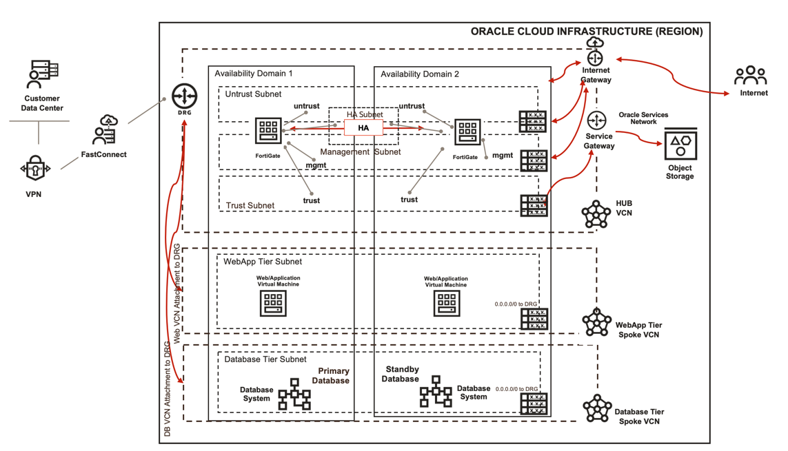

# Introduction

Oracle Cloud Infrastructure is responsible for securing the infrastructure that runs all the services offering by Oracle Cloud Infrastructure. This infrastructure is composed of the hardware, software, networking, and facilities that run Oracle Cloud Infrastructure services. Customer's responsibility is tied to which service they select on Oracle Cloud Infrastructure. Since its a shared security model, it becomes critical to secure your workloads. In this workshop you will be using OCI's partner Fortinet's FortiGate solution to secure your workloads. 

This workshop will cover step-by-step(manual) and automated approach which you can follow to deploy required components on Oracle Cloud Infrastructure with FortiGate solution.

Since you will be using OCI Marketplace's product (FortiGate) so make sure you have access to **Paid Listings** available on Oracle Cloud Infrastructure Marketplace which allows you to have an active license. 

## FortiGate Solution

Oracle Cloud Infrastructure's partner Fortinet's **FortiGate** solution is available on OCI Marketplace. You can use this solution with different use-cases to secure your workloads. In this workshop will cover High-Availability use-case where you can deploy the solution in active-passive mode and secure the workloads using **FortiGate(s)**. 

Attached below is a sample architecture of the solution:

   

Estimated time: 120 minutes

### Objectives

   - Provision the infrastructure using Oracle Resource Manager i.e. Terraform
   - Provision and configure the infrastructure manually 
   - Learn to Deploy FortiGate instances using marketplace i.e. partner images
   - Configure FortiGate Firewalls to support high availability use-case 
   - Validate and inspect the traffic via FortiGate Firewalls
   - Destroy the infrastructure using Oracle Resource Manager or Manually.

### Prerequisites

   - Oracle Cloud Infrastructure paid account credentials (User, Password, Tenant, and Compartment)

   **PLEASE READ**: You must have a valid **Oracle Cloud Infrastructure paid account** which allows you to access at a minimum **BYOL** Marketplace listing and paid listings depends on which country you are coming from. **Getting Started** section includes instructions to create a new free trial account, please convert that account as pay you go so you can consume marketplace listings.

   - Access to Oracle Cloud Marketplace listings **BYOL** and/or **PAID** listings.

   **PLEASE READ**: If you don't have access to paid listings, you can still follow manual steps outlined in this workshop using **BYOL** listing on marketplace. You will have to procure license on your own.

#### Let's get Started!

You may now [proceed to the labs](#next).

## Learn More

1. [OCI Training](https://www.oracle.com/cloud/iaas/training/)
2. [Familiarity with OCI console](https://docs.us-phoenix-1.oraclecloud.com/Content/GSG/Concepts/console.htm)
3. [Overview of Networking](https://docs.us-phoenix-1.oraclecloud.com/Content/Network/Concepts/overview.htm)
4. [Overview of Marketplace Applications](https://docs.oracle.com/en-us/iaas/Content/Marketplace/Concepts/marketoverview.htm)
5. [OCI FortiGate Administration Guide](https://docs.fortinet.com/document/fortigate-public-cloud/7.0.0/oci-administration-guide/16658/about-fortigate-vm-for-oci)

## Acknowledgements

- **Author** - Arun Poonia, Senior Solutions Architect
- **Adapted by** -  Fortinet
- **Contributors** - N/A
- **Last Updated By/Date** - Arun Poonia, July 2021