# Configure VM Series Firewalls

## Introduction

In this lab you will be configuring VM Series Firewall firewalls initial configuration, hostnames, interfaces, high availability, external OCI connector and route tables to support traffic between VCNs.

Estimated Lab Time: 20 minutes.

### Objectives

- Initial Configuration on Primary VM Series Firewall
- Initial Configuration on Secondary VM Series Firewall

### Prerequisites

- Oracle Cloud Infrastructure paid account credentials (User, Password, Tenant, and Compartment)  

## **Task 1: Initial Configuration on Primary VM Series Firewall**

1. Setup initial **admin** user password using **CLI**. Connect to **vm-series-firewall-1** instance using your ssh private key which you used earlier via **admin** user:  

      ```
      <copy>
      ssh -i private-key-path admin@vm-series-firewall-1-mgmt-public-ip
      </copy>
      ```

2. Once you login successfully, you need to setup **admin** password so you can login to GUI. Enter **configure** command to configuration mode. Run below command and setup password. In your case you can hose **PaloAlto@1234** as password example or your unique password. 

      ```
      <copy>
      configure 
      set mgt-config users admin password
      </copy>
      ```
3. Once you confirm password, make sure to commit your change using **commit** command on the same shell prompt. Below snippet shows an **example** of setting initial password. 

   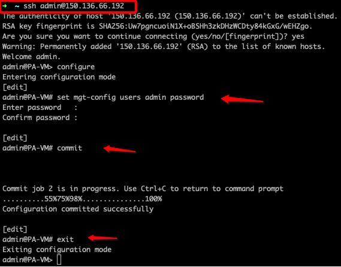

4. Connect to **VM-Series-Firewall-1** instance public IP on your local machine's web browser: **https://public_ip**. It will ask you to enter username/password so enter **admin/PaloAlto@1234** or the password which you picked in **step2** earlier. 

   

5. Close the initial dialog box and select **Remind Me Later** option as below: 

   

6. Click on the link below to open the **xml** configuration file which you need to setup initial configuration on Firewall.  

    - Click here: [vm-series-firewall-1.xml](https://objectstorage.us-ashburn-1.oraclecloud.com/p/FzpSwvA6XI8YMgVjjrThOF1R-zDhDa9yHaEYJY0qUsUY1s4TmLJVcByUpNqHQgt2/n/partners/b/files/o/vm-series-firewall-1.xml) 

7. Save in your local machine's downloads folder and open the file.

8. Update **vm-series-firewall1.xml** file variables as per below table and make sure details matches to your **VM-Series-Firewall-1** instance.

    | Parameter                                 | Value                                                            | Comment                            |
    |-------------------------------------------|------------------------------------------------------------------|------------------------------------|
    | untrust-interface-floating-ip/subnet-mask | Primary Firewall Untrust Secondary Interface Floating Private IP | Example: 192.168.3.47/24           |
    | trust-interface-floating-ip/subnet-mask   | Primary Firewall Trust Secondary Interface Floating Private IP   | Example: 192.168.2.156/24          |
    | untrust-subnet-default-gateway            | First IP of Untrust Subnet                                       | Example: 192.168.3.1               |
    | trust-subnet-default-gateway              | First IP of Trust Subnet                                         | Example: 192.168.2.1               |
    | spoke-vcns-cidr/mask                      | Collective or Single Values of Spoke VCNs                        | Example: 10.0.0.0/16               |
    | object-storage-cidr/mask                  | Object Storage Network CIDR; Specific to your Region             | Example: 134.70.0.0/16 for Ashburn |
    | first-firewall-hostname                   | First Firewall Hostname                                          | Example: Firewall-A                |
    | first-firewall-mgmt-ip                    | First Firewall MGMT IP                                           | Example: 192.168.1.108             |
    | mgmt-subnet-default-gateway               | First IP of Mgmt Subnet                                          | Example: 192.168.1.1               |
    | first-firewall-ha-interface-ip            | First Firewall HA Interface IP                                   | Example: 192.168.4.200             |
    | ha-subnet-default-gateway                 | First IP of HA Subnet                                            | Example: 192.168.4.1               |
    | second-firewall-mgmt-private-ip           | Second Firewall MGMT IP                                          | Example: 192.168.1.136             |
    | db-app1-vm-ip                             | DB VCN App1 VM Private IP                                        | Example: 10.0.1.50                 |
    | web-app1-vm-ip                            | Web VCN App1 VM Private IP                                       | Example: 10.0.0.19                 |

9. Once you have updated local **xml** file. It's time to upload that configuration to your **vm-series-firewall-1** i.e. Primary instance.

10. This will add below configuration to your **vm-series-firewall-1** instance: 

    - **Hostname** and mgmt **IP Address**
    - Untrust, Trust and HA **Interfaces**
    - Static **Routes** **entries**
    - **Security** policies 
    - **NAT** policies 
    - **HA Communication** 

10. Navigate to **Device > Operations > Import named configuration snapshot** as per below. 

   

   

11. Click on **Import named configuration snapshot** and browse your local file which you just updated with required variable. 

   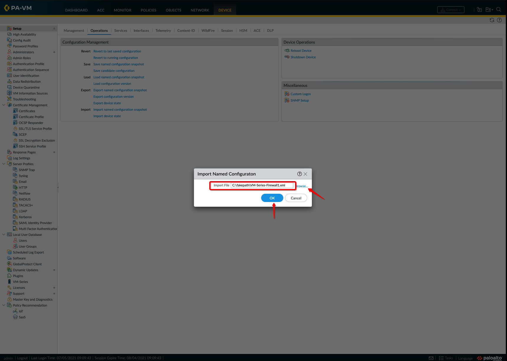

12. Click on **Load named configuration snapshot** and select the file which you just imported. 

   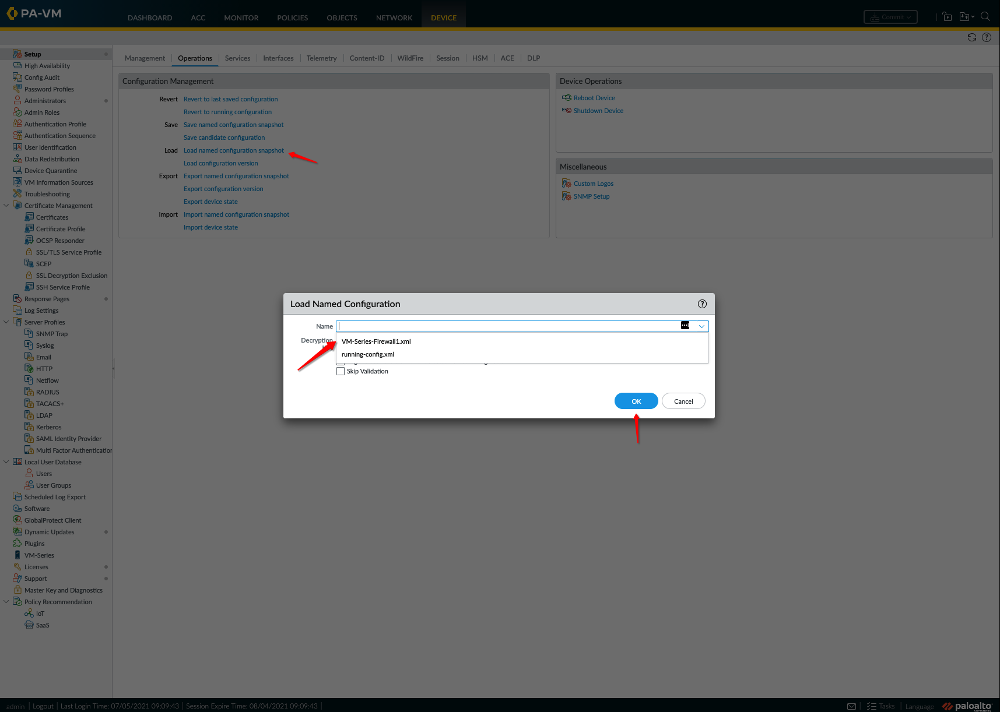

13. Do a sanity check and verify that configuration which you are trying to push to Firewall is correct: 

    - **Interfaces**
      
      

    - **Security Policies**

      

    - **NAT Policies**

      

    - **Address Objects**
   
       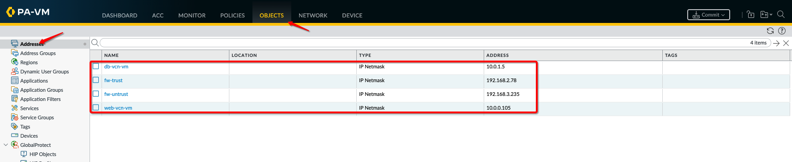

    - **HA Communication**

       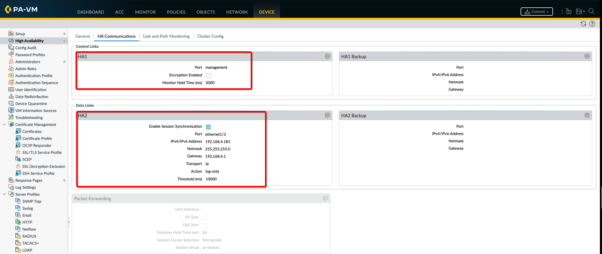

14. Commit your changes to **vm-series-firewall-1** instance and it should be successful: 

   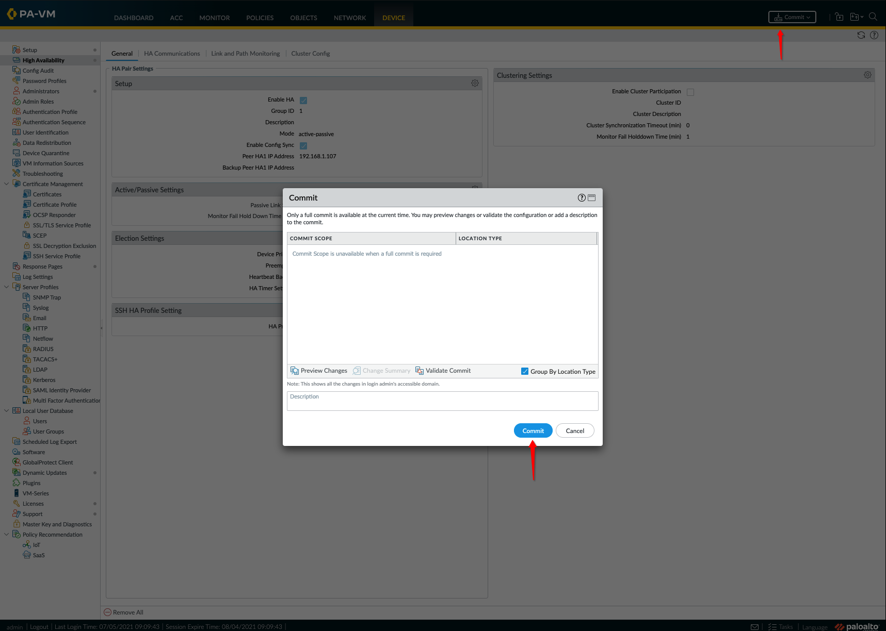

   

15. You can verify configuration by navigating to **interfaces**, **policies** etc section. For example, below image shows interfaces are created successfully: 

   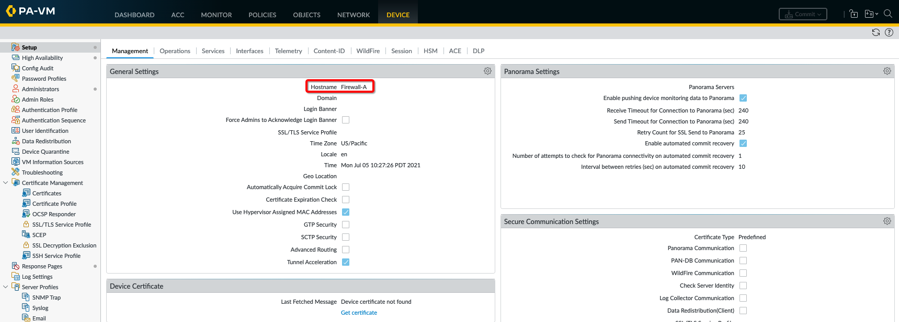

   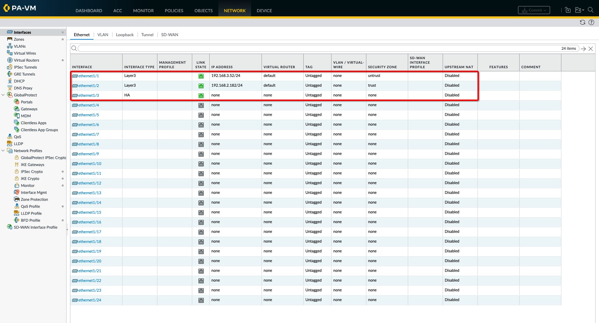

16. You need to enable **Jumbo Frame** so to enable that navigate: **Device > Setup > Session** and check mark **Enable Jumbo Frame** option:

   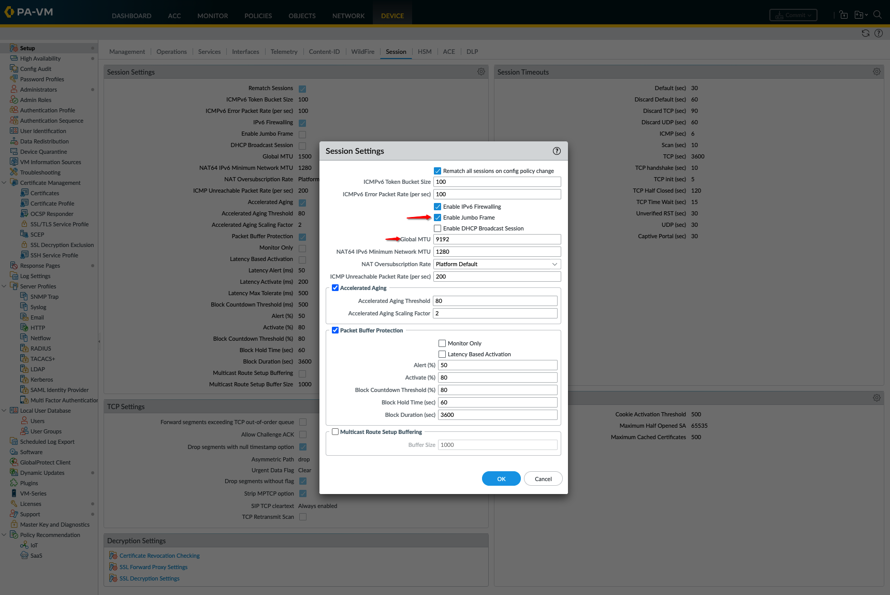

17. You must reboot the device to reflect jumbo frame changes. You can do that from OCI console or using **Operations > Reboot Device** option within your **vm-series-firewall-1** GUI. 

   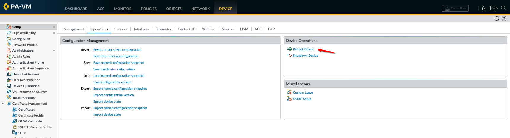

## **Task 2: Initial Configuration on Secondary VM Series Firewall**

1. Setup initial **admin** user password using **CLI**. Connect to **vm-series-firewall-2** instance using your ssh private key which you used earlier via **admin** user:  

      ```
      <copy>
      ssh -i private-key-path admin@vm-series-firewall-1-mgmt-public-ip
      </copy>
      ```

2. Once you login successfully, you need to setup **admin** password so you can login to GUI. Enter **configure** command to configuration mode. Run below command and setup password. In your case you can hose **PaloAlto@1234** as password example or your unique password. 

      ```
      <copy>
      configure 
      set mgt-config users admin password
      </copy>
      ```
3. Once you confirm password, make sure to commit your change using **commit** command on the same shell prompt. Below snippet shows an **example** of setting initial password. 

   

4. Connect to **VM-Series-Firewall-2** instance public IP on your local machine's web browser: **https://public_ip**. It will ask you to enter username/password so enter **admin/PaloAlto@1234** or the password which you picked in **step2** earlier. 

   

5. Close the initial dialog box and select **Remind Me Later** option as below: 

   

6. Click on the link below to open the **xml** configuration file which you need to setup initial configuration on Firewall.  

    - Click here: [vm-series-firewall-2.xml](https://objectstorage.us-ashburn-1.oraclecloud.com/p/npWr_G2Tno8LRr0JjHwzS0WtS8EYbG1UBAU2kPw4KVNbkf5tDM22iha6peBA59Z2/n/partners/b/files/o/vm-series-firewall-2.xml) 

7. Save in your local machine's downloads folder and open the file.

8. Update **vm-series-firewall2.xml** file variables as per below table and make sure details matches to your **VM-Series-Firewall-2** instance.

    | Parameter                                 | Value                                                            | Comment                            |
    |-------------------------------------------|------------------------------------------------------------------|------------------------------------|
    | untrust-interface-floating-ip/subnet-mask | Primary Firewall Untrust Secondary Interface Floating Private IP | Example: 192.168.3.47/24           |
    | trust-interface-floating-ip/subnet-mask   | Primary Firewall Trust Secondary Interface Floating Private IP   | Example: 192.168.2.156/24          |
    | untrust-subnet-default-gateway            | First IP of Untrust Subnet                                       | Example: 192.168.3.1               |
    | trust-subnet-default-gateway              | First IP of Trust Subnet                                         | Example: 192.168.2.1               |
    | spoke-vcns-cidr/mask                      | Collective or Single Values of Spoke VCNs                        | Example: 10.0.0.0/16               |
    | object-storage-cidr/mask                  | Object Storage Network CIDR; Specific to your Region             | Example: 134.70.0.0/16 for Ashburn |
    | second-firewall-hostname                  | Second Firewall Hostname                                         | Example: Firewall-B                |
    | second-firewall-mgmt-ip                   | Second Firewall MGMT Interface Private IP                        | Example: 192.168.1.136             |
    | mgmt-subnet-default-gateway               | First IP of Mgmt Subnet                                          | Example: 192.168.1.1               |
    | second-firewall-ha-interface-ip           | Second Firewall HA Interface IP                                  | Example: 192.168.4.109             |
    | ha-subnet-default-gateway                 | First IP of HA Subnet                                            | Example: 192.168.4.1               |
    | first-firewall-mgmt-private-ip            | First Firewall MGMT Interface Private IP                         | Example: 192.168.1.108             |
    | db-app1-vm-ip                             | DB VCN App1 VM Private IP                                        | Example: 10.0.1.50                 |
    | web-app1-vm-ip                            | Web VCN App1 VM Private IP                                       | Example: 10.0.0.19                 |

9. Once you have updated local **xml** file. It's time to upload that configuration to your **vm-series-firewall-2** i.e. Primary instance.

10. This will add below configuration to your **vm-series-firewall-2** instance: 

    - **Hostname** and mgmt **IP Address**
    - Untrust, Trust and HA **Interfaces**
    - Static **Routes** **entries**
    - **Security** policies 
    - **NAT** policies 
    - **HA Communication** 

10. Navigate to **Device > Operations > Import named configuration snapshot** as per below. 

   

   

11. Click on **Import named configuration snapshot** and browse your local file which you just updated with required variable. 

   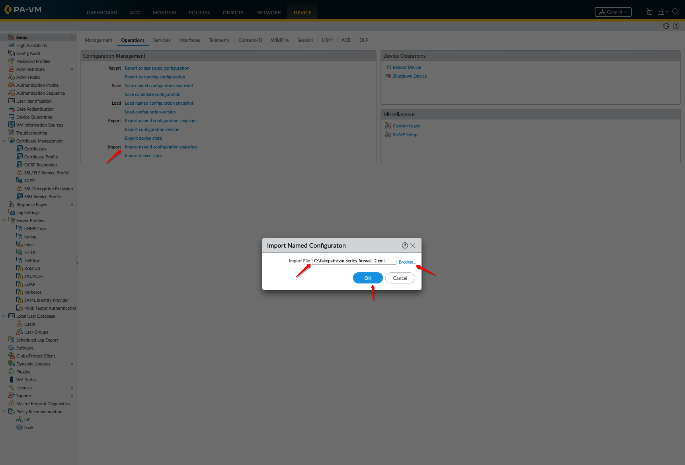

12. Click on **Load named configuration snapshot** and select the file which you just imported. 

   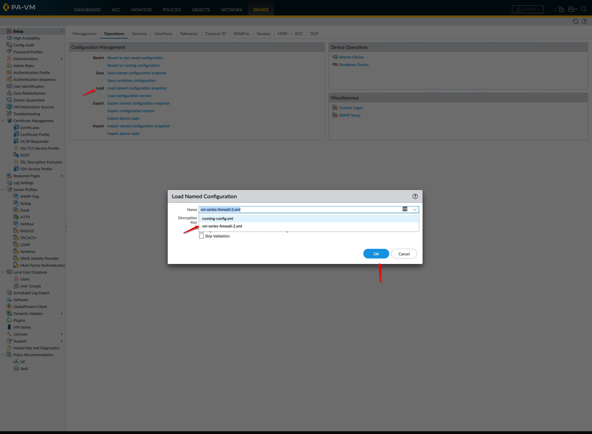

13. Do a sanity check and verify that configuration which you are trying to push to Firewall is correct: 

    - **Interfaces**
      
      

    - **Security Policies**

      

    - **NAT Policies**

      

    - **Address Objects**
   
       

    - **HA Communication**

       

14. Commit your changes to **vm-series-firewall-2** instance and it should be successful: 

   

   

15. You can verify configuration by navigating to **interfaces**, **policies** etc section. For example, below image shows interfaces are created successfully: 

   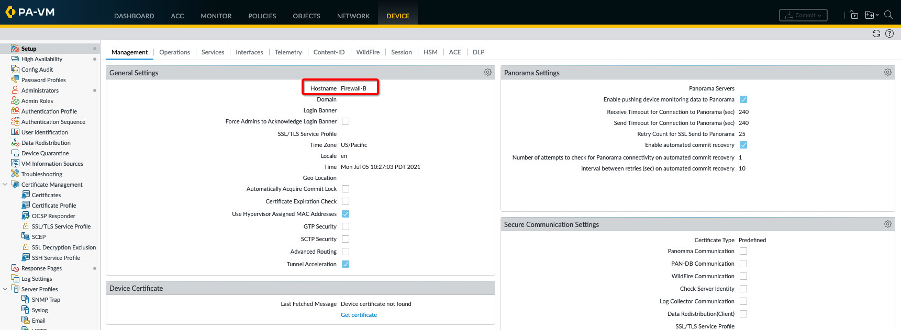

   

16. Navigate to **Dashboard > Widgets > System > High Availability** to add a high availability widget on each **vm-series-firewall** instances.

   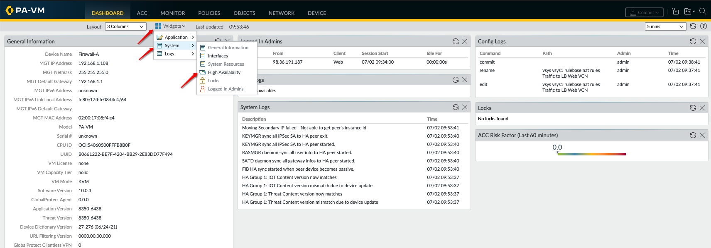

17. Either you can wait for configuration to sync or you can force initial configuration sync. In this lab you will do that from **vm-series-firewall-1** instance. 

   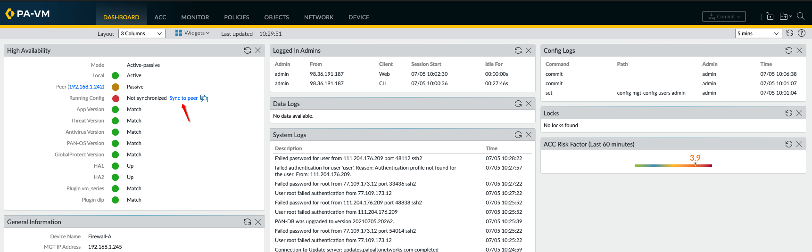

18. Successfull HA configuration should look like this on each firewall (primary or standby): 

   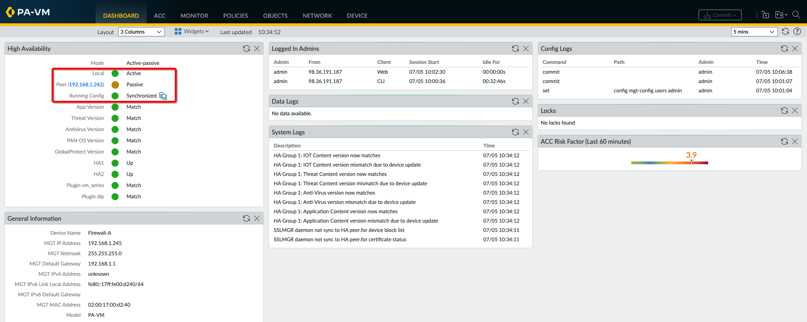

19. You need to enable **Jumbo Frame** so to enable that navigate: **Device > Setup > Session** and check mark **Enable Jumbo Frame** option:

   

20. You must reboot the device to reflect jumbo frame changes. You can do that from OCI console or using **Operations > Reboot Device** option within your **vm-series-firewall-2** GUI. 

   

***Congratulations! You have successfully completed the lab.***

You may now [proceed to the next lab](#next).

## Learn More

1. [OCI Training](https://cloud.oracle.com/en_US/iaas/training)
2. [Familiarity with OCI console](https://docs.us-phoenix-1.oraclecloud.com/Content/GSG/Concepts/console.htm)
3. [Overview of Networking](https://docs.us-phoenix-1.oraclecloud.com/Content/Network/Concepts/overview.htm)
4. [Familiarity with Compartment](https://docs.us-phoenix-1.oraclecloud.com/Content/GSG/Concepts/concepts.htm)
5. [Connecting to a compute instance](https://docs.us-phoenix-1.oraclecloud.com/Content/Compute/Tasks/accessinginstance.htm)
6. [OCI VM Series Firewall Administration Guide](https://docs.paloaltonetworks.com/vm-series/10-0/vm-series-deployment/set-up-the-vm-series-firewall-on-oracle-cloud-infrastructure.html)

## Acknowledgements

- **Author** - Arun Poonia, Senior Solutions Architect
- **Adapted by** - Palo Alto Networks
- **Contributors** - N/A
- **Last Updated By/Date** - Arun Poonia, July 2021