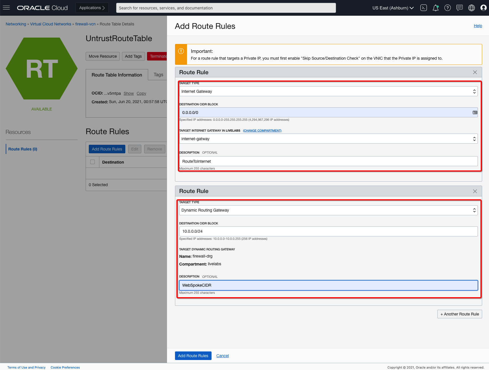

# Deploy VM Series Firewall and Supporting Configuration

## Introduction

In this lab you will be creating VM Series Firewall instances from **partner images** or **marketplace**, adding additional interfaces, IP Addresses, dynamic group and policy to support traffic between VCNs.

Estimated Lab Time: 30 minutes.

### Objectives

- Launch VM Series Firewall Instances in Hub VCN 
- Add Interfaces to VM Series Firewall Instances 
- Assign Secondary IP Addresses to Primary VM Series Firewall Instance
- Demonstrate launching Dynamic Groups and Policies 
- Demonstrate updating routing tables 
- Validate route tables association

### Prerequisites

- Oracle Cloud Infrastructure paid account credentials (User, Password, Tenant, and Compartment)
- Oracle Marketplace Listings Access
    - **VM Series Firewall** paid listing or BOYL access required for this **Lab**
        - You would need a valid license from Palo Alto Networks if you want to monitor traffic using BOYL image.

## **Task 1: Launch VM Series Firewall Instances**

1. Launch **Cloud Shell** by clicking the icon next to region name on top right of OCI console. ('<=' icon)

2. Once cloud Shell is launched. Enter command **ssh-keygen**, press enter for all prompts. This will create a ssh key pair. Enter command.

      ```
      <copy>
      bash
      cd .ssh
      cat id_rsa.pub
      </copy>
      ```
   
   Copy the key displayed. This will be used when creating the compute instance.

3. From OCI services menu, Click **Instances** under **Compute**.
 
4. On the left sidebar, select the **Compartment** in which you placed your VCN under **List Scope**. The, Click **Create Instance**. You will be creating **2** instances as per below table: 

    | Name      | Placement | Image                                                |  Version | Shape          | Network      | Subnet      | Add SSH-Keys                |
    | ---------- | --------- | ---------------------------------------------------- | ------------- | -------------- | ------------ | ----------- | --------------------------- |
    | vm-series-firewall-1| AD1       | Partner Image: Palo Alto Networks VM-Series Bundle2 - 4 OCPUs | 10.1.0        | VMStandard2.4  | firewall-vcn | mgmt-subnet | Yours/CloudShell Public Key |
    | vm-series-firewall-2| AD2       | Partner Image: Palo Alto Networks VM-Series Bundle2 - 4 OCPUs | 10.1.0        | VM Standard2.4 | firewall-vcn | mgmt-subnet | Yours/CloudShell Public Key |
    
5. Enter a **Name** for your Instance and the **Compartment** in which you placed your **Firewall VCN**. Fill out the dialog box. Select appropriate values based on table shared in previous **#4**. Click on **Partner Image Agreement** check box and save image selection by clicking on **Select Image** button.

6. Select Shape **VM Standard2.4** as default value.

7. Scroll Down to **Networking** and verify the following.
      - Your Compartment is selected
      - The VCN created is populated: **firewall-vcn**
      - The subnet created is populated: **mgmt-subnet**
      - Enable Public IP Address assignment: **Assign a public IPv4 address**

   

8. Ensure **PASTE PUBLIC KEYS** is selected under **Add SSH Keys**. Paste the public key copied earlier.
 
   **NOTE:** If 'Service limit' error is displayed choose a different shape from VM.Standard2.1, VM.Standard.E2.1, VM.Standard1.1, VM.Standard.B1.1 OR choose a different AD.

   **NOTE:** If you already have your ssh-key available you can skip copying from cloud-shell and paste your own public key and use private key associated to that for accessing instance.

9. Click **Create** and wait for Instance to be in **Running** state. 

10. Repeat step 5 to 9 based on the **table** provided in **step 4** for another VM Series Firewall **vm-series-firewall-2** instance.

   

## **Task 2: Add Interfaces on VM Series Firewall Instances**

1. Click on **forgiate1** instance and navigate to **Attached VNIC** under Resources section of the instance details page. You will be adding **untrust**, **trust** and **ha** interfaces respectively:

    | Name    | Virtual Cloud Network | Network      | Subnet         | Skip source/destination check |
    |---------|-----------------------|--------------|----------------|-------------------------------|
    | untrust | firewall-vcn          | Normal Setup | untrust-subnet | Yes                           |
    | trust   | firewall-vcn          | Normal Setup | trust-subnet   | Yes                           |
    | ha      | firewall-vcn          | Normal Setup | ha-subnet      | No                            |

2. Click on **Create VNIC** and fill out the dialog box for **untrust** interface: 

      - **Name**: Enter Name
      - **Virtual Cloud Network**:  Select firewall-vcn from drop down
      - **Network**:  Keep the default value as Normal Setup
      - **Subnet**: Select **untrust-subnet** from drop down
      - **Skip source/destination check**: Select checkmark next to this option

   

3. Verify all the information and Click **Save Changes**.

4. This will add **untrust** interface on **vm-series-firewall-1** instance with following components.

    *untrust interface on VM-Series-Firewall-1 instance*

5. Click on **Create VNIC** and fill out the dialog box for **trust** interface: 

      - **Name**: Enter Name
      - **Virtual Cloud Network**:  Select firewall-vcn from drop down
      - **Network**:  Keep the default value as Normal Setup
      - **Subnet**: Select **trust-subnet** from drop down
      - **Skip source/destination check**: Select checkmark next to this option

   

6. Verify all the information and Click **Save Changes**.

7. This will add **trust** interface on **vm-series-firewall-1** instance with following components.

    *trust interface on VM-Series-Firewall-1 instance*

8. Click on **Create VNIC** and fill out the dialog box for **ha** interface: 

      - **Name**: Enter Name
      - **Virtual Cloud Network**:  Select firewall-vcn from drop down
      - **Network**:  Keep the default value as Normal Setup
      - **Subnet**: Select **ha-subnet** from drop down
      - **Skip source/destination check**: Select checkmark next to this option

   

9. Verify all the information and Click **Save Changes**.

10. This will add **ha** interface on **vm-series-firewall-1** instance with following components.

    *ha interface on VM-Series-Firewall-1 instance*

11. Click on **vm-series-firewall-2** instance and navigate to **Attached VNIC** under Resources section of the instance details page. You will be adding **untrust**, **trust** and **ha** interfaces respectively: 

    | Name    | Virtual Cloud Network | Network      | Subnet         | Skip source/destination check |
    |---------|-----------------------|--------------|----------------|-------------------------------|
    | untrust | firewall-vcn          | Normal Setup | untrust-subnet | Yes                           |
    | trust   | firewall-vcn          | Normal Setup | trust-subnet   | Yes                           |
    | ha      | firewall-vcn          | Normal Setup | ha-subnet      | No                            |

12. Click on **Create VNIC** and fill out the dialog box for **untrust** interface: 

      - **Name**: Enter Name
      - **Virtual Cloud Network**:  Select firewall-vcn from drop down
      - **Network**:  Keep the default value as Normal Setup
      - **Subnet**: Select **untrust-subnet** from drop down
      - **Skip source/destination check**: Select checkmark next to this option

   

13. Verify all the information and Click **Save Changes**.

14. This will add **untrust** interface on **vm-series-firewall-2** instance with following components.

    *untrust interface on VM Series Firewall 2 instance*

15. Click on **Create VNIC** and fill out the dialog box for **trust** interface: 

      - **Name**: Enter Name
      - **Virtual Cloud Network**:  Select firewall-vcn from drop down
      - **Network**:  Keep the default value as Normal Setup
      - **Subnet**: Select **trust-subnet** from drop down
      - **Skip source/destination check**: Select checkmark next to this option

   

16. Verify all the information and Click **Save Changes**.

17. This will add **trust** interface on **vm-series-firewall-2** instance with following components.

    *trust interface on VM Series Firewall 2 instance*

18. Click on **Create VNIC** and fill out the dialog box for **ha** interface: 

      - **Name**: Enter Name
      - **Virtual Cloud Network**:  Select firewall-vcn from drop down
      - **Network**:  Keep the default value as Normal Setup
      - **Subnet**: Select **ha-subnet** from drop down
      - **Skip source/destination check**: Select checkmark next to this option

   

19. Verify all the information and Click **Save Changes**.

20. This will add **ha** interface on **vm-series-firewall-2** instance with following components.

    *ha interface on VM Series Firewall 2 instance*

## **Task 3: Assign Secondary IP Addresses on Primary VM Series Firewall Instance**

1. Click on **forgiate1** instance and navigate to **Attached VNIC** under Resources section of the instance details page. You will be assigning additional IP addresses to **untrust** and **trust** interfaces of **vm-series-firewall-1** VM. You will be using them to route traffic to/from firewall:

    | Interface | Public IP Address         | Public IP Assignment            | PublicIP Name     |
    |-----------|---------------------------|---------------------------------|-------------------|
    | untrust   | Select Reserve Public IP  | Create New or Chose Existing IP | UntrustFloatingIP |
    | trust     | N/A                       | N/A                             | N/A               |

2. Select **untrust** interface and click on **Assign Secondary Private IP Address** and fill out the dialog box for **untrust** interface secondary IP address: 

      - **Public IP Type**: Select Reserved Public IP 
      - **Select Existing Reserved Public IP Address**:  If you have an existing IP you can select but in this case you will create a new public IP.
      - **PublicIP Name**:  Enter a user-friendly name
      - **COMPARTMENT**: Ensure your compartment is selected

   

3. Verify all the information and Click **Assign**.

4. This will add secondary private IP address and a public IP to **untrust** interface on **vm-series-firewall-1** instance with following components.

    *assign secondary IP address to untrust interface on VM-Series-Firewall-1 instance*

5. Select **trust** interface and click on **Assign Secondary Private IP Address** and fill out the dialog box for **trust** interface secondary IP address: 

      - **Public IP Type**: Select Reserved Public IP 
      - **Select Existing Reserved Public IP Address**:  If you have an existing IP you can select but in this case you will create a new public IP.
      - **PublicIP Name**:  Enter a user-friendly name
      - **COMPARTMENT**: Ensure your compartment is selected

   

6. Verify all the information and Click **Assign**.

7. This will add secondary private IP address to **trust** interface on **vm-series-firewall-1** instance with following components.

    *assign secondary IP address to trust interface on VM-Series-Firewall-1 instance*

## **Task 4: Configure Dynamic Groups and Required Policies**

1. From the OCI Services menu, click **Dynamic Groups** under **Identity & Security**. Select your region on right part of the screen:

   

2. You will be creating **Dynamic Group** which will include **VM Series Firewall** instances OCIDs which will support HA failover use-case. Based on below tables you will create Dynamic Group. 

    | Name                        | Description                          | Instance OCIDs               | Comment                                      |
    |-----------------------------|--------------------------------------|------------------------------|----------------------------------------------|
    | vm-series-firewall-high-availability | VM Series Firewall High Availability Use-Case | VM-Series-Firewall-1, VM-Series-Firewall-2 OCIDs | Collect Instances OCID from Instance Details |

3. Select **Create Dynamic Group** and fill out the dialog box for creating dynamic group: 

      - **Name**: Select Reserved Public IP 
      - **Description**:  If you have an existing IP you can select but in this case you will create a new public IP.
      - **Matching Rules**:  Click on Rule-Builder With **Any of The Following** option
        - **Instance OCID**: 
            - **Value**: Enter VM-Series-Firewall-1 Instance OCID
        - **Instance OCID**: 
            - **Value**: Enter VM-Series-Firewall-2 Instance OCID

   

   

6. Verify all the information and Click **Add Rule** and Click **Create**:

7. This will create a new dynamic group with VM Series Firewall Instance OCIDs with following components.

    *new dynamic group with VM Series Firewall Instances OCID*

3. From the OCI Services menu, click **Policies** under **Identity & Security**. Select your region on right part of the screen:

   

2. You will be creating **Dynamic Group** which will include **VM Series Firewall** instances OCIDs which will support HA failover use-case. Based on below tables you will create Dynamic Group. 

    | Name                | Description                              | Policy                                                                                                                                                                                                                                     | Comment                                                             |
    |---------------------|------------------------------------------|--------------------------------------------------------------------------------------------------------------------------------------------------------------------------------------------------------------------------------------------|---------------------------------------------------------------------|
    | palo-alto-ha-policy | VM Series Firewall HA Policy             | Allow dynamic-group vm-series-firewall-high-availability to use instance-family in compartment enter-compartment-name Allow dynamic-group vm-series-firewall-high-availability to use virtual-network-family in enter-compartment-name | Open for All Resources with Instances OCID present in dynamic group |

3. Select **Create Dynamic Group** and fill out the dialog box for creating dynamic group: 

      - **Name**: Enter Policy Name
      - **Description**:  Enter Policy Description
      - **Polic Builder**:  Enter policy
        - **Open Policy**: Allow dynamic-group <dynamic_group_name> to manage all-resources in TENANCY
            - **Dynamic Group**: Ensure you enter correct dynamic group name in out case it’s **vm-series-firewall-high-availability**
      - **COMPARTMENT**: Ensure **Root** compartment is selected

   

6. Verify all the information and Click **Create**.

7. This will create policy with following components.

    *New Policy Present in Root comparment associated with dynamic group created earlier*

7. Verify at this point you have required instances are running in your chosen compartment: 
   - **Two** VM Series Firewall Instances in Firewall-VCN
   - **Two** Linux VM Instances in Web-VCN
   - **Two** Linux VM Instances in DB-VCN

   

## **Task 5: Update Route Tables on Firewall-VCN**

1. Navigate to the **firewall-vcn** and select **VCN-INGRESS** route table. 

2. Click **Add Route Rules**

3. Select the Target Type as **Private IP** and enter the Secondary IP Address Associated with **VM-Series-Firewall-1** instance's **Trust** interface..

4. Enter the **Destination CIDR Block**

    - In this case you will put all default CIDR **0.0.0.0/0** which is incoming traffic from Spoke VCNs via **DRG** to Active Firewall. You can also enter the CIDR block for the Web and DB VCN is needed.  ie: 10.0.0.0/24 or 10.0.1.0/24

5. Add **Description**.

   

6. Click **Add Route Rules** to finish.

7. Navigate to the **firewall-vcn** and select **TrustRouteTable** route table. 

8. Click **Add Route Rules**

9. Select the Target Type as **Dynamic Routing Gateway** and associated Dynamic Routing Gateway gets reflected automatically due to VCN attachment.

10. Enter the **Destination CIDR Block**

    - In this case you will add two route entries for both Web and DB VCN i.e.: 10.0.0.0/24 or 10.0.1.0/24 using **Another Route Rule** option available on dialog box.

11. Add **Description** for each entry.

   

12. Click **Add Route Rules** to finish.

13. Navigate to the **firewall-vcn** and select **UntrustRouteTable** route table. 

14. Click **Add Route Rules**

15. You will be adding two entries one for Internet Facing traffic via internet gateway and another for return traffic from this subnet to Spoke VCNs via Dynamic Routing Gateway. 
   
    - **First Entry**
        - Select the Target Type as **Internet Gateway** and associated Internet Gateway gets reflected automatically select that from drop down **internet-gateway**.
        - Enter the **Destination CIDR Block**
            - In this case you will put **0.0.0.0/0** for outgoing traffic via internet gateway.
    - **Second Entry**
        - Select the Target Type as **Dynamic Routing Gateway** and associated Dynamic Routing Gateway gets reflected automatically due to VCN attachment.
        - Enter the **Destination CIDR Block**
            - In this case you will add an entry for Web VCN ie: 10.0.0.0/24
    - **Third Entry**
        - Select the Target Type as **Dynamic Routing Gateway** and associated Dynamic Routing Gateway gets reflected automatically due to VCN attachment.
        - Enter the **Destination CIDR Block**
            - In this case you will add an entry for DB VCN ie: 10.0.1.0/24.

16. Add **Description** for each entry.

   

17. Click **Add Route Rules** to finish.

18. Navigate to the **firewall-vcn** and select **SGWRouteTable** route table. 

19. Click **Add Route Rules**

20.  Select the Target Type as **Private IP** and enter the Secondary IP Address Associated with **VM-Series-Firewall-1** instance's **Trust** interface.

21. Enter the **Destination CIDR Block**

    - In this case you will put all default CIDR **0.0.0.0/0** so all return traffic goes from Service Gateway goes via Firewall.

22. Add **Description** for each entry.

   

17. Click **Add Route Rules** to finish.

## **Task 6: Verify Route Tables associated to Subnets and Gateways**

1. Below table includes neccessary subnets in each **VCNs** and make sure **Route Table** are attached to right subnets and service gateway. 

    | VCN          | Resource Name/Type                       | Route Table Name                |
    |--------------|------------------------------------------|---------------------------------|
    | firewall-vcn | mgmt-subnet/Subnet                       | DefaultRouteTable               |
    | firewall-vcn | untrust-subnet/Subnet                    | UntrustRouteTable               |
    | firewall-vcn | trust-subnet/Subnet                      | TrustRouteTable                 |
    | firewall-vcn | ha-subnet/Subnet                         | HARouteTable                    |
    | firewall-vcn | Firewall VCN/DRG Firewall VCN Attachment | VCN-INGRESS                     |
    | firewall-vcn | hubServiceGateway/Service Gateway        | SGWRouteTable                   |
    | web-vcn      | application-private/Subnet               | Default Route Table for web-vcn |
    | db-vcn       | database-private/Subnet                  | Default Route Table for db-vcn  |

2. Below example reflects how to attach correct route table based on above table to one of the resource **Service Gateway**:

   

3. Below example reflects how to attach correct route table based on above table to one of the resource **UntrustRouteTable**:

   

***Congratulations! You have successfully completed the lab.***

You may now [proceed to the next lab](#next).

## Learn More

1. [OCI Training](https://cloud.oracle.com/en_US/iaas/training)
2. [Familiarity with OCI console](https://docs.us-phoenix-1.oraclecloud.com/Content/GSG/Concepts/console.htm)
3. [Overview of Networking](https://docs.us-phoenix-1.oraclecloud.com/Content/Network/Concepts/overview.htm)
4. [Familiarity with Compartment](https://docs.us-phoenix-1.oraclecloud.com/Content/GSG/Concepts/concepts.htm)
5. [Connecting to a compute instance](https://docs.us-phoenix-1.oraclecloud.com/Content/Compute/Tasks/accessinginstance.htm)
6. [OCI VM Series Firewall Administration Guide](https://docs.paloaltonetworks.com/vm-series/10-0/vm-series-deployment/set-up-the-vm-series-firewall-on-oracle-cloud-infrastructure.html)

## Acknowledgements

- **Author** - Arun Poonia, Senior Solutions Architect
- **Adapted by** - Palo Alto Networks
- **Contributors** - N/A
- **Last Updated By/Date** - Arun Poonia, July 2021