# Traffics and High Availability Validation

## Introduction

In this lab you will be creating required security policies on VM Series Firewalls to support different use-case and validate traffics between and from VCNs. In the end you will stop/reboot primary instance to ensure that floating IPs moves to Secondary **VM Series Firewall** instance.

Estimated Lab Time: 20 minutes.

### Objectives

- Validate North-South Inbound
- Validate North-South Outbound
- Validate East-West (Web to Database & Database to Web)
- Validate East-West Traffic (Web & DB Application to Oracle Services Network)
- Validate HA Failover to Secondary VM Series Firewall Instance

### Prerequisites

- Oracle Cloud Infrastructure paid account credentials (User, Password, Tenant, and Compartment)  

## Task 1: North-South Inbound Traffic

1. Connect to **VM-Series-Firewall-1** instance public IP on your local machine's web browser: **https://public_ip** using **admin/Pal0Alt0@123** since password has changed due to **xml** config push on **Lab3**

2. You have already pushed the policy on your **firewall** instance as per below to support this traffic: 

    

3. Connect to **Web APP1** and **DB APP1** using **VM-Series-Firewall-1 Untrust Interface Floating Public IP** over **SSH** and unique port as per below table: 

    | VM       | Port  | IP                                   | Example                       |
    |----------|-------|--------------------------------------|-------------------------------|
    | Web App1 | 1234  | Untrust Interface Floating Public IP | ssh opc@129.159.93.97 -p 1234 |
    | DB App1  | 1235  | Untrust Interface Floating Public IP | ssh opc@129.159.93.97 -p 1235 |

4. Below diagram validates that Inbound traffic is working towards your DB and Web Spoke VMs. 

   

5. You can also verify traffic from **Monitor** on your **VM-Series-Firewall-1** instance.

   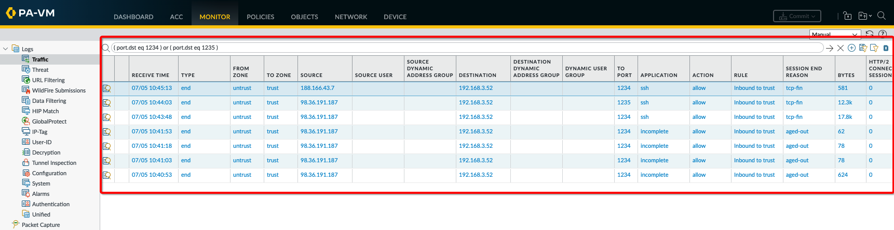

## Task 2: North-South Outbound Traffic

1. Connect to **VM-Series-Firewall-1** instance public IP on your local machine's web browser: **https://public_ip** using **admin/Pal0Alt0@123** since password has changed due to **xml** config push on **Lab3**

2. You have already pushed the policy on your **firewall** instance as per below to support this traffic: 

    

3. Connect to **Web APP1** and **DB APP1** using **VM-Series-Firewall-1 Untrust Interface Floating Public IP** over **SSH** and unique port as per below table: 

    | VM       | Port  | IP                                   | Example                       |
    |----------|-------|--------------------------------------|-------------------------------|
    | Web App1 | 1234  | Untrust Interface Floating Public IP | ssh opc@129.159.93.97 -p 1234 |
    | DB App1  | 1235  | Untrust Interface Floating Public IP | ssh opc@129.159.93.97 -p 1235 |

4. Initiate a ping to **google.com** or publicly available site connection as per below diagram which validates that Outbound traffic from Web and DB spoke VMs is working fine.

   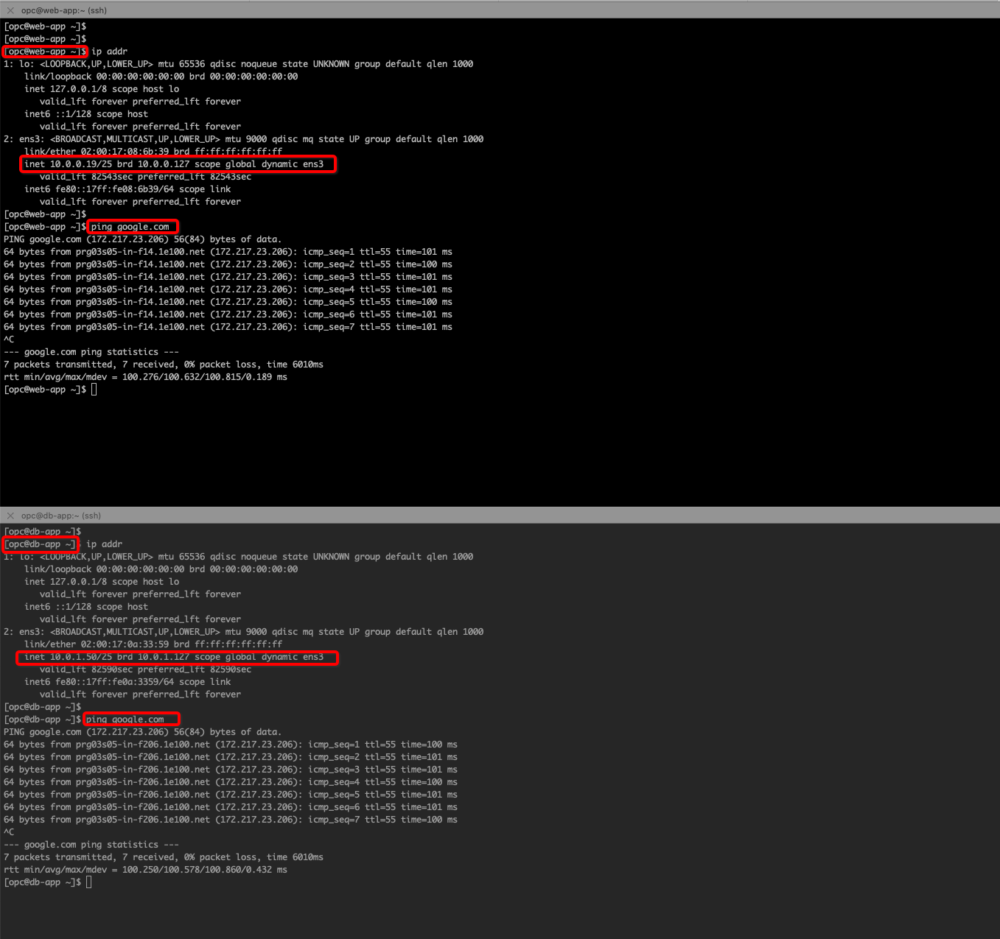

5. You can also verify that from **Monitor** on your **VM-Series-Firewall-1** instance.

   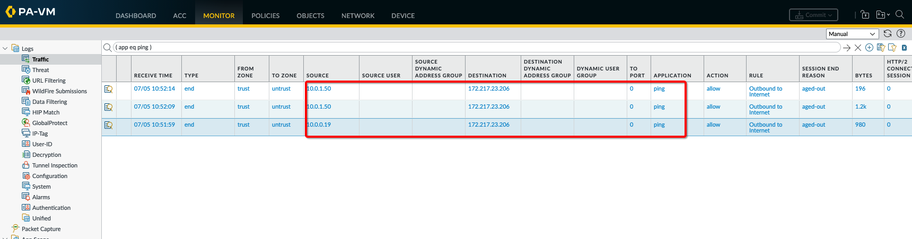

## Task 3: East-West Traffic (Web to Database & Database to Web)

1. Connect to **VM-Series-Firewall-1** instance public IP on your local machine's web browser: **https://public_ip** using **admin/Pal0Alt0@123** since password has changed due to **xml** config push on **Lab3**

2. You have already pushed the policy on your **firewall** instance as per below to support this traffic: 

    

3. Connect to **Web APP1** and **DB APP1** using **VM-Series-Firewall-1 Untrust Interface Floating Public IP** over **SSH** and unique port as per below table: 

    | VM       | Port  | IP                                   | Example                       |
    |----------|-------|--------------------------------------|-------------------------------|
    | Web App1 | 1234  | Untrust Interface Floating Public IP | ssh opc@129.159.93.97 -p 1234 |
    | DB App1  | 1235  | Untrust Interface Floating Public IP | ssh opc@129.159.93.97 -p 1235 |

4. Initiate a ping to **google.com** or publicly available site connection as per below diagram which validates that Outbound traffic from Web and DB spoke VMs is working fine.

   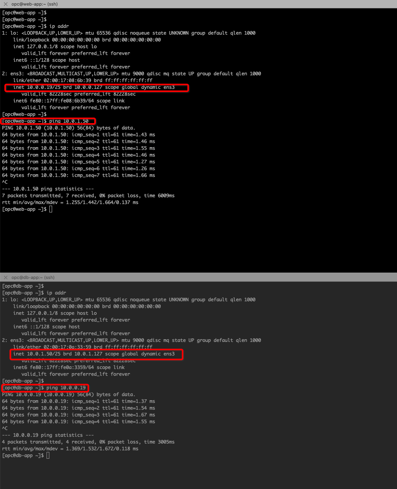

5. You can also verify that from **Monitor** on your **VM-Series-Firewall-1** instance.

   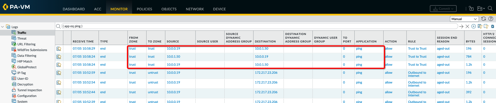

## Task 4: East-West Traffic (Web & DB Application to Oracle Services Network)

1. From the OCI Services menu, click **Buckets** under **Storage**. Select your region on right part of the screen:

   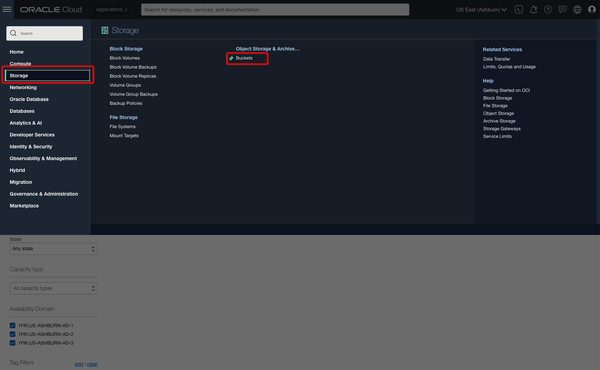

2. Below table represents what you will be creating. Click on **Create Bucket** icon to create new **Bucket**:

      | Bucket Name               | Bucket Type    | Comment                                                    |
      |---------------------------|----------------|------------------------------------------------------------|
      | firewall-bucket           | Standard       | You will be adding an object and creating pre-auth URL     |

3. Fill out the dialog box:

      - **Bucket NAME**: Provide a name
      - **COMPARTMENT**: Ensure your compartment is selected
      - **Bucket Type**: Standard

   

4. Verify all the information and Click **Create**.

5. This will create a Bucket with following components.

    *Standard Bucket*

6. Upload a Object and Create **Pre-Auth** URL which you will be using to access the object from **Web** or **DB** spoke VMs. 
   
    - In your case you can upload an image object for test purpose.

   

7. Once you complete **Pre-Authentication Request** a Details dialog box pops up, copy the URL which you will be using to access uploaded Object. 

8. Connect to **VM-Series-Firewall-1** instance public IP on your local machine's web browser: **https://public_ip** using **admin/Pal0Alt0@123** since password has changed due to **xml** config push on **Lab3**

9. You have already pushed the policy and route on your **firewall** instance as per below to support this traffic: based on below blob create a static route for your **Object Storage Networks** within your **region**: 

    

10. Connect to **Web APP1** and **DB APP1** using **VM-Series-Firewall-1 Untrust Interface Floating Public IP** over **SSH** and unique port as per below table: 

    | VM       | Port  | IP                                   | Example                       |
    |----------|-------|--------------------------------------|-------------------------------|
    | Web App1 | 1234  | Untrust Interface Floating Public IP | ssh opc@129.159.93.97 -p 1234 |
    | DB App1  | 1235  | Untrust Interface Floating Public IP | ssh opc@129.159.93.97 -p 1235 |

11. Do a **wget** to **Pre-Authentication Request** which you created earlier from Web and DB spoke VMs and you should get a response back.

   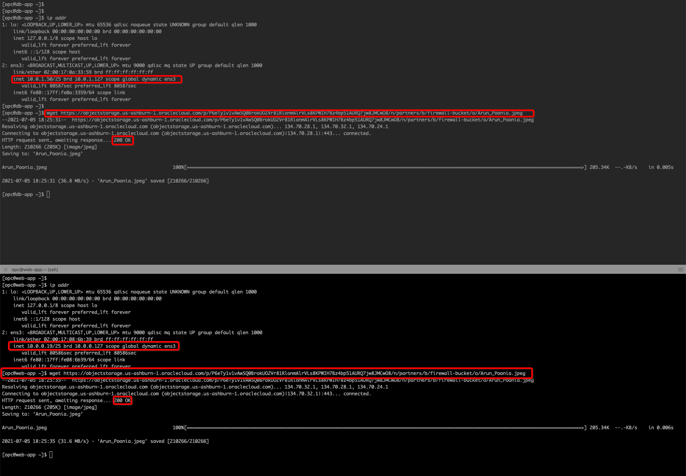

12. You can also verify that from **Monitor** on your **VM-Series-Firewall-1** instance.

   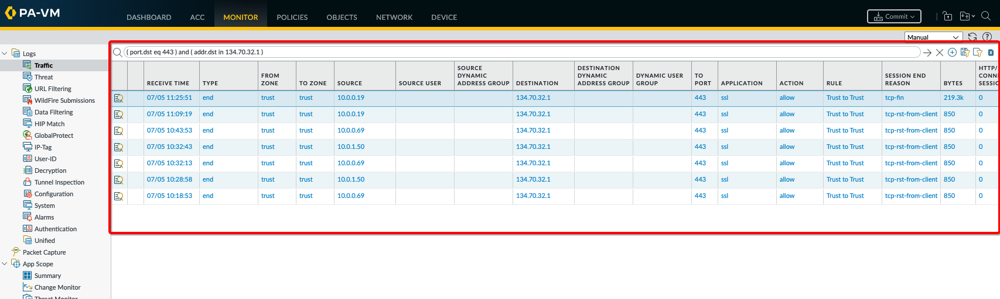

## Task 5: High Availability Failover Validation

1. Navigate to **VM-Series-Firewall-1** instance attached VNIC details page and verify that **Untrust** and/or **Trust** interface has floating secondary IPs are available on primary instance. 

   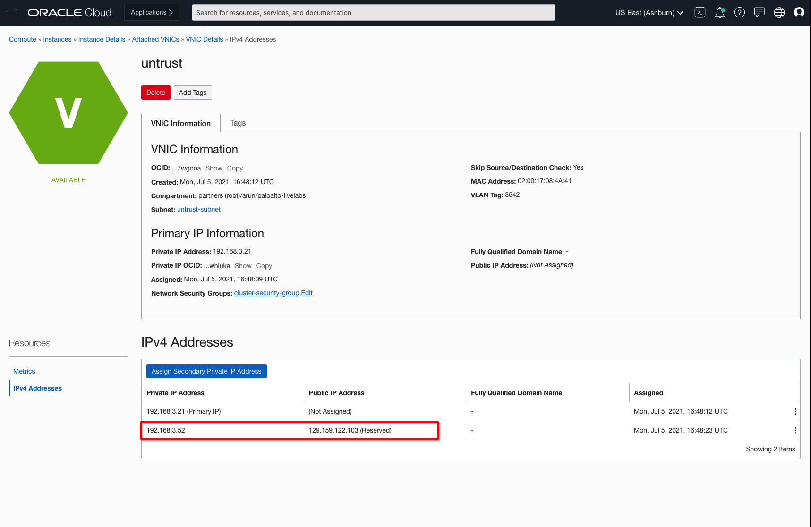

2. Reboot primary **VM-Series-Firewall-1** instance which will trigger failover automatically to **VM-Series-Firewall-2** instance. 

   

3. You should see on **VM-Series-Firewall-2** GUI that it became primary instance.

   

4. Navigate to **VM-Series-Firewall-2** instance attached VNIC details page and verify that **Untrust** and **Trust** interface floating IPs has moved from **VM-Series-Firewall-1** instance. 

   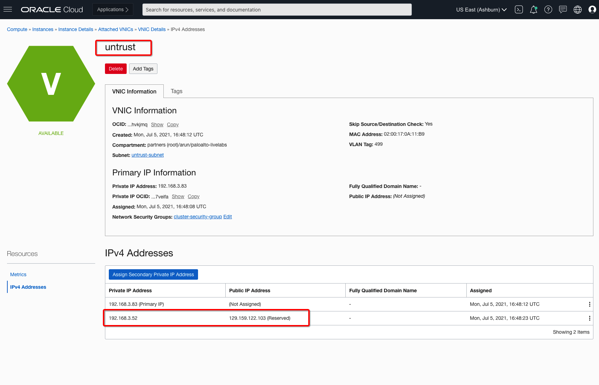

   

5. You can verify that **VM-Series-Firewall-2** is primary and **VM-Series-Firewall-1** is secondary in your HA cluster:

   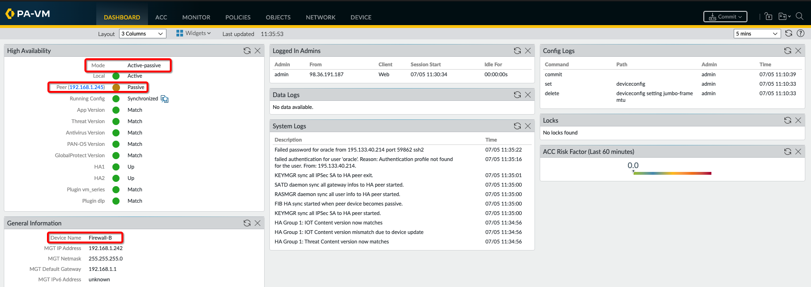

***Congratulations! You have successfully completed the lab.***

You may now [proceed to the next lab](#next).

## Learn More

1. [OCI Training](https://cloud.oracle.com/en_US/iaas/training)
2. [Familiarity with OCI console](https://docs.us-phoenix-1.oraclecloud.com/Content/GSG/Concepts/console.htm)
3. [Overview of Networking](https://docs.us-phoenix-1.oraclecloud.com/Content/Network/Concepts/overview.htm)
4. [Familiarity with Compartment](https://docs.us-phoenix-1.oraclecloud.com/Content/GSG/Concepts/concepts.htm)
5. [Connecting to a compute instance](https://docs.us-phoenix-1.oraclecloud.com/Content/Compute/Tasks/accessinginstance.htm)
6. [OCI VM Series Firewall Administration Guide](https://docs.paloaltonetworks.com/vm-series/10-0/vm-series-deployment/set-up-the-vm-series-firewall-on-oracle-cloud-infrastructure.html)

## Acknowledgements

- **Author** - Arun Poonia, Principal Solutions Architect
- **Adapted by** - Palo Alto Networks
- **Contributors** - N/A
- **Last Updated By/Date** - Arun Poonia, Aug 2023