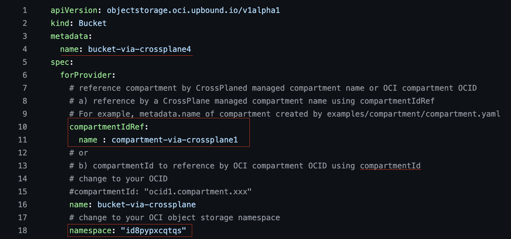

# Manage OCI Infrastructure with the OCI Crossplane Provider

## Introduction

* This lab walks you through the steps to deploy OCI infrastructure from a Kubernetes environment using the OCI Crossplane provider.
Estimated Lab Time: 30 minutes

### Objectives

In this lab, you will:
* Deploy an OCI Bucket using the OCI Crossplane provider
* Delete a resource using the OCI Crossplane provider
* Troubleshoot common issues with the OCI Crossplane provider

### Prerequisites

This lab assumes you have:
* All previous labs successfully completed

## Task 1: Deploy an OCI Bucket using the OCI Crossplane provider

1. You need to connect to the operator instance. Copy the command from Resource Manager -> Stacks -> StackName -> Apply Job -> Outputs.

2. Go to [examples of resources for OCI Crossplane provider](https://github.com/oracle-samples/crossplane-provider-oci/tree/main/examples) and copy the bucket deployment [example](https://github.com/oracle-samples/crossplane-provider-oci/blob/main/examples/objectstorage/bucket.yaml)

  

3. Create a YAML file called **bucket.yaml** on your operator instance and paste the content in there:


4. Change the `compartmentIdRef` and `name` with `compartmentId` and provide the ocid of the compartment where you want the bucket to be created:
  ```
  <copy>compartmentId: "ocid1.compartment.oc1.."</copy>
  ```

5. Change the namespace with your tenancy's Object Storage namespace.
  ```
  <copy>namespace: tenancy_namespace</copy>
  ```

6. Run the **bucket.yaml** file using kubectl:
  ```
  <copy>kubectl apply -f bucket.yaml</copy>
  ```

7. Once the kubectl command runs successfully, the bucket will be created. You can verify it in the OCI console.

8. You can reference the bucket in your Kubernetes resources using the metadata name assigned to the bucket:
  ```
  metadata:
    name: bucket-via-crossplane4
  ```

9. Check details about the created resources using the OCI Crossplane provider in the **make_run.log** file, located in the home directory of the operator instance.


## Task 2: Delete a resource using the OCI Crossplane provider

1. To delete the previously created bucket, simply run the kubectl delete command:
  ```
  <copy>kubectl delete -f bucket.yaml</copy>
  ```

2. You can check details about the status of deleting  resources with OCI Crossplane provider in the **make_run.log** located in the home directory of the operator instance.


## Task 3: Troubleshoot common issues with the OCI Crossplane provider

1. Always check the status of the resources in the **make_run.log** file.

2. If you encounter a 404 Not Authorized error, it may indicate an authentication issue with the provider. To resolve this:
  - Check the **~/crossplane_yamls/secret.yaml** file and ensure the login credentials for OCI are correct.
  - Verify that the secret is created and contains the correct authentication details.

## Acknowledgements

**Authors**

* **Ionut Sturzu**, Principal Cloud Architect, NACIE
