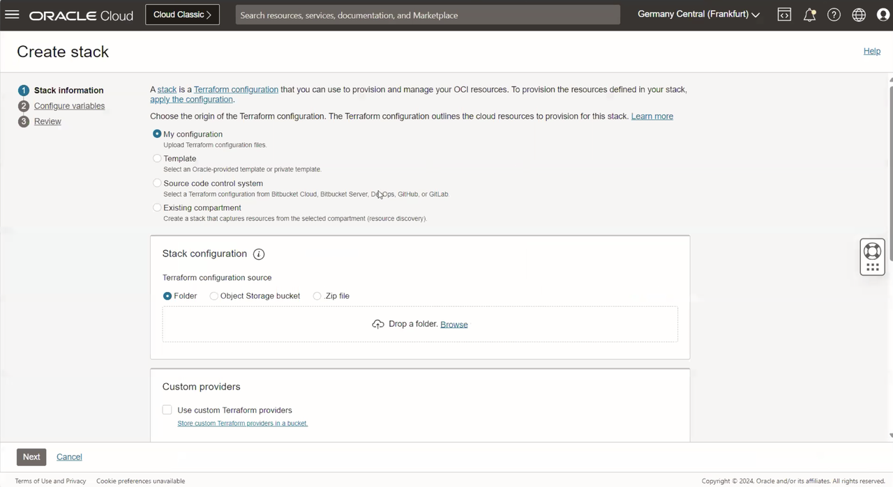
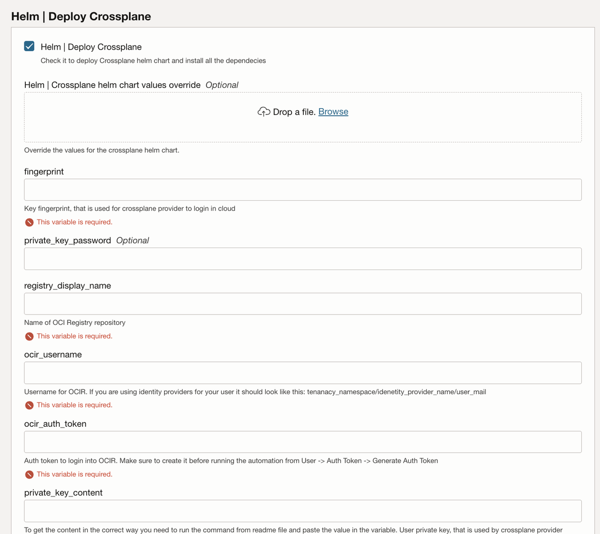
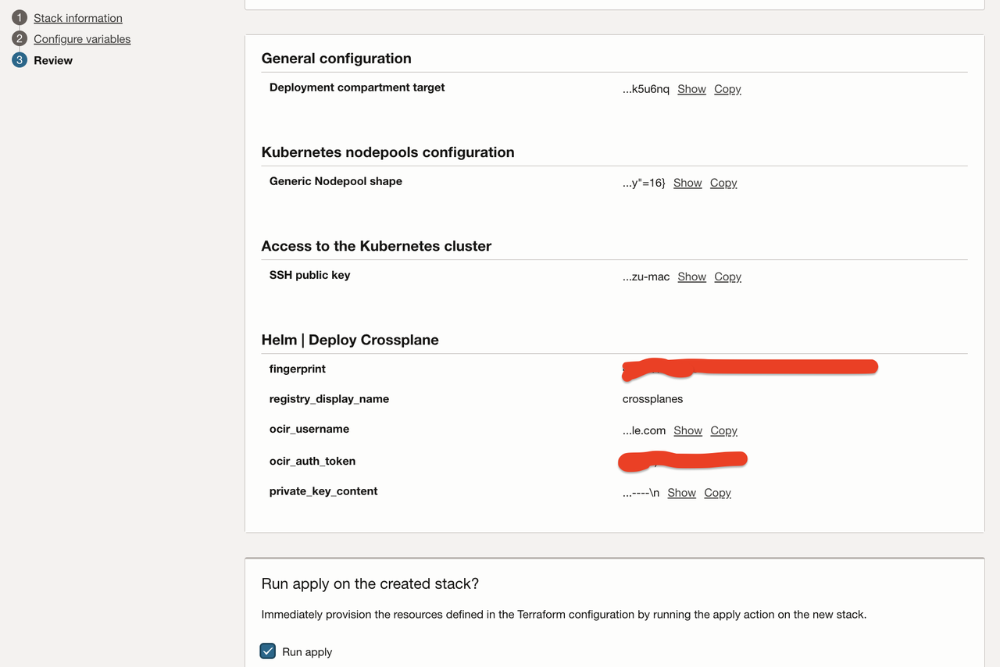
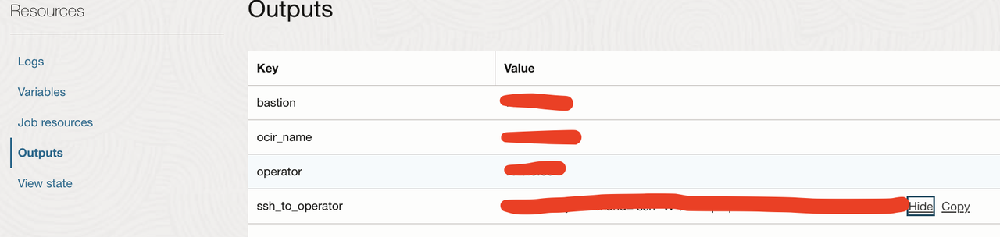

# Deploy the OCI Crossplane Provider on OCI with Resource Manager

## Introduction

This lab will take you through the steps needed to provision the infrastructure using Resource Manager and deploy the OCI Crossplane provider.

Estimated Lab Time: 90 minutes

### Objectives

In this lab, you will:
* Learn how to upload the code to Resource Manager
* Configure the automation variables
* Deploy the automation that creates the infrastructure and installs the OCI Crossplane provider

### Prerequisites

This lab assumes you have:
* An Oracle Cloud account
* Administrator permissions or the necessary permissions to manage the OCI tenancy


## Task 1: Gathering Data to Complete Variables in Resource Manager

Before running the automation in Resource Manager, you need to gather details about your OCI tenancy such as the tenancy Namespace, OCI Registry Auth Token, OCI Registry Username, and the OCI authentication private key content.

1. Tenancy Namespace 

Navigate to Tenancy Details. Under Object Storage Settings, locate the Object Storage Namespace.

You will need the tenancy namespace in order to create an OCI Registry that will be used to start the crossplane and to be able to have a correct OCI Registry user.


2. Auth Token

In order to run the automation you will need to obtain an Auth token with at least five minutes before running it. 

To obtain the Auth Token navigate to the OCI Console and select your user profile. Click on Auth Token in the left-side column and generate token. 

You will need to provide the token to configure the `ocir_auth_token` variable. More details can be found [here](https://docs.oracle.com/en-us/iaas/Content/Registry/Tasks/registrygettingauthtoken.htm).


3. OCI Registry user

Enter your username in the format <tenancy-namespace>/<username>, where <tenancy-namespace> is the auto-generated Object Storage namespace string of your tenancy (as shown on the Tenancy Information page). For example, ansh81vru1zp/jdoe@acme.com. If your tenancy is federated with Oracle Identity Cloud Service, use the format <tenancy-namespace>/oracleidentitycloudservice/<username>.

More details about how to correctly retrieve your OCI Registry user can be found [here](https://docs.oracle.com/en-us/iaas/Content/Registry/Tasks/registrypushingimagesusingthedockercli.htm)

You will need to create this user to configure the `ocir_username` variable.


4. OCI API Keys

If you do not already have an existing API public and private key pair, you can set them up by following the [RSA key pair in PEM format (minimum 2048 bits)](https://docs.oracle.com/en-us/iaas/Content/API/Concepts/apisigningkey.htm?utm_source=chatgpt.com)

Once you generate the keys, you can log in to OCI console -> Click on your profile (top-right corner) -> your user -> API Keys -> Add API Key.

Copy the fingerprint; you will need it later to complete the `fingerprint` variable

5. OCI Private key content

Run the following command on the environment where you have the OCI private key:

```
<copy>awk 'NF {sub(/\r/, ""); printf "%s\\n",$0;}' <same path to key file as your OCI CLI config></copy>
```

Copy the resulting content which will be required to configure the `private_key_content` variable.

This is used for the crossplane provider login to OCI.


## Task 2: Provision resources

1. Go to Resource manager -> Stacks -> Create Stack. Choose **My Configuration** and upload the provided zip file, select the compartment where you want to create the stack, then click Next: [orm-stack-oke-crossplane-deployment.zip](https://github.com/ionut-sturzu/orm-stack-oke-crossplane-deployment/archive/refs/heads/main.zip).

    

    Alternatively, you can use the single-click deployment button below:

    [](https://cloud.oracle.com/resourcemanager/stacks/create?zipUrl=https://github.com/ionut-sturzu/orm-stack-oke-crossplane-deployment/archive/refs/heads/main.zip)

2. Enter the following information for **Compartment**, **Kubernetes Cluster Name (Any suitable name)** , **Check Create new VCN**, **VCN Name (Any suitable name)**, **Leave other Networking information as default**.

3. Configure the **Kubernetes nodepool configuration** according to your cluster needs.

4. Choose whether to create a public or private endpoint for the OKE cluster, or a private one by checking **Create public OKE API?** checkbox and follow the below steps to complete all the variables.
    

5. Now it is time to configure the OCI Crossplane provider deployment via helm by having the checkbox **Helm | Deploy Crossplane** checked.

6. Optional: If  you need to override the OCI Crossplane provider values you can create a file with the desired variables and upload it under **Helm | Crossplane helm chart values override**. Details about the values that are supported by the helm chart can be found [here](https://github.com/crossplane/crossplane/blob/main/cluster/charts/crossplane/values.yaml?utm_source=chatgpt.com).

7. Next, enter the values obtained in Task 1 to their variables: `fingerprint`, `ocir_username`, `ocir_auth_token`, `private_key_content`.

8. (Optional) If you have a password set up for your private key complete the `private_key_password` variable.

9. Next, set up the OCI Registry repository name value by completing the `registry_display_name`. This needs to be a unique name across the tenancy.

10. Click Next, check the **Run Apply** and click Create in order to create and deploy the Resource Manager stack.
    

11. Wait for the job to complete successfully. This process may take 20–25 minutes as it deploys the OKE cluster and sets up all required dependencies for the OCI Crossplane provider.

12. Once the job succeeds, go to Outputs and copy the `ssh_to_operator` command to access the instance managing the OKE cluster.
    

Next, we will guide you through deploying resources in OCI using your newly deployed OCI Crossplane provider.
You may now proceed to the next lab.

## Acknowledgements

**Authors**

* **Ionut Sturzu**, Principal Cloud Architect, NACIE
