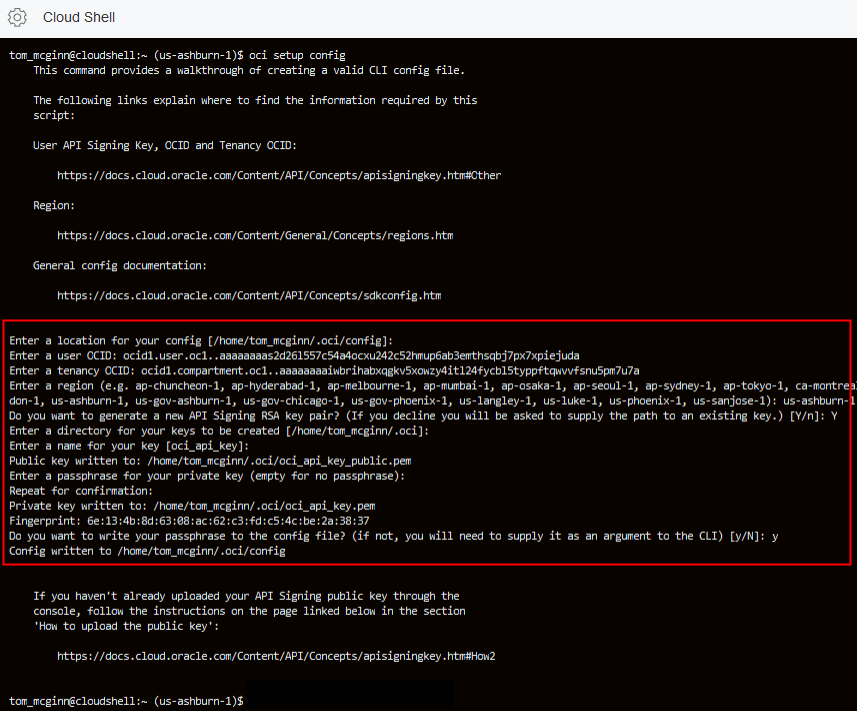
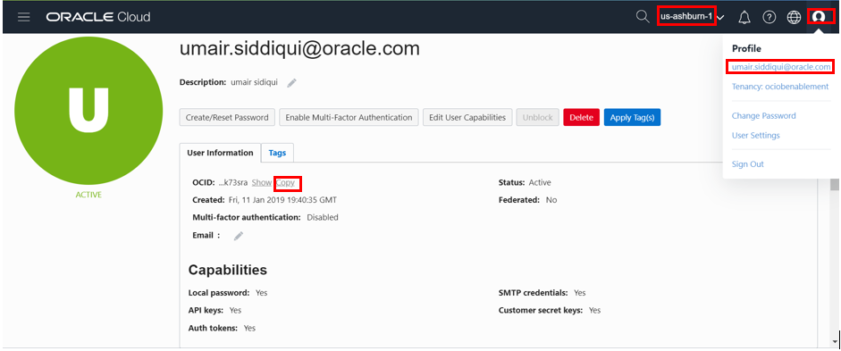
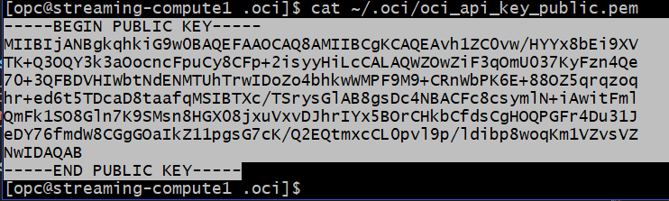
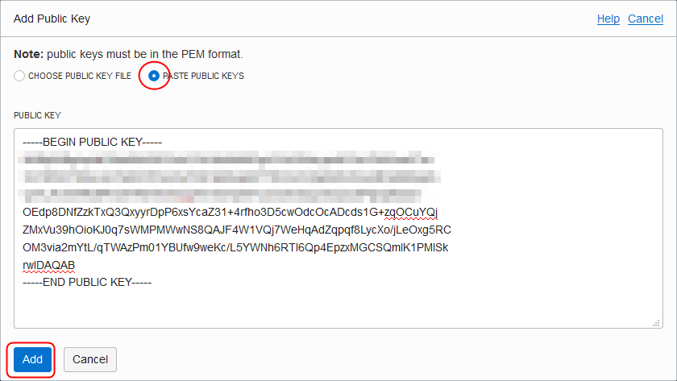
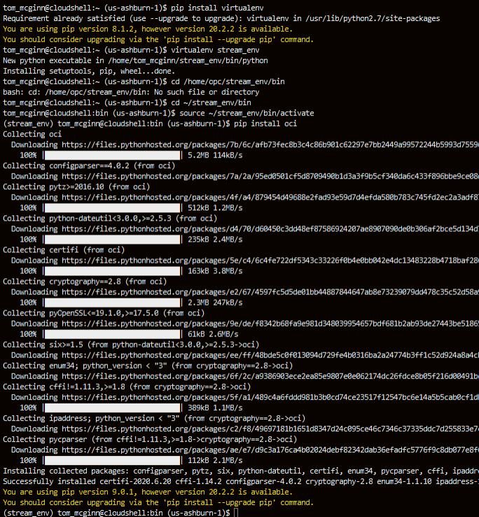
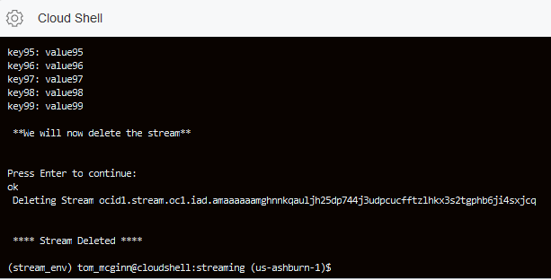
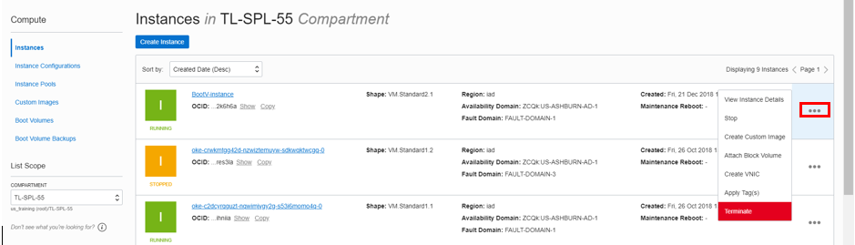
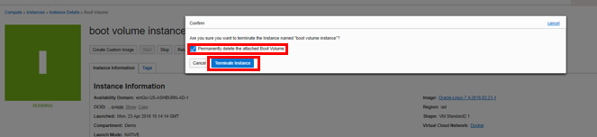

# Deploying OCI Streaming Service

## Introduction

In this lab, we will create a compute instance, download a script to configure streaming service, publish and consume messages. The Oracle Cloud Infrastructure Streaming service provides a fully managed, scalable, and durable storage solution for ingesting continuous, high-volume streams of data that you can consume and process in real time. Streaming can be used for messaging, ingesting high-volume data such as application logs, operational telemetry, web Click-stream data, or other use cases in which data is produced and processed continually and sequentially in a publish-subscribe messaging model.

## Task 1: Download Script to configure Streaming service and Publish messages

1. In Oracle Cloud Shell, configure OCI CLI:
    ```
    <copy>
    oci setup config
    </copy>
    ```

    

2. Accept the default directory location. For user's OCID switch to OCI Console window. Click your person icon in the upper right, and select your user name. In the user details page Click **copy** to copy the OCID. **Also note down your region name as shown in OCI Console window**. Paste the user OCID into Cloud Shell.

     

3. Repeat the step to find tenancy OCID (person icon followed by selecting Tenancy Name). Paste the Tenancy OCID in Cloud Shell. Then enter the string that matches your region (us-ashburn-1, us-phoenix-1, etc).

4. When asked for **Do you want to generate a new API Signing RSA key pair?** answer Y.

5. Enter a passphrase you can remember.

5. When asked **Do you want to write your passphrase to the config file?** answer y.

5. **oci setup config** also generated an API key. We will need to upload this API key into our OCI account for authentication of API calls. Switch to ssh session to compute instance, to display the content of API key Enter command:

    ```
    <copy>
    cat ~/.oci/oci_api_key_public.pem
    </copy>
    ```

6. Highlight and copy the content from ssh session. Switch to OCI Console, Click Human icon followed by your user name. In user details page Click **Add Public Key**. In the dialog box paste the public key content and Click **Add**.

     

     

7. Download and Install pip utility which will be used to install additional software. Enter command:

    ```
    <copy>
    curl https://bootstrap.pypa.io/get-pip.py -o get-pip.py
    </copy>
    ```

    followed by

    ```
    <copy>
    python get-pip.py
    </copy>
    ```

8. Install a virtual environment. This is being done so we have a clean environment to execute our python script that will create and publish messages to OCI streaming service. Enter command:

    ```
    <copy>
    pip install virtualenv
    </copy>
    ```

9. Now create a virtual environment, Enter command:

    ```
    <copy>
    virtualenv <Environment_Name>
    </copy>
    ```
    For example **virtualenv stream\_env**.

    Now initialize the virtual environment, Enter command:

    **NOTE** : Below command assumes that the environment name is 'stream-env'

    ```
    <copy>
    cd ~/stream_env/bin
    </copy>
    ```

    ```
    <copy>
    source ~/stream_env/bin/activate
    </copy>
    ```

10. Once your virtual environment is active, OCI can be installed using pip, Enter command:

    ```
    <copy>
    pip install oci
    </copy>
    ```

     

11. Now download the main script file though first we will remove the existing file, Enter Command:

    ```
    <copy>
    cd ~
    </copy>
    ```

    ```
    <copy>
    rm stream_example.py
    </copy>
    ```

    ```
    <copy>
    wget https://objectstorage.us-ashburn-1.oraclecloud.com/p/Ei1_2QRw4M8tQpk59Qhao2JCvEivSAX8MGB9R6PfHZlqNkpkAcnVg4V3-GyTs1_t/n/c4u04/b/livelabsfiles/o/oci-library/stream_example.py
    </copy>
    ```

12. Now download a dependent script file though first we will remove the existing file, Enter Command:

    ```
    <copy>
    cd ~/stream_env/lib/python2.7/site-packages/oci/streaming/
    </copy>
    ```

    ```
    <copy>
    rm stream_admin_client_composite_operations.py
    </copy>
    ```

    ```
    <copy>
    wget https://objectstorage.us-ashburn-1.oraclecloud.com/p/Ei1_2QRw4M8tQpk59Qhao2JCvEivSAX8MGB9R6PfHZlqNkpkAcnVg4V3-GyTs1_t/n/c4u04/b/livelabsfiles/o/oci-library/stream_admin_client_composite_operations.py
    </copy>
    ```

13. Our setup is now ready. Before running the script switch to OCI Console window, from the main menu click **Identity** -> **Compartments**. Select your compartment name and copy the OCID of the compartment.

14. In Cloud Shell, enter:

    ```
    <copy>
    python ~/stream_example.py <COMPARTMENT_OCID>
    </copy>
    ```

    For example :

    python ~/stream\_example.py ocid1.compartment.oc1..aaaaaaaada2gaukcqoagqoshxq2pyt6cdsj2mhnrz3p5nke33ljx2bp476wq

15. Follow the prompts of the script. The script will create Streaming service called **SdkExampleStream**. It will publish 100 messages, create 2 groups on the compute and read those messages. Finally it will delete the streaming service. **You will be prompted to hit enter after verifying each step**.

  

## Task 2: Delete the resources

1. Switch to OCI console window.

2. If your Compute instance is not displayed, From OCI services menu Click **Instances** under **Compute**.

3. Locate compute instance, Click Action icon and then **Terminate**.

     

4. Make sure Permanently delete the attached Boot Volume is checked, Click **Terminate Instance**. Wait for instance to fully Terminate.

     

5. From OCI services menu Click **Virtual Cloud Networks** under Networking, list of all VCNs will appear.

6. Locate your VCN , Click Action icon and then **Terminate**. Click **Terminate All** in the Confirmation window. Click **Close** once VCN is deleted.
     


## Acknowledgements
*Congratulations! You have successfully completed the lab.*

- **Author** - Flavio Pereira, Larry Beausoleil
- **Adapted by** -  Yaisah Granillo, Cloud Solution Engineer
- **Contributors** - Kamryn Vinson, QA Engineer Lead Intern | Arabella Yao, Product Manager Intern, DB Product Management
- **Last Updated By/Date** - Madhusudhan Rao, Apr 2022
- **Valid through** - August 2021

