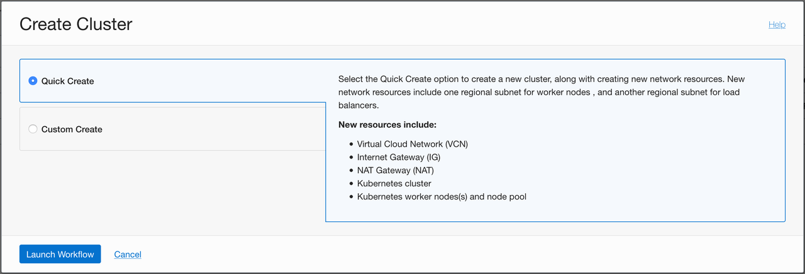
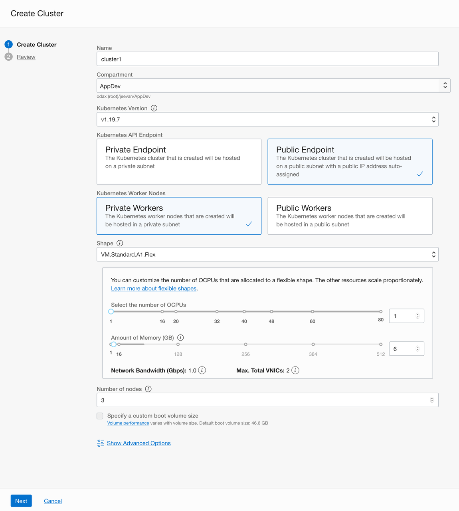
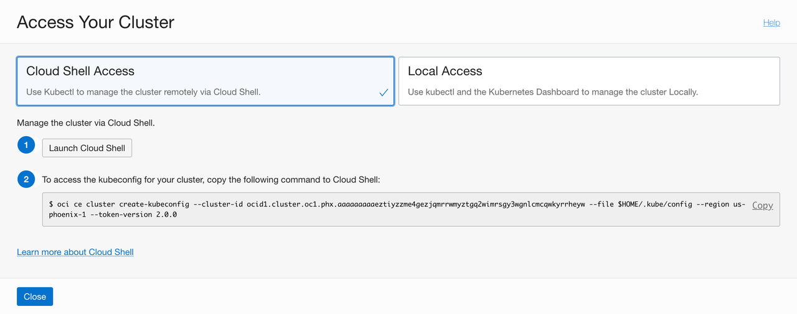

# Create an Arm based Kubernetes Cluster

Container Engine for Kubernetes is easy to start using, and combined with OCI Cloud Shell, you can have complete control without having to set up a local environment. To get started, you create a new Kubernetes cluster on OCI.

1. From the navigation menu in the Oracle Cloud Console, go to **Developer Services** and click **Kubernetes Clusters**.

2. Click **Create Cluster**. You can use the **Quick Create** option to use default values or the **Custom Create** option to specify advanced settings. Here we use the **Quick Create** because the defaults that it chooses are a great start.

   

3. On the Create Cluster page, choose some basic configuration options, like the version of Kubernetes that you want to run and the number and shape of the nodes for your cluster. For this tutorial, choose the Oracle A1 shape for the nodes. 

   > Choose the Ampere A1 compute shape for the nodes as shown below.

   

   You can also specify a name and compartment for the cluster. The visibility type indicates whether the nodes in the cluster are reachable from the internet, for example, over SSH. It's more common to keep them on a private network and use bastion or jump hosts on the public network to provide access paths. Here we choose the default of keeping the nodes private.

4. Click **Create Cluster** and the workflow starts creating all the required required resources and the cluster itself. 

   After the supporting resources are created, the cluster details page is displayed. Within a few minutes, the cluster is created and activated.

5. After the cluster status is Active, click the Access Cluster button to see the ways to access the cluster.

6. Choose the Cloud Shell option. Cloud Shell is a full-featured, online terminal environment integrated with the Console. Cloud Shell has all the tools you need for interacting with your Kubernetes cluster and is the quickest way to get started without configuring a local development environment.

   

   You can launch Cloud Shell directly from the page. Note that access to Cloud Shell is also available on the top of the Console at all times, for quick access.

   The page also include a command to run inside Cloud Shell. This command uses the OCI CLI to create the *kubeconfig* file. Kubernetes clients like `kubectl` can work with a configuration file that facilitates access to the cluster. Such a file is generally called a *kubeconfig* file. Typically, this configuration file resides in *~/.kube*. A single configuration file can contain access configuration for multiple clusters.

   > OCI CLI is already installed and configured for you in the Cloud Shell environment. 

7. Launch Cloud Shell, and then copy the command and paste it in to Cloud Shell to run it. The standard command line client for Kubernetes is kubectl and it is preinstalled in the Cloud Shell environment. 
   
   Now, let's check if we can interact with the cluster and see the cluster nodes. 

8. Copy the following command to Cloud Shell and run it.
   
    ```
    kubectl get nodes -o wide
    ```
   You should see output similar to the following example, depending on the number of nodes in the cluster. Note the kernel version shows that we are running Oracle Linux for `aarch64` (Arm 64-bit) architecture. 

    ```
    NAME          STATUS    ROLES   AGE    VERSION   INTERNAL-IP   OS-IMAGE                  KERNEL-VERSION            
    10.0.10.229   Ready     node    3d7h   v1.19.7   10.0.10.229   Oracle Linux Server 7.9   5.4.17-2102.200.13.el7uek.aarch64
    10.0.10.29    Ready     node    3d7h   v1.19.7   10.0.10.29    Oracle Linux Server 7.9   5.4.17-2102.200.13.el7uek.aarch64
    10.0.10.87    Ready     node    3d7h   v1.19.7   10.0.10.87    Oracle Linux Server 7.9   5.4.17-2102.200.13.el7uek.aarch64
    ```

   Now that you have a fully functioning Kubernetes cluster and have set up the tools to interact with it, you can deploy any kubernetes workload to it. 