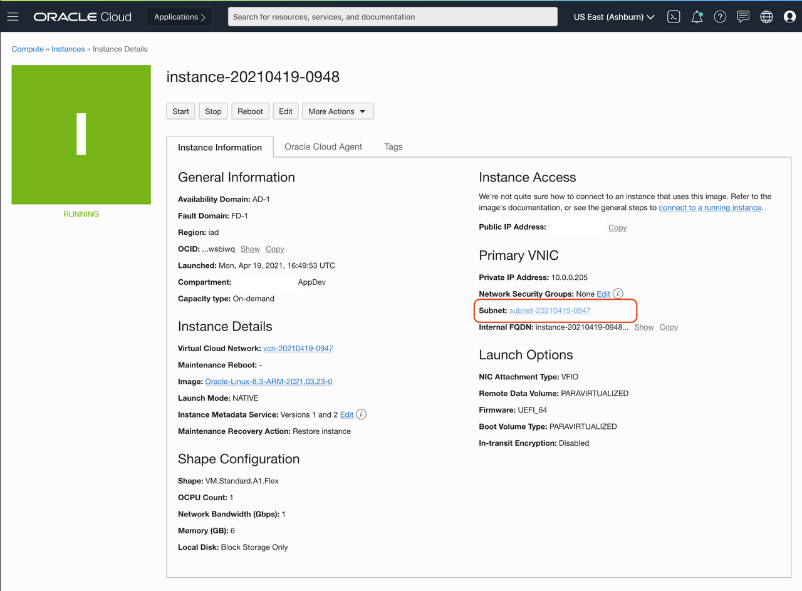
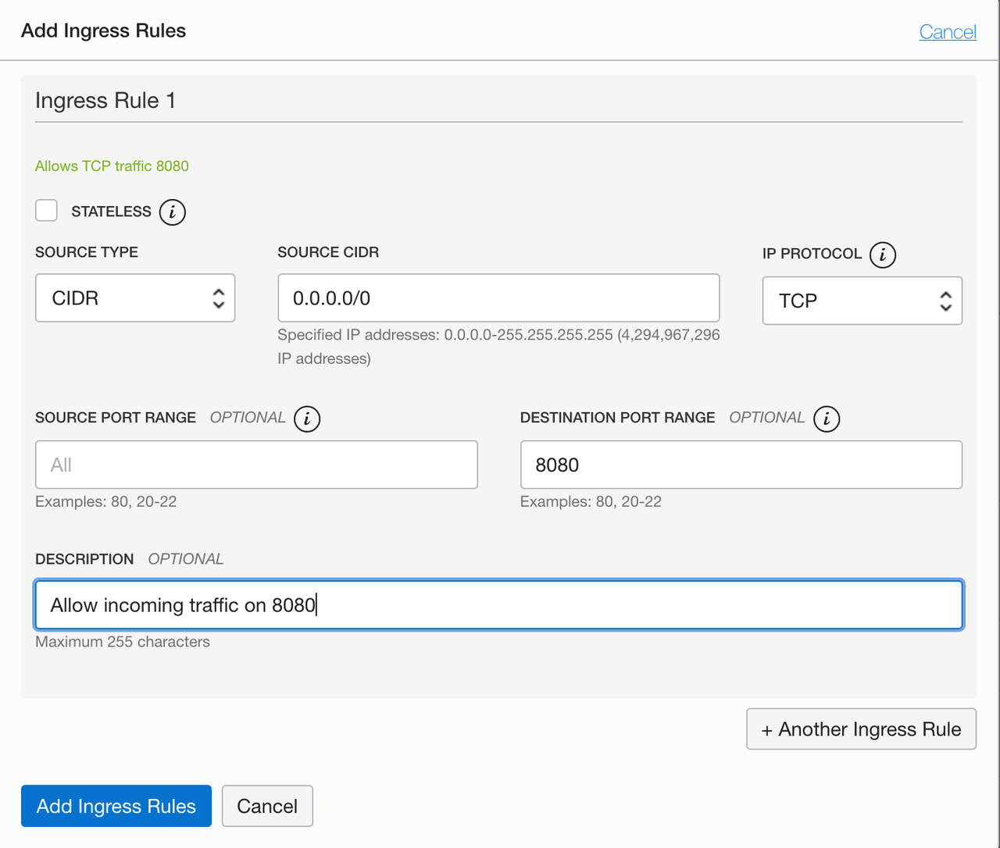

# Expose application ports to users

For applications to be accessible from the internet, you need to open the ports that our application will use. In this section, you will configure security lists on your cloud network and firewall rules on your compute instance to enable your applications to send and receive traffic. 

Estimated time: 10 minutes

### Objectives

- Setup security rules and firewall options to enable application connectivity

### Prerequisites

- Your Oracle Cloud Trial Account
- You have already created an OCI Arm A1 instance.

## Configure your Virtual Cloud Network (VCN)
A security list acts as a virtual firewall for an instance, with ingress and egress rules that specify the types of traffic allowed in and out. Security lists as configured at the subnet level, which applies the security rules to all network elements in that subnet. Your network comes with a [default security list](https://docs.oracle.com/en-us/iaas/Content/Network/Concepts/securitylists.htm#Default), which contain an initial set of rules. The default security list enables you to connect to your instance using SSH and for your instance to make outbound network calls to any destination. 

1. Navigate the the instance details page for the instance that you have created. **Compute** >   **Instances**  > *Click on the instance you have created* 
1. Navigate to the subnet your instance is attached to, by clicking on the subnet
   
1. On the subnet, select the default security list
1. Click on "Add Ingress Rule" to add a new rule to allow incoming traffic that match the rules.
1. Add an ingress rule to allow incoming traffic on port 8080
    1. Set the **Source CIDR** to `0.0.0.0/0`. This allows incoming traffic from all sources. 
    1. Set the **Destination Port Range** to `8080`. This sets the destination to only port `8080`. The rule now allows traffic from all sources to use port `8080`. This is what we need, so that our application can be reached from anywhere. 
    1. Provide a description.
    

## Configure your Instance

Firewall rules control packet-level traffic in/out of an instance. You configure firewall rules directly on the instance itself, and provide an additional level of security.

1. Navigate the the instance details page for the instance that you have created. **Compute** >   **Instances**  > *Click on the instance you have created* 
1. Copy the public IP address of your instance. 
1. Login to the instance using SSH. Use the key you either generated or provided during the instance creation step. The default username for instances using the Oracle Linux operating system is `opc`.  
1. Execute the firewall configuration commands. This modifies the firewall in the instance itself to expose port `8080` and accept incoming traffic.
   ```
    sudo firewall-cmd --zone=public --permanent --add-port=8080/tcp
    sudo firewall-cmd --reload
   ```

